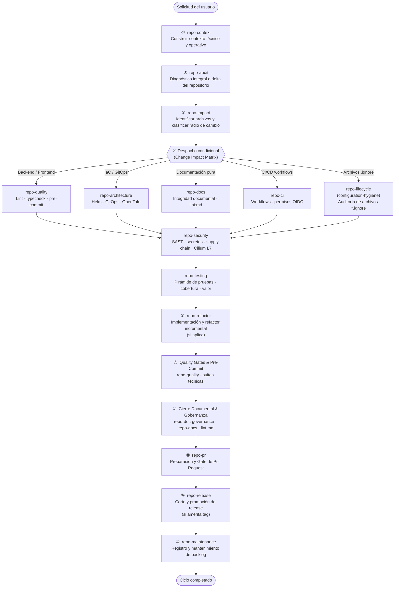
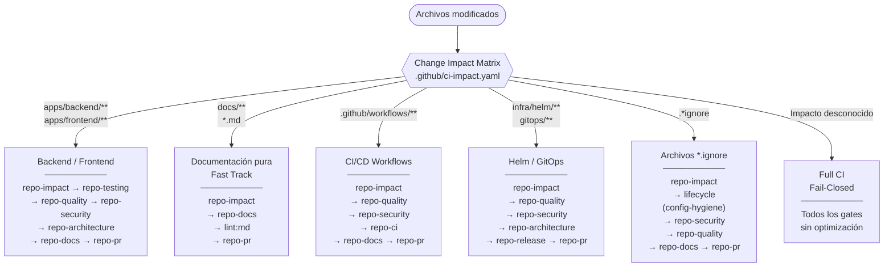
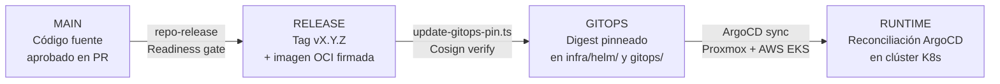

# `.agents` — Catálogo de Skills y Flujos de Orquestación

Este directorio contiene las **skills** del agente Antigravity para el repositorio
`rocapellino/pokedex`. Cada skill es una unidad autónoma de instrucciones que cubre
un dominio específico del ciclo de vida del repositorio.

> [!NOTE]
> El idioma operativo de toda comunicación humana es el **español**.
> Los identificadores técnicos, comandos y nombres de archivos permanecen en inglés.
> Referencia: [`_shared/language-policy.md`](skills/_shared/language-policy.md)

---

## Mapa de Skills

| Categoría | Skill | Responsabilidad Principal |
| :--- | :--- | :--- |
| **Core & Lifecycle** | [`repo-context`](skills/repo-context/SKILL.md) | Construir el contexto técnico y operativo antes de cualquier análisis |
| | [`repo-lifecycle`](skills/repo-lifecycle/SKILL.md) | Orquestador maestro del ciclo de vida completo |
| | [`repo-impact`](skills/repo-impact/SKILL.md) | Analizar radio de cambio y dependencias cruzadas |
| | [`repo-audit`](skills/repo-audit/SKILL.md) | Coordinador de auditorías integrales (read-only) |
| **Engineering** | [`repo-quality`](skills/repo-quality/SKILL.md) | Calidad estática, linters y prevención de God Files |
| | [`repo-architecture`](skills/repo-architecture/SKILL.md) | Coherencia de sistema, plataforma y GitOps |
| | [`repo-testing`](skills/repo-testing/SKILL.md) | Pirámide de pruebas, cobertura y valor |
| | [`repo-dependencies`](skills/repo-dependencies/SKILL.md) | Árbol npm, lockfile, CVEs y librerías huérfanas |
| **Delivery & Security** | [`repo-security`](skills/repo-security/SKILL.md) | DevSecOps, secretos, Cilium L7 y supply chain |
| | [`repo-ci`](skills/repo-ci/SKILL.md) | Topología integral de CI/CD (PR ➔ Job ➔ Tool) |
| | [`repo-pr`](skills/repo-pr/SKILL.md) | Preparación, validación y revisión de Pull Requests |
| | [`repo-release`](skills/repo-release/SKILL.md) | Corte de versión y readiness de release |
| **Governance & Maintenance** | [`repo-doc-governance`](skills/repo-doc-governance/SKILL.md) | Políticas, límites y contratos documentales |
| | [`repo-docs`](skills/repo-docs/SKILL.md) | Integridad documental y claims verification |
| | [`repo-maintenance`](skills/repo-maintenance/SKILL.md) | Salud periódica, higiene y limpieza segura |
| | [`repo-refactor`](skills/repo-refactor/SKILL.md) | Diseño de cambios incrementales |
| | [`repo-modernize`](skills/repo-modernize/SKILL.md) | Evaluación de modernización tecnológica |
| | [`repo-metrics`](skills/repo-metrics/SKILL.md) | Telemetría auxiliar de evolución técnica |

---

## Flujo 1 — Orquestación Principal (`repo-lifecycle`)

`repo-lifecycle` es el **único orquestador** del ciclo de vida. Las demás skills
son invocadas condicionalmente según el tipo de cambio y el impacto detectado.

> [!IMPORTANT]
> **Frontera de invocación con `repo-audit`.** `repo-audit` es una *superficie de
> invocación* read-only, no un segundo orquestador. `/repo-audit` delega íntegramente en
> el flujo `full-audit` de `repo-lifecycle`, y a su vez `repo-lifecycle` sitúa a
> `repo-audit` como paso ② de su flujo resumido. La entrada es por tanto **mutua** y
> deliberada: existe un único ciclo canónico de ejecución y la etapa ② de ese ciclo se
> implementa como diagnóstico read-only. **No hay recursión**: las 16 etapas del
> `full-audit` no reentran en `repo-audit`.
>
> Para auditar el repositorio, invocar cualquiera de las dos superficies; no ambas de
> forma encadenada.

---

## Flujo 2 — Full-Audit (16 etapas secuenciales)

Cuando se invoca `/repo-lifecycle full-audit`, el ciclo recorre 16 dominios
en cascada estricta, sin saltar ni duplicar etapas:

---

## Flujo 3 — Despacho Condicional por Tipología de Cambio

No todas las skills corren en todos los cambios. El motor
[`scripts/detect-change-impact.ts`](../scripts/detect-change-impact.ts)
clasifica el impacto y activa únicamente los gates necesarios:

---

## Flujo 4 — Ciclo de Release y Promoción

---

## Recursos Compartidos (`_shared/`)

Todos los skills consumen los contratos definidos en `_shared/`:

| Archivo | Propósito |
| :--- | :--- |
| [`methodology.md`](skills/_shared/methodology.md) | Ciclo de 8 pasos, Evidence-first, clasificación P0-P3 |
| [`change-impact-matrix.md`](skills/_shared/change-impact-matrix.md) | Cascada de dependencias por tipo de componente |
| [`documentation-impact-matrix.md`](skills/_shared/documentation-impact-matrix.md) | Evaluación de drift entre código y documentación |
| [`state-model.md`](skills/_shared/state-model.md) | Taxonomías de estados por dominio (KEEP, REMOVE, REVIEW…) |
| [`language-policy.md`](skills/_shared/language-policy.md) | Política de idioma: español operativo, inglés técnico |
| [`change-plan.md`](skills/_shared/change-plan.md) | Plantilla de planes de cambio con rollback explícito |
| [`finding.md`](skills/_shared/finding.md) | Formato atómico de hallazgo (P0-P3, evidencia, acción) |
| [`report-template.md`](skills/_shared/report-template.md) | Estructura del reporte consolidado de auditoría |
| [`markdown-quality.md`](skills/_shared/markdown-quality.md) | Markdown Quality Gate — 0 errores `MDxxx` obligatorio |
| [`source-of-truth.md`](skills/_shared/source-of-truth.md) | Jerarquía de fuentes de verdad (SSOT vs. evidencia histórica) |

---

## Guardarraíles Generales

> [!IMPORTANT]
> **Antes de ejecutar cualquier análisis o cambio**, consultar la
> [Change Impact Matrix](skills/_shared/change-impact-matrix.md) para determinar
> qué skills son necesarias. Los cambios puramente documentales aplican
> **Fast Track** (`repo-docs` + `npm run lint:md`).

Las auditorías históricas en `docs/audits/` **nunca** son evidencia del
estado actual. Las SSOT vigentes son `gitops/`, `infra/`, `docs/architecture/`,
`apps/`, `scripts/` y `tests/`. El **Markdown Quality Gate** (`npm run lint:md`)
es obligatorio tras crear o modificar cualquier `.md`; ninguna tarea se considera
terminada con errores `MDxxx` pendientes.
