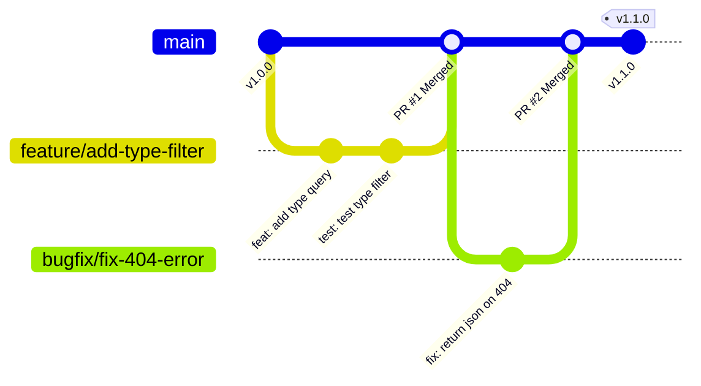

# 🌿 Guía de Mejores Prácticas para el Mantenimiento de Repositorios Git

Este documento define los lineamientos, flujos de trabajo y estándares de desarrollo para mantener un repositorio Git limpio, seguro, colaborativo y listo para integración continua (**CI/CD**), tomando como base el proyecto **Pokémon API**.

---

## 📑 Tabla de Contenidos
1. [Estrategia de Ramas (Branching Strategy)](#1-estrategia-de-ramas-branching-strategy)
2. [Estándar de Commits (Conventional Commits)](#2-estándar-de-commits-conventional-commits)
3. [Higiene del Repositorio y `.gitignore`](#3-higiene-del-repositorio-y-gitignore)
4. [Flujo de Pull Requests (PR) y Revisiones](#4-flujo-de-pull-requests-pr-y-revisiones)
5. [Estrategias de Integración (Merge vs Squash vs Rebase)](#5-estrategias-de-integración-merge-vs-squash-vs-rebase)
6. [Versionado Semántico y Git Tags](#6-versionado-semántico-y-git-tags)
7. [Seguridad y Prevención de Fuga de Secretos](#7-seguridad-y-prevención-de-fuga-de-secretos)
8. [Automatización con Git Hooks (`pre-commit`)](#8-automatización-con-git-hooks-pre-commit)
9. [Guía Rápida de Comandos para el Equipo](#9-guía-rápida-de-comandos-para-el-equipo)

---

## 1. Estrategia de Ramas (Branching Strategy)

Para equipos ágiles y proyectos DevOps se recomienda **GitHub Flow** (o Trunk-Based con ramas cortas), garantizando que la rama principal siempre esté en un estado desplegable y estable.



### 1.1. Reglas de Ramas
- `main`: Rama de producción protegida. **Nunca se hace commit directo** ni `push --force`. Todo cambio entra vía Pull Request aprobado.
- `feature/<nombre-descriptivo>`: Nuevas funcionalidades (ej. `feature/filtro-por-tipo`, `feature/docker-setup`).
- `bugfix/<nombre-descriptivo>`: Corrección de errores en desarrollo (ej. `bugfix/validar-campos-post`).
- `hotfix/<nombre-descriptivo>`: Corrección urgente para producción.
- `docs/<nombre-descriptivo>`: Modificaciones exclusivas de documentación (ej. `docs/actualizar-readme`).
- `test/<nombre-descriptivo>`: Adición o refactorización de tests (ej. `test/cobertura-rutas`).

### 1.2. Protección de Ramas (Branch Protection)
En la configuración de GitHub/GitLab se debe activar:
1. **Require a pull request before merging.**
2. **Require status checks to pass before merging** (Tests automáticos con Pytest y Linters).
3. **Require approvals** (Al menos 1 aprobación de un compañero de equipo).
4. **Dismiss stale pull request approvals when new commits are pushed.**

---

## 2. Estándar de Commits (Conventional Commits)

Utilizar la especificación **Conventional Commits** para generar un historial legible, estructurado y que facilite la generación automática de CHANGELOGs.

### 2.1. Estructura del Mensaje
```text
<tipo>(<alcance opcional>): <descripción corta en imperativo>

[cuerpo opcional con detalles del cambio]

[pie opcional: referencias a issues, breaking changes]
```

### 2.2. Tipos de Commit Permitidos
| Tipo | Propósito | Ejemplo |
| :--- | :--- | :--- |
| `feat` | Nueva característica o endpoint | `feat(api): agregar endpoint GET /pokemons/habitat/<nombre>` |
| `fix` | Corrección de un bug | `fix(routes): corregir código de error 404 en DELETE` |
| `docs` | Cambios en documentación | `docs(readme): añadir instrucciones de ejecución con venv` |
| `test` | Añadir o modificar tests | `test(pytest): añadir pruebas unitarias para PUT /pokemons` |
| `refactor` | Refactorización de código sin cambiar comportamiento | `refactor(src): modularizar validación de esquema JSON` |
| `chore` | Tareas de mantenimiento, dependencias o config | `chore(deps): actualizar flask a version 3.0.3` |
| `ci` | Cambios en pipelines CI/CD o Docker | `ci(docker): agregar Dockerfile multi-stage y healthcheck` |
| `style` | Formato, espacios en blanco, comillas (sin cambio en lógica) | `style(app): formatear imports segun PEP 8` |

### 2.3. Principio del Commit Atómico
- ❌ **Evitar commits masivos:** "avances", "arreglos varios", "proyecto terminado".
- ✅ **Commits pequeños e independientes:** Cada commit debe resolver una sola unidad lógica. Si un commit rompe algo, debe ser fácil de revertir con `git revert` sin afectar otras funciones.

---

## 3. Higiene del Repositorio y `.gitignore`

El repositorio solo debe contener código fuente, configuración y documentación. Los binarios, artefactos generados y archivos del sistema deben ser ignorados.

### 3.1. Archivos que NUNCA deben commitearse
- Entornos virtuales: `.venv/`, `venv/`, `env/`
- Bytecode y caché de Python: `__pycache__/`, `*.pyc`, `.pytest_cache/`
- Archivos de configuración de IDE personal: `.vscode/`, `.idea/`
- Variables de entorno locales y secretos: `.env`, `.env.local`, llaves privadas `.pem`
- Reportes de cobertura y temporales: `htmlcov/`, `.coverage`, `*.log`

### 3.2. ¿Cómo limpiar archivos commiteados por error?
Si un archivo ignorado (ej. `.venv/` o `__pycache__/`) fue commiteado accidentalmente, se debe remover del seguimiento de Git sin borrar el archivo local:

```bash
# Remover del índice de git manteniendo el archivo en tu disco local
git rm -r --cached __pycache__/
git rm -r --cached .venv/

# Crear commit de limpieza
git commit -m "chore: eliminar archivos de cache y entorno virtual del seguimiento"
git push origin <rama>
```

---

## 4. Flujo de Pull Requests (PR) y Revisiones

Todo cambio debe integrarse mediante Pull Requests con una descripción clara.

### 4.1. Plantilla de Pull Request (`.github/pull_request_template.md`)
Crear este archivo en el repositorio para estandarizar la creación de PRs:

```markdown
## 📌 Tipo de Cambio
- [ ] 🚀 Nueva funcionalidad (`feat`)
- [ ] 🐛 Corrección de error (`fix`)
- [ ] 📝 Documentación (`docs`)
- [ ] 🧪 Pruebas (`test`)
- [ ] 🔧 Configuración / CI/CD (`ci` / `chore`)

## 📋 Descripción del Cambio
Explica brevemente qué se modificó y cuál era la motivación del cambio.

## 🧪 Pruebas Realizadas
- [ ] Pruebas unitarias ejecutadas (`pytest`) con resultado exitoso.
- [ ] Pruebas de integración con scripts HTTP (`scripts/run_all_scripts.py`).
- [ ] Verificación manual en navegador / Postman.

## 🔍 Checklist de Calidad
- [ ] El código sigue las guías de estilo PEP 8.
- [ ] No se subieron credenciales ni archivos temporales (`.venv`, `__pycache__`).
- [ ] La documentación (`README.md` o docstrings) fue actualizada si correspondía.
```

---

## 5. Estrategias de Integración (Merge vs Squash vs Rebase)

Al fusionar un Pull Request en `main`, existen tres opciones:

```mermaid
flowchart TD
    subgraph Opciones["Estrategias de Merge"]
        A["Squash and Merge (Recomendado)"] -->|Combina todos los commits del PR en uno solo| D["Historial lineal y limpio en main"]
        B["Rebase and Merge"] -->|Reaplica commits individualmente| E["Mantiene commits individuales pero lineal"]
        C["Merge Commit"] -->|Crea un commit de merge| F["Preserva grafo ramificado (puede generar ruido)"]
    end
```

> [!TIP]
> **Recomendación para este proyecto:**
> - Usar **Squash and Merge** para PRs de características (`feature/`) para que cada funcionalidad represente un único commit limpio y atómico en `main`.
> - Mantener la opción **Automatically delete head branches** activada en GitHub para eliminar ramas fusionadas y evitar acumulación de ramas obsoletas (*stale branches*).

---

## 6. Versionado Semántico y Git Tags

Seguir la especificación [SemVer 2.0.0](https://semver.org/lang/es/): `vMAYOR.MENOR.PARCHE` (ej. `v1.2.3`).

- **MAYOR:** Cambios incompatibles con versiones anteriores (Breaking Changes en la API).
- **MENOR:** Nuevas funcionalidades retrocompatibles (nuevos endpoints o parámetros).
- **PARCHE:** Correcciones de errores retrocompatibles.

### 6.1. Creación de Tags Anotados
```bash
# Crear un tag anotado para una versión estable
git tag -a v1.0.0 -m "Release v1.0.0: Versión inicial de la API Pokémon con pruebas completas"

# Subir los tags al repositorio remoto
git push origin v1.0.0

# Subir todos los tags pendientes
git push origin --tags
```

---

## 7. Seguridad y Prevención de Fuga de Secretos

1. **Nunca commitear credenciales:** Tokens de GitHub, contraseñas de BD, claves JWT o API keys privadas jamás deben entrar al historial.
2. **Plantilla de variables (`.env.example`):** Proveer un archivo de ejemplo sin datos reales:
   ```ini
   FLASK_ENV=development
   PORT=5000
   SECRET_KEY=cambiar_en_produccion_por_valor_seguro
   ```
3. **Escaneo Automático:** Integrar herramientas como `gitleaks` o `trufflehog` en los flujos de CI para bloquear PRs que contengan credenciales.

> [!CAUTION]
> Si se commitea un secreto por error a una rama pública o remota:
> 1. **Revocar y rotar la clave inmediatamente.** Asumir que la clave fue comprometida.
> 2. No basta con hacer un commit borrando el secreto; queda en el historial. Se debe usar `git filter-repo` o `BFG Repo-Cleaner` para purgarlo del historial.

---

## 8. Automatización con Git Hooks (`pre-commit`)

Para asegurar que ningún commit entre al repositorio con errores de sintaxis o tests rotos, se recomienda configurar el framework `pre-commit`.

### 8.1. Archivo `.pre-commit-config.yaml`
```yaml
repos:
  - repo: https://github.com/pre-commit/pre-commit-hooks
    rev: v4.6.0
    hooks:
      - id: trailing-whitespace
      - id: end-of-file-fixer
      - id: check-yaml
      - id: check-json
      - id: check-added-large-files
        args: ['--maxkb=500']
      - id: detect-private-key

  - repo: https://github.com/psf/black
    rev: 24.4.2
    hooks:
      - id: black
        language_version: python3
```

---

## 9. Guía Rápida de Comandos para el Equipo

### Iniciar una nueva tarea:
```bash
# 1. Asegurar tener la última versión de main
git checkout main
git pull origin main

# 2. Crear y moverse a la nueva rama
git checkout -b feature/nombre-de-la-tarea
```

### Trabajar y guardar cambios:
```bash
# Ver estado de archivos modificados
git status

# Añadir cambios específicos
git add src/app.py tests/test_app.py

# Crear commit estructurado
git commit -m "feat(api): validar campos requeridos en endpoint POST"
```

### Mantener tu rama al día con `main` antes del PR:
```bash
# Traer cambios recientes de main sin ensuciar con merge commits innecesarios
git fetch origin
git rebase origin/main

# Si hay conflictos, resolverlos en el código y continuar:
git add <archivos_resueltos>
git rebase --continue
```

### Publicar rama y abrir Pull Request:
```bash
# Subir la rama al remoto
git push -u origin feature/nombre-de-la-tarea
```

### Deshacer cambios locales de forma segura:
```bash
# Descartar cambios no guardados en un archivo específico
git restore src/app.py

# Deshacer el último commit local manteniendo los cambios en staging
git reset --soft HEAD~1
```

