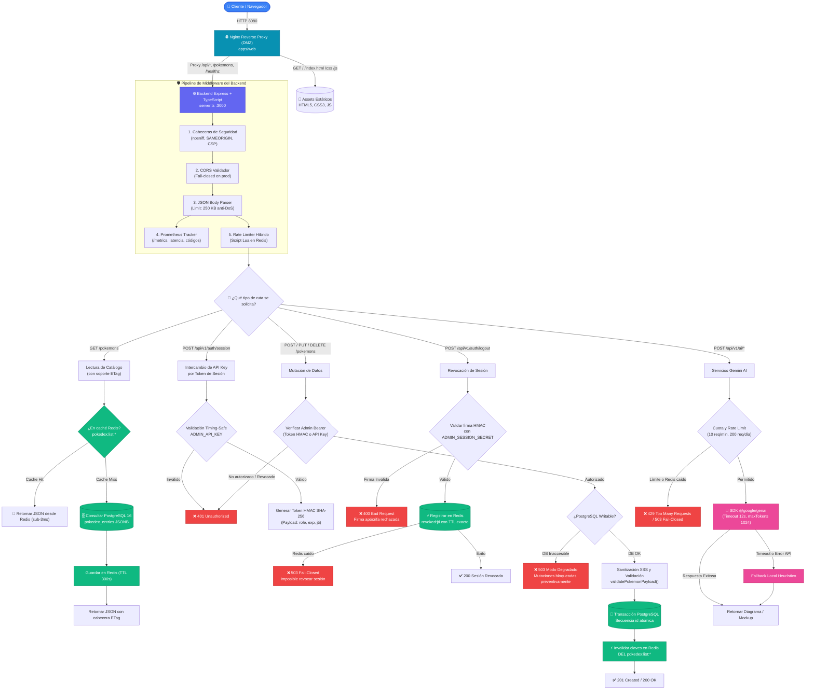
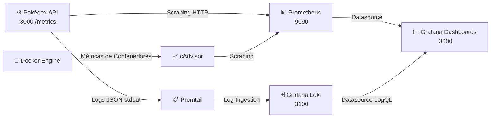

# ⚡ Pokémon DevOps Platform: Monorepo Full-Stack & DevSecOps

[](https://nodejs.org/)
[](https://www.typescriptlang.org/)
[](https://expressjs.com/)
[](https://www.postgresql.org/)
[](https://redis.io/)
[](https://aistudio.google.com/)
[](https://www.docker.com/)
[](https://kubernetes.io/)
[](https://helm.sh/)
[](https://kyverno.io/)
[](https://sigstore.dev/)
[](https://github.com/gitleaks/gitleaks)
[](LICENSE)

Plataforma de grado empresarial y portafolio DevSecOps que implementa una Pokédex reactiva de alto rendimiento con catálogo oficial de 1.025 Pokémon, persistencia híbrida ACID en PostgreSQL 16 con aceleración distribuida en Redis 7, servicios de Inteligencia Artificial generativa con Google Gemini 2.5 Flash, seguridad en cadena de suministro (Cosign + SBOM + Kyverno) y despliegue continuo GitOps híbrido (Proxmox VE on-premise + AWS EKS en la nube).

---

## 📑 Tabla de Contenidos
1. [Arquitectura del Sistema](#1-arquitectura-del-sistema)
2. [Diagrama de Flujo de Componentes e Interacciones](#2-diagrama-de-flujo-de-componentes-e-interacciones)
3. [Estructura del Monorepo](#3-estructura-del-monorepo)
4. [Matriz de Endpoints y Contratos REST](#4-matriz-de-endpoints-y-contratos-rest)
5. [Seguridad y Hardening DevSecOps](#5-seguridad-y-hardening-devsecops)
6. [Guía de Inicio Rápido](#6-guía-de-inicio-rápido)
7. [Observabilidad y Monitoreo](#7-observabilidad-y-monitoreo)
8. [Portal de Documentación Completa](#8-portal-de-documentación-completa)

---

## 1. Arquitectura del Sistema

La arquitectura está construida bajo los principios de **Separación de Responsabilidades**, **Defensa en Profundidad (*Defense in Depth*)**, **Zero-Trust Network Isolation** y **Fail-Closed Security**:

```text
                             [ Usuarios / Clientes Web ]
                                          │
                                          ▼ (HTTP :80 / :8080)
                ┌──────────────────────────────────────────────────┐
                │    Capa 1: Ingress / Nginx Reverse Proxy (DMZ)    │
                │  • Servido de estáticos HTML5/CSS3/JS Vanilla    │
                │  • Cabeceras de seguridad estrictas (CSP, CORS)  │
                └─────────────────────────┬────────────────────────┘
                                          │
                                          ▼ (HTTP interno :3000)
                ┌──────────────────────────────────────────────────┐
                │   Capa 2: Backend Pokédex Server (Express + TS)  │
                │  • Rate Limiter híbrido (Lua en Redis + Local)   │
                │  • Sesiones HMAC SHA-256 con revocación en Redis │
                │  • Catálogo indexado en memoria O(1) con ETags   │
                │  • Validaciones contra XSS y límites anti-DoS    │
                │  • Exportador nativo de métricas Prometheus      │
                └──────────────┬───────────────────┬───────────────┘
                               │                   │
                               ▼ (SQL / TCP :5432) ▼ (RESP / TCP :6379)
                ┌─────────────────────────┐     ┌─────────────────────────┐
                │   PostgreSQL 16         │     │   Redis 7               │
                │ • Tabla pokedex_entries │     │ • Caché pokedex:list:*  │
                │ • Documentos JSONB      │     │ • Revocación tokens     │
                │ • Secuencia atómica id  │     │ • Rate limit atómico    │
                └─────────────────────────┘     └─────────────────────────┘
                               │
                               ▼ (HTTPS / API Rest)
                ┌──────────────────────────────────────────────────┐
                │   Google AI Studio / Gemini 2.5 Flash            │
                │   • Generación de diagramas, mockups y assets    │
                │   • Timeout 12s, fallback local y cuota diaria   │
                └──────────────────────────────────────────────────┘
```

---

## 2. Diagrama de Flujo de Componentes e Interacciones

El siguiente diagrama detalla el ciclo de vida de una solicitud HTTP en el sistema, diferenciando lecturas cacheadas, mutaciones autenticadas con protección *fail-closed* y servicios de IA:



---

## 3. Estructura del Monorepo

```text
.
├── apps/
│   └── web/                         # Frontend Vanilla JS, CSS3, HTML5 y servidor Nginx
│       ├── Dockerfile               # Contenedor Alpine no-root para Nginx
│       ├── nginx.conf               # Configuración optimizada con gzip y cabeceras CSP
│       └── public/                  # Catálogo de Pokédex, Ficha técnica y Backoffice CRUD
├── src/
│   ├── data/                        # Semilla oficial de 1.025 Pokémon (pokedex.json)
│   ├── services/
│   │   ├── ai.ts                    # Integración Gemini 2.5 Flash (@google/genai) con timeout
│   │   ├── auth.ts                  # Autenticación timing-safe y gestión de sesiones HMAC
│   │   └── db.ts                    # Cliente PostgreSQL (JSONB) + Redis con scripts Lua
│   ├── types.ts                     # Definiciones e interfaces de dominio TypeScript
│   ├── utils/pagination.ts          # Normalizador y límites de paginación anti-DoS
│   ├── validation/pokemon.ts        # Sanitizador contra inyecciones XSS y validador de esquema
│   └── seed.ts                      # Script CLI y función de inicialización de la base de datos
├── infra/
│   ├── ansible/                     # Hardening de servidores y configuración UFW/SSH
│   ├── helm/pokedex/                # Helm Chart 3 parametrizado (HPA, Sealed Secrets, NetworkPolicies)
│   ├── k8s/                         # Políticas Kyverno para verificación de firmas Cosign
│   ├── opentofu/                    # Infraestructura como Código (Proxmox VE + AWS EKS)
│   └── terraform/                   # Módulos Multi-Cloud (GCP, AWS, Azure, Proxmox)
├── gitops/
│   ├── apps/                        # Definición de Applications de ArgoCD (app-proxmox, app-cloud)
│   └── environments/                # Values parametrizados para cada clúster
├── scripts/                         # Utilidades de DX, auditoría, pruebas de estrés y sellado de secretos
├── tests/                           # Suite de pruebas unitarias, seguridad y pentesting lógico
├── Dockerfile                       # Construcción multi-stage en Node.js 22 Alpine endurecido
├── docker-compose.yml               # Orquestación multicontenedor local (API, Web, Postgres, Redis)
├── package.json                     # Scripts y dependencias del backend
├── server.ts                        # Punto de entrada del servidor Express 4.21
├── Taskfile.yml                     # Automatizador cross-platform de tareas (go-task)
└── renovate.json                    # Configuración de dependencias automáticas con Renovate Bot
```

---

## 4. Matriz de Endpoints y Contratos REST

| Método | Endpoint | Autenticación Requerida | Rate Limit | Propósito y Contrato |
| :---: | :--- | :--- | :--- | :--- |
| **`GET`** | `/healthz` | Pública | Ilimitado | **Liveness Probe**: Confirma que el proceso Node.js responde (`healthy`). |
| **`GET`** | `/readyz` | Pública | Ilimitado | **Readiness Probe**: Verifica conectividad con PostgreSQL y Redis (`ready`). |
| **`GET`** | `/metrics` | Pública | Ilimitado | Exportador nativo en formato de texto estándar para scraping de **Prometheus**. |
| **`POST`** | `/api/v1/auth/session` | `X-API-Key: <ADMIN_API_KEY>` | 15 req/min | Intercambia API Key por un token de sesión firmado HMAC SHA-256 (`Bearer`). |
| **`POST`** | `/api/v1/auth/logout` | `Bearer <Token>` (validación HMAC) | 15 req/min | Revoca token en Redis (`revoked:<jti>`). Rechaza firmas apócrifas (`400`). |
| **`GET`** | `/pokemons` | Pública | Ilimitado (ETag) | Lista paginada y filtrable. Límite máx: 100 por página, offset máx: 10.000. |
| **`GET`** | `/pokemons/:id` | Pública | Ilimitado (ETag) | Obtiene detalle por ID nacional (1 - 1025+). Retorna `404` si no existe. |
| **`POST`** | `/pokemons` | Bearer Token / `ADMIN_API_KEY` | 30 req/min | Crea Pokémon. Asigna ID secuencial atómico. Requiere DB activa (`503` en fallo). |
| **`PUT`** | `/pokemons/:id` | Bearer Token / `ADMIN_API_KEY` | 30 req/min | Actualiza Pokémon por ID e invalida caché Redis. Sanitiza contra XSS (`422`). |
| **`DELETE`**| `/pokemons/:id` | Bearer Token / `ADMIN_API_KEY` | 30 req/min | Elimina registro e invalida caché. Bloqueado en modo degradado (`503`). |
| **`POST`** | `/api/v1/ai/diagram` | `X-API-Key` o Bearer Token | 10/min, 200/día | Genera diagrama de arquitectura Mermaid mediante Gemini 2.5 Flash. |
| **`POST`** | `/api/v1/ai/mock` | `X-API-Key` o Bearer Token | 10/min, 200/día | Genera especificación JSON de interfaz para componentes web. |
| **`POST`** | `/api/v1/ai/image` | `X-API-Key` o Bearer Token | 10/min, 200/día | Genera prompts o assets optimizados según aspecto (`1:1`, `16:9`, etc.). |
| **`GET`** | `/admin` / `/backoffice.html` | IP autorizada / loopback | — | Panel de administración web para gestión de catálogo. |
| **`GET`** | `/download/repo` | Bearer Token / `ADMIN_API_KEY` | 30 req/min | Descarga empaquetada del repositorio para respaldos autorizados. |

---

## 5. Seguridad y Hardening DevSecOps

```mermaid
flowchart LR
    subgraph S1["1. Código & Dependencias"]
        GITLEAKS["🛡️ Gitleaks\n(Secret Scanning)"]
        SEMGREP["🔍 Semgrep\n(SAST OWASP)"]
        NPM_AUDIT["📦 npm audit\n(SCA)"]
    end

    subgraph S2["2. Build & Supply Chain"]
        DOCKER["🐳 Alpine Multi-Stage\n(Non-root UID 1001)"]
        SYFT["📋 Syft\n(SBOM CycloneDX)"]
        TRIVY["🔍 Trivy\n(Vulnerabilidades OCI)"]
        COSIGN["✍️ Cosign Keyless\n(Sigstore OIDC)"]
    end

    subgraph S3["3. Kubernetes Runtime"]
        KYVERNO["☸️ Kyverno Policy\n(Verifica firma de imagen)"]
        SEALED["🔐 Sealed Secrets\n(Cifrado asimétrico)"]
        NETPOL["🛡️ NetworkPolicies\n(Aislamiento DMZ)"]
    end

    S1 --> S2 --> S3
```



1. **Supply Chain Security:**
   * **Firmado Criptográfico Keyless:** Las imágenes OCI en `ghcr.io/rocapellino/pokedex` son firmadas automáticamente en GitHub Actions mediante **Cosign** y **Sigstore** usando el token OIDC del pipeline de `main`.
   * **Atestación SBOM:** Se genera un catálogo SBOM en formato CycloneDX mediante Syft y se adjunta como atestación a la imagen.
   * **Control de Admisión Kyverno:** En el clúster de Kubernetes, una [`ClusterPolicy`](file:///infra/k8s/kyverno-cosign-policy.yaml) en modo `Enforce` bloquea cualquier Pod cuya imagen no esté debidamente firmada por el workflow oficial de GitHub Actions verificado contra Rekor.

2. **Seguridad en Aplicación:**
   * **Desacoplamiento Estricto de Secretos:** `ADMIN_API_KEY` se emplea únicamente para llamadas administrativas directas o intercambio de sesión; `ADMIN_SESSION_SECRET` firma y verifica los tokens HMAC SHA-256 de sesión.
   * **Fail-Closed Architecture:** Si Redis no está disponible, el sistema deniega el logout y el rate limiting de IA en lugar de continuar de forma insegura. Si PostgreSQL no está accesible, se bloquean todas las mutaciones de escritura (`503 Service Unavailable`).
   * **Comparación Timing-Safe:** Todas las comparaciones criptográficas utilizan `crypto.timingSafeEqual` con hashes SHA-256 de longitud fija para prevenir ataques de canal lateral basados en tiempo.
   * **Sanitización contra XSS:** Filtro estricto que rechaza payloads que contengan tags HTML (`<...>` o `</...>`) o esquemas `javascript:`, retornando `422 Unprocessable Entity`.

---

## 6. Guía de Inicio Rápido

### Prerrequisitos
* [Node.js 22 LTS](https://nodejs.org/) y npm 10+
* [Docker](https://www.docker.com/) 24+ y Docker Compose
* [Task](https://taskfile.dev/) (opcional, pero recomendado para automatización)

### Despliegue con Docker Compose (Recomendado)
```bash
# 1. Clonar el repositorio
git clone https://github.com/rocapellino/pokedex.git
cd pokedex

# 2. Configurar variables de entorno desde la plantilla
cp .env.example .env

# 3. Iniciar todos los servicios (API, Web, PostgreSQL 16, Redis 7)
docker compose up -d

# 4. Verificar salud del backend
curl http://localhost:3000/readyz
# Respuesta: {"status":"ready","database":"connected","redis":"connected"}
```
Accede a la interfaz web en: **`http://localhost:8080`**  
Accede al panel Backoffice en: **`http://localhost:8080/backoffice.html`**

### Desarrollo Local con Taskfile
```bash
# Instalar dependencias
npm ci

# Ejecutar en modo desarrollo con recarga en caliente
task dev

# Ejecutar auditorías de calidad y linting
task audit
task ts:lint

# Ejecutar suite de pruebas unitarias y pentesting
npm test
```

---

## 7. Observabilidad y Monitoreo

La plataforma cuenta con instrumentación de grado producción lista para conectarse al stack global de **`docker_monitoreo`**:



* **Métricas HTTP expuestas en `/metrics`:**
  * `http_requests_total{endpoint="/pokemons",status="200",method="GET"}`
  * `http_request_duration_seconds{endpoint="/pokemons"}`
  * `pokedex_uptime_seconds` y `pokedex_requests_total`
* **Alertmanager:** Alertas configuradas para detectar caídas de la base de datos, tasas elevadas de error `5xx` y picos de consumo de memoria.

---

## 8. Portal de Documentación Completa

Para profundizar en cada disciplina, consulta la documentación técnica especializada:

* 📚 [**Índice General de Documentación**](docs/README.md)
* 📡 [**Especificación de Contratos de la API REST**](docs/api/API_SPECIFICATION.md)
* 🔄 [**Ciclo de Vida Integral de la Aplicación (SDLC & DevOps)**](docs/architecture/APPLICATION_LIFECYCLE.md)
* 🛡️ [**Seguridad, DMZ y Aislamiento de Red**](docs/architecture/SECURITY_AND_NETWORK_ISOLATION.md)
* 📊 [**Análisis Arquitectónico de Base de Datos y Caché**](docs/architecture/DATABASE_ANALYSIS.md)
* ☁️ [**Diseño de Infraestructura Cloud y GitOps Híbrido**](docs/architecture/CLOUD_INFRASTRUCTURE_DESIGN.md)
* ☸️ [**Análisis de Escalabilidad y Resiliencia en Kubernetes**](docs/architecture/KUBERNETES_SCALING_ANALYSIS.md)
* 🤖 [**Guía de Workflows de CI/CD en GitHub Actions**](docs/devops/GITHUB_WORKFLOWS_GUIDE.md)
* 🌿 [**Estrategia de Ramas y Flujo Git**](docs/devops/GIT_BRANCHING_AND_MERGE_WORKFLOW.md)
* 🛠️ [**Catálogo de Herramientas y Stack Tecnológico**](docs/devops/TOOLS_AND_TECH_STACK.md)
* ⎈ [**Manual de Despliegue con Helm 3 y ArgoCD**](docs/runbooks/HELM_DEPLOYMENT_GUIDE.md)
* 🚀 [**Manual de Autoescalado con HPA v2**](docs/runbooks/KUBERNETES_AUTOSCALING_GUIDE.md)
* 🧪 [**Guía de Pruebas de Estrés con k6**](docs/runbooks/STRESS_TESTING_GUIDE.md)

---

## 📄 Licencia
Este proyecto está licenciado bajo los términos de la Licencia MIT. Consulta el archivo [LICENSE](LICENSE) para más detalles.