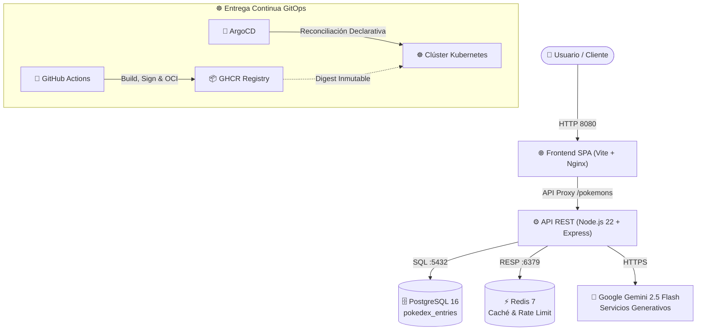

#  Pokémon DevOps Platform

Plataforma full-stack y referencia de arquitectura Cloud-Native que implementa una Pokédex reactiva para la consulta y gestión del catálogo oficial de Pokémon. Diseñada bajo principios de separación de responsabilidades, seguridad por defecto (*fail-closed*) y entrega continua mediante GitOps sobre Kubernetes portable.

[](https://github.com/rocapellino/pokedex/actions/workflows/ci.yml)
[](https://nodejs.org/)
[](https://www.typescriptlang.org/)
[](https://www.docker.com/)
[](https://kubernetes.io/)
[](https://helm.sh/)
[](https://github.com/gitleaks/gitleaks)
[](LICENSE)

---

## 📑 Tabla de Contenidos

- [1. Propósito y Visión General](#1-propósito-y-visión-general)
- [2. Características Principales](#2-características-principales)
- [3. Arquitectura del Sistema](#3-arquitectura-del-sistema)
- [4. Stack Tecnológico](#4-stack-tecnológico)
- [5. Requisitos Previos](#5-requisitos-previos)
- [6. Puesta en Marcha Local](#6-puesta-en-marcha-local)
- [7. Ejecución de Pruebas y Calidad](#7-ejecución-de-pruebas-y-calidad)
- [8. Despliegue y Orquestación](#8-despliegue-y-orquestación)
- [9. Seguridad y DevSecOps](#9-seguridad-y-devsecops)
- [10. Observabilidad y SRE](#10-observabilidad-y-sre)
- [11. Índice de Documentación](#11-índice-de-documentación)
- [12. Licencia y Contribución](#12-licencia-y-contribución)

---

## 1. Propósito y Visión General

**Pokédex** es un proyecto de ingeniería de software y operaciones que demuestra la implementación de un sistema moderno, escalable y observable. Proporciona una interfaz web interactiva y una API REST robusta para explorar más de 1.025 especímenes de Pokémon, integrando capacidades de inteligencia artificial generativa y un pipeline de entrega continua declarativo.

---

## 2. Características Principales

- **Catálogo Completo y Reactivo:** Exploración, filtrado multigenacional (Gen I a IX) y búsqueda en tiempo real de los 1.025 Pokémon oficiales.
- **Backend Unificado y Tipado:** Servidor en Node.js 22 LTS y Express con validación de esquemas y tipado de extremo a extremo en TypeScript.
- **Persistencia Híbrida y Caché:** Almacenamiento relacional duradero en PostgreSQL 16 (modelo relacional + `JSONB` indexado con GIN), pooling nativo con `pg.Pool` (con soporte opcional de PgBouncer) y aceleración en memoria con Redis 7.
- **Inteligencia Artificial Contextual:** Integración con Google Gemini 2.5 Flash (`@google/genai`) para la generación de diagramas y asistencia técnica con circuit breaker y fallback local.
- **Backoffice Administrativo:** Consola web para la gestión de especímenes, monitoreo de métricas en vivo y operaciones seguras.

---

## 3. Arquitectura del Sistema

La solución implementa una arquitectura desacoplada y orientada a contenedores sobre Kubernetes portable:



Para una especificación exhaustiva de diseño y flujos de datos, consulta [docs/architecture/ANALISIS_LENGUAJES_Y_MEJORES_PRACTICAS.md](docs/architecture/ANALISIS_LENGUAJES_Y_MEJORES_PRACTICAS.md).

---

## 4. Stack Tecnológico

| Capa | Tecnología | Rol Técnico |
| :--- | :--- | :--- |
| **Runtime & Lenguaje** | Node.js 22 LTS / TypeScript 5.x | Servidor de API, lógica de negocio y tipado estático |
| **Frontend** | HTML5, CSS Moderno, TypeScript, Vite | Interfaz reactiva, Bento Grid y Backoffice administrativo |
| **Base de Datos** | PostgreSQL 16 + Redis 7 | Persistencia ACID relacional + JSONB y caché distribuida |
| **Tooling & Build** | esbuild, Taskfile, npm workspaces | Compilación ultrarrápida y orquestación de tareas |
| **Orquestación & CI/CD** | Kubernetes, Helm 3, ArgoCD, GitHub Actions | Empaquetado declarativo y sincronización GitOps |

---

## 5. Requisitos Previos

- [Node.js](https://nodejs.org/) 22 LTS y npm 10+
- [Docker](https://www.docker.com/) 24+ y Docker Compose v2
- [Task](https://taskfile.dev/) (opcional, para ejecución simplificada de comandos)

---

## 6. Puesta en Marcha Local

### 1. Clonar el repositorio y configurar entorno

```bash
git clone https://github.com/rocapellino/pokedex.git
cd pokedex
cp .env.example .env
```

### 2. Instalar dependencias

```bash
npm install
```

### 3. Iniciar servicios con Docker Compose

```bash
docker compose up -d
```

Una vez iniciados los servicios, accede a:

- **Catálogo Web:** `http://localhost:8080`
- **Backoffice Administrativo:** `http://localhost:8080/backoffice.html`
- **Healthcheck de la API:** `http://localhost:3000/healthz`
- **Métricas Prometheus:** `http://localhost:3000/metrics`

---

## 7. Ejecución de Pruebas y Calidad

El proyecto aplica una suite multi-nivel de pruebas automatizadas:

```bash
# Ejecutar todas las pruebas unitarias y de integración
npm test

# Ejecutar linters y comprobación de tipos
npm run lint
npm run typecheck

# Validar calidad de documentación Markdown (0 errores MDxxx)
npm run lint:md
```

---

## 8. Despliegue y Orquestación

La infraestructura está modelada de forma declarativa e interoperable:

- **Desarrollo y Pruebas:** Localmente con Docker Compose o en clústeres efímeros con Kind (`infra/kind/`).
- **Producción:** Despliegue mediante Helm Chart oficial ([infra/helm/pokedex/](infra/helm/pokedex/)) y sincronización GitOps gestionada por ArgoCD ([gitops/](gitops/)), compatible con clústeres on-premise (Proxmox VE / K3s) y entornos Cloud gestionados (EKS, GKE, AKS).

### Matriz de Estado y Nivel de Soporte de Componentes

| Componente | Nivel de Soporte |
| :--- | :--- |
| Kubernetes (EKS / Bare-Metal) | Activo |
| Helm 3 (OCI Artifacts) | Activo |
| ArgoCD (GitOps) | Activo |
| OpenTofu 1.8+ | Activo |

---

## 9. Seguridad y DevSecOps

La seguridad se aplica por diseño en todo el ciclo de vida:

- **Análisis de Vulnerabilidades (SAST & SCA):** Escaneos con Semgrep, CodeQL, Dependency Review y Trivy en CI.
- **Supply Chain Security:** Firma criptográfica de imágenes con Cosign, atestación de SBOM CycloneDX y validación con Kyverno.
- **Gestión de Secretos:** Integración desacoplada mediante External Secrets Operator (ESO) con HashiCorp Vault CE.

Para reportar vulnerabilidades de forma responsable, consulta [SECURITY.md](SECURITY.md).

---

## 10. Observabilidad y SRE

- **Métricas Prometheus:** Expuestas en `/metrics` con contadores de peticiones HTTP, histogramas de latencia y saturación.
- **Healthchecks Estandarizados:** Sondas `/healthz` y `/readyz` para Kubernetes.
- **Trazabilidad Distribuida:** Encabezados W3C Trace Context y propagación de `X-Request-Id`.
- **Alertas y Decisiones:** Consulta [docs/operations/observability-alerts.md](docs/operations/observability-alerts.md) y [docs/decisions/ADR-007-observability-and-metrics.md](docs/decisions/ADR-007-observability-and-metrics.md).

---

## 11. Índice de Documentación

La documentación técnica detallada se organiza en:

- [docs/architecture/](docs/architecture/): Análisis de base de datos, escalabilidad, decisiones y aislamiento de red.
- [docs/devops/](docs/devops/): Pipeline de CI/CD, supply chain security y automatización.
- [docs/operations/](docs/operations/): Guías de aprovisionamiento, despliegue en Proxmox y respaldos off-site.
- [docs/runbooks/](docs/runbooks/): Procedimientos de contingencia y [Plan de Recuperación ante Desastres](docs/runbooks/DISASTER_RECOVERY_PLAN.md).
- [docs/decisions/](docs/decisions/): Registro inmutable de Architectural Decision Records (ADR).
- [docs/audits/](docs/audits/): Política de retención y baselines consolidados de auditoría.

### Decisiones de Arquitectura Relevantes (ADR) y CLI

- [ADR-007: Observabilidad y Métricas Prometheus](docs/decisions/ADR-007-observability-and-metrics.md)
- [ADR-008: Seguridad de Cadena de Suministro](docs/decisions/ADR-008-supply-chain-security.md)
- [ADR-009: Resiliencia de IA y Contratos](docs/decisions/ADR-009-ai-resilience-and-contracts.md)
- [ADR-010: Autenticación y Manejo de Sesiones](docs/decisions/ADR-010-authentication-and-session-management.md)
- [ADR-011: Persistencia con Drizzle ORM y PgBouncer](docs/decisions/ADR-011-persistence-drizzle-orm-and-pgbouncer.md)
- [ADR-012: Gestión de Estado y Cifrado en IaC](docs/decisions/ADR-012-iac-state-management-and-encryption.md)
- [ADR-013: Arquitectura de Red Zero Trust](docs/decisions/ADR-013-zero-trust-network-architecture.md)
- [ADR-014: Autoescalado Elástico con HPA y PDB](docs/decisions/ADR-014-elastic-autoscaling-hpa-and-pod-disruption-budget.md)
- [ADR-015: Terminación Grácil y Ciclo de Vida](docs/decisions/ADR-015-pod-lifecycle-graceful-shutdown-and-probes.md)
- [ADR-016: Ingress TLS y Hardening HTTP L7](docs/decisions/ADR-016-ingress-tls-and-http-hardening.md)
- [ADR-017: Admisión Kyverno y Pod Security](docs/decisions/ADR-017-kyverno-admission-control-and-pod-security.md)
- [ADR-018: OpenTelemetry y W3C Trace Context](docs/decisions/ADR-018-opentelemetry-distributed-tracing-and-w3c.md)
- [ADR-019: Optimización Monorepo y Turborepo](docs/decisions/ADR-019-monorepo-build-optimization-and-dependency-graph.md)
- [ADR-020: Gobernanza de Despliegue y Scripts](docs/decisions/ADR-020-unified-deployment-governance-and-script-retirement.md)
- [ADR-021: GitOps Sync Waves y Health Checks](docs/decisions/ADR-021-advanced-gitops-sync-waves-and-health-checks.md)
- [ADR-022: Rotación Automatizada de Secretos](docs/decisions/ADR-022-automated-credential-rotation-and-reloader.md)
- [ADR-026: Ciclo de Vida Aliases Taskfile CLI](docs/decisions/ADR-026-taskfile-cli-alias-deprecation-and-lifecycle.md)
- [TASKFILE_CLI_REFERENCE.md](docs/operations/TASKFILE_CLI_REFERENCE.md): Referencia oficial del CLI con Taskfile.

---

## 12. Licencia y Contribución

Este proyecto se distribuye bajo la licencia **MIT**. Consulta el archivo [LICENSE](LICENSE) para más detalles. Para directrices sobre contribuciones y estilo operativo, consulta [AGENTS.md](AGENTS.md).
