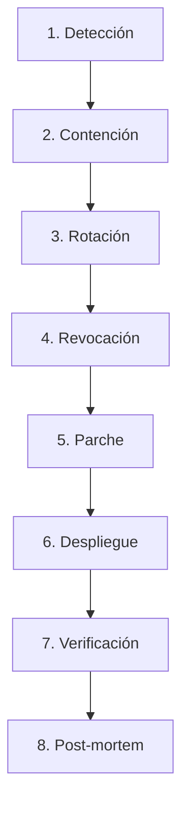

# 🚨 Security Incident Response Runbook - Pokédex Project

Este documento define los procedimientos operativos estándar (**SOP**) para la detección, contención, remediación y post-mortem de incidentes de seguridad que afecten al sistema Pokédex, su infraestructura Kubernetes/OpenTofu, bases de datos (PostgreSQL, Redis) y la cadena de suministro de CI/CD (GitHub Actions, GHCR, Cosign).

---

## 1. Matriz de Severidad de Incidentes

| Nivel | Definición | Tiempo Máximo de Respuesta (SLA) | Ejemplos |
|---|---|---|---|
| **SEV-1 (Crítico)** | Compromiso activo de credenciales maestras, RCE, fuga total de base de datos o fallo en cadena de suministro. | < 15 minutos | Fuga de `ADMIN_SESSION_SECRET` en producción, compromiso de clave Cosign / GHCR, ataque activo con privilegios de escritura. |
| **SEV-2 (Alto)** | Caída total de componentes de seguridad fail-closed, robo de un token de sesión individual, o CVE crítico reportado sin mitigación. | < 1 hora | Redis inaccesible en multi-pod provocando 503 en auth, vulnerabilidad crítica descubierta en imagen base distroless. |
| **SEV-3 (Medio)** | Ataque DoS mitigado por rate limiting, intentos continuos de inyección XSS/SQL bloqueados, discrepancias en políticas de red. | < 4 horas | IPs abusando de endpoints de IA y alcanzando cuotas diarias, anomalías en logs de Kyverno. |
| **SEV-4 (Bajo)** | Falsos positivos en scanners, advertencias menores de dependencias sin vector de explotación conocido. | < 24 horas | Alerta no crítica de Dependabot en dependencia de desarrollo. |

---

## 2. Ciclo de Vida de Respuesta a Incidentes (8 Fases)



1. **Detección**: Identificar la señal de compromiso a través de métricas (`pokedex_http_requests_total`, auth failures), logs de Kubernetes, alertas de Trivy/Semgrep o reportes externos vía [SECURITY.md](file:///c:/Users/Rodrigo/Documents/Git/pokedex/SECURITY.md).
2. **Contención**: Aislar pods o tráfico sospechoso mediante NetworkPolicies, revocación temporal de ingress o escalado a cero de servicios comprometidos.
3. **Rotación**: Regenerar inmediatamente los secretos comprometidos en Kubernetes Secrets, Vault o variables de entorno de producción.
4. **Revocación**: Invalidar tokens de sesión activos masiva o puntualmente en Redis.
5. **Parche**: Aplicar correcciones de código o actualizar dependencias con `npm audit fix` o bump de imágenes fijadas por SHA.
6. **Despliegue**: Pasar los Quality Gates completos de CI/CD (SAST, SCA, Trivy, Fuzzing, Cosign) y desplegar en Kubernetes.
7. **Verificación**: Comprobar salud mediante `/healthz`, `/readyz`, `/metrics` y suites de pentest automatizadas.
8. **Post-mortem**: Documentar causa raíz (RCA), impacto, acciones tomadas y medidas preventivas en un plazo no mayor a 72 horas.

---

## 3. Playbooks Operativos por Escenario

### Escenario A: Compromiso de `ADMIN_SESSION_SECRET` o `ADMIN_API_KEY`
**Impacto:** Cualquier atacante con el secreto puede forjar tokens de sesión de administrador válidos sin pasar por `/api/v1/auth/session`.

#### Procedimiento de Mitigación Inmediata:
1. **Generar un nuevo secreto criptográficamente fuerte (32 bytes hex / 256 bits):**
   ```bash
   NEW_SESSION_SECRET=$(openssl rand -hex 32)
   NEW_API_KEY=$(openssl rand -hex 32)
   ```
2. **Actualizar el Secret en Kubernetes:**
   ```bash
   kubectl create secret generic pokedex-secrets \
     --namespace pokedex \
     --from-literal=admin-api-key="$NEW_API_KEY" \
     --from-literal=admin-session-secret="$NEW_SESSION_SECRET" \
     --dry-run=client -o yaml | kubectl apply -f -
   ```
3. **Invalidación Criptográfica y Limpieza Granular de Sesiones en Redis:**
   Como `ADMIN_SESSION_SECRET` cambió, **todos los tokens firmados con el secreto anterior quedan inmediatamente invalidados a nivel criptográfico** (`crypto.timingSafeEqual` falla con `invalid_signature`) en cuanto los pods carguen la nueva clave, sin necesidad de vaciar la base de datos completa.
   Para limpiar claves huérfanas de revocación de forma no destructiva (preservando contadores de rate limiting distribuido y cuotas de IA):
   ```bash
   # Limpieza granular selectiva (NO usar FLUSHDB para evitar pérdida de métricas/rate-limits):
   kubectl exec -it deployment/redis -n pokedex -- sh -c "redis-cli --scan --pattern 'pokedex:revoked:*' | xargs -r redis-cli del"
   ```
4. **Reiniciar los Pods de la API para cargar las nuevas credenciales:**
   ```bash
   kubectl rollout restart deployment/pokedex -n pokedex
   kubectl rollout status deployment/pokedex -n pokedex
   ```
5. **Verificar:**
   Intentar acceder a `/pokemons` (POST/PUT/DELETE) con el token antiguo; debe responder estrictamente `401 Unauthorized`.

---

### Escenario B: Fuga o Robo de Token de Sesión Específico
**Impacto:** Un atacante posee un token de sesión válido emitido legítimamente pero no el secreto maestro.

#### Procedimiento de Revocación Puntual:
1. **Extraer el `jti` y timestamp `exp` del token comprometido:**
   ```bash
   # En Node.js o decodificador seguro:
   node -e "const [p] = process.argv[1].split('.'); console.log(JSON.parse(Buffer.from(p, 'base64url').toString('utf8')));" "<TOKEN_COMPROMETIDO>"
   ```
2. **Inyectar la revocación forzada directamente en Redis con TTL correspondiente:**
   ```bash
   # Si el token expira en 900 segundos:
   kubectl exec -it deployment/redis -n pokedex -- redis-cli SETEX "pokedex:revoked:<JTI>" 900 "1"
   ```
3. **Verificar revocación:**
   ```bash
   curl -X POST http://<API_URL>/api/v1/auth/logout \
     -H "Authorization: Bearer <TOKEN_COMPROMETIDO>"
   # Las solicitudes subsiguientes con este Bearer token deben retornar 401 Unauthorized
   ```

---

### Escenario C: Caída o Indisponibilidad de Redis (Fail-Closed)
**Impacto:** La API deniega operaciones de autenticación multi-pod con `503 Service Unavailable` para evitar que pods desincronizados acepten tokens revocados.

#### Diagnóstico y Recuperación:
1. **Comprobar estado del pod de Redis:**
   ```bash
   kubectl get pods -n pokedex -l app.kubernetes.io/name=redis
   kubectl logs deployment/redis -n pokedex --tail=100
   ```
2. **Verificar conectividad de red interna:**
   ```bash
   kubectl exec -it deployment/pokedex -n pokedex -- nc -zv redis-service 6379
   ```
3. **Si el pod está en CrashLoopBackOff o OOMKilled:**
   - Verificar límites de recursos en `infra/helm/pokedex/values.yaml`.
   - Reiniciar el pod de Redis:
     ```bash
     kubectl rollout restart deployment/redis -n pokedex
     ```
4. **Validar retorno a la normalidad:**
   ```bash
   curl -s http://<API_URL>/readyz | jq .redis_connected
   # Debe responder true y HTTP 200
   ```

---

### Escenario D: Vulnerabilidad Crítica Reportada en Contenedor o Dependencia (CVE)
**Impacto:** Trivy o Dependency Review bloquean el pipeline o se notifica un zero-day en una librería externa.

#### Procedimiento de Mitigación:
1. **Reproducir el hallazgo localmente con Trivy:**
   ```bash
   docker build -t pokedex:local-audit .
   trivy image --severity HIGH,CRITICAL pokedex:local-audit
   ```
2. **Actualizar dependencia fijada:**
   - Si es dependencia npm: actualizar en `package.json` o aplicar `overrides`.
   - Si es imagen base Dockerfile: verificar nuevo digest SHA en Docker Hub / GHCR para Node.js distroless o alpine.
3. **Ejecutar Suite de Fuzzing y Pentest local:**
   ```bash
   npm run lint
   npm test
   npm run test:fuzz
   ```
4. **Abrir Pull Request:**
   Asegurarse de que el commit incluya descripción detallada del CVE mitigado y pasar los gates de `Dependency Review` y `Trivy`.

---

### Escenario E: Caída o Corrupción de PostgreSQL (Fail-Closed de Mutaciones)
**Impacto:** La API entra en modo degradado de solo lectura (lectura desde memoria/caché) y rechaza cualquier mutación (`POST/PUT/DELETE /pokemons`) con `503 Service Unavailable`.

#### Procedimiento de Recuperación:
1. **Comprobar salud en `/readyz` y métricas:**
   ```bash
   curl -s http://<API_URL>/readyz | jq .
   # Verificar postgres_connected: false
   ```
2. **Inspeccionar estado de la base de datos:**
   ```bash
   kubectl logs deployment/postgresql -n pokedex --tail=100
   ```
3. **Restaurar conectividad o recrear réplica:**
   ```bash
   kubectl rollout restart deployment/postgresql -n pokedex
   ```
4. **Verificar reconexión automática:**
   Una vez que PostgreSQL responda en el puerto 5432, el pool de conexiones de la aplicación restaurará `isWritableStorageAvailable()` y `/readyz` retornará 200 `ready`.

---

## 4. Contactos y Escalamiento

- **Líder de Seguridad / Maintainer:** Equipo Pokédex Security ([SECURITY.md](file:///c:/Users/Rodrigo/Documents/Git/pokedex/SECURITY.md))
- **Canal de Incidentes:** Issues confidenciales con etiqueta `security-incident` en GitHub.
- **Canal de Auditoría Externa:** Reportes mediante GitHub Security Advisories privados.
