# 📚 Portal de Documentación Técnica: Pokédex DevOps Platform

Bienvenido al centro de documentación oficial del monorepo **Pokédex DevOps Platform**. Este portal organiza y enlaza todas las especificaciones de arquitectura, contratos de API, manuales operativos, seguridad DevSecOps y guías de desarrollo del proyecto.

---

## 🗺️ Mapa de Navegación de la Documentación

```mermaid
flowchart TD
    PORTAL(["📚 Portal de Documentación\ndocs/README.md"]) --> ARCH["🏗️ 1. Arquitectura & Diseño\n(docs/architecture/)"]
    PORTAL --> API["📡 2. Contratos de API REST\n(docs/api/)"]
    PORTAL --> DEVOPS["🤖 3. DevOps, CI/CD & Herramientas\n(docs/devops/)"]
    PORTAL --> BEST["🌿 4. Estándares & Mejores Prácticas\n(docs/best-practices/)"]
    PORTAL --> RUN["📖 5. Runbooks & Operaciones\n(docs/runbooks/)"]

    ARCH --> A1["🎨 MOCKUPS_Y_DISENO_UI.md"]
    ARCH --> A2["🔬 ANALISIS_LENGUAJES_Y_MEJORES_PRACTICAS.md"]
    ARCH --> A3["🔄 APPLICATION_LIFECYCLE.md"]
    ARCH --> A4["🛡️ SECURITY_AND_NETWORK_ISOLATION.md"]
    ARCH --> A5["📊 DATABASE_ANALYSIS.md"]
    ARCH --> A6["☁️ CLOUD_INFRASTRUCTURE_DESIGN.md"]
    ARCH --> A7["☸️ KUBERNETES_SCALING_ANALYSIS.md"]
    ARCH --> A8["📂 MONOREPO_STRUCTURE.md"]

    API --> AP1["📡 API_SPECIFICATION.md"]

    DEVOPS --> D1["🤖 GITHUB_WORKFLOWS_GUIDE.md"]
    DEVOPS --> D2["🌿 GIT_BRANCHING_AND_MERGE_WORKFLOW.md"]
    DEVOPS --> D3["🛠️ TOOLS_AND_TECH_STACK.md"]

    BEST --> B1["🌿 MEJORES_PRACTICAS_GIT.md"]
    BEST --> B2["🐳 MEJORES_PRACTICAS_DOCKERFILE.md"]

    RUN --> R1["⎈ HELM_DEPLOYMENT_GUIDE.md"]
    RUN --> R2["🚀 KUBERNETES_AUTOSCALING_GUIDE.md"]
    RUN --> R3["🧪 STRESS_TESTING_GUIDE.md"]

    classDef main fill:#2563eb,stroke:#1d4ed8,color:#fff;
    classDef section fill:#0891b2,stroke:#0e7490,color:#fff;
    classDef doc fill:#64748b,stroke:#475569,color:#fff;

    class PORTAL main;
    class ARCH,API,DEVOPS,BEST,RUN section;
    class A1,A2,A3,A4,A5,A6,A7,A8,AP1,D1,D2,D3,B1,B2,R1,R2,R3 doc;
```

---

## 📑 Directorio de Documentos por Categoría

### 1. 🏗️ Arquitectura y Decisiones de Diseño ([`docs/architecture/`](./architecture/))
* 🔄 [**APPLICATION_LIFECYCLE.md**](./architecture/APPLICATION_LIFECYCLE.md): **Ciclo de vida integral (SDLC & DevOps)** con diagrama de flujo de punta a punta (Linear, CI/CD, SemVer, Cosign Keyless OIDC, SBOM CycloneDX, Kyverno ClusterPolicy y ArgoCD).
* 🛡️ [**SECURITY_AND_NETWORK_ISOLATION.md**](./architecture/SECURITY_AND_NETWORK_ISOLATION.md): Modelo de **Defensa en Profundidad**, segmentación de red DMZ de 4 capas, control de admisión con Kyverno, políticas *fail-closed* y aislamiento de base de datos con NetworkPolicies.
* 📊 [**DATABASE_ANALYSIS.md**](./architecture/DATABASE_ANALYSIS.md): Análisis de persistencia híbrida (PostgreSQL 16 con almacenamiento JSONB y secuencia atómica + Redis 7 para aceleración sub-3ms, revocación de sesiones y rate limiting atómico en Lua).
* ☁️ [**CLOUD_INFRASTRUCTURE_DESIGN.md**](./architecture/CLOUD_INFRASTRUCTURE_DESIGN.md): Arquitectura de infraestructura en la nube, topología Zero-Trust y despliegue híbrido GitOps (Proxmox VE on-premise + AWS EKS cloud) con OpenTofu.
* ☸️ [**KUBERNETES_SCALING_ANALYSIS.md**](./architecture/KUBERNETES_SCALING_ANALYSIS.md): Autoescalado elástico horizontal (**HPA v2**), garantía de consistencia de réplica única de base de datos y comparativa L4 vs L7.
* 🎨 [**MOCKUPS_Y_DISENO_UI.md**](./architecture/MOCKUPS_Y_DISENO_UI.md): Mockups visuales de alta fidelidad del Catálogo, Ficha de Detalle y Panel Backoffice CRUD con accesibilidad y temas claro/oscuro.
* 🔬 [**ANALISIS_LENGUAJES_Y_MEJORES_PRACTICAS.md**](./architecture/ANALISIS_LENGUAJES_Y_MEJORES_PRACTICAS.md): Análisis comparativo de lenguajes de programación (TypeScript vs Python vs Go), arquitectura limpia y justificación del stack Node.js 22 LTS.
* 📂 [**MONOREPO_STRUCTURE.md**](./architecture/MONOREPO_STRUCTURE.md): Organización de directorios del monorepo (`apps/`, `infra/`, `gitops/`, `src/`, `scripts/`, `docs/`) y responsabilidades por dominio.
* 🔐 [**SECRETS_MANAGEMENT_SEALED_SECRETS.md**](./architecture/SECRETS_MANAGEMENT_SEALED_SECRETS.md): Gestión segura de credenciales sin secretos en claro en Git mediante Bitnami Sealed Secrets y escaneo con Gitleaks.
* 🖥️ [**PROXMOX_DEPLOYMENT_GUIDE.md**](./architecture/PROXMOX_DEPLOYMENT_GUIDE.md): Guía de despliegue y virtualización en clústeres locales Proxmox VE con contenedores LXC.

---

### 2. 📡 Contratos e Interfaces de API ([`docs/api/`](./api/))
* 📡 [**API_SPECIFICATION.md**](./api/API_SPECIFICATION.md): Especificación formal de los endpoints REST del backend (`/pokemons`, `/api/v1/auth/session`, `/api/v1/auth/logout`, `/api/v1/ai/*`, `/healthz`, `/readyz`, `/metrics`), diagrama de flujo del pipeline de middlewares, rate limiting y códigos HTTP.

---

### 3. 🤖 DevOps, CI/CD y Herramientas ([`docs/devops/`](./devops/))
* 🤖 [**GITHUB_WORKFLOWS_GUIDE.md**](./devops/GITHUB_WORKFLOWS_GUIDE.md): Guía completa de workflows de GitHub Actions con filtrado por rutas (`paths`), Quality Gates paralelos, firmado de imágenes con Cosign y sincronización con Linear.
* 🌿 [**GIT_BRANCHING_AND_MERGE_WORKFLOW.md**](./devops/GIT_BRANCHING_AND_MERGE_WORKFLOW.md): Estrategia de ramas GitHub Flow, estándares de Conventional Commits, apertura de Pull Requests y reglas de protección.
* 🛠️ [**TOOLS_AND_TECH_STACK.md**](./devops/TOOLS_AND_TECH_STACK.md): Catálogo exhaustivo de tecnologías utilizadas en el proyecto y diagrama de flujo del ecosistema de herramientas.

---

### 4. 🌿 Estándares y Mejores Prácticas ([`docs/best-practices/`](./best-practices/))
* 🌿 [**MEJORES_PRACTICAS_GIT.md**](./best-practices/MEJORES_PRACTICAS_GIT.md): Higiene de repositorio, plantillas de PR, hooks de pre-commit y políticas contra fuga de información sensible.
* 🐳 [**MEJORES_PRACTICAS_DOCKERFILE.md**](./best-practices/MEJORES_PRACTICAS_DOCKERFILE.md): Construcción multi-stage en Alpine, reducción de superficie de ataque (usuario no-root UID 1001), orden de capas y cacheo eficiente.

---

### 5. 📖 Manuales Operativos y Runbooks ([`docs/runbooks/`](./runbooks/))
* ⎈ [**HELM_DEPLOYMENT_GUIDE.md**](./runbooks/HELM_DEPLOYMENT_GUIDE.md): Manual de despliegue con Helm 3, parametrización de entornos (`values.yaml`, `values.prod.yaml`) y sincronización con ArgoCD.
* 🚀 [**KUBERNETES_AUTOSCALING_GUIDE.md**](./runbooks/KUBERNETES_AUTOSCALING_GUIDE.md): Procedimiento de validación del autoescalado con métricas de CPU y siembra masiva de datos.
* 🧪 [**STRESS_TESTING_GUIDE.md**](./runbooks/STRESS_TESTING_GUIDE.md): Guía para ejecución de pruebas de carga y estrés con k6 y generador concurrente de tráfico.
