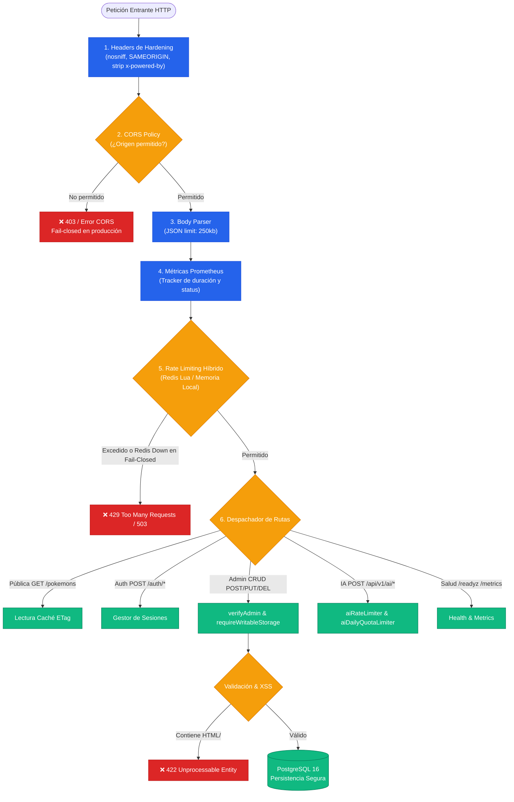

# 📡 Especificación de Contratos y Endpoints de la API REST

Esta guía define formalmente todos los endpoints REST, parámetros, estructuras de payload, esquemas de autenticación, validaciones de seguridad y códigos de estado HTTP expuestos por el backend **Pokémon API** (Node.js 22 LTS + Express 4.21 + TypeScript 5.7).

---

## 📑 Tabla de Contenidos
1. [Información General y Arquitectura de Middlewares](#1-información-general-y-arquitectura-de-middlewares)
2. [Diagrama de Flujo del Pipeline de Procesamiento HTTP](#2-diagrama-de-flujo-del-pipeline-de-procesamiento-http)
3. [Autenticación, Sesiones y Seguridad Criptográfica](#3-autenticación-sesiones-y-seguridad-criptográfica)
4. [Endpoints de Autenticación y Sesiones](#4-endpoints-de-autenticación-y-sesiones)
5. [Endpoints del Catálogo de Pokémon](#5-endpoints-del-catálogo-de-pokémon)
6. [Endpoints de Inteligencia Artificial (AI Services)](#6-endpoints-de-inteligencia-artificial-ai-services)
7. [Endpoints del Sistema, Salud y Monitoreo](#7-endpoints-del-sistema-salud-y-monitoreo)
8. [Endpoints Administrativos y de Utilidad](#8-endpoints-administrativos-y-de-utilidad)
9. [Esquema de Datos de Pokémon (TypeScript Interfaces)](#9-esquema-de-datos-de-pokémon-typescript-interfaces)
10. [Códigos de Estado HTTP y Manejo de Errores](#10-códigos-de-estado-http-y-manejo-de-errores)

---

## 1. Información General y Arquitectura de Middlewares

* **Base URL Local:** `http://localhost:3000` (Backend API) / `http://localhost:8080` (vía Nginx Ingress Proxy).
* **Formato de Comunicación:** `application/json; charset=utf-8`.
* **Runtime:** Node.js 22 LTS compilado con esbuild sobre contenedor Alpine endurecido (UID no-root: `1001`).
* **Límite de Payload:** Máximo de 250 KB (`express.json({ limit: '250kb' })`) para prevenir ataques DoS por saturación de memoria.
* **Cabeceras de Seguridad:** Inyección automática de `X-Content-Type-Options: nosniff`, `X-Frame-Options: SAMEORIGIN` y `Referrer-Policy: strict-origin-when-cross-origin`. Supresión de `X-Powered-By`.
* **Políticas CORS:** Configuración en modo *fail-closed*. En producción exige definición explícita de `CORS_ORIGINS`; en desarrollo restringe estrictamente a loopback (`localhost:3000`, `localhost:8080`, `127.0.0.1`).
* **Estrategia de Caché y Validación Condicional:** Catálogo en memoria y Redis 7 con resolución sub-3ms mediante claves `pokedex:list:*` e invalidación automática ante mutaciones. Validación condicional de clientes mediante cabeceras `ETag` y `Cache-Control: public, max-age=60, stale-while-revalidate=300`.

---

## 2. Diagrama de Flujo del Pipeline de Procesamiento HTTP



---

## 3. Autenticación, Sesiones y Seguridad Criptográfica

El backend implementa un esquema de autenticación **timing-safe** de doble capa con desacoplamiento estricto de secretos:

1. **`ADMIN_API_KEY`:** Secreto administrativo utilizado exclusivamente para:
   * Autenticación directa de scripts/máquinas mediante cabecera `Authorization: Bearer <ADMIN_API_KEY>` o `X-API-Key: <ADMIN_API_KEY>`.
   * Intercambio por tokens de sesión temporales vía `POST /api/v1/auth/session`.
2. **`ADMIN_SESSION_SECRET`:** Clave criptográfica simétrica dedicada exclusivamente a:
   * Firmar tokens de sesión HMAC SHA-256 (`Bearer <base64url_payload>.<base64url_signature>`).
   * Verificar la validez de los tokens sin exponer la clave administrativa maestra.
3. **Prevención de Timing Attacks:** Todas las comparaciones de contraseñas y claves se ejecutan mediante `crypto.timingSafeEqual` sobre hashes SHA-256 de longitud constante fija.
4. **Estructura del Token de Sesión:**
   ```json
   {
     "role": "admin",
     "iat": 1725800000,
     "exp": 1725828800,
     "jti": "5a7f9b0c2e3d4a1b"
   }
   ```
5. **Revocación Distribuida Fail-Closed:** Al cerrar sesión (`POST /api/v1/auth/logout`), se valida primero la firma HMAC del token para rechazar firmas apócrifas con `400 Bad Request`. Si es válido, se almacena el `jti` en Redis bajo la clave `revoked:<jti>` con TTL exacto al tiempo restante de expiración. Si Redis no está disponible, el sistema responde `503 Service Unavailable` bloqueando el logout en modo *fail-closed*.

---

## 4. Endpoints de Autenticación y Sesiones

### 4.1. Iniciar Sesión / Intercambiar Credencial por Token
* **Ruta:** `POST /api/v1/auth/session`
* **Autenticación:** Requiere cabecera `X-API-Key: <ADMIN_API_KEY>` o `Authorization: Bearer <ADMIN_API_KEY>`.
* **Rate Limit:** 15 solicitudes/minuto por IP (`authRateLimiter`).
* **Respuesta Exitosa (`200 OK`):**
  ```json
  {
    "status": "authenticated",
    "token": "<base64url_payload>.<base64url_hmac_signature>",
    "expires_in": 28800,
    "role": "admin"
  }
  ```
* **Respuesta de Error (`401 Unauthorized`):**
  ```json
  {
    "detail": "Credencial inválida o no proporcionada"
  }
  ```

---

### 4.2. Cerrar Sesión y Revocar Token
* **Ruta:** `POST /api/v1/auth/logout`
* **Autenticación:** Requiere cabecera `Authorization: Bearer <Token>` o `X-Session-Token: <Token>`.
* **Rate Limit:** 15 solicitudes/minuto por IP (`authRateLimiter`).
* **Comportamiento Fail-Closed:**
  1. Valida criptográficamente la firma HMAC del token con `ADMIN_SESSION_SECRET`.
  2. Si la firma es falsa o corrupta: **`400 Bad Request`** (`Firma de token inválida`).
  3. Si la firma es válida: almacena `revoked:<jti>` en Redis con TTL.
  4. Si Redis está caído: **`503 Service Unavailable`** (`Almacenamiento de revocación no disponible (fail-closed)`).
* **Respuesta Exitosa (`200 OK`):**
  ```json
  {
    "status": "success",
    "message": "Sesión cerrada correctamente"
  }
  ```

---

## 5. Endpoints del Catálogo de Pokémon

### 5.1. Listar y Filtrar Pokémon (Con Paginación Segura Anti-DoS)
* **Ruta:** `GET /pokemons`
* **Autenticación:** Pública (sin credenciales).
* **Parámetros de Consulta (Query Params):**
  | Parámetro | Tipo | Restricción Anti-DoS | Descripción |
  | :--- | :--- | :--- | :--- |
  | `tipo` | `string` | Máx. 50 caracteres | Filtra por tipo elemental en español (ej: `Fuego`, `Agua`, `Eléctrico`). |
  | `nombre` | `string` | Máx. 100 caracteres | Búsqueda por subcadena insensible a mayúsculas/minúsculas. |
  | `limit` | `integer` | Rango: **1 a 100** (defecto: 50) | Límite máximo de resultados por página. |
  | `offset` | `integer` | Rango: **0 a 10.000** (defecto: 0) | Desplazamiento inicial para paginación segura. |

* **Cabeceras de Respuesta:**
  * `ETag`: Hash determinista de la colección para validación del lado del cliente (`If-None-Match`).
  * `Cache-Control`: `public, max-age=60, stale-while-revalidate=300`.
* **Respuesta Exitosa (`200 OK`):** Array JSON de objetos Pokémon.
* **Respuesta Condicional (`304 Not Modified`):** Retornada si `If-None-Match` coincide con el ETag actual.

---

### 5.2. Obtener Detalle de un Pokémon por ID
* **Ruta:** `GET /pokemons/:id`
* **Parámetros de Ruta:** `:id` (Entero positivo, ej: `25`).
* **Respuesta Exitosa (`200 OK`):** Objeto Pokémon completo.
* **Respuesta de Error (`404 Not Found`):**
  ```json
  {
    "detail": "Pokémon con id 9999 no encontrado"
  }
  ```

---

### 5.3. Crear un Nuevo Pokémon
* **Ruta:** `POST /pokemons`
* **Autenticación:** Requiere `Bearer <Token>` o `ADMIN_API_KEY`.
* **Rate Limit:** 30 solicitudes/minuto por IP (`mutationRateLimiter`).
* **Protección Writable Storage:** Si PostgreSQL está inaccesible, responde inmediatamente con **`503 Service Unavailable`** impidiendo escrituras en memoria desincronizadas.
* **Sanitización XSS:** Valida que ningún campo contenga `<...>` o `javascript:`. En caso de detección responde **`422 Unprocessable Entity`**.
* **Asignación de ID:** Si no se especifica `id`, la secuencia atómica `pokedex_id_seq` asigna automáticamente el siguiente valor disponible a partir del máximo actual o 1008+.
* **Cuerpo de la Petición (Request Body):**
  ```json
  {
    "nombre": "Pecharunt",
    "tipo": "Veneno",
    "tipos": ["Veneno", "Fantasma"],
    "habilidades": ["Títere Tóxico"],
    "habitat": "Desconocido",
    "imagen": "https://raw.githubusercontent.com/PokeAPI/sprites/master/sprites/pokemon/other/official-artwork/1025.png",
    "caracteristicas": {
      "altura": 0.3,
      "peso": 0.3,
      "fuerza": 88,
      "edad": 1,
      "categoria": "Pokémon Subyugador",
      "descripcion": "Almacena toxinas en su caparazón con forma de melocotón."
    },
    "stats": {
      "hp": 88,
      "attack": 88,
      "defense": 160,
      "sp_attack": 88,
      "sp_defense": 88,
      "speed": 88
    }
  }
  ```
* **Respuesta Exitosa (`201 Created`):** Objeto JSON del Pokémon creado con su `id` asignado.

---

### 5.4. Actualizar un Pokémon Existente
* **Ruta:** `PUT /pokemons/:id`
* **Autenticación:** Requiere `Bearer <Token>` o `ADMIN_API_KEY`.
* **Rate Limit:** 30 solicitudes/minuto.
* **Descripción:** Actualiza de forma parcial o total las propiedades de un Pokémon, persiste los cambios en PostgreSQL e invalida inmediatamente las claves de caché de Redis (`pokedex:list:*`).
* **Respuesta Exitosa (`200 OK`):** Objeto Pokémon actualizado.

---

### 5.5. Eliminar un Pokémon
* **Ruta:** `DELETE /pokemons/:id`
* **Autenticación:** Requiere `Bearer <Token>` o `ADMIN_API_KEY`.
* **Rate Limit:** 30 solicitudes/minuto.
* **Descripción:** Elimina el registro de PostgreSQL e invalida la caché en Redis.
* **Respuesta Exitosa (`200 OK`):**
  ```json
  {
    "mensaje": "Pokémon con id 25 eliminado con éxito"
  }
  ```

---

## 6. Endpoints de Inteligencia Artificial (AI Services)

Servicios de IA generativa integrados nativamente con **Google AI Studio (`@google/genai`)** utilizando el modelo **Gemini 2.5 Flash**:

* **Autenticación:** Requiere `X-API-Key: <AI_API_KEY>` (o `ADMIN_API_KEY` / Bearer Token).
* **Control de Tasa y Cuotas:**
  * Rate Limiter por minuto: **10 solicitudes/minuto** por IP (`aiRateLimiter`).
  * Cuota diaria fail-closed: **200 solicitudes/día** por IP (`aiDailyQuotaLimiter`). Si Redis está caído, la cuota aplica política *fail-closed* (`503 Service Unavailable`) para prevenir consumo descontrolado de tokens.
* **Timeout y Resiliencia:** Todas las llamadas a la API de Gemini están protegidas por un timeout estricto de **12 segundos** (`withTimeout(12000)`). En caso de timeout o indisponibilidad de API Key, se activa de forma transparente un generador determinista local de respaldo.
* **Tokens Máximos:** `maxOutputTokens: 1024` para garantizar tiempos de respuesta ágiles.

### 6.1. Generar Diagrama de Arquitectura
* **Ruta:** `POST /api/v1/ai/diagram`
* **Cuerpo de la Petición:**
  ```json
  {
    "topic": "Flujo de lectura con caché Redis y fallback en PostgreSQL"
  }
  ```
* **Respuesta Exitosa (`200 OK`):**
  ```json
  {
    "topic": "Flujo de lectura con caché Redis y fallback en PostgreSQL",
    "diagram": "graph TD;\n    A[Cliente] --> B[Express Server];\n    B --> C{Caché Redis?};\n    C -- Sí --> D[Retornar sub-3ms];\n    C -- No --> E[Consultar PostgreSQL 16];"
  }
  ```

---

### 6.2. Generar Especificación de Mockup de UI
* **Ruta:** `POST /api/v1/ai/mock`
* **Cuerpo de la Petición:**
  ```json
  {
    "component_name": "PokemonEvolutionChain"
  }
  ```
* **Respuesta Exitosa (`200 OK`):** Retorna la especificación JSON estructurada del componente.

---

### 6.3. Generar Prompt de Asset de Imagen
* **Ruta:** `POST /api/v1/ai/image`
* **Aspect Ratios Soportados:** `"1:1"`, `"16:9"`, `"9:16"`, `"4:3"`, `"3:4"`.
* **Cuerpo de la Petición:**
  ```json
  {
    "prompt": "Ilustración estilo Sugimori de un Pokémon dragón eléctrico",
    "aspect_ratio": "1:1"
  }
  ```
* **Respuesta Exitosa (`200 OK`):** Retorna el prompt estructurado y metadata del asset.

---

## 7. Endpoints del Sistema, Salud y Monitoreo

| Endpoint | Método | Autenticación | SLA / Propósito | Respuesta Típica |
| :--- | :---: | :--- | :--- | :--- |
| **`/healthz`** | `GET` | Pública | **Liveness Probe**: Verifica que el proceso Express responda al event loop. | `healthy\n` (`200 OK`) |
| **`/readyz`** | `GET` | Pública | **Readiness Probe**: Verifica conectividad activa contra PostgreSQL (`SELECT 1`) y Redis (`PING`). | `{"status":"ready","database":"connected","redis":"connected"}` (`200 OK` o `503 Service Unavailable`) |
| **`/metrics`** | `GET` | Pública | **Prometheus Scrape Endpoint**: Expone contadores, histogramas de latencia y uptime en formato OpenMetrics. | Texto plano de métricas estándar |

---

## 8. Endpoints Administrativos y de Utilidad

### 8.1. Exportación del Repositorio (`/download/repo`)
* **Rutas alternativas:** `/download`, `/download-zip`, `/download/repo`
* **Autenticación:** Requiere `ADMIN_API_KEY` o Bearer Token válido.
* **Rate Limit:** 30 solicitudes/minuto.
* **Propósito:** Genera y transmite dinámicamente un archivo `.zip` con el código fuente del repositorio para auditoría o respaldo local fuera de línea.

### 8.2. Panel de Backoffice (`/backoffice.html`)
* **Rutas alternativas:** `/admin`, `/backoffice`, `/backoffice.html`
* **Control de Acceso:** Middleware `adminIpRestricted` que restringe el acceso al panel a direcciones IP locales de administración (`127.0.0.1`, `::1`, `localhost` y rangos RFC1918 configurados).

---

## 9. Esquema de Datos de Pokémon (TypeScript Interfaces)

```typescript
export interface PokemonStats {
  hp: number;
  attack: number;
  defense: number;
  sp_attack: number;
  sp_defense: number;
  speed: number;
}

export interface PokemonCharacteristics {
  altura: number;        // En metros
  peso: number;          // En kilogramos
  fuerza: number;
  edad: number;
  categoria?: string;
  descripcion?: string;
}

export interface Pokemon {
  id: number;
  nombre: string;
  tipo: string;
  tipos?: string[];
  habilidades?: string[];
  habitat?: string;
  imagen: string;
  caracteristicas?: PokemonCharacteristics;
  stats?: PokemonStats;
  evoluciones?: any;
}
```

---

## 10. Códigos de Estado HTTP y Manejo de Errores

| Código HTTP | Nombre Estándar | Causa en Pokédex API |
| :---: | :--- | :--- |
| **`200 OK`** | Success | Consulta `GET`, actualización `PUT`, eliminación `DELETE` o sesión `POST /auth/*`. |
| **`201 Created`** | Created | Pokémon creado exitosamente vía `POST /pokemons`. |
| **`304 Not Modified`** | Not Modified | La cabecera `If-None-Match` del cliente coincide con el `ETag` actual. |
| **`400 Bad Request`** | Bad Request | Payload JSON malformado o intento de logout con token de firma apócrifa/corrupta. |
| **`401 Unauthorized`** | Unauthorized | Credencial ausente, token revocado, expirado o con firma HMAC inválida. |
| **`403 Forbidden`** | Forbidden | Violación de directiva de seguridad CORS o intento de acceso desde IP no autorizada. |
| **`404 Not Found`** | Not Found | ID de Pokémon no existente en la base de datos o catálogo. |
| **`422 Unprocessable Entity`** | Unprocessable Entity | Payload inválido o detección de vectores XSS (etiquetas HTML `<...>` o `javascript:`). |
| **`429 Too Many Requests`** | Rate Limit Exceeded | Superado el límite de solicitudes por ventana de tiempo. Cabecera `Retry-After: <segundos>`. |
| **`503 Service Unavailable`** | Service Unavailable | **Fail-Closed**: Fallo en PostgreSQL al intentar mutación de escritura, o fallo en Redis al intentar revocación de sesión o cálculo de cuota de IA. |
