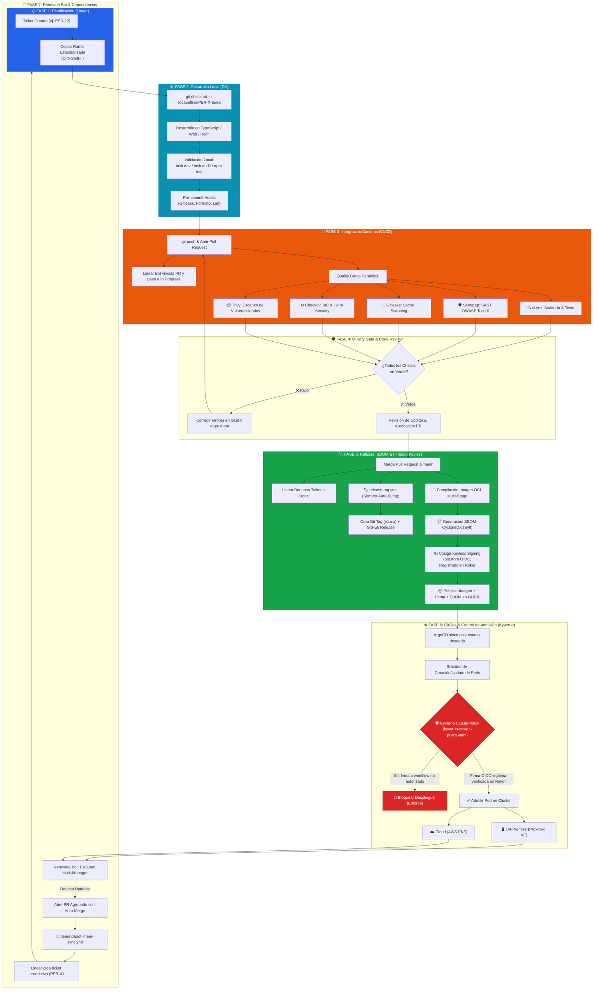

# 🔄 Ciclo de Vida Integral de la Aplicación (SDLC & DevOps Lifecycle)

Este documento describe el flujo de vida completo de la plataforma **Pokédex**, desde la concepción de una tarea o actualización de seguridad hasta su compilación, firmado criptográfico de artefactos, control de admisión en Kubernetes, versionado semántico y mantenimiento automatizado.

---

## 📑 Índice
1. [Diagrama de Flujo del Ciclo de Vida](#1-diagrama-de-flujo-del-ciclo-de-vida)
2. [Fases Detalladas del Ciclo](#2-fases-detalladas-del-ciclo)
   * [Fase 1: Planificación y Gestión Ágil (Linear)](#fase-1-planificación-y-gestión-ágil-linear)
   * [Fase 2: Desarrollo Local y Quality Gates (DX)](#fase-2-desarrollo-local-y-quality-gates-dx)
   * [Fase 3: Integración Continua y DevSecOps (GitHub Actions)](#fase-3-integración-continua-y-devsecops-github-actions)
   * [Fase 4: Revisión de Código y Quality Gate (GitHub Rulesets)](#fase-4-revisión-de-código-y-quality-gate-github-rulesets)
   * [Fase 5: Merge, Versionado Semántico y Firmado OCI (Cosign)](#fase-5-merge-versionado-semántico-y-firmado-oci-cosign)
   * [Fase 6: Despliegue GitOps y Control de Admisión (ArgoCD & Kyverno)](#fase-6-despliegue-gitops-y-control-de-admisión-argocd--kyverno)
   * [Fase 7: Mantenimiento Continuo con Renovate Bot](#fase-7-mantenimiento-continuo-con-renovate-bot)

---

## 1. Diagrama de Flujo del Ciclo de Vida

---

## 2. Fases Detalladas del Ciclo

### Fase 1: Planificación y Gestión Ágil (Linear)
* Toda nueva funcionalidad, mejora técnica o parche de seguridad se origina como un issue en **Linear** dentro del equipo `PER`.
* Cada ticket recibe automáticamente un identificador incremental (`PER-1`, `PER-2`, ..., `PER-X`).
* Al presionar `Ctrl + Shift + .` en Linear, se copia el nombre normalizado de la rama en el portapapeles según la convención `rocapellino/PER-X-descripcion-corta`.

### Fase 2: Desarrollo Local y Quality Gates (DX)
* El desarrollador crea su rama local y realiza los cambios en backend (`server.ts`, `src/`), frontend (`apps/web/`) o infraestructura (`infra/`, `gitops/`).
* Mediante el orquestador multiplataforma **Taskfile** (`task`) ejecuta verificaciones tempranas:
  * `task ts:lint`: Chequeo estricto de tipos con TypeScript (`tsc --noEmit`).
  * `task build`: Compilación y empaquetado de producción con esbuild.
  * `npm test`: Suite completa de 54 pruebas unitarias, de persistencia y pentesting lógico.
  * `task audit`: Detección de duplicación de código y auditoría de archivos.
  * `task helm:lint` y `task helm:template`: Validación de sintaxis y renderizado de plantillas Kubernetes.
* Los **Hooks de Pre-commit** impiden commits si se detectan secretos o código mal formateado.

### Fase 3: Integración Continua y DevSecOps (GitHub Actions)
* Al realizar `git push` y abrir un Pull Request:
  * El bot de Linear vincula el PR al ticket y actualiza el estado a **In Progress** / **In Review**.
  * Se ejecutan pipelines paralelos protegidos:
    * **`ci.yml`**: Calidad y complejidad, tests unitarios, Semgrep SAST, Gitleaks, Checkov IaC y escaneo de vulnerabilidades Trivy.
    * **`api.yml`**: Verificación estricta de compilación y tipado en Node.js 22 LTS.
    * **`web.yml`**: Validación de sintaxis de JavaScript y configuración de servidor Nginx.
    * **`infra.yml`**: Linting de Helm Charts y validación HCL de OpenTofu/Terraform.
    * **`security-gitleaks.yml`**: Detección estricta de credenciales en commits.

### Fase 4: Revisión de Código y Quality Gate (GitHub Rulesets)
* Las reglas de protección de rama (`main-protection`) bloquean el merge directo:
  * Exigen que todos los checks obligatorios de CI estén en verde (✅).
  * Exigen que todas las conversaciones de revisión de código estén resueltas.
  * Bloquean `git push --force` y eliminaciones accidentales de `main`.

### Fase 5: Merge, Versionado Semántico y Firmado OCI (Cosign)
* Al fusionar el PR en `main`:
  * El ticket en Linear transiciona automáticamente a **Done**.
  * El workflow **`release-tag.yml`** analiza los commits convencionales mergeados (`feat:`, `fix:`, `chore(deps):`) y calcula el incremento SemVer (`vMAJOR.MINOR.PATCH`), creando el **Git Tag** y el **GitHub Release** oficial.
  * El workflow **`ci.yml`** ejecuta el proceso de **Supply Chain Security**:
    1. Compila la imagen Docker de producción para arquitecturas `linux/amd64`.
    2. Genera el **Software Bill of Materials (SBOM)** en estándar CycloneDX usando **Syft**.
    3. Emplea **Cosign** en modo **Keyless** a través del proveedor OIDC de GitHub Actions para firmar criptográficamente la imagen del contenedor.
    4. Registra la transparencia criptográfica de la firma en el ledger público **Rekor** (`https://rekor.sigstore.dev`).
    5. Publica la imagen, su firma y el SBOM en GitHub Container Registry (`ghcr.io/rocapellino/pokedex`).

### Fase 6: Despliegue GitOps y Control de Admisión (ArgoCD & Kyverno)
* **ArgoCD** detecta los cambios en el directorio `gitops/`:
  * **On-Premise (Proxmox VE)**: [`gitops/apps/app-proxmox.yaml`](file:///gitops/apps/app-proxmox.yaml) aplicando `values.yaml` específicos.
  * **Cloud Pública (AWS EKS)**: [`gitops/apps/app-cloud.yaml`](file:///gitops/apps/app-cloud.yaml) aplicando `values.prod.yaml`.
* **Control de Admisión con Kyverno:**
  * La política de clúster [`infra/k8s/kyverno-cosign-policy.yaml`](file:///infra/k8s/kyverno-cosign-policy.yaml) intercepta la creación de Pods en modo `Enforce`.
  * Verifica que la imagen provenga de `ghcr.io/rocapellino/pokedex:*`, que esté firmada con el emisor OIDC `https://token.actions.githubusercontent.com` y que la identidad del workflow firmante sea exactamente `https://github.com/rocapellino/pokedex/.github/workflows/ci.yml@refs/heads/main`.
  * Cualquier imagen manipulada, sin firmar o construida fuera de `main` es rechazada inmediatamente en el API Server de Kubernetes.

### Fase 7: Mantenimiento Continuo con Renovate Bot
* **Renovate Bot** (`renovate.json`) audita continuamente dependencias multi-gestor (`npm`, `dockerfile`, `helm-values`, `github-actions`, `opentofu`).
* Agrupa parches de seguridad en PRs y aplica **automerge** automático una vez superados los Quality Gates.
* El workflow **`dependabot-linear-sync.yml`** genera automáticamente un ticket incremental en Linear por cada PR de dependencias, garantizando trazabilidad integral en el tablero del proyecto.
