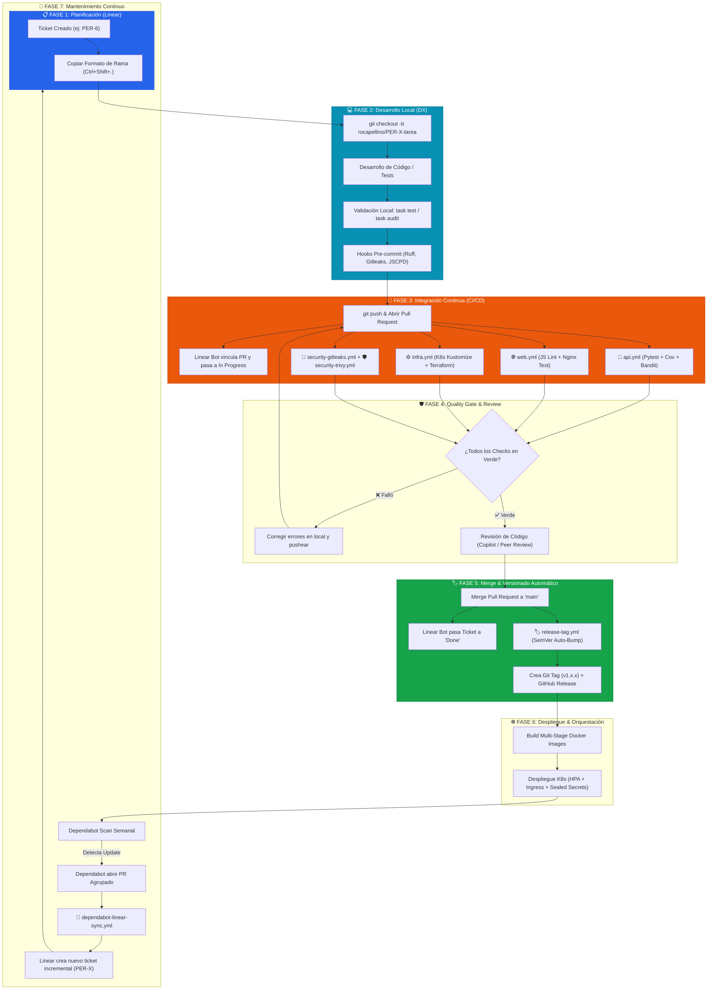

# 🔄 Ciclo de Vida Integral de la Aplicación (SDLC & DevOps Lifecycle)

Este documento describe el flujo de vida completo de la plataforma **Pokédex**, desde la concepción de una tarea o actualización de seguridad hasta su despliegue, versionado semántico y mantenimiento automatizado.

---

## 📑 Índice
1. [Diagrama de Flujo del Ciclo de Vida](#1-diagrama-de-flujo-del-ciclo-de-vida)
2. [Fases Detalladas del Ciclo](#2-fases-detalladas-del-ciclo)
   * [Fase 1: Planificación y Gestión Ágil (Linear)](#fase-1-planificación-y-gestión-ágil-linear)
   * [Fase 2: Desarrollo Local y Quality Gates (DX)](#fase-2-desarrollo-local-y-quality-gates-dx)
   * [Fase 3: Integración Continua y Validación (GitHub Actions)](#fase-3-integración-continua-y-validación-github-actions)
   * [Fase 4: Revisión de Código y Quality Gate (GitHub Rulesets)](#fase-4-revisión-de-código-y-quality-gate-github-rulesets)
   * [Fase 5: Merge y Versionado Semántico Automático](#fase-5-merge-y-versionado-semántico-automático)
   * [Fase 6: Despliegue y Orquestación (Docker & Kubernetes)](#fase-6-despliegue-y-orquestación-docker--kubernetes)
   * [Fase 7: Mantenimiento Continuo y Dependabot Sync](#fase-7-mantenimiento-continuo-y-dependabot-sync)

---

## 1. Diagrama de Flujo del Ciclo de Vida

---

## 2. Fases Detalladas del Ciclo

### Fase 1: Planificación y Gestión Ágil (Linear)
* Toda nueva funcionalidad, mejora o bug se origina en **Linear** dentro del equipo `PER`.
* Cada ticket recibe automáticamente un identificador incremental (`PER-1`, `PER-2`, ..., `PER-6`).
* Al copiar el nombre de la rama desde Linear (`Ctrl + Shift + .`), se asegura la convención estándar `rocapellino/PER-X-descripcion`.

### Fase 2: Desarrollo Local y Quality Gates (DX)
* El desarrollador crea la rama local y trabaja en el código de backend (`server.ts`, `src/`), frontend (`apps/web/`) o infraestructura (`infra/`).
* Utiliza el task runner multiplataforma (`task dev`, `task lint`, `task audit`) para verificar:
  * Verificación estricta de tipos con TypeScript (`tsc --noEmit`).
  * Compilación y empaquetado con esbuild (`npm run build`).
  * Detección de duplicación y archivos idénticos (`task audit`).
  * Auditoría de seguridad de dependencias (`npm audit`).
  * Validación de Helm Chart y manifiestos de Kubernetes (`task helm:lint`).
  * Detección de duplicación y archivos idénticos (`scripts/audit_code_quality.py`).
* Los **Hooks de Pre-commit** impiden commits locales si existen secretos o código no formateado.

### Fase 3: Integración Continua y Validación (GitHub Actions)
* Al hacer `git push` y abrir un Pull Request:
  * El bot de Linear detecta la referencia y transiciona el ticket a **In Progress** / **In Review**.
  * Se disparan los workflows optimizados por rutas (`paths`):
    * **`api.yml`**: Pruebas de backend, cobertura y Bandit SAST.
    * **`web.yml`**: Validación de JavaScript y sintaxis de Nginx.
    * **`infra.yml`**: Validación de manifiestos de Kubernetes con Kustomize y HCL con Terraform.
    * **`security-gitleaks.yml`**: Escaneo preventivo de secretos.
    * **`security-trivy.yml`**: Escaneo de vulnerabilidades SCA y contenedor con Trivy.

### Fase 4: Revisión de Código y Quality Gate (GitHub Rulesets)
* Las **Rulesets de GitHub** (`main-protection`) bloquean el merge directo:
  * Requieren que los checks de CI obligatorios estén en verde (✅).
  * Exigen que todas las conversaciones de revisión de código (Copilot / Peer Review) estén resueltas.

### Fase 5: Merge y Versionado Semántico Automático
* Al fusionar el PR en `main`:
  * El issue en Linear pasa automáticamente a **Done** (Completado).
  * El workflow **`release-tag.yml`** analiza los commits convencionales mergeados (`feat:`, `fix:`, `chore(deps):`).
  * Calcula el incremento según **SemVer** (`vMAJOR.MINOR.PATCH`).
  * Genera el **Git Tag** anotado y publica un **GitHub Release** oficial con changelog automático.

### Fase 6: Despliegue y Orquestación (Docker & Kubernetes)
* La aplicación se empaqueta en imágenes multi-stage optimizadas y seguras (ejecutadas por usuario no-root `appuser`).
* Se despliega en Kubernetes con:
  * **HPA v2** para escalado automático basado en CPU/Memoria y tráfico.
  * **Sealed Secrets** para gestión asimétrica de credenciales sin texto plano en Git.
  * **NetworkPolicies** para segmentación estricta entre Frontend, Backend, Redis y PostgreSQL.

### Fase 7: Mantenimiento Continuo y Dependabot Sync
* **Dependabot** analiza semanalmente dependencias de Python (`pip`), imágenes Docker (`docker`) y workflows (`github-actions`).
* Agrupa las actualizaciones en **Grouped PRs** limpios.
* El workflow **`dependabot-linear-sync.yml`** detecta el PR del bot y crea automáticamente un **ticket correlativo en Linear** (`PER-X`) con el enlace directo al PR, cerrando el ciclo de retroalimentación ágil.
