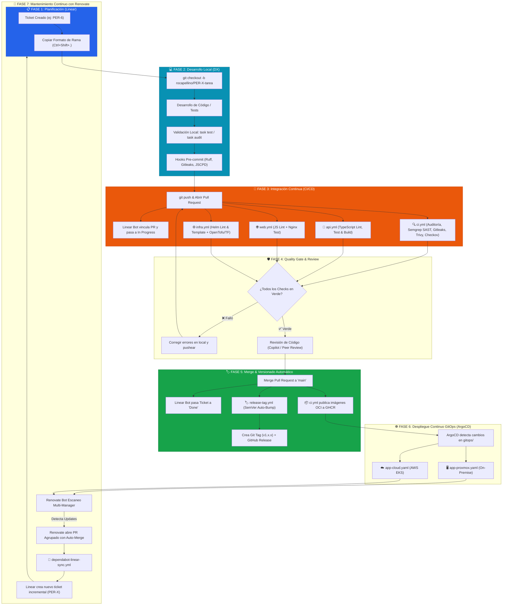

# 🔄 Ciclo de Vida Integral de la Aplicación (SDLC & DevOps Lifecycle)

Este documento describe el flujo de vida completo de la plataforma **Pokédex**, desde la concepción de una tarea o actualización de seguridad hasta su despliegue, versionado semántico y mantenimiento automatizado.

---

## 📑 Índice
1. [Diagrama de Flujo del Ciclo de Vida](#1-diagrama-de-flujo-del-ciclo-de-vida)
2. [Fases Detalladas del Ciclo](#2-fases-detalladas-del-ciclo)
   * [Fase 1: Planificación y Gestión Ágil (Linear)](#fase-1-planificación-y-gestión-ágil-linear)
   * [Fase 2: Desarrollo Local y Quality Gates (DX)](#fase-2-desarrollo-local-y-quality-gates-dx)
   * [Fase 3: Integración Continua y Validación (GitHub Actions)](#fase-3-integración-continua-y-validación-github-actions)
   * [Fase 4: Revisión de Código y Quality Gate (GitHub Rulesets)](#fase-4-revisión-de-código-y-quality-gate-github-rulesets)
   * [Fase 5: Merge y Versionado Semántico Automático](#fase-5-merge-y-versionado-semántico-automático)
   * [Fase 6: Despliegue y Orquestación (Docker & Kubernetes)](#fase-6-despliegue-y-orquestación-docker--kubernetes)
   * [Fase 7: Mantenimiento Continuo y Dependabot Sync](#fase-7-mantenimiento-continuo-y-dependabot-sync)

---

## 1. Diagrama de Flujo del Ciclo de Vida

---

## 2. Fases Detalladas del Ciclo

### Fase 1: Planificación y Gestión Ágil (Linear)
* Toda nueva funcionalidad, mejora o bug se origina en **Linear** dentro del equipo `PER`.
* Cada ticket recibe automáticamente un identificador incremental (`PER-1`, `PER-2`, ..., `PER-6`).
* Al copiar el nombre de la rama desde Linear (`Ctrl + Shift + .`), se asegura la convención estándar `rocapellino/PER-X-descripcion`.

### Fase 2: Desarrollo Local y Quality Gates (DX)
* El desarrollador crea la rama local y trabaja en el código de backend (`server.ts`, `src/`), frontend (`apps/web/`) o infraestructura (`infra/`, `gitops/`).
* Utiliza el task runner multiplataforma (`task dev`, `task ts:lint`, `task audit`) para verificar:
  * Verificación estricta de tipos con TypeScript (`tsc --noEmit`).
  * Compilación y empaquetado con esbuild (`npm run build`).
  * Ejecución de tests unitarios de seguridad y almacenamiento (`npm test`).
  * Detección de duplicación de código (`task audit`).
  * Auditoría de vulnerabilidades de dependencias (`npm audit`).
  * Validación y renderizado de Helm Chart (`task helm:lint`, `task helm:template`).
* Los **Hooks de Pre-commit** impiden commits locales si existen secretos o código no formateado.

### Fase 3: Integración Continua y Validación (GitHub Actions)
* Al hacer `git push` y abrir un Pull Request:
  * El bot de Linear detecta la referencia y transiciona el ticket a **In Progress** / **In Review**.
  * Se disparan los workflows optimizados por rutas (`paths`) y el pipeline central consolidado:
    * **`ci.yml`**: Calidad y complejidad, Semgrep SAST, Gitleaks, Checkov IaC y escaneo de vulnerabilidades Trivy sobre contenedor Docker Alpine endurecido.
    * **`api.yml`**: Tipado estricto, compilación esbuild y suite de tests unitarios Node.js.
    * **`web.yml`**: Validación de interfaz frontend y configuración de Nginx.
    * **`infra.yml`**: Lint y renderizado de Helm Charts (`values.yaml` y `values.prod.yaml`) y validación HCL de OpenTofu/Terraform.
    * **`security-gitleaks.yml`**: Detección estricta de secretos y tokens expuestos.

### Fase 4: Revisión de Código y Quality Gate (GitHub Rulesets)
* Las **Rulesets de GitHub** (`main-protection`) bloquean el merge directo:
  * Requieren que los checks de CI obligatorios (`🔍 Auditoría de Calidad y Complejidad`, `🛡️ Gitleaks Secret Detection`) estén en verde (✅).
  * Exigen que todas las conversaciones de revisión de código estén resueltas.

### Fase 5: Merge y Versionado Semántico Automático
* Al fusionar el PR en `main`:
  * El issue en Linear pasa automáticamente a **Done** (Completado).
  * El workflow **`release-tag.yml`** analiza los commits convencionales mergeados (`feat:`, `fix:`, `chore(deps):`).
  * Calcula el incremento según **SemVer** (`vMAJOR.MINOR.PATCH`).
  * Genera el **Git Tag** anotado y publica un **GitHub Release** oficial con changelog automático.
  * El workflow **`ci.yml`** compila la imagen Docker de producción y realiza el push al registro OCI de GitHub Container Registry (`ghcr.io`).

### Fase 6: Despliegue Continuo GitOps (ArgoCD & Kubernetes)
* El despliegue se gestiona de forma declarativa e independiente de agentes CI mediante **ArgoCD**:
  * **On-Premise (Proxmox VE)**: Sincronizado mediante [`gitops/apps/app-proxmox.yaml`](file:///gitops/apps/app-proxmox.yaml) aplicando valores específicos de [`gitops/environments/proxmox/values.yaml`](file:///gitops/environments/proxmox/values.yaml).
  * **Cloud Pública (AWS EKS)**: Sincronizado mediante [`gitops/apps/app-cloud.yaml`](file:///gitops/apps/app-cloud.yaml) aplicando valores específicos de [`gitops/environments/cloud/values.yaml`](file:///gitops/environments/cloud/values.yaml).
  * La plataforma opera con **HPA v2** para escalado automático, **Sealed Secrets** para cifrado de credenciales y **NetworkPolicies** para segmentación estricta de base de datos PostgreSQL y Redis.

### Fase 7: Mantenimiento Continuo con Renovate Bot
* **Renovate Bot** (`renovate.json`) audita continuamente dependencias multi-gestor:
  * Node.js (`npm`), imágenes Docker (`dockerfile`), Helm charts (`helm-values`), GitHub Actions y módulos de OpenTofu/Terraform.
  * Agrupa las actualizaciones en PRs no disruptivos y aplica **automerge** automático para parches seguros que superen todos los Quality Gates de CI.
  * El workflow **`dependabot-linear-sync.yml`** sincroniza los PRs de bots de dependencias con Linear creando el ticket correlativo correspondiente.
