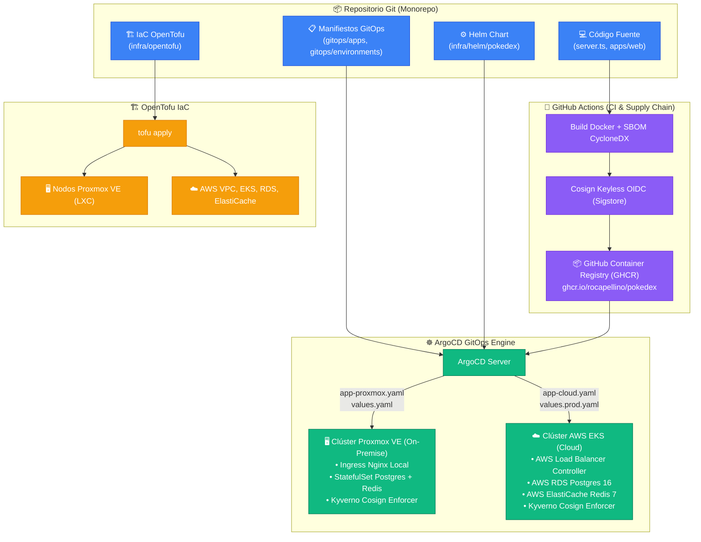

# ☁️ Diseño de Infraestructura en la Nube y GitOps Híbrido

Este documento describe formalmente la arquitectura de infraestructura, topología de red, servicios administrados y sincronización declarativa GitOps para la plataforma **Pokédex**, soportando despliegues híbridos en **Proxmox VE (On-Premises)** y en nubes públicas (**AWS EKS / Google Cloud**).

---

## 📑 Tabla de Contenidos
1. [Estructura de Capas en la Nube](#1-estructura-de-capas-en-la-nube)
2. [Diagrama de Flujo: Aprovisionamiento y Despliegue Híbrido GitOps](#2-diagrama-de-flujo-aprovisionamiento-y-despliegue-híbrido-gitops)
3. [Matriz de Objetos Cloud Implementados (IaC con OpenTofu)](#3-matriz-de-objetos-cloud-implementados-iac-con-opentofu)
4. [Topología de Red y Aislamiento (Zero-Trust)](#4-topología-de-red-y-aislamiento-zero-trust)
5. [Estructura del Código IaC Híbrido](#5-estructura-del-código-iac-híbrido)

---

## 1. Estructura de Capas en la Nube

```text
                                [ Usuarios Globales ]
                                          │
                                          ▼
  ════════════════════════════════════════════════════════════════════════════════
  CAPA 1: EDGE, WAF Y CDN GLOBAL (CloudFront / Cloud Armor)
  ════════════════════════════════════════════════════════════════════════════════
                     │                                           │
          (Ruta / /index.html / assets)                 (Ruta /api /pokemons)
                     │                                           │
                     ▼                                           ▼
  ┌─────────────────────────────────────┐     ┌─────────────────────────────────────┐
  │ CAPA 2: FRONTEND ESTÁTICO           │     │ CAPA 3: CÓMPUTO KUBERNETES / EKS    │
  │ • S3 Bucket / GCS con CloudFront    │     │ • Pokédex API (Node.js 22 Express)  │
  │ • Compresión gzip/brotli en Edge    │     │ • Autoescalado HPA v2 (CPU/Memoria) │
  └─────────────────────────────────────┘     └──────────────────┬──────────────────┘
                                                                 │
                                                   (VPC Private Peering / Enlace Privado)
                                                                 │
                                                                 ▼
  ════════════════════════════════════════════════════════════════════════════════
  VPC PRIVADA AISLADA (Zero-Trust Network - Sin IPs públicas)
  ════════════════════════════════════════════════════════════════════════════════
                                 │                               │
                                 ▼                               ▼
  ┌─────────────────────────────────────┐     ┌─────────────────────────────────────┐
  │ CAPA 4: CACHÉ DISTRIBUIDA (REDIS 7) │     │ CAPA 5: BASE DE DATOS (POSTGRES 16) │
  │ • AWS ElastiCache / Memorystore     │     │ • Amazon RDS / Cloud SQL Postgres   │
  │ • Sub-3ms Lecturas de Catálogo      │     │ • Backups automáticos & HA multi-AZ │
  └─────────────────────────────────────┘     └─────────────────────────────────────┘
```

---

## 2. Diagrama de Flujo: Aprovisionamiento y Despliegue Híbrido GitOps



---

## 3. Matriz de Objetos Cloud Implementados (IaC con OpenTofu)

| Objeto Cloud | Módulo IaC | Propósito Arquitectónico | SLA / Ventaja |
| :--- | :--- | :--- | :--- |
| **VPC & Subredes** | `modules/networking` | Red privada virtual con subredes separadas para DMZ, Cómputo y Datos. | Aislamiento estricto de red. |
| **Clúster Kubernetes (EKS)** | `modules/compute` | Orquestación de contenedores del backend Express y frontend Nginx. | Autoescalado HPA elástico y alta disponibilidad. |
| **Kyverno Admission Controller** | `infra/k8s` | Interceptor de admisión para validar firmas Cosign en imágenes OCI. | Cero ejecución de código no autenticado. |
| **PostgreSQL Gestionado** | `modules/database` | Base de datos relacional PostgreSQL 16 con columna JSONB. | 99.95% disponibilidad, Multi-AZ y backups continuos. |
| **Redis Gestionado** | `modules/database` | Clúster en memoria para caché sub-3ms y control de sesiones. | Concurrencia ultra alta y revocación atómica. |
| **Storage S3 / GCS** | `modules/storage` | Almacenamiento de assets multimedia y respaldos cifrados. | Durabilidad de 99.999999999%. |

---

## 4. Topología de Red y Aislamiento (Zero-Trust)

1. **Subred Pública DMZ (`10.0.1.0/24`):**
   * Aloja únicamente el balanceador de carga público (ALB o Ingress Controller).
2. **Subred Privada de Cómputo (`10.0.10.0/24`):**
   * Aloja los nodos trabajadores de Kubernetes donde corren los Pods de la API y el Frontend. No tienen IPs públicas asignadas; se comunican hacia el exterior exclusivamente mediante NAT Gateway.
3. **Subred Privada de Datos (`10.0.20.0/24`):**
   * Aislada sin salida a internet. Aloja las instancias de PostgreSQL y Redis. Solo acepta tráfico originado desde la subred de cómputo en los puertos autorizados (`5432` y `6379`).

---

## 5. Estructura del Código IaC Híbrido

```text
infra/
└── opentofu/                         # Aprovisionamiento declarativo OpenTofu
    └── environments/
        ├── cloud/                    # Entorno AWS EKS de producción
        └── proxmox/                  # Entorno Proxmox VE on-premise
```

---

## 6. Política de Runtime Oficial (Single Production Runtime)

Para evitar duplicidad operativa y dispersión arquitectónica, la plataforma establece una delimitación estricta de responsabilidades:

| Entorno / Capa | Tecnología Oficial | Responsabilidad |
| :--- | :--- | :--- |
| **Producción Oficial** | **Kubernetes (Helm + ArgoCD)** | Único runtime oficial para cargas de trabajo de producción, balanceo, ingress, autoscaling HPA, políticas L7 y auditoría de admisión (Kyverno + Cosign). |
| **Aprovisionamiento Base** | **Ansible (`host_baseline.yml`)** | Preparación de nodos bare-metal / VM en Proxmox: SO base, Docker/containerd, parámetros de kernel sysctl y firewall UFW. |
| **Desarrollo Local & Fallback** | **Docker Compose** | Ejecución local en estación de trabajo y modo standalone de emergencia para nodos aislados sin clúster activo. |

