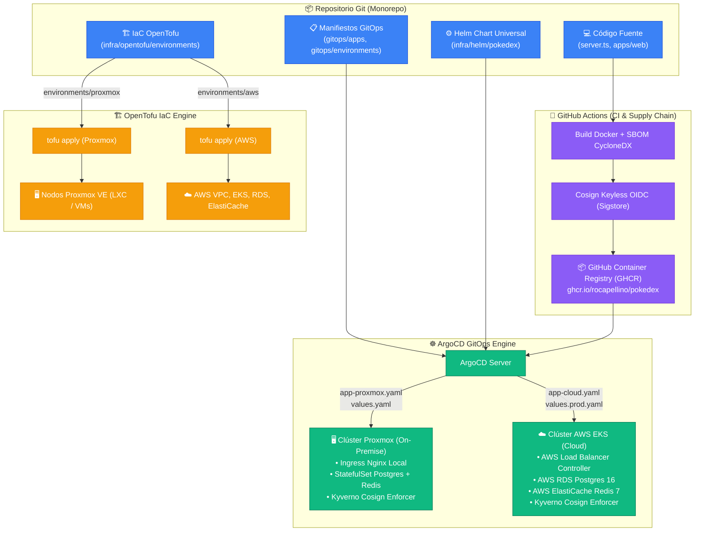

# ☁️ Diseño de Infraestructura Multi-Entorno y GitOps Universal

Este documento define formalmente la arquitectura de infraestructura, topología de red, servicios administrados y sincronización declarativa GitOps para la plataforma **Pokédex**. Establece a **Kubernetes como el runtime universal y agnóstico de producción**, soportando múltiples backends de cómputo: **Proxmox VE (On-Premises)** y nubes públicas (**AWS EKS**, Google Cloud / Azure).

---

## 📑 Tabla de Contenidos

1. [Arquitectura Agnóstica y Núcleo Portable](#1-arquitectura-agnóstica-y-núcleo-portable)
2. [Estructura de Capas en la Nube y On-Premises](#2-estructura-de-capas-en-la-nube-y-on-premises)
3. [Diagrama de Flujo: Aprovisionamiento y Despliegue Híbrido GitOps](#3-diagrama-de-flujo-aprovisionamiento-y-despliegue-híbrido-gitops)
4. [Matriz de Objetos de Infraestructura (IaC con OpenTofu)](#4-matriz-de-objetos-de-infraestructura-iac-con-opentofu)
5. [Topología de Red y Aislamiento (Zero-Trust)](#5-topología-de-red-y-aislamiento-zero-trust)
6. [Estructura del Código IaC Multi-Backend](#6-estructura-del-código-iac-multi-backend)
7. [Política de Runtime Oficial y Experiencia de Desarrollo Dual](#7-política-de-runtime-oficial-y-experiencia-de-desarrollo-dual)

---

## 1. Arquitectura Agnóstica y Núcleo Portable

El principio rector del diseño de Pokédex es la **portabilidad absoluta del núcleo de la aplicación**. La lógica del negocio, el empaquetado de contenedores y los manifiestos de despliegue no contienen dependencias acopladas a un proveedor de nube específico ni a hardware particular.

```text
                                POKÉDEX
                                   │
                ┌──────────────────┴──────────────────┐
                │                                     │
         NÚCLEO PORTABLE                      INFRAESTRUCTURA
                │                                     │
       ┌────────┴────────┐                   ┌────────┴────────┐
       │                 │                   │                 │
    Backend           Frontend             Cloud            On-Prem
 (Node.js API)     (Vite/Nginx)            (AWS)           (Proxmox)
       │                 │                   │                 │
       └────────┬────────┘                   ▼                 ▼
                │                         OpenTofu          OpenTofu
                ▼                       (modules/...)     (environments/
         Helm Universal Chart                               proxmox)
       (infra/helm/pokedex)                  │                 │
                │                            ▼                 ▼
                │                         AWS EKS           K8s Node
                │                         Clúster          (k3s/Talos)
                │                            │                 │
                └────────────────────────────┼─────────────────┘
                                             │
                                             ▼
                                     ArgoCD GitOps Sync
```

### Principios de Aislamiento de Capas

1. **Contratos Estándar CNCF:** La aplicación consume exclusivamente interfaces estándar de Kubernetes (>= 1.28): `Deployment`, `Service`, `Ingress`, `ConfigMap`, `Secret`, `HorizontalPodAutoscaler` y `PersistentVolumeClaim` mediante `storageClassName`.
2. **Cero Vendor Lock-in en el Helm Chart:** El chart principal ([`infra/helm/pokedex`](file:///c:/Users/Rodrigo/Documents/Git/pokedex/infra/helm/pokedex)) no contiene anotaciones propietarias fijas de AWS o Proxmox. Cualquier ajuste específico de entorno se inyecta mediante capas de valores de GitOps (`values.yaml` para on-premises/local, `values.prod.yaml` para cloud).
3. **Inmutabilidad de Imágenes de Contenedor:** Las imágenes OCI se compilan una sola vez en CI, se firman criptográficamente mediante Cosign (Sigstore) y se publican en GitHub Container Registry (`ghcr.io/rocapellino/pokedex`). La misma imagen binaria se ejecuta en local, Proxmox o AWS EKS.

---

## 2. Estructura de Capas en la Nube y On-Premises

```text
                                [ Usuarios Globales ]
                                          │
                                          ▼
  ════════════════════════════════════════════════════════════════════════════════
  CAPA 1: EDGE, WAF Y CDN GLOBAL (CloudFront / Cloud Armor / Ingress Controller)
  ════════════════════════════════════════════════════════════════════════════════
                     │                                           │
          (Ruta / /index.html / assets)                 (Ruta /api /pokemons)
                     │                                           │
                     ▼                                           ▼
  ┌─────────────────────────────────────┐     ┌─────────────────────────────────────┐
  │ CAPA 2: FRONTEND ESTÁTICO           │     │ CAPA 3: CÓMPUTO KUBERNETES / RUNTIME│
  │ • S3 Bucket / GCS con CloudFront    │     │ • Pokédex API (Node.js 22 Express)  │
  │   (o Nginx Pod en On-Premises/Edge) │     │ • Autoescalado HPA v2 (CPU/Memoria) │
  │ • Compresión gzip/brotli en Edge    │     │ • Kyverno Cosign Image Enforcer     │
  └─────────────────────────────────────┘     └──────────────────┬──────────────────┘
                                                                 │
                                                   (VPC Private Peering / Red Local Privada)
                                                                 │
                                                                 ▼
  ════════════════════════════════════════════════════════════════════════════════
  RED PRIVADA AISLADA (Zero-Trust Network - Sin IPs públicas en capas de datos)
  ════════════════════════════════════════════════════════════════════════════════
                                 │                               │
                                 ▼                               ▼
  ┌─────────────────────────────────────┐     ┌─────────────────────────────────────┐
  │ CAPA 4: CACHÉ DISTRIBUIDA (REDIS 7) │     │ CAPA 5: BASE DE DATOS (POSTGRES 16) │
  │ • AWS ElastiCache / Redis Cluster   │     │ • Amazon RDS / Cloud SQL Postgres   │
  │ • StatefulSet local en On-Prem      │     │ • StatefulSet local con PVC Ceph    │
  │ • Sub-3ms Lecturas de Catálogo      │     │ • Backups continuos y WAL-G         │
  └─────────────────────────────────────┘     └─────────────────────────────────────┘
```

---

## 3. Diagrama de Flujo: Aprovisionamiento y Despliegue Híbrido GitOps



---

## 4. Matriz de Objetos de Infraestructura (IaC con OpenTofu)

| Objeto de Infraestructura | Módulo / Directorio IaC | Propósito Arquitectónico | Implementación Cloud (AWS) | Implementación On-Prem (Proxmox) |
| :--- | :--- | :--- | :--- | :--- |
| **VPC & Networking** | `modules/networking` | Aislamiento por subredes DMZ, Cómputo y Datos. | AWS VPC, Subredes privadas, NAT Gateway | Linux Bridge (`vmbr0`), VLANs 802.1Q |
| **Cómputo Kubernetes** | `modules/compute` | Orquestación elástica de Pods de la API y Frontend. | Amazon EKS v1.28+ con Managed Node Groups | Nodos Proxmox VE (LXC/VM) con k3s / Talos |
| **Política de Seguridad** | `infra/k8s` | Admisión de contenedores y firma de la cadena de suministro. | Kyverno Policy Validating Cosign OIDC | Kyverno Policy Validating Cosign OIDC |
| **Base de Datos** | `modules/database` | Persistencia relacional PostgreSQL 16 con JSONB. | Amazon RDS for PostgreSQL (Multi-AZ) | PostgreSQL 16 HA StatefulSet / Bitnami |
| **Caché en Memoria** | `modules/database` | Caché distribuida sub-3ms y sesiones. | Amazon ElastiCache Redis 7 | Redis 7 StatefulSet / Sentinel |
| **Almacenamiento de Objetos** | `modules/storage` | Almacenamiento de backups cifrados y assets. | Amazon S3 con Bucket Policy restrictiva | MinIO S3-Compatible / Ceph RGW |

---

## 5. Topología de Red y Aislamiento (Zero-Trust)

1. **Subred Pública DMZ (`10.0.1.0/24`):**
   * Aloja únicamente el balanceador de carga público (AWS ALB o Ingress-Nginx Controller en on-prem).
   * Todo el tráfico no-HTTPS es redirigido obligatoriamente a HTTPS (TLS 1.3).
2. **Subred Privada de Cómputo (`10.0.10.0/24`):**
   * Aloja los nodos trabajadores de Kubernetes donde ejecutan los Pods de la API y el Frontend.
   * Sin direcciones IP públicas asignadas; egreso hacia internet restringido mediante NAT Gateway (o Gateway Proxmox) para pull de imágenes y parches de seguridad.
3. **Subred Privada de Datos (`10.0.20.0/24`):**
   * Aislada sin salida a internet ni ruta default.
   * Aloja PostgreSQL y Redis. Solo acepta conexiones entrantes originadas desde la subred de cómputo en los puertos autorizados (`5432` y `6379`).

---

## 6. Estructura del Código IaC Multi-Backend

La infraestructura como código está modularizada bajo `infra/opentofu/` separando explícitamente los proveedores y garantizando que cada entorno declare sus propios recursos sin mezclar dependencias de proveedores:

```text
infra/
├── opentofu/
│   ├── modules/                      # Módulos reutilizables agnósticos / cloud
│   │   ├── compute/                  # EKS y Node Groups
│   │   ├── database/                 # RDS Postgres & ElastiCache Redis
│   │   ├── networking/               # VPC, subredes, tablas de ruteo
│   │   ├── security/                 # IAM roles, KMS, Security Groups
│   │   └── storage/                  # Buckets S3 con cifrado KMS
│   └── environments/
│       ├── aws/                      # Backend Cloud: AWS EKS, RDS, VPC
│       │   ├── main.tf
│       │   ├── providers.tf
│       │   ├── variables.tf
│       │   └── terraform.tfvars.example
│       └── proxmox/                  # Backend On-Premises: Proxmox VE
│           ├── main.tf
│           ├── providers.tf
│           ├── variables.tf
│           └── terraform.tfvars.example
├── ansible/                          # Hardening y configuración de nodos base
│   └── playbooks/
│       └── host_baseline.yml         # SO base, containerd, UFW, sysctl
└── k8s/                              # Definiciones Kubernetes locales y perfiles
    └── kind-cluster.yaml             # Perfil de desarrollo local con paridad K8s
```

Asimismo, el repositorio GitOps refleja esta misma topología bajo `gitops/`:

```text
gitops/
├── apps/
│   ├── app-cloud.yaml                # ArgoCD Application apuntando a environments/aws
│   └── app-proxmox.yaml              # ArgoCD Application apuntando a environments/proxmox
└── environments/
    ├── aws/                          # Capa de valores para clúster AWS EKS
    │   └── values.yaml               # Valores específicos (ALB Ingress, RDS endpoint)
    └── proxmox/                      # Capa de valores para clúster Proxmox
        └── values.yaml               # Valores específicos (Nginx Ingress, StatefulSet)
```

---

## 7. Política de Runtime Oficial y Experiencia de Desarrollo Dual

Para evitar duplicidad operativa, inconsistencias entre entornos y scripts de despliegue monolíticos fuera de control de versiones, la plataforma establece una estricta delimitación de responsabilidades:

| Entorno / Propósito | Tecnología Oficial | Responsabilidad y Alcance |
| :--- | :--- | :--- |
| **Producción Universal** | **Kubernetes (Helm + ArgoCD)** | **Único runtime oficial de producción**. Gestiona ciclo de vida de Pods, balanceo L7, autoscaling HPA, NetworkPolicies, y validación criptográfica de firmas mediante Kyverno. |
| **Aprovisionamiento Infra** | **OpenTofu (`infra/opentofu`)** | Declaración inmutable de recursos de cómputo, redes, VPCs, bases de datos gestionadas y almacenamiento en la nube o en Proxmox. |
| **Baseline y Hardening** | **Ansible (`host_baseline.yml`)** | Configuración base a nivel de sistema operativo en nodos Proxmox / bare-metal: containerd, parámetros de kernel `sysctl` y firewall `ufw`. **No gestiona el despliegue de contenedores de la aplicación**. |
| **Desarrollo: Perfil Rápido** | **Docker Compose (`task dev:compose`)** | Iteración rápida en máquina local. Levanta la API, Frontend, Postgres y Redis con recarga en caliente sin sobrecarga de orquestación. |
| **Desarrollo: Paridad K8s** | **Kind (`task dev:k8s:up`)** | Validación local con paridad total frente a producción. Levanta un clúster Kind con mapeo de Ingress y despliega el Helm chart idéntico al de producción. |

### Regla de Oro Operativa

> **No se despliegan contenedores de aplicación en producción mediante Docker Compose ni scripts bash aislados.**
> Todo despliegue productivo debe originarse en un commit Git auditado, pasar los controles de CI (tests, SBOM, firma Cosign) y ser sincronizado declarativamente en un clúster Kubernetes mediante ArgoCD.
