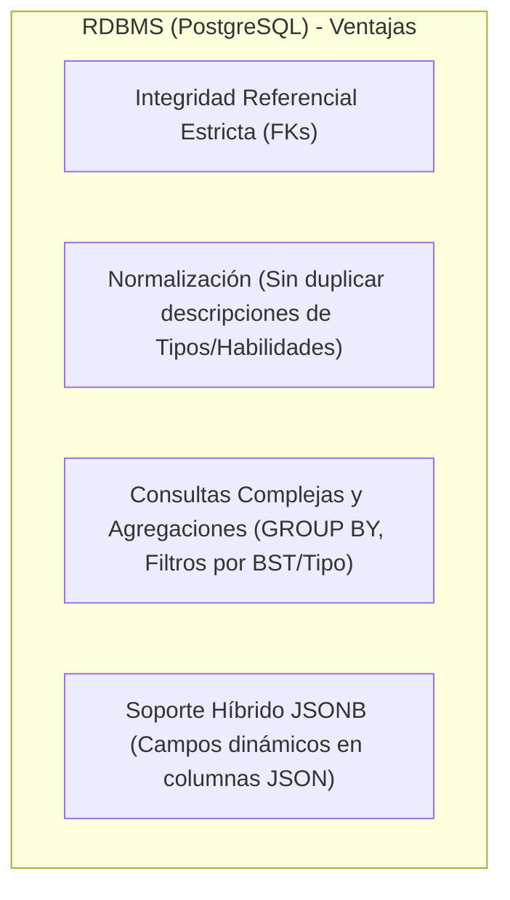
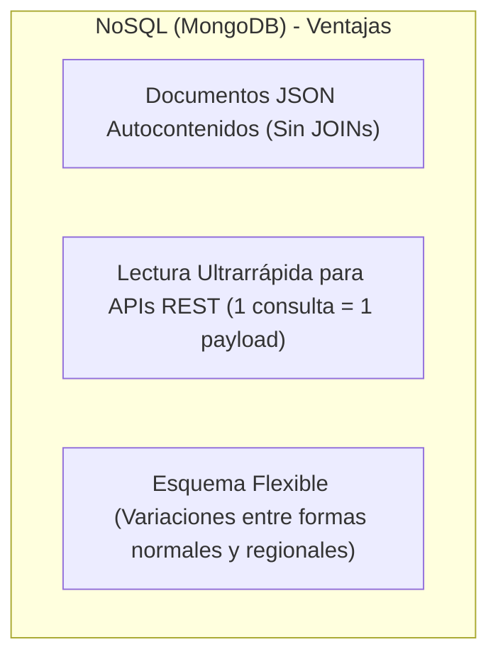
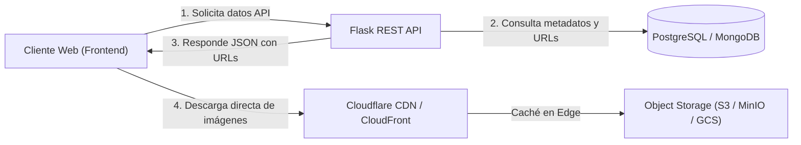
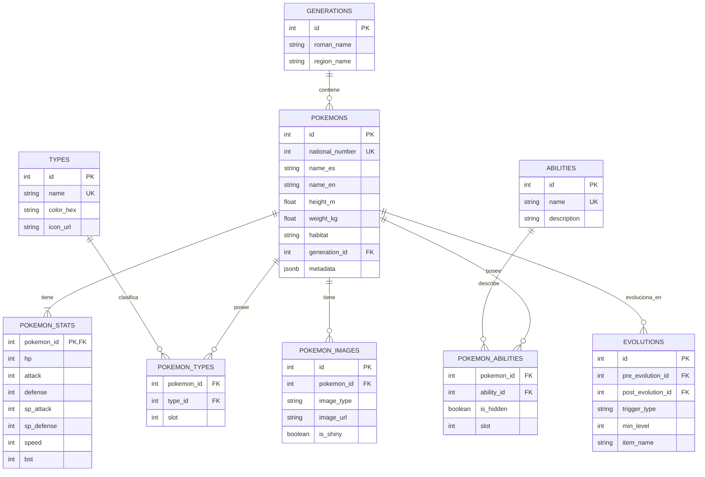

# 📊 Análisis Arquitectónico de Base de Datos: Pokémon API (Referencia WikiDex)

Este documento presenta el análisis técnico y de diseño de persistencia de datos para la **Pokédex API**, evaluando si se requiere una base de datos **Relacional (SQL)**, **No Relacional (NoSQL)** o una **Arquitectura Híbrida**, considerando la naturaleza de los datos extraídos de [WikiDex (Lista de Pokémon)](https://www.wikidex.net/wiki/Lista_de_Pok%C3%A9mon) y el manejo de assets multimedia (imágenes, sprites y artwork).

---

## 📑 Tabla de Contenidos
1. [Naturaleza y Estructura de los Datos (WikiDex)](#1-naturaleza-y-estructura-de-los-datos-wikidex)
2. [Evaluación de Paradigmas de Bases de Datos](#2-evaluación-de-paradigmas-de-bases-de-datos)
3. [Estrategia de Almacenamiento de Imágenes y Multimedia](#3-estrategia-de-almacenamiento-de-imágenes-y-multimedia)
4. [Veredicto y Arquitectura Recomendada](#4-veredicto-y-arquitectura-recomendada)
5. [Modelo Entidad-Relación (ER) Propuesto](#5-modelo-entidad-relación-er-propuesto)
6. [Diseño del Documento NoSQL Alternativo (MongoDB)](#6-diseño-del-documento-nosql-alternativo-mongodb)

---

## 1. Naturaleza y Estructura de los Datos (WikiDex)

Analizando la información oficial de WikiDex para los más de 1.025 Pokémon (Generaciones I a IX), los datos se dividen en las siguientes entidades e interconexiones:

| Dimensión de Datos | Atributos | Tipo de Relación / Cardinalidad |
| :--- | :--- | :--- |
| **Identidad Base** | Número nacional, Nombre (ES/EN/JA), Generación, Categoría | Entidad Principal (1:1) |
| **Tipos Elementales** | Fuego, Agua, Planta, Dragón, etc. (18 tipos existentes) | **N:M (Muchos a Muchos)**: Un Pokémon tiene 1 o 2 tipos; un tipo agrupa cientos de Pokémon. |
| **Habilidades** | Primaria, Secundaria, Oculta (Efecto en combate) | **N:M**: Un Pokémon tiene hasta 3 habilidades; una habilidad pertenece a múltiples Pokémon. |
| **Estadísticas Base** | PS, Ataque, Defensa, Atq. Especial, Def. Especial, Velocidad, Total (BST) | **1:1**: Valores numéricos cuantitativos estructurados. |
| **Líneas Evolutivas** | Pre-evolución, Evolución, Nivel, Piedra, Intercambio, Felicidad | **Grafo / Jerarquía (1:N y N:M)**: Cadenas lineales (Charmander) o ramificadas (Eevee, Tyrogue). |
| **Características Físicas** | Altura (m), Peso (kg), Ratio de Género, Grupo Huevo, Hábitat, Color | Atributos mixtos y relaciones **N:M** (Grupos huevo). |
| **Formas Alternativas** | Variantes regionales (Alola, Galar, Paldea), Megaevoluciones, Gigamax | **1:N**: Un número de Pokédex puede tener múltiples formas con stats/tipos distintos. |
| **Imágenes / Media** | Artwork Oficial Ken Sugimori, Sprites (frente/espalda/shiny), Iconos | **1:N**: Archivos binarios de imágenes en alta y media resolución. |

---

## 2. Evaluación de Paradigmas de Bases de Datos

### Opción A: Base de Datos Relacional (PostgreSQL / MySQL)



- ✅ **Puntos Fuertes:**
  - El dominio Pokémon es inherentemente **relacional**: los tipos, habilidades, movimientos y cadenas evolutivas están fuertemente interconectados.
  - Permite consultas analíticas precisas: *"Listar todos los Pokémon de Generación 3 con tipo dual Fuego/Volador y velocidad > 90"*.
  - Evita anomalías de actualización: si se corrige la descripción de una habilidad o el color de un tipo, se actualiza en una sola fila.
  - PostgreSQL ofrece soporte nativo para columnas `JSONB` y búsqueda全文 (Full-Text Search) sobre descripciones de la Pokédex.
- ❌ **Puntos Débiles:**
  - Requiere ejecutar `JOINs` entre múltiples tablas para armar la respuesta completa de un Pokémon.

---

### Opción B: Base de Datos No Relacional / Documental (MongoDB / Firestore)



- ✅ **Puntos Fuertes:**
  - Ideal para lectura directa de la API: el documento se almacena exactamente con la estructura JSON que consume el frontend (`index.html`).
  - Excelente rendimiento de lectura directa por clave/ID.
  - Esquema dinámico: permite añadir campos específicos a formas Gigamax o Mega sin alterar el esquema global.
- ❌ **Puntos Débiles:**
  - **Duplicación de datos:** La información de tipos, colores y habilidades se repite en cientos de documentos.
  - **Pérdida de integridad:** Modificar una habilidad requiere actualizar miles de documentos en segundo plano.
  - Mayor complejidad para modelar árboles evolutivos complejos o grafos de debilidades de tipos.

---

## 3. Estrategia de Almacenamiento de Imágenes y Multimedia

Un error común en el diseño de persistencia es almacenar imágenes dentro de la base de datos en formato `BLOB` / `BYTEA` o `Base64`.

> [!CAUTION]
> **Por qué NUNCA almacenar binarios de imágenes directamente en SQL/NoSQL:**
> - **Degradación de Rendimiento:** La Pokédex contiene más de 1.025 Pokémon. Con Artwork HD + Sprites normales + Sprites Shiny + Iconos, existen más de **5.000 imágenes (~3 a 8 GB)**.
> - **Saturación del Buffer Pool:** Los binarios expulsan de la memoria RAM los índices y datos tabulares críticos.
> - **Backups Inmanejables:** Los respaldos (`pg_dump` o `mongodump`) se vuelven lentos y pesados.

### ✅ Solución Estándar de la Industria: Object Storage + CDN



1. **Almacenamiento de Archivos:** Las imágenes se almacenan en un bucket de **Object Storage** (Amazon S3, Google Cloud Storage, o **MinIO** en entornos locales contenerizados con Docker).
2. **Distribución (CDN):** Se utiliza una red de entrega de contenido (Cloudflare / CloudFront) para comprimir automáticamente a formatos modernos (**WebP** o **AVIF**) y entregar las imágenes con latencia mínima.
3. **Persistencia en Base de Datos:** En la base de datos se almacena **únicamente la URL canónica o ruta relativa** del recurso (ej: `https://assets.pokemon.com/artwork/0025.webp`).

---

## 4. Veredicto y Arquitectura Recomendada

### 🏆 Recomendación: **Arquitectura Híbrida (Relacional + Object Storage + Cache)**

Para el proyecto Pokémon basado en los datos de WikiDex se recomienda implementar:

1. **Capa Principal de Datos (Source of Truth): `PostgreSQL` (Relacional)**
   - Garantiza la integridad de tipos, habilidades, evoluciones y generaciones.
   - Utiliza campos `JSONB` para almacenar características secundarias o metadatos dinámicos.
2. **Capa de Almacenamiento Multimedia: `Object Storage (MinIO / S3)`**
   - Aloja los assets de imágenes optimizados en formato WebP.
3. **Capa de Aceleración y Caché: `Redis` (In-Memory)**
   - Almacena en caché las respuestas JSON de listados masivos (`GET /pokemons`) y resultados de filtros frecuentes, reduciendo la carga sobre la base de datos a casi cero.

---

## 5. Modelo Entidad-Relación (ER) Propuesto



---

## 6. Diseño del Documento NoSQL Alternativo (MongoDB)

Si el equipo optara por una solución puramente NoSQL, la estructura de documento desnormalizada para la colección `pokemons` sería la siguiente:

```json
{
  "_id": "64f8a1b2c3d4e5f6a7b8c9d0",
  "national_number": 25,
  "nombre": {
    "es": "Pikachu",
    "en": "Pikachu",
    "ja": "ピカチュウ"
  },
  "generacion": 1,
  "region": "Kanto",
  "tipos": [
    {
      "nombre": "Eléctrico",
      "color": "#FACC15",
      "slot": 1
    }
  ],
  "caracteristicas": {
    "altura": 0.4,
    "peso": 6.0,
    "habitat": "Bosques",
    "color": "Amarillo",
    "ratio_genero": { "macho": 50.0, "hembra": 50.0 }
  },
  "estadisticas": {
    "ps": 35,
    "ataque": 55,
    "defensa": 40,
    "ataque_especial": 50,
    "defensa_especial": 50,
    "velocidad": 90,
    "total_bst": 320
  },
  "habilidades": [
    { "nombre": "Electricidad estática", "es_oculta": false },
    { "nombre": "Pararrayos", "es_oculta": true }
  ],
  "imagenes": {
    "artwork": "https://assets.pokemon.com/artwork/0025.webp",
    "sprite_frente": "https://assets.pokemon.com/sprites/0025.png",
    "sprite_shiny": "https://assets.pokemon.com/sprites/shiny/0025.png"
  },
  "evolucion": {
    "pre_evolucion": { "id": 172, "nombre": "Pichu", "metodo": "Felicidad" },
    "post_evolucion": { "id": 26, "nombre": "Raichu", "metodo": "Piedra Trueno" }
  }
}
```

