# 📊 Análisis Arquitectónico de Base de Datos: Persistencia Híbrida y Caché Distribuida

Este documento presenta el análisis técnico, diseño e implementación real de la arquitectura de persistencia de datos para la **Pokédex API**, evaluando el compromiso entre modelos relacionales (SQL), documentales (NoSQL/JSONB) y sistemas de aceleración en memoria (Redis).

---

## 📑 Tabla de Contenidos
1. [Naturaleza y Estructura de los Datos](#1-naturaleza-y-estructura-de-los-datos)
2. [Evaluación de Paradigmas de Bases de Datos](#2-evaluación-de-paradigmas-de-bases-de-datos)
3. [Arquitectura Implementada: Híbrida Relacional + JSONB + Redis](#3-arquitectura-implementada-híbrida-relacional--jsonb--redis)
4. [Diagrama de Flujo: Flujos de Lectura y Escritura de Datos](#4-diagrama-de-flujo-flujos-de-lectura-y-escritura-de-datos)
5. [Esquema de Base de Datos y Secuencia Atómica](#5-esquema-de-base-de-datos-y-secuencia-atómica)
6. [Estrategia de Caché, Revocación y Rate Limiting en Redis](#6-estrategia-de-caché-revocación-y-rate-limiting-en-redis)
7. [Manejo de Assets Multimedia y CDN](#7-manejo-de-assets-multimedia-y-cdn)

---

## 1. Naturaleza y Estructura de los Datos

El catálogo de la Pokédex comprende más de **1.025 Pokémon oficiales** (Generaciones I a IX), caracterizados por:
* **Identidad Base Estructurada:** Número nacional único (`id`), nombre, tipo principal y tipos secundarios.
* **Atributos Dinámicos y Jerárquicos:** Estadísticas base (HP, Attack, Defense, etc.), características físicas (peso, altura, descripciones de Pokédex), habilidades y árboles evolutivos lineales o ramificados (ej: Eevee, Tyrogue).
* **Patrón de Carga:** Altamente asimétrico: **99% lecturas** (exploración de catálogo, filtrado, consultas de detalle) frente a **1% escrituras** (mutaciones administrativas en Backoffice).

---

## 2. Evaluación de Paradigmas de Bases de Datos

| Criterio | Relacional Puro (SQL Normalizado) | NoSQL Puro (Documental / MongoDB) | Arquitectura Híbrida Implementada (PostgreSQL + JSONB + Redis) |
| :--- | :--- | :--- | :--- |
| **Garantías ACID** | Completas con claves foráneas estrictas | Eventuales por colección | **Completas en PostgreSQL con transacciones ACID** |
| **Flexibilidad de Esquema** | Rígida; requiere migraciones DDL | Totalmente libre; riesgo de inconsistencia | **Óptima: columnas indexadas (`id`, `nombre`, `tipo`) + columna `data JSONB`** |
| **Rendimiento de Lectura** | Requiere múltiples JOINs para armar el JSON | Alta lectura directa por documento | **Sub-3ms vía caché en Redis 7 con fallback a lectura JSONB** |
| **Integridad y Secuencias** | Secuencias atómicas (`nextval`) | Requiere contadores atómicos en colecciones | **Secuencia dinámica `pokedex_id_seq` a partir de 1008+** |
| **Coordinación Distribuida** | No aplicable para rate limiting / sesiones | No optimizado para llaves volátiles | **Redis atómico con scripts Lua y TTL exactos para tokens y cuotas** |

---

## 3. Arquitectura Implementada: Híbrida Relacional + JSONB + Redis

La solución implementada combina lo mejor de ambos mundos:
1. **PostgreSQL 16 (Fuente de la Verdad / Persistencia Duradera):**
   * Almacena registros en la tabla `pokedex_entries`.
   * Expone columnas relacionales indexadas para filtros comunes (`id`, `nombre`, `tipo`) y almacena el documento completo estructurado en un campo nativo binario **`data JSONB`**.
   * Garantiza transacciones ACID, integridad referencial y secuencia numérica atómica.
2. **Redis 7 (Capa de Aceleración y Coordinación Distribuida):**
   * **Caché de Listados:** Almacena respuestas completas serializadas bajo claves `pokedex:list:*` con TTL de 300 segundos.
   * **Revocación Distribuida de Sesiones:** Registra identificadores de sesión revocados `revoked:<jti>` con expiración exacta.
   * **Rate Limiting Atómico:** Ejecuta scripts Lua en memoria para ventanas deslizantes sin condiciones de carrera.

---

## 4. Diagrama de Flujo: Flujos de Lectura y Escritura de Datos

```mermaid
flowchart TD
    %% FLUJO DE LECTURA
    subgraph READ_PATH["📖 Flujo de Lectura de Catálogo (GET /pokemons)"]
        R_REQ["Petición Cliente GET /pokemons?tipo=Fuego&limit=20"] --> R_REDIS{"¿Existe en Caché Redis?\npokedex:list:tipo=Fuego:limit=20"}
        R_REDIS -->|Cache Hit| R_HIT["⚡ Retorno Inmediato desde Redis\nLatencia sub-3ms"]
        R_REDIS -->|Cache Miss| R_PG[("🗄️ Query a PostgreSQL 16\nSELECT data FROM pokedex_entries WHERE...")]
        R_PG --> R_SET_REDIS["Guardar resultado en Redis\nSETEX pokedex:list:* 300s"]
        R_SET_REDIS --> R_RESP["Retornar JSON al Cliente con cabecera ETag"]
        R_HIT --> R_RESP
    end

    %% FLUJO DE ESCRITURA
    subgraph WRITE_PATH["💾 Flujo de Mutación CRUD (POST / PUT / DELETE)"]
        W_REQ["Petición Autenticada POST /pokemons"] --> W_CHECK_DB{"¿PostgreSQL Writable?\nisWritableStorageAvailable()"}
        W_CHECK_DB -->|Base de Datos Caída| W_ERR_503["❌ 503 Service Unavailable (Fail-Closed)\nEscrituras bloqueadas preventivamente"]
        W_CHECK_DB -->|Conectada| W_VAL["Validación de Payload y Sanitización XSS"]
        W_VAL -->|Contiene HTML/<script>| W_ERR_422["❌ 422 Unprocessable Entity"]
        W_VAL -->|Válido| W_SEQ["Asignar ID Atómico:\nSELECT nextval('pokedex_id_seq')"]
        W_SEQ --> W_INSERT[("💾 Transacción SQL:\nINSERT INTO pokedex_entries (id, nombre, tipo, data)\nVALUES ($1, $2, $3, $4)")]
        W_INSERT --> W_INV_CACHE["⚡ Invalidar Caché Redis:\nDEL pokedex:list:*"]
        W_INV_CACHE --> W_RESP["✅ Retornar 201 Created con entidad"]
    end

    classDef success fill:#10b981,stroke:#047857,color:#fff;
    classDef error fill:#ef4444,stroke:#b91c1c,color:#fff;
    classDef step fill:#3b82f6,stroke:#1d4ed8,color:#fff;
    classDef storage fill:#8b5cf6,stroke:#6d28d9,color:#fff;

    class R_HIT,W_RESP success;
    class W_ERR_503,W_ERR_422 error;
    class R_REQ,W_REQ,W_VAL,W_SEQ step;
    class R_PG,W_INSERT,R_SET_REDIS,W_INV_CACHE storage;
```



---

## 5. Esquema de Base de Datos y Secuencia Atómica

Implementado en [`src/services/db.ts`](file:///src/services/db.ts):

### Definición DDL de Tabla
```sql
CREATE TABLE IF NOT EXISTS pokedex_entries (
    id INT PRIMARY KEY,
    nombre VARCHAR(100) NOT NULL,
    tipo VARCHAR(50) NOT NULL,
    data JSONB NOT NULL,
    updated_at TIMESTAMP DEFAULT CURRENT_TIMESTAMP
);

CREATE INDEX IF NOT EXISTS idx_pokedex_tipo ON pokedex_entries(tipo);
CREATE INDEX IF NOT EXISTS idx_pokedex_nombre ON pokedex_entries(nombre);
CREATE INDEX IF NOT EXISTS idx_pokedex_data ON pokedex_entries USING GIN (data);
```

### Inicialización Dinámica de Secuencia Atómica
Para permitir la inserción de nuevos Pokémon sin conflictos de clave primaria y preservando la numeración oficial histórica:
```sql
CREATE SEQUENCE IF NOT EXISTS pokedex_id_seq;

-- Sincroniza la secuencia para que inicie en el valor máximo existente o al menos en 1008
SELECT setval(
    'pokedex_id_seq',
    GREATEST((SELECT COALESCE(MAX(id), 0) FROM pokedex_entries), 1007)
);
```

---

## 6. Estrategia de Caché, Revocación y Rate Limiting en Redis

1. **Caché de Consultas Frecuentes:**
   * Clave: `pokedex:list:<query_hash>`
   * TTL: **300 segundos** (5 minutos).
   * Invalidación proactiva: Cada operación `savePokemon()` o `deletePokemon()` invoca un escaneo e invalidación de claves coincidentes con `pokedex:list:*`.
2. **Revocación Distribuida de Sesiones:**
   * Clave: `revoked:<jti>`
   * Valor: `"1"`
   * TTL: Tiempo restante para la expiración del token (`payload.exp - now`).
   * Al recibir una solicitud autenticada, el backend consulta `EXISTS revoked:<jti>`. Si la clave existe, deniega el acceso con `401 Unauthorized`.
3. **Rate Limiting Atómico vía Script Lua:**
   * Previene condiciones de carrera (*race conditions*) en entornos multi-Pod mediante ejecución atómica en el motor mono-hilo de Redis:
   ```lua
   local current = redis.call('INCR', KEYS[1])
   if current == 1 then
     redis.call('PEXPIRE', KEYS[1], ARGV[1])
   end
   return current
   ```

---

## 7. Manejo de Assets Multimedia y CDN

Las imágenes, sprites y artwork oficial **nunca se almacenan como binarios (BLOB/Base64) en PostgreSQL**:
* **Ubicación de Assets:** Se sirven como URLs canónicas hacia el repositorio de artwork oficial de GitHub / CDN global (`https://raw.githubusercontent.com/PokeAPI/sprites/...`).
* **Optimización en Producción:** En entornos cloud, se interpone un proxy perimetral (Cloudflare / CloudFront) que convierte dinámicamente los formatos a **WebP** y almacena en caché en el Edge.
