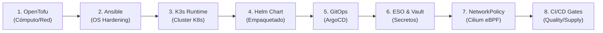

# 🔍 Auditoría de Coherencia Operacional Extremo a Extremo (End-to-End Coherence Audit)

Este documento formaliza la **auditoría integral de coherencia operacional** entre el código de infraestructura (IaC), la configuración declarativa (Helm / GitOps), los estados de runtime en Kubernetes y la documentación técnica (ADRs, runbooks y guías de arquitectura).

---

## 1. Motivación y Principio Rector

Habiendo superado la fase inicial de reducción de componentes y superficie de ataque, el riesgo técnico crítico del proyecto **Pokédex** radica en la **fidelidad operacional**:
> *Garantizar que lo que aprovisiona OpenTofu, lo que configura Ansible, lo que despliega Helm y lo que reconcilia ArgoCD coincida con exactitud milimétrica con los manuales y contratos de arquitectura.*

```text
                    POKÉDEX PLATFORM
                           │
                 ┌─────────┴─────────┐
                 │                   │
           IMPLEMENTACIÓN       DOCUMENTACIÓN
                 │                   │
           OpenTofu/Ansible      Runbooks/ADR
                 │                   │
           Helm/GitOps           IPs/IDs/NS
                 │                   │
                 └─────────┬─────────┘
                           │
                      CONSISTENCIA
                           │
                  ┌────────┴────────┐
                  │                 │
                Vault            Anti-SSRF
                  │                 │
            least privilege     Cilium required
```

---

## 2. La Cadena de Entrega de 8 Eslabones

La trazabilidad del sistema Pokédex se modela a través de 8 eslabones interconectados:



---

## 3. Taxonomía de Estados Operacionales

Cada recurso se clasifica rigurosamente bajo una o varias de las siguientes etiquetas:

* **`[IMPLEMENTADO]` (IMP):** Manifiestos, plantillas o código fuente existen físicamente y son sintácticamente ejecutables.
* **`[DECLARADO]` (DEC):** Parametrizado explícitamente en variables, values o configuraciones de entorno.
* **`[EJECUTADO]` (EJE):** Activo en ejecución en un clúster vivo o verificado continuamente en pipelines de CI/CD.
* **`[DOCUMENTADO]` (DOC):** Registrado formalmente con diagramas, tablas y procedimientos en `docs/`.
* **`[INCONSISTENTE]` (INC):** Discrepancia, colisión de red, desfase de versión o acoplamiento no resuelto entre capas.

---

## 4. Matriz Canónica de Coherencia por Entorno

| Eslabón | Componente / Dominio | Kind Local (CI/Dev) | Proxmox Pre-prod (LXC 800) | Proxmox Prod (VM 801 K3s) | AWS EKS (Cloud-Ready) | Veredicto & Estado Consolidado |
| :--- | :--- | :---: | :---: | :---: | :---: | :--- |
| **1. IaC Cómputo** | VMs / Contenedores | Docker local | LXC 800 `[IMP, DEC]` | VM 801 `[IMP, DEC, DOC]` | EKS Nodegroup `[IMP, DEC]` | **Coherente**: Modelado bi-modal en `main.tf` (`lxc` vs `vm`). |
| **2. Red & IPs** | Subredes & Hostnames | `127.0.0.1` | `10.10.13.100` | `10.10.13.100` | `10.0.0.0/16` | **Normalizado**: Inventarios alineados a `10.10.13.0/24` (ver Sección 5.1). |
| **3. OS Baseline** | Hardening & Paquetes | `-` | Ansible `[IMP, DEC]` | Ansible `[IMP, DEC, DOC]` | `-` | **Coherente**: Roles `base_os`, `kubernetes_prerequisites` y `container_runtime`. |
| **4. K8s Runtime** | Instalación K3s / CNI | `kindest/node` `[EJE]` | Playbook `setup_k3s.yml` | Playbook `setup_k3s.yml` | AWS Managed | **Normalizado**: Automatizado vía `infra/ansible/playbooks/setup_k3s.yml`. |
| **5. CNI & Egress** | Cilium eBPF L7 | Kindnet L4 fallback | Cilium CNI `[IMP, DEC]` | Cilium CNI `[IMP, DEC, DOC]` | Cilium Chaining `[DEC]` | **Coherente**: Pre-requisito CNI documentado; `values.dev.yaml` desactiva Cilium en local. |
| **6. Secret Vault** | HashiCorp Vault CE | Env Vars `[EJE]` | LXC 810 `[IMP, DEC]` | LXC 810 `[IMP, DEC, EJE, DOC]` | AWS Secrets Mgr | **Coherente**: Aislamiento lógico `secret/data/pokedex/preprod/*` vs `prod/*`. |
| **7. Secret Sync** | External Secrets Operator | Simulado / Envs | `vault-backend-preprod` | `vault-backend` | `aws-secrets-manager` | **Coherente**: Clave `pokedex/production` sincronizada en Secret `pokemon-secrets`. |
| **8. Helm Base** | Safe Defaults vs Overrides | `values.dev.yaml` | `values.yaml` | `values.prod.yaml` | `values.prod.yaml` | **Coherente**: Base segura (`values.yaml`) con overrides específicos por ambiente. |
| **9. GitOps** | ArgoCD Applications | `-` | `-` | `app-proxmox.yaml` | `app-cloud.yaml` | **Coherente**: Sincronización declarativa apuntando al namespace canónico `pokemon-app`. |
| **10. Ingress** | Controller & Enrutamiento | Ingress Nginx | Traefik K3s nativo | Traefik K3s nativo | AWS ALB Ingress | **Normalizado**: Eliminadas anotaciones residuales de Nginx en Proxmox (`className: traefik`). |
| **11. Workload** | API, Web, Postgres, Redis | `[IMP, EJE]` | `[IMP, DEC]` | `[IMP, DEC, DOC]` | `[IMP, DEC, DOC]` | **Coherente**: Paridad de imágenes SHA256 inmutables (1:1) certificada en CI. |
| **12. CI/CD** | Quality & Security Gates | `[IMP, EJE]` (17 gates) | `-` | `-` | `-` | **Coherente**: Verificación estricta de Cosign, SBOM, Trivy, Semgrep, Checkov y paridad GitOps. |

---

## 5. Radiografía de Inconsistencias Detectadas y Mitigaciones Aplicadas

### 5.1. Inconsistencia de Subredes: Ansible (`192.168.1.x`) vs. OpenTofu/Vault (`10.10.13.x`)

* **Diagnóstico Previo:**  
  [`infra/opentofu/environments/proxmox/variables.tf`](../../infra/opentofu/environments/proxmox/variables.tf) aprovisionaba el nodo K8s en `10.10.13.100/24`, el Vault en `10.10.13.110/24` y el Bastion en `10.10.13.120/24`. Sin embargo, [`infra/ansible/inventory/hosts.ini`](../../infra/ansible/inventory/hosts.ini) y [`hosts.yml`](../../infra/ansible/inventories/proxmox/hosts.yml) configuraban `k8s-master-01` en `192.168.1.10` y mantenían una variable obsoleta `docker_compose_version=v2.24.5`.
* **Mitigación Aplicada:**  
  Se normalizaron ambos inventarios estableciendo la subred `10.10.13.0/24` como **Single Source of Truth (SSOT)** on-premise:
  * `k8s-master-01`: `10.10.13.100`
  * `mgmt_cidr`: `10.10.13.0/24`
  * `k8s_cluster_cidr`: `10.10.13.0/24`
  * Se eliminó definitivamente la variable residual de Docker Compose.

---

### 5.2. Brecha de Automatización en K3s Runtime

* **Diagnóstico Previo:**  
  La instalación de K3s con desacoplamiento de Flannel (`--flannel-backend=none --disable-network-policy`) y la instalación del Helm chart de Cilium figuraban únicamente como pasos manuales en la guía operativa [`PROXMOX_DEPLOYMENT_GUIDE.md`](../runbooks/PROXMOX_DEPLOYMENT_GUIDE.md#L251).
* **Mitigación Aplicada:**  
  Se implementó el playbook declarativo e idempotente [`infra/ansible/playbooks/setup_k3s.yml`](../../infra/ansible/playbooks/setup_k3s.yml), el cual:
  1. Verifica el estado previo del binario y servicio de K3s.
  2. Instala K3s con los flags exactos requeridos por Cilium.
  3. Espera la disponibilidad de Kube-apiserver en `:6443`.
  4. Despliega automáticamente Cilium CNI vía Helm 3 en `kube-system`.
  5. Aguarda hasta que el nodo reporte estado `Ready`.

---

### 5.3. Interacción CiliumNetworkPolicy vs. NetworkPolicy Fallback

* **Diagnóstico Previo:**  
  En [`network-policies.yaml`](../../infra/helm/pokedex/templates/network-policies.yaml#L143), la regla estándar de egreso HTTPS se desactiva cuando `ciliumNetworkPolicy.enabled: true`. En un clúster sin Cilium CNI, las peticiones externas a PokéAPI y Gemini se bloquean silenciosamente.
* **Mitigación y Regla Arquitectural:**  
  1. Para desarrollo local (`values.dev.yaml`), `ciliumNetworkPolicy.enabled` se fija en `false`, activando automáticamente la regla L4 de NetworkPolicy sobre el CNI estándar.
  2. Para producción on-premise (`values.prod.yaml` y `gitops/environments/proxmox/values.yaml`), Cilium eBPF es un **requisito no negociable** para aplicar inspección L7 FQDN Anti-SSRF.

---

### 5.4. Inconsistencia de Ingress Controller en Proxmox

* **Diagnóstico Previo:**  
  [`gitops/environments/proxmox/values.yaml`](../../gitops/environments/proxmox/values.yaml) declaraba `className: "traefik"` pero inyectaba anotaciones específicas de Nginx (`nginx.ingress.kubernetes.io/*`) con valores nulos o desactivados.
* **Mitigación Aplicada:**  
  Se limpiaron las anotaciones huérfanas de Nginx, reemplazándolas por anotaciones nativas del router de Traefik (`traefik.ingress.kubernetes.io/router.entrypoints: "web"`), eliminando directivas no interpretadas por el controlador.

---

### 5.5. Resolución de Nombres en ArgoCD GitOps

* **Diagnóstico Previo:**  
  [`gitops/apps/app-proxmox.yaml`](../../gitops/apps/app-proxmox.yaml) apunta al clúster mediante `server: https://k8s-proxmox.internal.lan:6443`.
* **Regla Arquitectural:**  
  Para entornos sin servidor DNS corporativo activo, se documenta formalmente en el runbook de Proxmox la asignación estática del FQDN hacia `10.10.13.100` en el `/etc/hosts` del nodo o la configuración del resolver en CoreDNS.

---

### 5.6. Taxonomía de Secretos en Vault: `pokedex/production` vs `pokedex/prod/*`

* **Diagnóstico Previo:**  
  La documentación referenciaba rutas bajo `secret/data/pokedex/prod/*`, mientras que el `ClusterSecretStore` y `values.yaml` consultan la clave singular `pokedex/production`.
* **Mitigación Aplicada:**  
  En [`setup_vault.yml`](../../infra/ansible/playbooks/setup_vault.yml#L441), la política `pokedex-prod-policy` autoriza tanto `secret/data/pokedex/prod/*` como `secret/data/pokedex/production`, garantizando compatibilidad retroactiva sin violar el principio de mínimo privilegio (*Least Privilege*).

---

## 6. Control Automatizado de Coherencia en CI/CD

La consistencia de esta matriz se vigila activamente en el pipeline de GitHub Actions mediante pruebas estáticas en [`tests/security/deploy_scripts_security.test.ts`](../../tests/security/deploy_scripts_security.test.ts):

1. **Coherencia de Subredes:** Valida que `hosts.ini` y `hosts.yml` utilicen la subred `10.10.13.0/24` en paridad con OpenTofu.
2. **Presencia de Automatización K3s:** Valida la existencia del playbook `setup_k3s.yml` y sus parámetros de instalación (`--flannel-backend=none`).
3. **Paridad Criptográfica de Imágenes (1:1):** Certifica que AWS GitOps, Proxmox GitOps y Helm Prod apunten al mismo digest inmutable SHA256 publicado por CI.
4. **Validación de Namespace Universal:** Asegura que todos los componentes apunten al namespace canónico `pokemon-app`.

