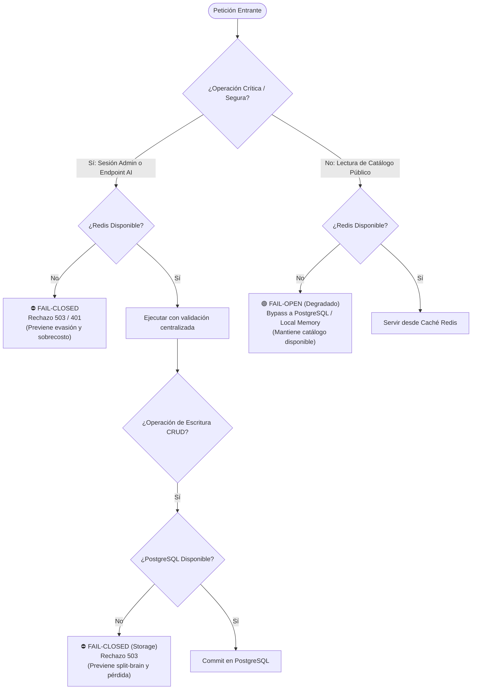
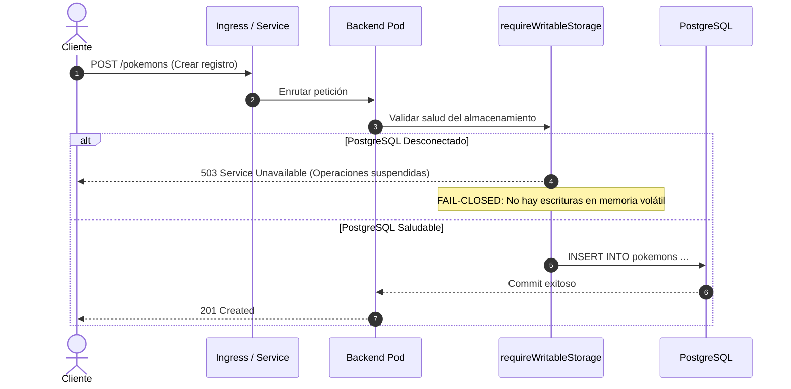
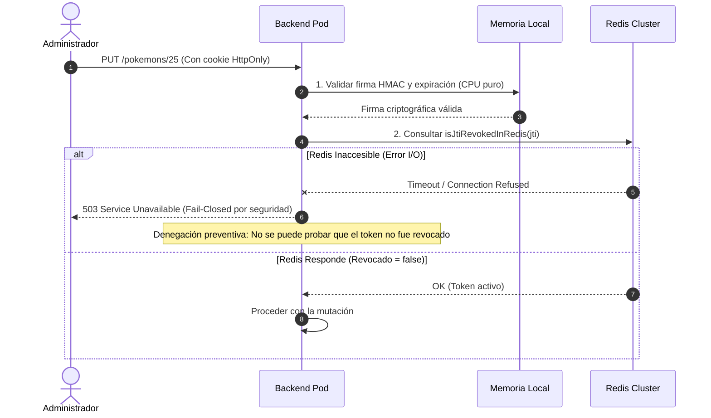

# Especificación Formal de Contratos de Resiliencia: Fail-Open vs. Fail-Closed

## 1. Resumen Ejecutivo y Marco Teórico

En arquitecturas distribuidas de alta concurrencia como la Pokédex Cloud-Ready (Kubernetes + PostgreSQL + Redis + Google Gemini AI), los fallos parciales de dependencias externas son eventos inevitables. Cuando un componente crítico de infraestructura queda inaccesible o experimenta latencia extrema, el sistema debe operar bajo contratos formales y predecibles:

* **Fail-Closed (Fallo Cerrado - Prioridad Seguridad e Integridad)**:
  La operación se aborta de manera determinista, rechazando la solicitud con un código de error HTTP explícito (`503 Service Unavailable`, `401 Unauthorized` o `429 Too Many Requests`). Se aplica a operaciones donde la inconsistencia de datos, el escalamiento de privilegios o el sobrecosto financiero superan el valor de la disponibilidad temporal.

* **Fail-Open (Fallo Abierto / Degradación Grácil - Prioridad Disponibilidad)**:
  La operación continúa ejecutándose a través de un mecanismo alternativo (fallback en memoria local, omisión de aceleradores de caché, o desacoplamiento no bloqueante). Se adopta en flujos de lectura pública o consumo donde la indisponibilidad de un componente no compromete la seguridad ni la integridad de los datos.



---

## 2. Matriz Canónica de Contratos de Resiliencia

A continuación se formaliza el comportamiento arquitectónico del backend ante contingencias en cada una de sus dependencias:

| Componente Afectado | Operación / Endpoint | Política Adoptada | Código HTTP | Justificación Técnica (Seguridad vs. Disponibilidad) |
| :--- | :--- | :--- | :--- | :--- |
| **PostgreSQL** | Liveness Probe (`/healthz`) | **Fail-Open** | `200 OK` | **Anti-Cascading Failure**: Si la base de datos se reinicia o satura transitoriamente, los pods de Kubernetes no deben morir en bucle (`CrashLoopBackOff`), preservando la estabilidad del plano de cómputo. |
| **PostgreSQL** | Readiness Probe (`/readyz`) | **Fail-Closed** | `503 Service Unavailable` | **Aislamiento de Tráfico**: Informa a Kubernetes que el pod no puede resolver peticiones dependientes de DB. K8s remueve el pod de los endpoints del `Service`, protegiendo a los usuarios de errores 500. |
| **PostgreSQL** | Escritura CRUD (`POST`, `PUT`, `DELETE /pokemons`) | **Fail-Closed** | `503 Service Unavailable` | **Integridad Absoluta**: Implementado mediante `requireWritableStorage`. Prohíbe mutaciones que no puedan persistirse de forma duradera en disco, evitando *split-brain* en memoria o pérdida silenciosa de datos. |
| **PostgreSQL** | Lectura Pública (`GET /pokemons`, `/pokemons/:id`) | **Fail-Open (Graceful)** | `200 OK` (Caché caliente) o `503` (Frío) | Si Redis conserva copias cálidas del catálogo, las lecturas se sirven con normalidad durante el drenado del pod. Si la clave expira, falla cerrado de forma controlada. |
| **Redis** | Revocación de Sesión (`isJtiRevokedInRedis`) | **Fail-Closed** | `503 Service Unavailable` / `401 Unauthorized` | **Seguridad Sin Concesiones**: En un entorno multi-pod, si un token de administrador fue revocado, un pod desconectado de Redis no puede verificar dicha revocación. Aceptar el token constituiría una brecha de seguridad grave. |
| **Redis** | Rate Limiting de IA (`/api/v1/ai/*`) | **Fail-Closed** | `503 Service Unavailable` | **Protección de Cuota y Costos**: Los endpoints de Gemini consumen APIs externas tarifadas y cuotas estrictas. Si el limitador distribuido en Redis no responde (`failClosedOnRedisOutage: true`), se bloquea el tráfico para prevenir agotamiento de cuotas. |
| **Redis** | Rate Limiting Público (`/pokemons`, Global) | **Fail-Open con Fallback Local** | `200 OK` (Permitido) o `429` (Local) | **Alta Disponibilidad**: El catálogo público conmuta instantáneamente al almacén de tokens en memoria RAM de cada pod (`Map<string, RateLimitEntry>`). Los usuarios legítimos no sufren cortes de servicio por caídas de Redis. |
| **Redis** | Lectura de Caché (`getOrSetCache`) | **Fail-Open** | `200 OK` | **Transparencia Operativa**: Si Redis falla o no está conectado, el backend captura el error de red y consulta directamente a PostgreSQL sin impactar la respuesta al cliente. |
| **Redis** | Invalidación de Caché (`invalidateCache`) | **Fail-Open Bounded** | `200 OK` (Mutación en DB persistida) | **Persistencia Primero**: Si la mutación en PostgreSQL se completó exitosamente pero Redis no pudo incrementar la versión de lista (`pokedex:list_version`), la escritura no se revierte. La inconsistencia máxima queda estrictamente acotada por el TTL pasivo de las claves (60s para listados, 300s para ítems). |

---

## 3. Análisis Detallado por Dominio de Resiliencia

### 3.1. Almacenamiento PostgreSQL (Base de Datos Relacional)



1. **Gobernanza de Probes de Kubernetes**:
   * `/healthz` únicamente valida que el hilo principal de eventos de Node.js responda.
   * `/readyz` valida activamente `health.postgres_connected`. Si la conexión se pierde, el pod pasa a estado `Unready` en menos de 5 segundos (`periodSeconds: 5`, `failureThreshold: 2`).

2. **Protección Contra Pérdida de Datos**:
   * La función `requireWritableStorage` actúa como guardia obligatoria antes de cualquier mutación en `/pokemons`.
   * Se elimina de raíz el riesgo de registrar datos en estructuras volátiles que desaparecerían ante un reinicio del pod.

---

### 3.2. Clúster de Caché y Sesión Redis



1. **Revocación de Sesión (Cero Falsos Positivos de Confianza)**:
   * El token de sesión emitido incluye un identificador aleatorio criptográfico `jti` (16 bytes hex).
   * La verificación de firma HMAC SHA-256 es local y rápida.
   * La consulta de revocación remota en Redis se rige por:

     ```typescript
     if (redisRevoked === null && Boolean(process.env.REDIS_URL)) {
       return { valid: false, reason: 'service_unavailable' };
     }
     ```

   * Si Redis está configurado pero no responde, la solicitud administrativa es **rechazada con 503**, previniendo que un administrador desvinculado o con credencial comprometida continúe operando.

2. **Doble Capa de Rate Limiting**:
   * **Capa 1: In-Memory / express-rate-limit**:
     Defensa perimetral inmediata en cada pod. Si Redis no está disponible, esta capa asegura que ningún cliente pueda inundar el pod con más peticiones de las configuradas.
   * **Capa 2: Distribuido / Redis Lua Scripts**:
     Garantiza cuotas globales en despliegues con réplicas elásticas (HPA).
     * Endpoints IA: `failClosedOnRedisOutage: true` -> **Fail-Closed (503)**.
     * Endpoints de Catálogo: `failClosedOnRedisOutage: false` -> **Fail-Open** con conmutación a Map local.

---

### 3.3. Invalidación de Caché y Límites de Inconsistencia Eventual

Para la invalidación de listados paginados y filtrados, la Pokédex no ejecuta búsquedas bloqueantes como `KEYS *` o `SCAN` iterativos que degradarían la latencia de Redis. Se utiliza un esquema de **versionado atómico**:

* Clave de versión global: `pokedex:list_version`
* Claves de listados: `pokedex:list:v{VERSION}:{HASH_PARAMETROS}` con TTL de 60 segundos.
* Invalidador:

  ```typescript
  export async function invalidateCache(id?: number): Promise<void> {
    if (!isRedisConnected || !redisClient) return;
    try {
      if (id !== undefined) await redisClient.del(`pokedex:item:${id}`);
      await redisClient.incr('pokedex:list_version');
    } catch {
      // Fail-Open para no revertir la transacción de DB
    }
  }
  ```

Si la llamada `redisClient.incr` fallara por un micro-corte de red:

1. La base de datos PostgreSQL ya persistió el nuevo estado de forma ACID.
2. La clave de caché anterior en Redis continuará respondiendo datos previos como máximo durante **60 segundos** (TTL preestablecido).
3. Transcurridos los 60 segundos, la clave expira automáticamente en Redis y la siguiente consulta regenerará los datos frescos desde PostgreSQL.
4. **Veredicto**: Bounded Eventual Consistency (consistencia eventual con ventana máxima de 60 segundos).

---

## 4. Auditoría de Cumplimiento y Verificación

El cumplimiento de estos contratos se valida tanto en tiempo de compilación (TypeScript estricto) como en la suite automatizada de pruebas (`tests/security/deploy_scripts_security.test.ts`):

* **Fail-Closed en Escrituras**: Test unitario e integración validando retorno `503` al invocar `requireWritableStorage` con DB inactiva.
* **Fail-Closed en Revocación**: Test validando rechazo de sesión cuando Redis retorna estado inaccesible.
* **Fail-Closed en Cuotas IA**: Test validando que `aiRateLimiter` rechaza con `503` bajo fallo de Redis.
* **Fail-Open en Catálogo**: Test validando que el catálogo responde desde memoria local cuando Redis se desconecta.
