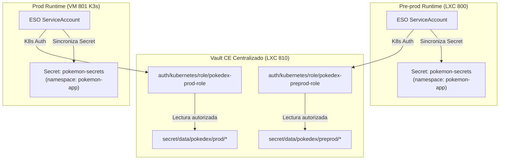

# 🏷️ Taxonomía Canónica de Namespaces de Kubernetes y Rutas de Secretos

Este documento establece la **única fuente de verdad (SSOT)** para la nomenclatura de namespaces de Kubernetes, recursos de carga de trabajo y rutas de secretos en el proyecto Pokédex.

---

## 1. Declaración Canónica (SSOT)

> **Regla Operativa Canónica:**  
> En **todos** los clústeres y entornos (Kind local, Proxmox VE Pre-producción LXC 800, Proxmox VE Producción K3s VM 801, y AWS EKS Cloud-Ready), **la aplicación Pokédex se despliega exclusivamente en el namespace `pokemon-app`**.
>
> Ningún runbook, manifiesto, pipeline o comando operativo debe utilizar los namespaces legados `pokedex` o `pokedex-preprod`.

```text
┌─────────────────────────────────────────────────────────────────────────────┐
│                       PLATAFORMA KUBERNETES (K3s / EKS)                     │
├──────────────────────────────┬──────────────────────────────────────────────┤
│ Namespace de Aplicación      │ pokemon-app (SSOT Canónico)                  │
│ Namespaces de Plataforma     │ kube-system, external-secrets, monitoring,   │
│                              │ argocd, cert-manager, kyverno                │
├──────────────────────────────┴──────────────────────────────────────────────┤
│                       GESTOR DE SECRETOS (HASHICORP VAULT)                  │
├──────────────────────────────┬──────────────────────────────────────────────┤
│ Rutas de Secretos KV v2      │ secret/data/pokedex/preprod/*                │
│                              │ secret/data/pokedex/prod/*                   │
│ Roles de Autenticación K8s   │ pokedex-preprod-role                         │
│                              │ pokedex-prod-role                            │
└──────────────────────────────┴──────────────────────────────────────────────┘
```

---

## 2. Taxonomía de Namespaces en el Clúster

| Namespace | Tipo | Responsabilidad / Carga de Trabajo | Políticas Asociadas |
| :--- | :--- | :--- | :--- |
| **`pokemon-app`** | **Aplicación (Workload)** | Microservicio Backend (`pokemon-api`), Frontend Web (`pokedex-web`), Base de Datos (`postgres`), Caché (`redis`), Connection Pooler (`pgbouncer`), Jobs de seed y probes de egreso anti-SSRF. | Pod Security Standard: `restricted` • Cilium / K8s NetworkPolicies L3/L4/L7 • ResourceQuota & LimitRange dedicados |
| **`kube-system`** | Plataforma / Core | Plano de control K3s, CNI (Cilium / Flannel), CoreDNS, Kube-Proxy, Local-Path Provisioner. | Pod Security Standard: `privileged` |
| **`external-secrets`** | Plataforma / Seguridad | External Secrets Operator (ESO) controller, webhook y ServiceAccount (`external-secrets-sa`) para sincronización con Vault. | Pod Security Standard: `baseline` |
| **`monitoring`** | Plataforma / Observabilidad | Grafana Alloy (agente de telemetría OTLP), Prometheus, Alertmanager, Node Exporter. | Pod Security Standard: `baseline` |
| **`argocd`** | Plataforma / GitOps | ArgoCD Server, Repo Server, Application Controller (reconciliación declarativa de `app-proxmox.yaml`). | Pod Security Standard: `baseline` |
| **`cert-manager`** | Plataforma / PKI | Emisión y renovación automática de certificados TLS X.509 vía Let's Encrypt / ACME. | Pod Security Standard: `baseline` |
| **`kyverno`** | Plataforma / Governance | Validación de políticas de admisión, bloqueo de escalada de privilegios y verificación criptográfica de firmas Cosign. | Pod Security Standard: `restricted` |

---

## 3. Disambiguación: ¿Por qué NO existen `pokedex` ni `pokedex-preprod` como namespaces de Kubernetes?

Históricamente, algunos manuales de procedimiento contenían referencias mixtas a `pokedex` o `pokedex-preprod`. La arquitectura aclara la separación de conceptos:

### 3.1. Aislamiento por Instancia de Computación, no por Namespace Compartido

- En la arquitectura On-Premise ([ADR-025](../decisions/ADR-025-management-plane-runtime-plane-and-cloud-ready-separation.md) y [Análisis de SPOF](ONPREM_SPOF_AND_FAILURE_DOMAIN_ANALYSIS.md)), **Pre-producción** se ejecuta en un contenedor LXC aislado (`LXC 800`), mientras que **Producción** se ejecuta en una máquina virtual K3s dedicada (`VM 801`).
- Dado que los entornos residen en instancias de computación K3s independientes, no se mezclan cargas de trabajo en un único clúster multitenant.
- En ambos entornos, la aplicación se ejecuta dentro del namespace canónico `pokemon-app`, garantizando paridad exacta de manifiestos Helm y GitOps (12-Factor App Parity).

### 3.2. Segregación Lógica en Vault (Rutas y Roles)

El único componente compartido físicamente en el host Proxmox es la instancia centralizada de **HashiCorp Vault CE** (`LXC 810`). En Vault, la segregación sí requiere rutas y roles diferenciados:



- **Rutas KV v2:**
  - `secret/data/pokedex/preprod/*`: Secretos específicos de Pre-producción.
  - `secret/data/pokedex/prod/*`: Secretos restringidos de Producción.
- **Roles K8s Auth en Vault:**
  - `pokedex-preprod-role`: Enlaza a la política `pokedex-preprod-policy` (acceso exclusivo a la ruta preprod).
  - `pokedex-prod-role`: Enlaza a la política `pokedex-prod-policy` (acceso exclusivo a la ruta prod).
- En ambos casos, el objeto sincronizado en Kubernetes es:
  - Nombre: `pokemon-secrets`
  - Namespace: `pokemon-app`

---

## 4. Hoja de Referencia Operativa (Operator Cheat Sheet)

Cualquier operador que ejecute tareas de diagnóstico, rotación, reinicio o inspección debe utilizar las siguientes convenciones unificadas:

### 4.1. Comandos de Diagnóstico y Estado

```bash
# Consultar pods en ejecución
kubectl get pods -n pokemon-app -o wide

# Consultar servicios e ingress
kubectl get svc,ingress -n pokemon-app

# Consultar consumo de recursos y autoscaling (HPA)
kubectl get hpa -n pokemon-app
kubectl top pods -n pokemon-app
```

### 4.2. Comandos de Logs y Trazas

```bash
# Logs del Backend API
kubectl logs -n pokemon-app -l app=pokemon-api --tail=100 -f

# Logs del Frontend Web (Nginx)
kubectl logs -n pokemon-app -l app=pokedex-web --tail=100 -f

# Logs de Redis
kubectl logs -n pokemon-app deployment/redis --tail=100

# Logs de PostgreSQL
kubectl logs -n pokemon-app statefulset/postgres --tail=100
```

### 4.3. Reinicios Seguros (Rollout Restart)

```bash
# Reinicio del Backend API
kubectl rollout restart deployment/pokemon-api -n pokemon-app
kubectl rollout status deployment/pokemon-api -n pokemon-app

# Reinicio de Redis
kubectl rollout restart deployment/redis -n pokemon-app

# Reinicio de PostgreSQL
kubectl rollout restart statefulset/postgres -n pokemon-app
```

### 4.4. Nombres Canónicos de Recursos en `pokemon-app`

| Tipo de Recurso | Nombre Canónico | Selector de Etiquetas | Puerto Interno |
| :--- | :--- | :--- | :--- |
| **Deployment** | `pokemon-api` | `app=pokemon-api` | `3000` |
| **Deployment** | `pokedex-web` | `app=pokedex-web` | `8080` |
| **Deployment** | `redis` | `app=redis` | `6379` |
| **StatefulSet** | `postgres` | `app=postgres` | `5432` |
| **Service** | `pokemon-api-svc` | `app: pokemon-api` | `3000` |
| **Service** | `pokemon-web-svc` | `app: pokedex-web` | `8080` |
| **Service** | `pokemon-redis-svc` | `app: redis` | `6379` |
| **Service** | `postgres-service` | `app: postgres` | `5432` |
| **Secret** | `pokemon-secrets` | `app.kubernetes.io/part-of=pokemon-platform` | N/A |
| **ExternalSecret** | `pokedex-external-secrets` | `app.kubernetes.io/name=pokedex` | N/A |

---

## 5. Control de Regresión Automatizado

El cumplimiento de esta taxonomía se valida de forma continua en el pipeline de CI/CD mediante los siguientes tests automatizados en [`tests/security/deploy_scripts_security.test.ts`](../../tests/security/deploy_scripts_security.test.ts):

1. **Prohibición de Namespaces Obsoletos:** Falla si cualquier documento en `docs/` o `gitops/` contiene `-n pokedex` o `--namespace pokedex`.
2. **Paridad de Helm Values:** Verifica que `infra/helm/pokedex/values.yaml` especifique `global.namespace: pokemon-app`.
3. **Paridad de GitOps ArgoCD:** Verifica que `gitops/apps/app-proxmox.yaml` y `gitops/apps/app-cloud.yaml` definan `destination.namespace: pokemon-app`.
4. **Validación de Roles Vault:** Verifica que `setup_vault.yml` enlace los roles `pokedex-preprod-role` y `pokedex-prod-role` al namespace `pokemon-app`.
