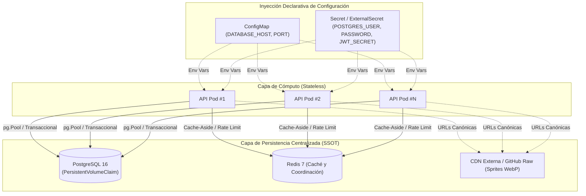

# ☸️ Análisis de Escalado en Kubernetes, Persistencia y Topología por Entorno

Este documento presenta la especificación arquitectónica del dimensionamiento de cómputo, autoescalado horizontal (**Horizontal Pod Autoscaler - HPA**), persistencia centralizada y enrutamiento de red para la **Pokédex API**, formalizando la estrategia diferenciada por entornos de ejecución.

---

## 📑 Tabla de Contenidos

1. [Estrategia de Cómputo y Dimensionamiento por Entorno](#1-estrategia-de-cómputo-y-dimensionamiento-por-entorno)
2. [Arquitectura de Autoescalado con Kubernetes (HPA v2)](#2-arquitectura-de-autoescalado-con-kubernetes-hpa-v2)
3. [Estrategia de Persistencia y Coherencia de Datos](#3-estrategia-de-persistencia-y-coherencia-de-datos)
4. [Topología de Red y Enrutamiento L4 / L7](#4-topología-de-red-y-enrutamiento-l4--l7)
5. [Configuración de Referencia en Helm Chart](#5-configuración-de-referencia-en-helm-chart)
6. [Conclusiones Arquitectónicas](#6-conclusiones-arquitectónicas)

---

## 1. Estrategia de Cómputo y Dimensionamiento por Entorno

La plataforma se adapta a diferentes modelos de ejecución según el contexto operativo:

| Entorno | Modelo de Ejecución | Estrategia de Réplicas | Dimensionamiento / Recursos |
| :--- | :--- | :--- | :--- |
| **Local (Dev)** | Docker Compose / Kind | 1 réplica unificada | Recursos locales directos, recarga en vivo con `tsx` o `docker compose up` |
| **Pre-producción (Lab)** | LXC / K8s ligero | 1 réplica fija | Capacidad acotada para validación funcional e integración continua |
| **Proxmox VE (On-Premise)** | Kubernetes (K3s) | Réplicas fijas (2 pods) | **Capacidad fija por diseño lean**: garantiza alta disponibilidad local sin sobrecargar la CPU/RAM del host físico |
| **Cloud (Enterprise)** | EKS / GKE / AKS | HPA Elástico (2 a 10 pods) | Escalado automático reactivo a picos de tráfico basado en CPU y memoria |

---

## 2. Arquitectura de Autoescalado con Kubernetes (HPA v2)

En entornos Cloud donde el HPA está activado (`autoscaling.enabled: true` en Helm):

### 2.1. Dinámica de Monitoreo y Escalado

El controlador **HPA** consulta de forma continua el **Metrics Server** de Kubernetes (cada 15 segundos) para recolectar el consumo de CPU y memoria de los pods del `Deployment`:

```mermaid
flowchart TD
    subgraph K8sCluster["Clúster Kubernetes (Perfil Cloud HPA)"]
        MS["Metrics Server (kube-state-metrics)"]
        HPA["Horizontal Pod Autoscaler (HPA Controller)"]
        DEP["Deployment (pokedex-api)"]

        P1["Pod 1 (35% CPU)"]
        P2["Pod 2 (80% CPU)"]
        P3["Pod 3 (Nuevo Pod Escalado)"]

        MS -->|Reporta métricas CPU/RAM| HPA
        HPA -->|Ajusta réplicas según target (ej. 70% CPU)| DEP
        DEP -->|Mantiene / Escala| P1
        DEP -->|Mantiene / Escala| P2
        DEP -->|Despliega según demanda| P3
    end
```

### 2.2. Algoritmo de Escalado y Ventanas de Estabilización

- **Fórmula de Réplicas:**
  $$\text{Réplicas Deseadas} = \left\lceil \text{Réplicas Actuales} \times \left( \frac{\text{Métrica Actual}}{\text{Métrica Objetivo}} \right) \right\rceil$$
- **Requisitos Críticos:** Todo contenedor debe declarar de forma obligatoria `resources.requests.cpu` y `resources.requests.memory` para que el HPA pueda computar el porcentaje de utilización.
- **Políticas de Enfriamiento (*Cooldown*):**
  - **Scale Up:** Rápido (ventana de estabilización 0s, hasta 100% de incremento cada 15s) para absorber picos de carga de manera inmediata.
  - **Scale Down:** Gradual (ventana de estabilización de 300s / 5 min, decrementos máximos del 20% por minuto) para prevenir oscilaciones bruscas (*thrashing*).

---

## 3. Estrategia de Persistencia y Coherencia de Datos

Para que el escalado de pods se ejecute sin generar inconsistencias o condiciones de carrera:



### Principios de Consistencia Garantizados

1. **Pods 100% Stateless:** El proceso en Node.js no almacena estado en el sistema de archivos local del contenedor. Si un pod se destruye o se reduce por HPA, no se compromete ningún dato de la aplicación.
2. **Fuente Única de Verdad (SSOT):** Todas las réplicas convergen hacia la misma instancia primaria de PostgreSQL mediante una URL centralizada (`DATABASE_URL`).
3. **Gestión Concurrente de Conexiones:**
   - En **Proxmox (diseño lean)**: cada pod maneja su propio `pg.Pool` con un límite acotado (máximo 20 conexiones).
   - En **Cloud de Alta Escala**: se habilita opcionalmente **PgBouncer** para multiplexar conexiones transaccionales.
4. **Almacenamiento de Multimedia Desacoplado:** Los sprites y assets de Pokémon no residen en la base de datos ni en volúmenes locales; se consumen como URLs externas optimizadas servidas por CDN global.

---

## 4. Topología de Red y Enrutamiento L4 / L7

El flujo de tráfico hacia los pods sigue una estructura de capas complementarias:

```text
Internet / Clientes
       │
       ▼
┌──────────────────────────────────────────────┐
│ 1. External Load Balancer (L4 / L7)          │ ◄── Punto de entrada con IP pública / DNS
└──────────────────────┬───────────────────────┘
                       │
                       ▼
┌──────────────────────────────────────────────┐
│ 2. Ingress Controller (NGINX / Reverse Proxy)│ ◄── Terminación SSL/TLS, rutas (/ y /api), CORS
└──────────────┬───────────────────────────────┘
               │
               ▼
┌──────────────────────────────────────────────┐
│ 3. Service ClusterIP (kube-proxy / L4)       │ ◄── Balanceo interno Round-Robin entre pods
└──────────────┬───────────────────────────────┘
               │
       ┌───────┴────────┐
       ▼                ▼
┌──────────────┐ ┌──────────────┐
│ API Pod #1   │ │ API Pod #N   │ ◄── Pods réplicas (fijas en Proxmox, HPA en Cloud)
└──────┬───────┘ └──────┬───────┘
       │                │
       └────────┬───────┘
                ▼
┌─────────────────────────────┐
│ PostgreSQL 16 (StatefulSet) │
└─────────────────────────────┘
```

---

## 5. Configuración de Referencia en Helm Chart

La orquestación declarativa se centraliza en `infra/helm/pokedex/`:

```text
infra/helm/pokedex/
├── Chart.yaml                     # Metadatos del Chart y versionado semántico
├── values.yaml                    # Configuración base (perfil local/desarrollo)
├── values.prod.yaml               # Overrides de producción para clúster Proxmox
└── templates/
    ├── configmap.yaml             # Variables de entorno no sensibles
    ├── secret.yaml                # Credenciales y secretos sincronizados
    ├── postgres-statefulset.yaml  # PostgreSQL con PVC persistente
    ├── pgbouncer-deployment.yaml  # Pooler opcional para alta escala
    ├── redis-deployment.yaml      # Redis Caché con ClusterIP
    ├── deployment.yaml            # Deployment unificado de Node.js/Express
    ├── hpa.yaml                   # Autoscaler v2 condicionado por autoscaling.enabled
    ├── ingress.yaml               # Reglas de enrutamiento Ingress
    └── network-policies.yaml      # Políticas Zero-Trust de aislamiento de tráfico
```

---

## 6. Conclusiones Arquitectónicas

1. **Flexibilidad Operativa:** La arquitectura soporta escalado elástico Cloud cuando la demanda lo requiere y modo de capacidad fija lean en hosts on-premise Proxmox para evitar saturación de memoria.
2. **Consistencia Transaccional:** La capa de datos en PostgreSQL 16 con `pg.Pool` nativo asegura transacciones ACID sin riesgo de estados huérfanos entre réplicas.
3. **Desacoplamiento Multimedia:** El consumo de assets vía CDN previene la saturación del almacenamiento persistente del clúster.
