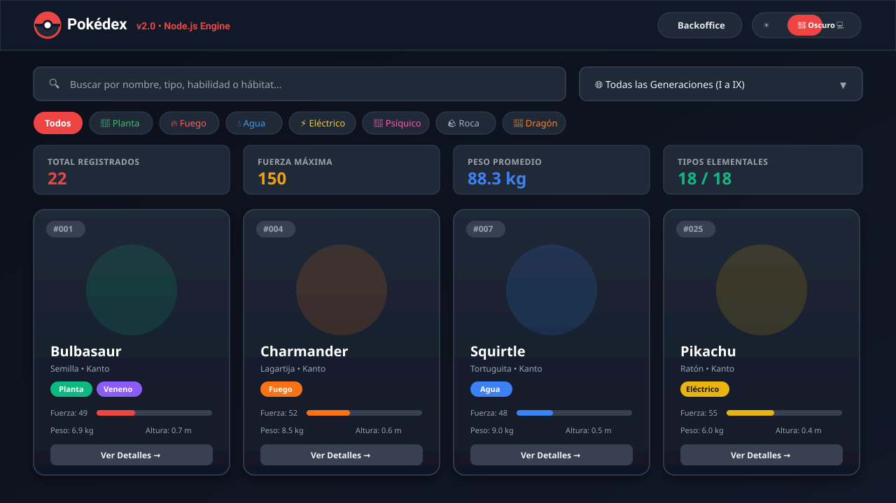
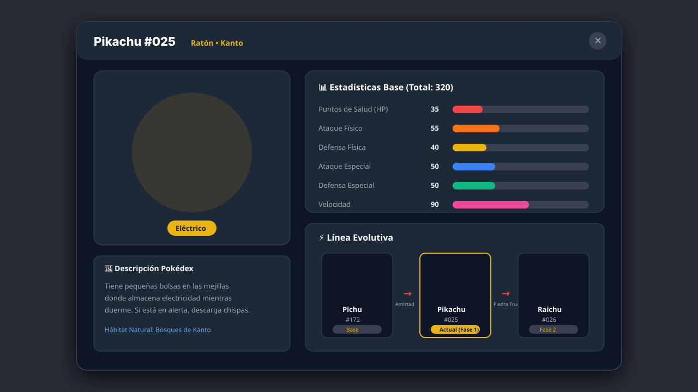
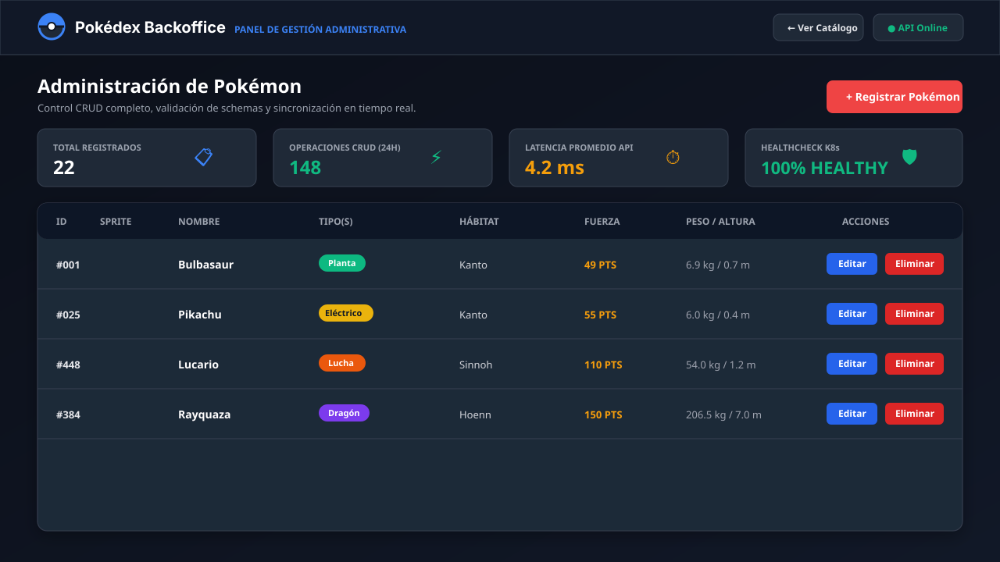

# 🎨 Mockups y Sistema de Diseño de la Interfaz (UI/UX)

Este documento presenta los **mockups visuales de alta fidelidad**, la arquitectura de componentes y los lineamientos de diseño de usuario para la aplicación **Pokédex**, abarcando tanto el catálogo público como el panel administrativo (Backoffice) y los modales de detalle.

---

## 📑 Índice de Contenidos
1. [Mockups Visuales](#1-mockups-visuales)
   * [1.1. Catálogo Principal Pokédex](#11-catálogo-principal-pokédex)
   * [1.2. Ficha de Detalle y Línea Evolutiva](#12-ficha-de-detalle-y-línea-evolutiva)
   * [1.3. Panel Administrativo CRUD (Backoffice)](#13-panel-administrativo-crud-backoffice)
2. [Sistema de Tokens de Diseño](#2-sistema-de-tokens-de-diseño)
3. [Patrones de UX y Accesibilidad](#3-patrones-de-ux-y-accesibilidad)
4. [Estrategia Responsiva](#4-estrategia-responsiva)

---

## 1. Mockups Visuales

### 1.1. Catálogo Principal Pokédex
El catálogo público ofrece exploración fluida, búsqueda en tiempo real, filtros por tipo elemental, selector de generaciones y métricas agregadas del universo Pokémon.

**Elementos clave del diseño:**
* **Barra de Navegación Unificada:** Identidad visual con Pokébola estilizada, selector de modo de tema (Claro / Oscuro / Sistema) y acceso directo al panel administrativo.
* **Barra de Búsqueda & Filtros Dinámicos:** Entrada debounce de texto para filtrado instantáneo por nombre, tipo o habilidad, junto con selector multigenacional (Generaciones I a IX).
* **Píldoras Elementales con Código Cromático:** Identificación inmediata de los 18 tipos elementales con colores armonizados y alto contraste.
* **Bento de Métricas Globales:** Tarjetas de datos rápidos que calculan al vuelo el total de especímenes, fuerza máxima registrada, peso medio del ecosistema y cobertura de tipos.
* **Tarjetas de Pokémon:** Jerarquía limpia con número de Pokédex oficial (#001), arte oficial en alta definición, badges de tipos, barras proporcionales de estadísticas y botón de interacción.

---

### 1.2. Ficha de Detalle y Línea Evolutiva
El modal emergente desglosa la información biológica, las estadísticas base y la cadena genealógica y evolutiva del Pokémon seleccionado.

**Elementos clave del diseño:**
* **Cabecera Contextual:** Identificador oficial, nombre y categoría del Pokémon con botón de cierre accesible (`ESC` o click de fondo).
* **Arte y Reseña Biológica:** Ilustración a escala con resplandor ambiental según el tipo elemental primario y cita descriptiva de la Pokédex.
* **Matriz de Estadísticas Base:** Barras visuales con gradientes semánticos para PS (HP), Ataque, Defensa, Ataque Especial, Defensa Especial y Velocidad, con cómputo del Total Base Stat (BST).
* **Cadena Evolutiva Interactiva:** Diagrama lineal que representa cada fase (Base, Fase 1, Fase 2), destacando la etapa actual y especificando el método de evolución (nivel, objeto, amistad o intercambio).

---

### 1.3. Panel Administrativo CRUD (Backoffice)
El panel Backoffice proporciona control operativo completo para la gestión del catálogo Pokémon, con monitoreo de salud del servicio y latencias.

**Elementos clave del diseño:**
* **Indicadores Operativos (KPIs):** Monitoreo en vivo de especímenes registrados, total de transacciones CRUD ejecutadas en las últimas 24 horas, latencia promedio de la API REST y estado del healthcheck de Kubernetes.
* **Acciones Rápidas:** Botón de registro de nuevo Pokémon con modal de validación de campos obligatorios y tipos.
* **Tabla de Gestión con Acciones:** Listado tabular con paginación, vista previa de sprites, badges tipados, características métricas y botones rápidos de edición (`PUT`) y eliminación protegida con confirmación (`DELETE`).

---

## 2. Sistema de Tokens de Diseño

| Token | Propósito | Valor Modo Oscuro | Valor Modo Claro |
|---|---|---|---|
| `color-bg-canvas` | Fondo base de la aplicación | `#0b0f19` | `#f8fafc` |
| `color-bg-surface` | Contenedores y tarjetas | `#1f2937` | `#ffffff` |
| `color-border-subtle` | Delimitadores y bordes | `#374151` | `#e2e8f0` |
| `color-text-primary` | Texto principal y encabezados | `#ffffff` | `#0f172a` |
| `color-text-secondary`| Subtítulos y etiquetas | `#9ca3af` | `#64748b` |
| `color-brand-primary` | Acentos y acción primaria | `#ef4444` (Pokéball Red) | `#dc2626` |
| `color-status-success`| Éxito / Estado saludable | `#10b981` | `#059669` |
| `color-status-warning`| Advertencia / Atención | `#f59e0b` | `#d97706` |

---

## 3. Patrones de UX y Accesibilidad

1. **Cumplimiento WCAG 2.1 AA:**
   * Relación de contraste mínima de 4.5:1 en todos los textos sobre fondos claros y oscuros.
   * Navegación completa mediante teclado (`Tab`, `Shift+Tab`, `Enter`, `Escape` para modales).
   * Atributos `aria-label`, `role="dialog"` y `aria-modal="true"` en ventanas emergentes.
2. **Prevención de Errores en Operaciones Destructivas:**
   * Diálogos de confirmación modales antes de eliminar cualquier registro en el Backoffice.
   * Notificaciones tipo *Toast* con temporizador de auto-cierre para confirmar operaciones exitosas o reportar errores.
3. **Optimización Perceptual de Carga:**
   * Animaciones suaves con aceleración de hardware (`transform`, `opacity`).
   * Skeletons de carga simulados para evitar saltos de diseño (*Cumulative Layout Shift - CLS*).

---

## 4. Estrategia Responsiva

* **Mobile (< 640px):** Diseño en columna única (`1 col`), menú colapsable, botones táctiles con área mínima de 44x44px y tablas con scroll horizontal asistido o formato tarjeta.
* **Tablet (640px - 1024px):** Rejilla de 2 columnas para el catálogo y Bento de 2x2 para métricas.
* **Desktop (1024px+):** Rejilla de 4 columnas auto-ajustables con contenedor centralizado (`max-w-7xl mx-auto`).
