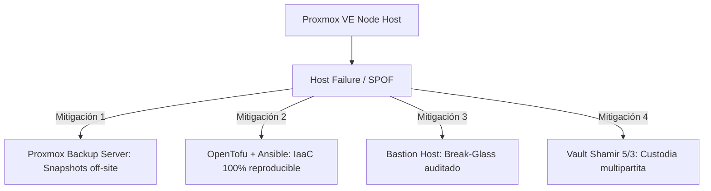

# Análisis de Dominios de Falla, Aislamiento y SPOF en Proxmox On-Premise

Este documento detalla formalmente el modelo de aislamiento, los dominios de falla compartidos y los puntos únicos de fallo (**Single Point of Failure - SPOF**) de la infraestructura on-premise desplegada sobre Proxmox VE para el proyecto Pokédex, en consonancia con el [ADR-025](../decisions/ADR-025-management-plane-runtime-plane-and-cloud-ready-separation.md).

---

## 1. Declaración Formal del Nivel de Aislamiento

> [!IMPORTANT]
> **Aislamiento Lógico vs. Físico**: Los entornos de **Pre-producción** (LXC 800) y **Producción** (VM 801 K3s) operan como entidades lógicamente aisladas dentro de una **misma plataforma física compartida** (servidor host Proxmox VE).
>
> Esto significa que no existen límites de tolerancia a fallos de hardware entre ambos entornos. Una indisponibilidad en el hardware del host Proxmox afectará simultáneamente a Pre-producción, Producción, Vault (LXC 110) y Bastion (LXC 802).

```text
                               Proxmox VE Host Físico (Single Hardware Node)
  ┌─────────────────────────────────────────────────────────────────────────────────────────┐
  │                                                                                         │
  │   Recursos Físicos Compartidos: CPU (Sockets/Cores) ── RAM ── NVMe/ZFS ── NIC (vmbr0)    │
  │                                                                                         │
  │   ┌──────────────────┐  ┌──────────────────┐  ┌──────────────────┐  ┌─────────────────┐ │
  │   │   Pre-prod LXC   │  │   K3s Prod VM    │  │    Vault LXC     │  │   Bastion LXC   │ │
  │   │     (CT 800)     │  │     (VM 801)     │  │     (CT 110)     │  │    (CT 802)     │ │
  │   │                  │  │                  │  │                  │  │                 │ │
  │   │  Linux Namespaces│  │  KVM Hypervisor  │  │  Raft Storage    │  │ Break-Glass     │ │
  │   │  cgroups v2      │  │  Dedicated Kernel│  │  Shamir 5/3      │  │ Audit Logs      │ │
  │   └──────────────────┘  └──────────────────┘  └──────────────────┘  └─────────────────┘ │
  └─────────────────────────────────────────────────────────────────────────────────────────┘
```

---

## 2. Matriz de Dominios de Falla Compartidos (Shared Failure Domains)

| Vector de Recurso | Nivel de Compartición | Mecanismo de Aislamiento Lógico | Límite del Aislamiento (Riesgo Residual) |
|---|---|---|---|
| **CPU** | Host Cores compartidos | KVM vCPUs con scheduling CFS, LXC cgroups limits | Throttling cruzado si un proceso de Pre-prod consume 100% de CPU del host. |
| **RAM** | Memoria física ECC compartida | VM con asignación estática fija; LXCs con límites de memoria | Si el host entra en saturación severa, el kernel OOM-killer puede matar procesos arbitrarios. |
| **Storage (Disco)** | Mismo ZFS Pool / Disco NVMe | Datasets ZFS separados, cuotas por contenedor/VM | Contención de I/O (IOPS saturation) o corrupción a nivel de bloque del hardware físico. |
| **Networking** | Misma tarjeta física (NIC) | Bridge Linux `vmbr0`, segmentación por IP/VLAN | Caída de enlace físico, saturación del ancho de banda o loop ARP en el bridge. |
| **Kernel / OS** | KVM usa kernel propio; LXCs comparten kernel Proxmox | Virtualización completa en VM Prod; Namespaces en Preprod/Vault | Un Kernel Panic en Proxmox reinicia inmediatamente todos los contenedores y VMs. |

---

## 3. Análisis de Escenarios de Falla Crítica

A continuación se define el comportamiento de la plataforma ante contingencias específicas y las mitigaciones implementadas:

### 3.1. Caída o Reinicio Imprevisto de Proxmox (Host Crash / Power Loss)
- **Impacto:** Caída total de Producción, Pre-producción, Vault y Bastion.
- **Comportamiento post-rearranque:**
  1. Proxmox inicia y arranca las VMs/LXCs configuradas con `onboot: 1`.
  2. K3s Runtime (VM 801) levanta y los pods quedan a la espera de sus secretos.
  3. HashiCorp Vault (LXC 110) arranca en estado **sellado (sealed / HTTP 503)** por diseño de seguridad.
  4. External Secrets Operator (ESO) queda bloqueado esperando la disponibilidad de Vault.
- **Acción Operativa:** Requiere procedimiento [Break-Glass](../runbooks/BREAK_GLASS_PROCEDURE.md) desde Bastion para inyectar 3 de las 5 llaves Shamir (`vault operator unseal`).

### 3.2. Falta de RAM y Activación del Linux OOM Killer
- **Impacto:** Terminación forzada de procesos por parte del kernel.
- **Mitigación Arquitectural:**
  - K3s Prod VM tiene asignación de memoria estática y no ballooning dinámico.
  - Vault LXC tiene `disable_mlock = false` y capacidad `CAP_IPC_LOCK` (`LimitMEMLOCK=infinity`), impidiendo que sus secretos sean swappeados al disco.
  - En Kubernetes, se definen `requests` y `limits` estrictos en los manifiestos de la aplicación y `ResourceQuota` en cada namespace.

### 3.3. Corrupción o Degradación de Storage
- **Impacto:** I/O errors en etcd/SQLite de K3s o en la base de datos de Pokédex.
- **Mitigación Arquitectural:**
  - Backups automáticos programados mediante **Proxmox Backup Server (PBS)** hacia storage secundario externo.
  - Snapshots transaccionales de Raft en Vault exportables vía script de resguardo.
  - RPO (Recovery Point Objective): 24 horas (nightly snapshot). RTO (Recovery Time Objective): < 20 minutos restaurando desde PBS.

### 3.4. Pérdida de Conectividad de Red (NIC / Switch Físico)
- **Impacto:** Aislamiento del nodo; pérdida de acceso a GitHub, clientes externos y telemetría.
- **Comportamiento:**
  - El tráfico local entre LXCs y la VM K3s a través de `vmbr0` permanece funcional si es enrutado localmente.
  - La sincronización de ArgoCD se detiene temporalmente sin afectar los pods en ejecución (principio de resiliencia desconectada).

### 3.5. Actualización de K3s / Mantenimiento Programado
- **Impacto:** Reinicio temporal del servicio `k3s.service` o reboot de la VM 801.
- **Comportamiento:**
  - K3s mononodo implica downtime del plano de control durante la actualización (< 60 segundos).
  - Los pods continúan ejecutándose en el runtime containerd existente.
  - Despliegues y reconciliaciones quedan en pausa hasta que kube-apiserver retome el control.

---

## 4. Justificación del Trade-off: ¿Por qué mantener un solo nodo físico?

1. **Eficiencia y Huella de Recursos (Lean Footprint):**
   - El cluster completo (K3s + Vault + Bastion + Pre-prod) consume menos de 6 GB de RAM y menos de 100 GB de disco. Duplicar hardware físico solo para separar ambientes pre-prod incurriría en gastos y mantenimiento injustificados para la fase actual.
2. **Separación de Responsabilidades:**
   - La separación de entornos se garantiza lógicamente:
     - En **Vault**: Rutas segregadas (`secret/data/pokedex/preprod/*` vs `secret/data/pokedex/prod/*`) y roles RBAC independientes (`pokedex-preprod-role` vs `pokedex-prod-role`).
     - En **Kubernetes**: Namespaces independientes (`pokedex-preprod` vs `pokedex`), `NetworkPolicies` y ServiceAccounts dedicados.
3. **Estrategia Cloud-Ready (AWS / EKS):**
   - La alta disponibilidad física multi-nodo y multi-zona (Multi-AZ) está diseñada en el plano de infraestructura Cloud ([ADR-025](../decisions/ADR-025-management-plane-runtime-plane-and-cloud-ready-separation.md)), listo para activarse cuando los requisitos de negocio lo exijan.

---

## 5. Resumen de Controles y Resiliencia


