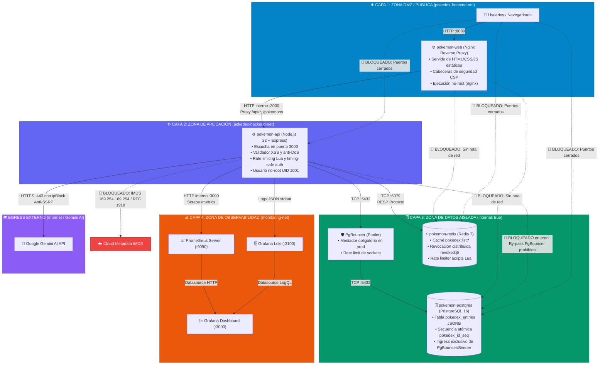
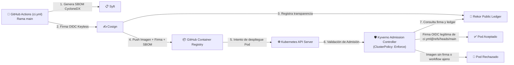

# 🛡️ Arquitectura de Seguridad, DMZ y Aislamiento de Red

Este documento describe el modelo de **Defensa en Profundidad (*Defense in Depth*)**, segmentación de red (*DMZ*), principio de mínimo privilegio (*Least Privilege*), políticas *fail-closed*, mitigación de SSRF a nivel de kernel de red y seguridad de la cadena de suministro aplicadas en **Kubernetes**, **Docker Compose** y en la integración con el stack de observabilidad **`docker_monitoreo`**.

---

## 📑 Tabla de Contenidos
1. [Principios Rectores de Seguridad](#1-principios-rectores-de-seguridad)
2. [Diagrama de Flujo: Topología de Red y Aislamiento de 4 Capas](#2-diagrama-de-flujo-topología-de-red-y-aislamiento-de-4-capas)
3. [Matriz de Control de Acceso, Redes y Puertos](#3-matriz-de-control-de-acceso-redes-y-puertos)
4. [Segmentación en Docker Compose](#4-segmentación-en-docker-compose)
5. [Aislamiento en Kubernetes (`NetworkPolicies`)](#5-aislamiento-en-kubernetes-networkpolicies)
   * [5.1. Denegación por Defecto (Default Deny)](#51-denegación-por-defecto-default-deny)
   * [5.2. Aislamiento Estricto de PostgreSQL Mediado por PgBouncer](#52-aislamiento-estricto-de-postgresql-mediado-por-pgbouncer)
   * [5.3. Egress Anti-SSRF y Protección de Metadatos Cloud (IMDS)](#53-egress-anti-ssrf-y-protección-de-metadatos-cloud-imds)
   * [5.4. Restricción de Tráfico DNS a CoreDNS](#54-restricción-de-tráfico-dns-a-coredns)
6. [Seguridad en la Cadena de Suministro y Control de Admisión (Kyverno + Cosign)](#6-seguridad-en-la-cadena-de-suministro-y-control-de-admisión-kyverno--cosign)
7. [Inmutabilidad de Artefactos OCI y Digest Pinning](#7-inmutabilidad-de-artefactos-oci-y-digest-pinning)
8. [Mecanismos Fail-Closed en la Aplicación](#8-mecanismos-fail-closed-en-la-aplicación)
9. [Manejo Seguro de Secretos y Credenciales](#9-manejo-seguro-de-secretos-y-credenciales)

---

## 1. Principios Rectores de Seguridad

1. **Superficie de Ataque Mínima:** Únicamente la capa de presentación Web (Nginx / Ingress Controller) y las consolas de observabilidad autorizadas exponen puertos hacia el exterior.
2. **Cero Exposición de Bases de Datos:** Ni PostgreSQL (`5432`) ni Redis (`6379`) exponen puertos públicos en producción. Operan en redes internas aisladas sin enrutamiento a Internet.
3. **Aislamiento Lateral (Zero-Trust):**
   * El frontend (`pokemon-web`) no tiene conectividad de red hacia PostgreSQL ni Redis.
   * El backend (`pokemon-api`, Express en puerto `:3000`) es el único intermediario validado.
   * En producción con PgBouncer activo, la API **no puede comunicarse directamente con PostgreSQL**: toda conexión pasa obligatoriamente por el pooler de conexiones.
   * El stack de observabilidad (`docker_monitoreo`) accede únicamente al endpoint `/metrics` de la API a través de la red `monitoring-net`, sin visibilidad de las bases de datos.
4. **Protección Egress Anti-SSRF:** La salida a Internet de los pods de aplicación está restringida a HTTPS (443) y filtra explícitamente mediante `ipBlock` los rangos de metadatos de Cloud (IMDS `169.254.169.254/32`), redes privadas RFC 1918 y loopback.
5. **Ejecución No-Root:** Todos los contenedores corren bajo usuarios sin privilegios (`appuser:1001` en el backend y `nginx` en el frontend).
6. **Arquitectura Fail-Closed:** Ante fallos de componentes auxiliares de seguridad (Redis o PostgreSQL), las operaciones sensibles se bloquean preventivamente en lugar de continuar en estado vulnerable.

---

## 2. Diagrama de Flujo: Topología de Red y Aislamiento de 4 Capas



---

## 3. Matriz de Control de Acceso, Redes y Puertos

| Componente | Repositorio | Redes Asignadas | Puerto Interno | Puerto Host | Accesible Desde | Bloqueado Para |
| :--- | :--- | :--- | :---: | :---: | :--- | :--- |
| **Frontend (`pokemon-web`)** | `pokedex` | `pokedex-frontend-net` | `80` (HTTP) | `8080` | Internet / Clientes | `pokedex-backend-net`, `monitoring-net` |
| **Backend API (`pokemon-api`)**| `pokedex` | `pokedex-frontend-net`<br>`pokedex-backend-net`<br>`monitoring-net` | `3000` | `3000` *(dev)* | `pokemon-web`<br>`prometheus` (`/metrics`) | Acceso directo sin proxy en producción |
| **PgBouncer (`pgbouncer`)** | `pokedex` | `pokedex-backend-net` | `5432` | — | `pokemon-api` | `pokemon-web`, Internet, `docker_monitoreo` |
| **PostgreSQL 16** | `pokedex` | `pokedex-backend-net` | `5432` | `5432` *(dev)* | `pgbouncer`, `db-seeder` | `pokemon-web`, `pokemon-api` *(en prod)*, Internet |
| **Redis 7** | `pokedex` | `pokedex-backend-net` | `6379` | `6379` *(dev)* | `pokemon-api` | `pokemon-web`, Internet, `docker_monitoreo` |
| **Prometheus** | `docker_monitoreo` | `monitoring-local-net`<br>`monitoring-net` | `9090` | `9090` | Host, `grafana` | `pokedex-backend-net`, `pokedex-frontend-net` |
| **Grafana** | `docker_monitoreo` | `monitoring-local-net` | `3000` | `3000` | Host / Usuarios | `pokedex-backend-net`, `pokedex-frontend-net`, `pokemon-api` |

---

## 4. Segmentación en Docker Compose

En [`docker-compose.yml`](file:///docker-compose.yml) se definen tres redes aisladas:

```yaml
networks:
  frontend-net:
    name: pokedex-frontend-net
    driver: bridge
    internal: false  # Permite al proxy web publicar el puerto 8080 hacia el host

  backend-net:
    name: pokedex-backend-net
    driver: bridge
    internal: true   # Aislamiento total: sin enrutamiento ni acceso a internet

  monitoring-net:
    name: monitoring-net
    driver: bridge   # Red compartida exclusiva para métricas de observabilidad
```

---

## 5. Aislamiento en Kubernetes (`NetworkPolicies`)

Implementado en [`infra/helm/pokedex/templates/network-policies.yaml`](file:///infra/helm/pokedex/templates/network-policies.yaml):

### 5.1. Denegación por Defecto (Default Deny)
La política `default-deny-all-ingress` bloquea por defecto cualquier tráfico no explícitamente autorizado en el namespace de la aplicación.

### 5.2. Aislamiento Estricto de PostgreSQL Mediado por PgBouncer
Cuando `pgbouncer.enabled: true` está activo (por defecto en producción):
1. **API Egress:** La API pierde la regla de salida hacia `component: database` y **solo** se le concede salida a `component: pgbouncer` en el puerto 5432.
2. **PostgreSQL Ingress:** La política de entrada de la base de datos restringe el origen exclusivamente a los pods etiquetados con:
   * `app.kubernetes.io/component: pgbouncer`
   * `app.kubernetes.io/component: db-seeder` (Jobs de inicialización/migración)
   Cualquier paquete TCP directo desde un pod de la API hacia PostgreSQL es descartado por el CNI.

### 5.3. Egress Anti-SSRF y Protección de Metadatos Cloud (IMDS)
Para prevenir ataques de Server-Side Request Forgery (SSRF) dirigidos a endpoints de metadatos o reconocimiento de subredes internas del clúster, la regla de egress HTTPS en el puerto 443 implementa filtrado CIDR estricto:

```yaml
- ports:
    - protocol: TCP
      port: 443
  to:
    - ipBlock:
        cidr: 0.0.0.0/0
        except:
          - 169.254.169.254/32  # AWS/GCP/Azure Cloud Metadata IMDS
          - 10.0.0.0/8          # RFC 1918 Private Class A
          - 172.16.0.0/12       # RFC 1918 Private Class B
          - 192.168.0.0/16      # RFC 1918 Private Class C
          - 127.0.0.0/8         # Loopback
```

### 5.4. Restricción de Tráfico DNS a CoreDNS
La resolución de nombres de dominio (puerto 53 TCP/UDP) no queda abierta a cualquier IP externa; está restringida exclusivamente a los pods del clúster etiquetados con `k8s-app: kube-dns`.

---

## 6. Seguridad en la Cadena de Suministro y Control de Admisión (Kyverno + Cosign)



* **Política Kyverno:** Definida en [`infra/k8s/kyverno-cosign-policy.yaml`](file:///infra/k8s/kyverno-cosign-policy.yaml).
* **Modo `Enforce`:** Bloquea en tiempo de admisión cualquier intento de ejecutar una imagen que no haya sido firmada por el workflow oficial de GitHub Actions:
  * Emisor OIDC: `https://token.actions.githubusercontent.com`
  * Sujeto: `https://github.com/rocapellino/pokedex/.github/workflows/ci.yml@refs/heads/main`
  * Ledger Rekor: `https://rekor.sigstore.dev`

---

## 7. Inmutabilidad de Artefactos OCI y Digest Pinning

Para evitar descargas no deterministas, colisiones de tags y ataques de sustitución de imágenes:
1. **Eliminación del tag `latest`:** Los valores por defecto de Helm fijan tags semánticos explícitos (`1.9.5`).
2. **Soporte de Digest Criptográfico:** Los despliegues de Helm permiten parametrizar `digest: "sha256:..."` garantizando que Kubernetes verifique el hash inmutable antes de la ejecución.
3. **Imágenes de Infraestructura Fijadas por Digest:**
   * PgBouncer está anclado a `1.22.0@sha256:aa8a38b7b33e5fe70c679053f97a8e55c74d52b00c195f0880845e52b50ce516`.
   * Frontend Nginx está anclado a `1.27-alpine@sha256:65645c7bb6a0661892a8b03b89d0743208a18dd2f3f17a54ef4b76fb8e2f2a10`.

---

## 8. Mecanismos Fail-Closed en la Aplicación

El backend `server.ts` implementa principios de seguridad estricta para evitar estados intermedios vulnerables:

1. **Logout Fail-Closed:**
   * Al revocar una sesión, primero se comprueba la firma criptográfica HMAC con `ADMIN_SESSION_SECRET`.
   * Si la firma es inválida, se responde **`400 Bad Request`** impidiendo la inyección de identificadores arbitrarios.
   * Si Redis está caído y no se puede registrar la revocación distribuida, se responde inmediatamente con **`503 Service Unavailable`** impidiendo aceptar una sesión como "cerrada" cuando otros nodos del clúster aún la considerarían válida.
2. **Mutaciones Protegidas (`requireWritableStorage`):**
   * Si la base de datos PostgreSQL se encuentra en fallo, se bloquean preventivamente todas las solicitudes `POST /pokemons`, `PUT` y `DELETE` con **`503 Service Unavailable`**, evitando escrituras en memoria desincronizadas.
3. **Cuota Diaria de IA Fail-Closed:**
   * La cuota de 200 peticiones/día por IP para llamadas a Gemini se gestiona en Redis. Si Redis no está disponible, el middleware deniega el acceso con **`503 Service Unavailable`** para evitar el agotamiento de presupuesto o saturación de la API de IA.
4. **Validación Timing-Safe:**
   * Comparaciones criptográficas seguras contra ataques de canal lateral basados en tiempo (`crypto.timingSafeEqual`).
5. **Sanitización contra Inyección XSS:**
   * Todo campo de entrada se analiza contra patrones de scripts HTML o esquemas `javascript:`, retornando **`422 Unprocessable Entity`**.

---

## 9. Manejo Seguro de Secretos y Credenciales

* **Cero Secretos en Claro en Git:** Ningún archivo de configuración contiene contraseñas reales. Se provee exclusivamente [`.env.example`](file:///.env.example).
* **Detección Preventiva con Gitleaks:** Hook local de pre-commit y pipeline [`.github/workflows/security-gitleaks.yml`](file:///.github/workflows/security-gitleaks.yml) con reglas estrictas ([`.gitleaks.toml`](file:///.gitleaks.toml)).
* **Desacoplamiento en Producción (`existingSecret` / External Secrets Operator):**
  * En entornos cloud o GitOps de producción, el Chart de Helm no renderiza objetos `Secret` con valores predeterminados.
  * Se enlaza a un Secret existente (`secrets.existingSecret: "pokedex-prod-secrets"`) o se sincroniza dinámicamente mediante el **External Secrets Operator** desde Vault, AWS Secrets Manager o GCP Secret Manager.
* **Cifrado Asimétrico con Bitnami Sealed Secrets:** Para clústeres on-premise (Proxmox VE), las credenciales se cifran asimétricamente con `kubeseal` permitiendo versionar el manifiesto seguro en Git.
