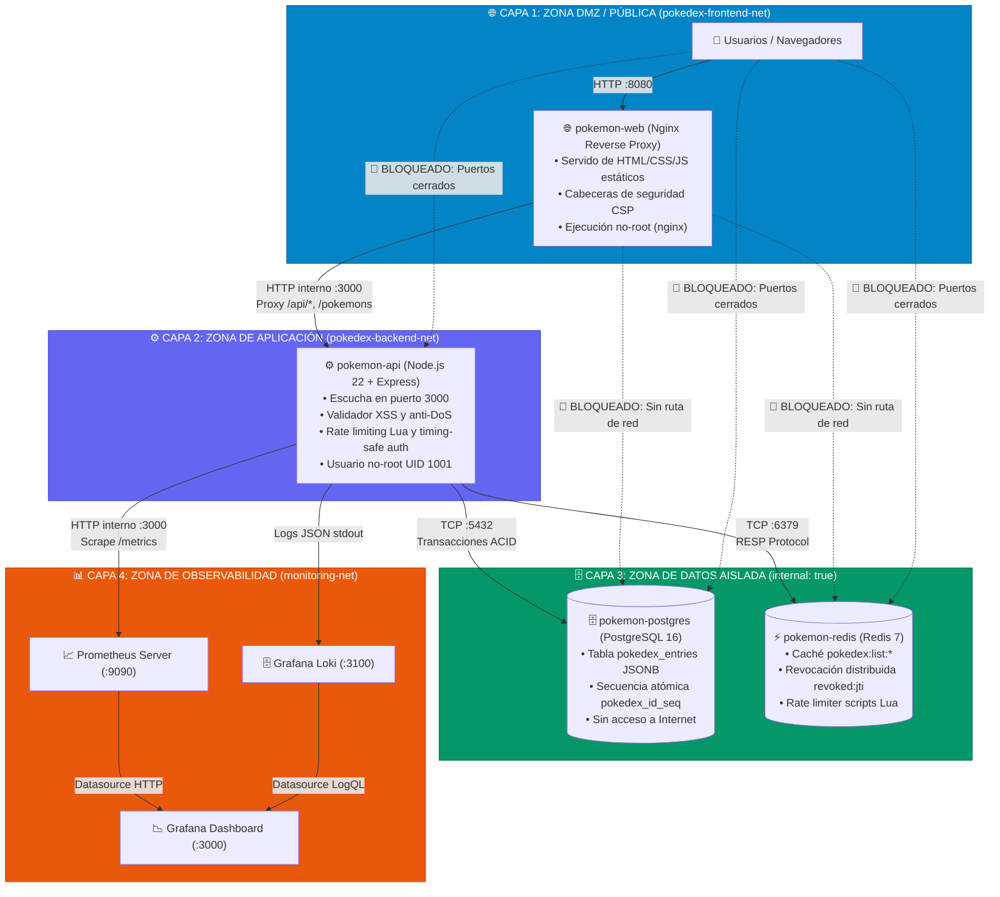
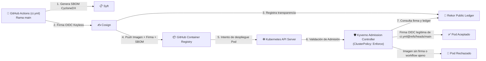

# 🛡️ Arquitectura de Seguridad, DMZ y Aislamiento de Red

Este documento describe el modelo de **Defensa en Profundidad (*Defense in Depth*)**, segmentación de red (*DMZ*), principio de mínimo privilegio (*Least Privilege*), políticas *fail-closed* y seguridad de la cadena de suministro aplicadas en **Kubernetes**, **Docker Compose** y en la integración con el stack de observabilidad **`docker_monitoreo`**.

---

## 📑 Tabla de Contenidos
1. [Principios Rectores de Seguridad](#1-principios-rectores-de-seguridad)
2. [Diagrama de Flujo: Topología de Red y Aislamiento de 4 Capas](#2-diagrama-de-flujo-topología-de-red-y-aislamiento-de-4-capas)
3. [Matriz de Control de Acceso, Redes y Puertos](#3-matriz-de-control-de-acceso-redes-y-puertos)
4. [Segmentación en Docker Compose](#4-segmentación-en-docker-compose)
5. [Aislamiento en Kubernetes (`NetworkPolicies`)](#5-aislamiento-en-kubernetes-networkpolicies)
6. [Seguridad en la Cadena de Suministro y Control de Admisión (Kyverno + Cosign)](#6-seguridad-en-la-cadena-de-suministro-y-control-de-admisión-kyverno--cosign)
7. [Mecanismos Fail-Closed en la Aplicación](#7-mecanismos-fail-closed-en-la-aplicación)
8. [Manejo Seguro de Secretos y Credenciales](#8-manejo-seguro-de-secretos-y-credenciales)

---

## 1. Principios Rectores de Seguridad

1. **Superficie de Ataque Mínima:** Únicamente la capa de presentación Web (Nginx / Ingress Controller) y las consolas de observabilidad autorizadas exponen puertos hacia el exterior.
2. **Cero Exposición de Bases de Datos:** Ni PostgreSQL (`5432`) ni Redis (`6379`) exponen puertos públicos en producción. Operan en redes internas aisladas sin enrutamiento a Internet.
3. **Aislamiento Lateral (Zero-Trust):**
   * El frontend (`pokemon-web`) no tiene conectividad de red hacia PostgreSQL ni Redis.
   * El backend (`pokemon-api`, Express en puerto `:3000`) es el único intermediario validado.
   * El stack de observabilidad (`docker_monitoreo`) accede únicamente al endpoint `/metrics` de la API a través de la red `monitoring-net`, sin visibilidad de las bases de datos.
4. **Ejecución No-Root:** Todos los contenedores corren bajo usuarios sin privilegios (`appuser:1001` en el backend y `nginx` en el frontend).
5. **Arquitectura Fail-Closed:** Ante fallos de componentes auxiliares de seguridad (Redis o PostgreSQL), las operaciones sensibles se bloquean preventivamente en lugar de continuar en estado vulnerable.

---

## 2. Diagrama de Flujo: Topología de Red y Aislamiento de 4 Capas



---

## 3. Matriz de Control de Acceso, Redes y Puertos

| Componente | Repositorio | Redes Asignadas | Puerto Interno | Puerto Host | Accesible Desde | Bloqueado Para |
| :--- | :--- | :--- | :---: | :---: | :--- | :--- |
| **Frontend (`pokemon-web`)** | `pokedex` | `pokedex-frontend-net` | `80` (HTTP) | `8080` | Internet / Clientes | `pokedex-backend-net`, `monitoring-net` |
| **Backend API (`pokemon-api`)**| `pokedex` | `pokedex-frontend-net`<br>`pokedex-backend-net`<br>`monitoring-net` | `3000` | `3000` *(dev)* | `pokemon-web`<br>`prometheus` (`/metrics`) | Acceso directo sin proxy en producción |
| **PostgreSQL 16** | `pokedex` | `pokedex-backend-net` | `5432` | `5432` *(dev)* | `pokemon-api` | `pokemon-web`, Internet, `docker_monitoreo` |
| **Redis 7** | `pokedex` | `pokedex-backend-net` | `6379` | `6379` *(dev)* | `pokemon-api` | `pokemon-web`, Internet, `docker_monitoreo` |
| **Prometheus** | `docker_monitoreo` | `monitoring-local-net`<br>`monitoring-net` | `9090` | `9090` | Host, `grafana` | `pokedex-backend-net`, `pokedex-frontend-net` |
| **Grafana** | `docker_monitoreo` | `monitoring-local-net` | `3000` | `3000` | Host / Usuarios | `pokedex-backend-net`, `pokedex-frontend-net`, `pokemon-api` |

---

## 4. Segmentación en Docker Compose

En [`docker-compose.yml`](file:///docker-compose.yml) se definen tres redes aisladas:

```yaml
networks:
  frontend-net:
    name: pokedex-frontend-net
    driver: bridge
    internal: false  # Permite al proxy web publicar el puerto 8080 hacia el host

  backend-net:
    name: pokedex-backend-net
    driver: bridge
    internal: true   # Aislamiento total: sin enrutamiento ni acceso a internet

  monitoring-net:
    name: monitoring-net
    driver: bridge   # Red compartida exclusiva para métricas de observabilidad
```

---

## 5. Aislamiento en Kubernetes (`NetworkPolicies`)

Implementado en [`infra/helm/pokedex/templates/network-policies.yaml`](file:///infra/helm/pokedex/templates/network-policies.yaml):

1. **`default-deny-all-ingress`:** Política base Zero-Trust que deniega por defecto todo el tráfico de entrada en el namespace `pokemon-app`.
2. **`allow-ingress-to-frontend`:** Permite tráfico desde el Ingress Controller hacia el Service del Frontend (puerto `80`).
3. **`allow-frontend-to-backend`:** Permite tráfico proveniente exclusivamente de Pods con etiqueta `app.kubernetes.io/component: web` hacia el backend en el puerto `3000`.
4. **`allow-backend-to-databases`:** Permite tráfico proveniente exclusivamente del backend hacia PostgreSQL (`5432`) y Redis (`6379`).
5. **`allow-monitoring-to-backend`:** Permite al namespace o Pods de monitoreo acceder exclusivamente al puerto `3000` de la API para recolectar `/metrics`.

---

## 6. Seguridad en la Cadena de Suministro y Control de Admisión (Kyverno + Cosign)



* **Política Kyverno:** Definida en [`infra/k8s/kyverno-cosign-policy.yaml`](file:///infra/k8s/kyverno-cosign-policy.yaml).
* **Modo `Enforce`:** Bloquea en tiempo de admisión cualquier intento de ejecutar una imagen que no haya sido firmada por el workflow oficial de GitHub Actions:
  * Emisor OIDC: `https://token.actions.githubusercontent.com`
  * Sujeto: `https://github.com/rocapellino/pokedex/.github/workflows/ci.yml@refs/heads/main`
  * Ledger Rekor: `https://rekor.sigstore.dev`

---

## 7. Mecanismos Fail-Closed en la Aplicación

El backend `server.ts` implementa principios de seguridad estricta para evitar estados intermedios vulnerables:

1. **Logout Fail-Closed:**
   * Al revocar una sesión, primero se comprueba la firma criptográfica HMAC con `ADMIN_SESSION_SECRET`.
   * Si la firma es inválida, se responde **`400 Bad Request`** impidiendo la inyección de identificadores arbitrarios.
   * Si Redis está caído y no se puede registrar la revocación distribuida, se responde inmediatamente con **`503 Service Unavailable`** impidiendo aceptar una sesión como "cerrada" cuando otros nodos del clúster aún la considerarían válida.
2. **Mutaciones Protegidas (`requireWritableStorage`):**
   * Si la base de datos PostgreSQL se encuentra en fallo, se bloquean preventivamente todas las solicitudes `POST /pokemons`, `PUT` y `DELETE` con **`503 Service Unavailable`**, evitando escrituras en memoria desincronizadas.
3. **Cuota Diaria de IA Fail-Closed:**
   * La cuota de 200 peticiones/día por IP para llamadas a Gemini se gestiona en Redis. Si Redis no está disponible, el middleware deniega el acceso con **`503 Service Unavailable`** para evitar el agotamiento de presupuesto o saturación de la API de IA.
4. **Validación Timing-Safe:**
   * Comparaciones criptográficas seguras contra ataques de canal lateral basados en tiempo (`crypto.timingSafeEqual`).
5. **Sanitización contra Inyección XSS:**
   * Todo campo de entrada se analiza contra patrones de scripts HTML o esquemas `javascript:`, retornando **`422 Unprocessable Entity`**.

---

## 8. Manejo Seguro de Secretos y Credenciales

* **Cero Secretos en Claro en Git:** Ningún archivo de configuración contiene contraseñas reales. Se provee exclusivamente [`.env.example`](file:///.env.example).
* **Detección Preventiva con Gitleaks:** Hook local de pre-commit y pipeline [`.github/workflows/security-gitleaks.yml`](file:///.github/workflows/security-gitleaks.yml) con reglas estrictas ([`.gitleaks.toml`](file:///.gitleaks.toml)).
* **Cifrado Asimétrico con Bitnami Sealed Secrets:** En Kubernetes, las credenciales sensibles (`pokedex-secrets`) se cifran con la clave pública del clúster (`kubeseal`) generando manifiestos `SealedSecret` seguros para ser versionados en el repositorio GitOps.
