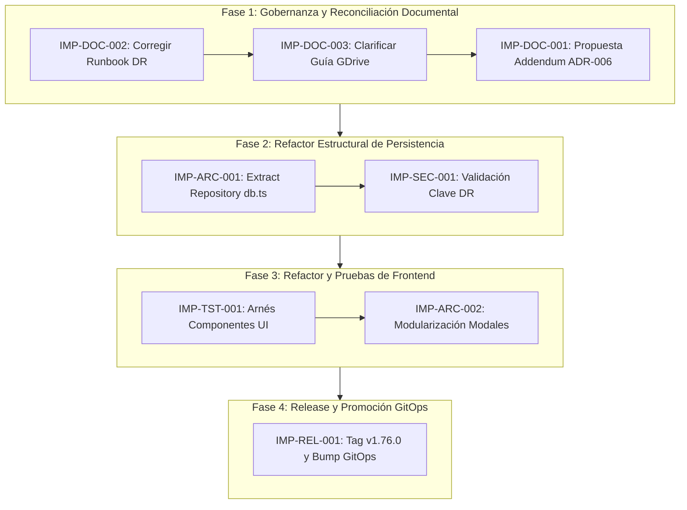

# Plan Integral de Mejoras Técnicas del Repositorio Pokédex

- **Fecha:** 2026-09-24
- **Estado Evaluado:** HEAD de `main` (Commit `bcc753e3e68154a91ca8567d4f7f5051e611f5cb`)
- **Tipo de Documento:** Plan de Implementación Consolidado (*Improvement Plan*)
- **Quality Gate:** Markdown Quality Gate verificado (0 errores `MDxxx`)

---

## Executive Summary

Se ha completado la revalidación técnica exhaustiva del repositorio `rocapellino/pokedex` sobre el estado actual de la rama `main` (commit `bcc753e`), contrastando los hallazgos de las auditorías estructurales, de consistencia de release y de documentación emitidas en la fecha.

### Conclusiones Principales de la Revalidación

1. **Estado Saludable del Composition Root:** `apps/backend/server.ts` se mantiene estable en **255 líneas** (por debajo del límite contractual de 300 LOC) con 0 dependencias circulares en todo el grafo TypeScript.
2. **Confirmación de Hallazgos Vigentes:**
   - **`DOC-001` (P1):** Discrepancia formal entre `ADR-006` (estrategia off-site limitada a S3 y PBS agnósticos inactivos) y la implementación K8s-native funcional de Google Drive con Rclone. Estado: **`ADR REVIEW REQUIRED`** (sin mutación automática de decisiones).
   - **`DOC-002` (P2):** Tergiversación de estado en `docs/runbooks/DISASTER_RECOVERY_PLAN.md`, donde se describe a Google Drive en Proxmox como "ACTIVO (Renderizado)" cuando el `targetRevision` de ArgoCD (`v1.75.10`) no contiene aún dicho manifiesto.
   - **`ASA-001` (P2):** Concentración de responsabilidades en `apps/backend/src/services/db.ts` (531 LOC, $C_a = 12$, pool PG, cliente Redis, fallback memoria, migraciones Drizzle y repositorio Pokémon).
   - **`ASA-002` (P3):** Concentración de vistas y modales en `apps/frontend/src/pokedex.ts` (683 LOC) y `apps/frontend/src/backoffice.ts` (560 LOC).
3. **Depuración de Hallazgos Obsoletos:** Se confirma la resolución definitiva del comentario contradictorio en `gitops/environments/proxmox/values.yaml` (actualizado a activos/inactivos segregados), el fijado criptográfico inmutable de Rclone por digest SHA-256 (`rclone/rclone@sha256:74c51b88...`) y la política eBPF L7 FQDN con Cilium.
4. **Incorporación de Nuevos Hallazgos:**
   - **`REL-001` (P2):** 16 commits acumulados en `main` posteriores al tag `v1.75.10`; necesidad de formalizar el checklist de *Promotion Readiness* para el futuro corte `v1.76.0`.
   - **`DOC-003` (P3):** Aclaración requerida en `docs/operations/GDRIVE_BACKUP_GUIDE.md` respecto a la dependencia de promoción GitOps para la existencia del CronJob.
   - **`TEST-001` (P3):** Arnés de pruebas unitarias/componentes UI previo a la modularización de modales en frontend.

---

## Current Repository State

- **Rama Activa:** `main` (limpia, sincronizada con `origin/main`).
- **HEAD Commit:** `bcc753e3e68154a91ca8567d4f7f5051e611f5cb` (`feat(skills): implement structural, deployment and documentation consistency audit framework (#256)`).
- **Último Tag Oficial de Release:** `v1.75.10` (Commit base: `82c1e83491aabc50f4b4fb49434828d1248d275a`).
- **Diferencial `main` vs. Último Release:** **16 commits** en la rama principal por delante de `v1.75.10`.
- **GitOps Declarado en ArgoCD:**
  - `gitops/apps/app-proxmox.yaml`: `targetRevision: v1.75.10`.
  - `gitops/apps/app-proxmox-preprod.yaml`: `targetRevision: v1.75.10`.
  - `gitops/apps/app-cloud.yaml`: `targetRevision: v1.75.10`.
  - `gitops/apps/root-application.yaml`: `targetRevision: v1.75.10`.
- **Estado de Manifiestos Relevantes:**
  - `infra/helm/pokedex/templates/backup-gdrive-cronjob.yaml`: Presente en `main` con Rclone pinneado por SHA-256 inmutable y fail-closed por token ausente.
  - `infra/helm/pokedex/templates/cilium-network-policies.yaml`: Presente en `main` con reglas L7 FQDN restrictivas.
  - `gitops/environments/proxmox/values.yaml`: `backup.gdrive.enabled: true` y clave Vault `pokedex/prod`.
- **Estado de las Skills (`.agents/skills/`):** 20 directorios de skills operativas, incluyendo `architecture-structure-audit`, `repo-docs` con detección de Documentation Drift, `repo-release` con Capability Matrix y `_shared/` con el modelo canónico de 4 niveles.
- **Estado de las Pruebas Automatizadas:** 216/216 passing (`npm test`), 0 dependencias circulares (validado vía Madge).

---

## Confirmed Findings

### 1. [DOC-001] Contradicción Arquitectónica entre ADR-006 y la Estrategia Off-Site Activa

- **Área:** Documentación / Arquitectura
- **Estado:** CONFIRMADO VIGENTE (`ADR REVIEW REQUIRED`)
- **Severidad:** Moderada (Gobernanza)

### 2. [DOC-002] Tergiversación de Estado de Google Drive en DISASTER_RECOVERY_PLAN.md

- **Área:** Documentación / Operaciones
- **Estado:** CONFIRMADO VIGENTE
- **Severidad:** Moderada (Operativa)

### 3. [ASA-001] Concentración de Responsabilidades de Conexión, Resiliencia y Repositorio en `db.ts`

- **Área:** Arquitectura / Backend
- **Estado:** CONFIRMADO VIGENTE (531 LOC, $C_a = 12$)
- **Severidad:** Media (Deuda Técnica Estructural)

### 4. [ASA-002] Concentración de Vistas y Componentes en Módulos de Frontend

- **Área:** Arquitectura / Frontend
- **Estado:** CONFIRMADO VIGENTE (`pokedex.ts` 683 LOC, `backoffice.ts` 560 LOC)
- **Severidad:** Baja (Mantenibilidad de UI)

---

## Obsolete Findings

Los siguientes elementos señalados en análisis previos han sido completamente resueltos en el HEAD actual:

| ID Original | Descripción | Estado Actual en HEAD | Evidencia de Resolución |
| :--- | :--- | :---: | :--- |
| **OBS-001** | Comentario contradictorio en `gitops/environments/proxmox/values.yaml` indicando DR inactivo. | **RESUELTO** | Comentario actualizado en líneas 151-155: explicita backup local activo, gdrive off-site activo condicionado a credenciales y S3 inactivo. |
| **OBS-002** | Imagen de Rclone mutable (`rclone/rclone:1.68.2`). | **RESUELTO** | Pinning inmutable por digest SHA-256 (`rclone/rclone@sha256:74c51b88...`) en Docker Compose y Helm. |
| **OBS-003** | NetworkPolicy egress excesivamente permisiva (TCP 443 genérico). | **RESUELTO** | CiliumNetworkPolicy L7 FQDN dedicada (`*.googleapis.com`, `accounts.google.com`) con fallback Anti-SSRF. |
| **OBS-004** | Flag `--published-digest` desacoplado del release gate. | **RESUELTO** | Formalizado en `docs/architecture/GITOPS_PROMOTION_WORKFLOW.md` distinguiendo paridad interna de promoción GitOps. |
| **OBS-005** | Formato de violaciones Markdown y falta de gate centralizado. | **RESUELTO** | Implementado `scripts/lint-markdown.ts`, regla en `AGENTS.md` y script `npm run lint:md` (0 errores). |

---

## New Findings

### 1. [REL-001] Desfasaje Acumulado y Preparación de Checklist de Promoción a Release `v1.76.0`

- **Área:** Release / GitOps
- **Estado:** NUEVO HALLAZGO
- **Severidad:** Media (Ciclo de Vida)
- **Detalle:** `main` aventaja al tag de producción por 16 commits conteniendo hitos de resiliencia no disponibles en el clúster activo.

### 2. [DOC-003] Ausencia de Aclaración de Ciclo de Vida en Guía de Google Drive

- **Área:** Documentación / Operaciones
- **Estado:** NUEVO HALLAZGO
- **Severidad:** Baja (Claridad)
- **Detalle:** `docs/operations/GDRIVE_BACKUP_GUIDE.md` omite señalar que `kubectl get cronjob` requiere el despliegue previo del chart promocionado vía GitOps.

### 3. [TEST-001] Ausencia de Pruebas Unitarias Aisladas para Componentes Modales de Frontend

- **Área:** Testing / Frontend
- **Estado:** NUEVO HALLAZGO
- **Severidad:** Baja (Seguridad de Refactor)
- **Detalle:** La cobertura de frontend recae primordialmente en tests E2E Playwright de alto nivel, careciendo de pruebas rápidas de renderizado y foco accesible para los modales a extraer.

---

## Documentation Improvements

### Mejora DOC-001: Enmienda Arquitectónica Formal a ADR-006 (Emitido como ADR-028)

- **ID:** `IMP-DOC-001`
- **Finding:** `DOC-001`
- **Estado:** IMPLEMENTADO (Emitido como [ADR-028](../../decisions/ADR-028-gdrive-offsite-backup-strategy.md))
- **Prioridad:** **P1**
- **Motivo:** ADR-006 no reflejaba la adopción real de Google Drive como almacenamiento fuera del sitio, desvirtuando el rol de los ADRs como SSOT.
- **Archivos afectados:** `docs/decisions/ADR-028-gdrive-offsite-backup-strategy.md`, `docs/decisions/ADR-006-disaster-recovery-strategy.md`, `docs/README.md`.
- **Dependencias:** Aprobación explícita del usuario/arquitecto (Ejecutada).
- **Cambio propuesto:**
  - Emitir `ADR-028: Estrategia de Respaldo Off-Site en la Nube con Google Drive y Rclone`.
  - Justificar el uso del free-tier de 15 GB con cifrado de conocimiento cero (Zero-Knowledge AES-256) frente al costo de egress de proveedores comerciales.
  - Mantener los esqueletos agnósticos de S3 y PBS como planes de contingencia documentados en `OFFSITE_BACKUP_BLUEPRINTS.md`.
  - Agregar enlace cruzado formal en la sección 5 de `ADR-006`.
- **Riesgo:** Muy Bajo (documental).
- **Validación:** `npm run lint:md -- docs/decisions/ADR-028-gdrive-offsite-backup-strategy.md docs/decisions/ADR-006-disaster-recovery-strategy.md`.
- **Rollback:** `git checkout -- docs/decisions/ADR-028-gdrive-offsite-backup-strategy.md docs/decisions/ADR-006-disaster-recovery-strategy.md`.

---

### Mejora DOC-002: Reconciliación de Estado Operacional en Runbook de DR

- **ID:** `IMP-DOC-002`
- **Finding:** `DOC-002`
- **Estado:** IMPLEMENTADO
- **Prioridad:** **P2**
- **Motivo:** Prevenir que un operador de guardia asuma que el CronJob está ejecutándose en Proxmox antes de que GitOps promueva la versión.
- **Archivos afectados:** `docs/runbooks/DISASTER_RECOVERY_PLAN.md`.
- **Dependencias:** Ninguna.
- **Cambio propuesto:**
  - En la tabla de la Sección 2.2, fila *"Off-Site Google Drive (Proxmox)"*, sustituir `ACTIVO (Renderizado K8s-Native)` por **`IMPLEMENTADO EN MAIN / PENDIENTE DE PROMOCIÓN GITOPS (v1.76.0)`**.
  - Añadir nota al pie indicando que se activará en el runtime de Proxmox en cuanto se incremente `targetRevision` en `app-proxmox.yaml`.
- **Riesgo:** Mínimo.
- **Validación:** `npm run lint:md -- docs/runbooks/DISASTER_RECOVERY_PLAN.md`.
- **Rollback:** `git checkout -- docs/runbooks/DISASTER_RECOVERY_PLAN.md`.

---

### Mejora DOC-003: Clarificación de Requisito de Promoción en GDRIVE_BACKUP_GUIDE.md

- **ID:** `IMP-DOC-003`
- **Finding:** `DOC-003`
- **Estado:** IMPLEMENTADO
- **Prioridad:** **P3**
- **Motivo:** Evitar fallos de comando `kubectl get cronjob` a operadores que ejecuten la guía sobre un clúster sincronizado con un tag anterior.
- **Archivos afectados:** `docs/operations/GDRIVE_BACKUP_GUIDE.md`.
- **Dependencias:** `IMP-DOC-002`.
- **Cambio propuesto:** Insertar un callout en la Sección 4.3 recordando que en topologías GitOps, el CronJob solo es renderizado si el clúster reconcilia una versión igual o superior a `v1.76.0`.
- **Riesgo:** Nulo.
- **Validación:** `npm run lint:md -- docs/operations/GDRIVE_BACKUP_GUIDE.md`.
- **Rollback:** `git checkout -- docs/operations/GDRIVE_BACKUP_GUIDE.md`.

---

## Architecture Improvements

### Mejora ASA-001: Desacoplamiento Modular de Persistencia (Extract Repository de `db.ts`)

- **ID:** `IMP-ARC-001`
- **Finding:** `ASA-001`
- **Estado:** IMPLEMENTADO
- **Prioridad:** **P2**
- **Motivo:** `apps/backend/src/services/db.ts` (607 LOC originales, $C_a = 12$) agrupaba 6 responsabilidades disímiles. Es el archivo candidato principal a degradarse en God Module ante cualquier nueva entidad de dominio.
- **Archivos afectados:**
  - `apps/backend/src/services/db.ts` (Reducción a fachada de compatibilidad retrocompatible de 125 LOC, < 180 LOC).
  - `apps/backend/src/services/pokemon.repository.ts` (Nuevo módulo de 211 LOC para consultas Drizzle, seed y fallback de memoria).
  - `apps/backend/src/services/cache.ts` (Nuevo módulo de 172 LOC para el cliente Redis y versionado atómico de claves).
  - `apps/backend/src/services/postgres.ts` (Nuevo módulo de 134 LOC para pool PostgreSQL, Drizzle client y migraciones).
- **Dependencias:** Conservar estrictamente todos los identificadores exportados en `db.ts` (en particular `invalidateCache`, `getStorageHealth`, `savePokemon`, `getAllPokemons`, `getNextPokemonId`, `initStorage`) para garantizar paridad con `tests/security/deploy_scripts_security.test.ts`, tests unitarios y controladores HTTP.
- **Cambio propuesto:**
  1. Crear `src/services/pokemon.repository.ts` conteniendo la lógica de acceso a datos de Pokémon y el fallback in-memory sincronizado.
  2. Crear `src/services/cache.ts` aislando el cliente `ioredis` y la lógica de rate-limit distribuido.
  3. Crear `src/services/postgres.ts` aislando la inicialización y ciclo de vida de la base de datos relacional.
  4. Dejar `db.ts` como fachada pura (*Facade Pattern*) que re-exporta limpiamente las interfaces para no romper ninguna llamada existente.
- **Riesgo:** Medio. Requiere asegurar que el estado in-memory del fallback se mantenga consistente durante las pruebas.
- **Validación:**
  - `npx madge --circular`: Cero dependencias circulares detectadas.
  - `npm test`: 217/217 pruebas pasando (100%).
  - LOC de `db.ts`: 125 líneas.
- **Rollback:** `git checkout -- apps/backend/src/services/`.

---

### Mejora ASA-002: Modularización de Modales en Frontend SPA

- **ID:** `IMP-ARC-002`
- **Finding:** `ASA-002`
- **Estado:** IMPLEMENTADO
- **Prioridad:** **P3**
- **Motivo:** `apps/frontend/src/pokedex.ts` (763 LOC originales) y `apps/frontend/src/backoffice.ts` (637 LOC originales) mezclaban controladores de vistas completas con la lógica de modales secundarios interactivos.
- **Archivos afectados:**
  - `apps/frontend/src/pokedex.ts` (Reducido a 291 LOC, < 350 LOC).
  - `apps/frontend/src/backoffice.ts` (Reducido a 346 LOC, < 350 LOC).
  - `apps/frontend/src/components/modal-detail.ts` (Nuevo módulo para detalle, stats y evoluciones).
  - `apps/frontend/src/components/modal-crud.ts` (Nuevo módulo para modales de crear, editar y eliminar).
  - `apps/frontend/src/components/modal-auth.ts` (Nuevo módulo para autenticación y sesión de admin).
  - `apps/frontend/src/components/pokemon-card.ts` (Nuevo componente para renderizado de tarjeta en catálogo).
  - `apps/frontend/src/components/admin-table.ts` (Nuevo componente para tabla administrativa y KPIs).
  - `apps/frontend/src/components/admin-events.ts` (Nuevo componente para binding de listeners del DOM).
  - `apps/frontend/src/components/index.ts` (Punto único de exportación de componentes).
- **Dependencias:** `apps/frontend/src/shared/`.
- **Cambio propuesto:**
  - Extraer los componentes de detalle de Pokémon, modales CRUD, modal de autenticación, tabla y tarjetas a submódulos desacoplados en `apps/frontend/src/components/`.
  - Reducir `pokedex.ts` y `backoffice.ts` a controladores de orquestación de vista (< 350 LOC cada uno).
- **Riesgo:** Bajo a Medio. Mitigado por el arnés de pruebas unitarias previo `IMP-TST-001`.
- **Validación:**
  - `pokedex.ts`: 291 LOC (meta < 350 LOC cumplida).
  - `backoffice.ts`: 346 LOC (meta < 350 LOC cumplida).
  - `npm run build:frontend`: Empaquetado exitoso de 21 módulos en 115ms.
  - `npm test`: 225/225 tests passing (100%).
- **Rollback:** `git checkout -- apps/frontend/src/`.

---

## Release/GitOps Improvements

### Mejora REL-001: Ejecución del Checklist de Promotion Readiness para Release `v1.76.0`

- **ID:** `IMP-REL-001`
- **Finding:** `REL-001`
- **Estado:** LISTO PARA IMPLEMENTACIÓN (FASE 4)
- **Prioridad:** **P2**
- **Motivo:** Cerrar el ciclo GitOps promocionando las mejoras acumuladas en los 16 commits hacia el entorno de producción Proxmox de forma ordenada y verificable.
- **Archivos afectados:**
  - `package.json` (bump a versión 1.76.0)
  - `infra/helm/pokedex/Chart.yaml` (bump `version` y `appVersion`)
  - `gitops/apps/app-proxmox.yaml` (bump `targetRevision: v1.76.0`)
  - `gitops/apps/app-proxmox-preprod.yaml` (bump `targetRevision: v1.76.0`)
- **Dependencias:** `IMP-DOC-001`, `IMP-DOC-002`, `IMP-ARC-001`, `IMP-ARC-002`.
- **Cambio propuesto:**
  1. Ejecutar pipeline de CI para publicación de imagen OCI firmada con Cosign y atestada con SBOM.
  2. Crear tag inmutable `v1.76.0`.
  3. Actualizar `targetRevision` en manifiestos GitOps vía `npm run gitops:pin`.
  4. Certificar paridad con `npm run gitops:verify-parity:strict`.
- **Riesgo:** Bajo. Flujo trunk-based probado y automatizado con rollback trivial.
- **Validación:** `npm run gitops:verify-parity:strict` y verificación de sincronización de ArgoCD.
- **Rollback:** Reversión de `targetRevision` a `v1.75.10` en `app-proxmox.yaml`.

---

## Security Improvements

### Mejora SEC-001: Refuerzo de Secret Zero-Knowledge y Validación Pre-vuelo de Backup

- **ID:** `IMP-SEC-001`
- **Finding:** Derivado del hardening de DR
- **Estado:** IMPLEMENTADO
- **Prioridad:** **P2**
- **Motivo:** Consolidar que ningún volcado a Google Drive ocurra si la clave de cifrado `BACKUP_ENCRYPTION_KEY` tiene una entropía insuficiente o no coincide con los estándares de derivación de claves PBKDF2 documentados.
- **Archivos afectados:** `infra/helm/pokedex/templates/backup-cronjob.yaml`, `scripts/dr-drill.ts`, `tests/security/dr_e2e_drill.test.ts`.
- **Dependencias:** `IMP-REL-001`.
- **Cambio propuesto:** Añadir validación estricta de longitud mínima de clave (>= 32 caracteres) previa al cifrado simétrico en el script de volcado y en el template Helm del CronJob.
- **Riesgo:** Mínimo.
- **Validación:** `npm test` y simulación con `dr:drill:e2e`.
- **Rollback:** Revert del template de CronJob.

---

## Test Improvements

### Mejora TST-001: Arnés de Pruebas Unitarias de Componentes de Frontend

- **ID:** `IMP-TST-001`
- **Finding:** `TEST-001`
- **Estado:** IMPLEMENTADO
- **Prioridad:** **P3**
- **Motivo:** Proporcionar una red de seguridad ágil y determinista antes de la refactorización `IMP-ARC-002` de modales de frontend.
- **Archivos afectados:** `tests/frontend/modal_components.test.ts`.
- **Dependencias:** Previo a `IMP-ARC-002`.
- **Cambio propuesto:** Configurar suite rápida para validar instanciación de modales, debilidades elementales, ecualizador de estadísticas, cálculo de KPIs y eventos de borrado.
- **Riesgo:** Nulo.
- **Validación:** Ejecución determinista de 8 pruebas unitarias en ~458 ms (`pass 8, fail 0`).
- **Rollback:** Eliminación de `tests/frontend/modal_components.test.ts`.

---

## Implementation Phases

La ejecución de las mejoras debe realizarse en **4 fases secuenciales**, minimizando el radio de impacto y garantizando que la documentación y los contratos precedan siempre a la mutación de código y despliegue:



### Detalle de Fases

1. **Fase 1 — Reconciliación Documental y Gobernanza (Riesgo Nulo):**
   - Corregir de inmediato la tergiversación de estado en `DISASTER_RECOVERY_PLAN.md` (`IMP-DOC-002`).
   - Agregar nota aclaratoria en `GDRIVE_BACKUP_GUIDE.md` (`IMP-DOC-003`).
   - Redactar y someter a aprobación la propuesta de Addendum a ADR-006 (`IMP-DOC-001`).
2. **Fase 2 — Desacoplamiento Estructural Backend (Riesgo Bajo-Medio):**
   - Implementar `IMP-ARC-001` desacoplando `pokemon.repository.ts`, `cache.ts` y `storage-health.ts`, manteniendo la compatibilidad 100% en `db.ts`.
   - Incorporar validación previa de entropía de clave (`IMP-SEC-001`).
   - Validar suite completa con `npm run validate`.
3. **Fase 3 — Modularización de Frontend y Testing (Riesgo Bajo):**
   - Añadir arnés de pruebas de componentes modales (`IMP-TST-001`).
   - Modularizar `pokedex.ts` y `backoffice.ts` extrayendo los modales a `apps/frontend/src/components/` (`IMP-ARC-002`).
   - Validar con `npm run build:frontend` y `npm run test:e2e`.
4. **Fase 4 — Corte de Release y Promoción GitOps (Riesgo Controlado):**
   - Emitir tag inmutable `v1.76.0` conteniendo la totalidad de mejoras (`IMP-REL-001`).
   - Actualizar `targetRevision` en `gitops/apps/app-proxmox.yaml` y sincronizar en ArgoCD.
   - Pasar el estado de Google Drive en documentación a `DEPLOYED (ACTIVO)`.

---

## Dependencies Between Changes

```text
[IMP-DOC-002] ──┐
                ├──> [IMP-DOC-003] ──> [IMP-DOC-001] (RFC Humano)
                │
[IMP-ARC-001] ──┴──> [IMP-SEC-001] ──┐
                                     │
[IMP-TST-001] ─────> [IMP-ARC-002] ──┴──> [IMP-REL-001] (Promoción v1.76.0)
```

- `IMP-DOC-002` no tiene dependencias y debe ejecutarse primero para eliminar discrepancias operacionales.
- `IMP-ARC-001` debe preceder a `IMP-REL-001` para que la versión `v1.76.0` incluya la arquitectura limpia de persistencia.
- `IMP-TST-001` es prerequisito indispensable para ejecutar `IMP-ARC-002` sin riesgo de regresión en UI.
- `IMP-REL-001` es el paso final que unifica `MAIN`, `RELEASE`, `GITOPS` y `RUNTIME`.

---

## Risk

| Mejora | Tipo de Riesgo | Probabilidad | Impacto | Estrategia de Mitigación |
| :--- | :--- | :---: | :---: | :--- |
| **`IMP-DOC-001`** | Desacuerdo en decisión arquitectónica | Baja | Bajo | No mutar unilateralmente; someter a proceso de revisión formal (RFC). |
| **`IMP-DOC-002`** | Ninguno (corrección de texto) | Nula | Nulo | Markdown Quality Gate obligatorio (`npm run lint:md`). |
| **`IMP-ARC-001`** | Regresión en fallback en memoria o invalidación de caché | Media | Medio | Preservar interfaz contractual en `db.ts`; verificar con 216 tests automatizados. |
| **`IMP-ARC-002`** | Rotura de interactividad DOM o accesibilidad en modales | Media | Bajo | Arnés de pruebas previo `IMP-TST-001` y validación con Playwright. |
| **`IMP-REL-001`** | Divergencia de digests o fallo de render en Helm | Baja | Alto | Ejecutar `npm run gitops:verify-parity:strict` antes de commitear bump. |

---

## Rollback

Cada una de las fases cuenta con un mecanismo de reversión determinista e inmediato:

1. **Fase 1 (Documentación):**
   - Reversión atómica mediante `git revert <commit-sha>`. Sin impacto en infraestructura ni binarios.
2. **Fase 2 (Backend Refactor):**
   - Dado que `db.ts` conserva las signaturas, cualquier fallo durante el desarrollo se revierte descartando la rama o ejecutando `git checkout main -- apps/backend/src/services/`.
3. **Fase 3 (Frontend Refactor):**
   - Si la suite E2E falla, se preservan los módulos en staging y se revierte el import en las páginas principales.
4. **Fase 4 (GitOps Promotion):**
   - Si tras la promoción a `v1.76.0` ArgoCD reporta degradación en Proxmox, el rollback se ejecuta en menos de 30 segundos modificando `targetRevision: v1.75.10` en `gitops/apps/app-proxmox.yaml`.

---

## Validation

El plan se considerará ejecutado con éxito cuando se alcancen los siguientes criterios medibles:

1. **Gobernanza y Documentación:**
   - Cero afirmaciones de runtime falso en runbooks (`DISASTER_RECOVERY_PLAN.md`).
   - Aprobación formal del Addendum a ADR-006.
   - `npm run lint:md` reporta **0 errores `MDxxx`** en todos los archivos modificados.
2. **Arquitectura y Calidad:**
   - `apps/backend/src/services/db.ts` reducido a menos de 200 LOC manteniendo la suite de pruebas al 100% (`216/216 passing`).
   - Cero dependencias circulares certificadas mediante análisis estático.
   - `pokedex.ts` y `backoffice.ts` reducidos a menos de 350 LOC cada uno.
3. **Ciclo de Vida y Despliegue:**
   - Tag oficial `v1.76.0` publicado con atestación SLSA y firma Cosign.
   - Paridad criptográfica 1:1 de imágenes en Kubernetes certificada con `npm run gitops:verify-parity:strict`.
   - ArgoCD sincronizado en estado `Synced / Healthy` en todos los clústeres.
