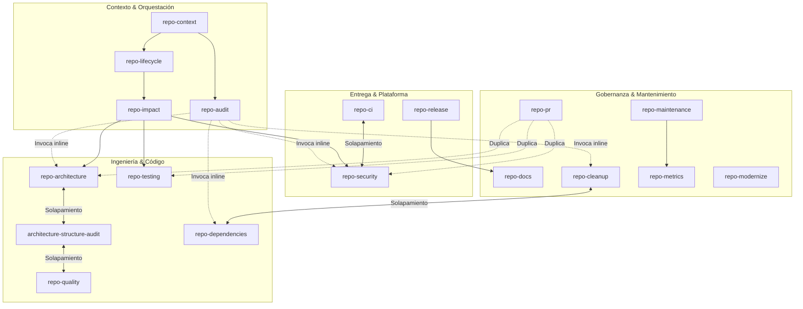
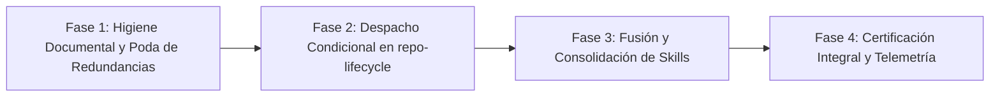

# Auditoría Estructural y Optimización de Skills (`rocapellino/pokedex`)

- **Fecha:** 2026-09-24
- **Autor:** Antigravity AI Engine
- **Repositorio:** `rocapellino/pokedex`
- **Ámbito:** `.agents/skills/`, `.agents/skills/_shared/`, `references/`
- **Carácter:** Diagnóstico y propuesta arquitectónica de optimización (Read-Only; no altera archivos de skills existentes).

---

## Resumen Ejecutivo

El framework de skills de `.agents/skills/` en `rocapellino/pokedex` constituye un sistema integral de gobierno para el ciclo de vida del monorepo (19 skills y 9 módulos compartidos en `_shared/`).

A pesar de su madurez técnica y alineación con estándares DevSecOps, la auditoría estructural revela **patrones críticos de degradación por crecimiento orgánico**:

1. **Hiper-fragmentación y Solapamiento:** Conviven 19 skills con límites difusos. Casos severos como `repo-architecture` frente a `architecture-structure-audit` y `repo-quality` generan redundancia en el análisis de acoplamiento, God Files y separación de capas.
2. **"God Skills" con Subcomandos Duplicados:** `repo-audit` implementa subcomandos (`/repo-audit security`, `/repo-audit architecture`, `/repo-audit dependencies`, `/repo-audit cleanup`) que ejecutan de forma paralela y no coordinada análisis que ya pertenecen a skills especializadas. De igual forma, `repo-pr` reimplementa chequeos de seguridad, arquitectura y testing.
3. **Rigidez Excesiva en el Orquestador:** `repo-lifecycle` define un pipeline obligatorio de post-change de 9 pasos ("sin omitir pasos") que impone validaciones pesadas (DAST, Kind, Cilium L7, GitOps digests) a cambios triviales o de alcance local (como documentación o tipado de frontend).
4. **Métricas como Fin y no como Medio:** `repo-metrics` opera como un paso independiente en el pipeline principal, recolectando datos numéricos desconectados de acciones correctivas, cuando conceptualmente es una capacidad transversal de telemetría y soporte a `repo-maintenance`.
5. **Divergencias en Documentos Compartidos:** Existen archivos con solapamiento temático directo, como `repo-lifecycle/references/decision-matrix.md` (tabla embrionaria de 11 líneas) frente a `_shared/change-impact-matrix.md` (matriz exhaustiva de cascada de impacto).

---

## 1. Inventario Actual de Skills

A continuación se detalla el catálogo actual de 19 skills distribuidas en `.agents/skills/`:

| Skill | Tipo | Responsabilidad Primaria | Responsabilidades Secundarias | Dependencias Conceptuales | Comandos Declarados |
| :--- | :--- | :--- | :--- | :--- | :--- |
| **`repo-lifecycle`** | Core / Orquestador | Orquestación end-to-end del ciclo de vida del repositorio. | Pipeline post-change de 9 pasos, selección de modos (`Full`, `Fast`, `Change`, `Release`, `Maintenance`). | Todas las skills especializadas | `/repo-lifecycle` (conceptualmente a través de sus modos) |
| **`repo-context`** | Core / Contexto | Construcción del contexto operativo fáctico (SSOT, monorepo, stack real). | Gobernanza de `AGENTS.md`, inventario de comandos y archivos `.*ignore`. | `_shared/methodology.md`, `source-of-truth.md` | `/repo-context`, `/repo-context refresh`, `/repo-context agents` |
| **`repo-audit`** | Core / Diagnóstico | Auditoría integral read-only del estado técnico general del repositorio. | Diagnósticos parciales duplicados de seguridad, dependencias, arquitectura y modernización. | `_shared/report-template.md`, `finding.md` | `/repo-audit`, `/repo-audit security`, `/repo-audit architecture`, `/repo-audit dependencies`, `/repo-audit cleanup`, `/repo-audit modernization`, `/repo-audit delta` |
| **`repo-impact`** | Core / Análisis | Mapeo de dependencias y radio de impacto previo a modificaciones. | Análisis de compatibilidad hacia atrás en API, evaluación de contratos DB y CI. | `_shared/change-impact-matrix.md`, `change-plan.md`, `state-model.md` | `/repo-impact <cambio>`, `/repo-impact file`, `/repo-impact dependency`, `/repo-impact api` |
| **`repo-refactor`** | Refactoring | Ejecución controlada e incremental de refactorizaciones. | Test-first characterization, partición de hotspots, generación de planes atómicos. | `repo-impact`, `change-plan.md`, `architecture-structure-audit` | `/repo-refactor <hallazgo>`, `/repo-refactor plan`, `/repo-refactor execute` |
| **`repo-architecture`** | Engineering | Análisis integral de arquitectura de app, plataforma, red e infraestructura. | Aislamiento monorepo, topología K8s/K3s, árbol de reconciliación ArgoCD, auditoría de ADRs. | `_shared/state-model.md`, `source-of-truth.md` | `/repo-architecture`, `/repo-architecture app`, `/repo-architecture platform`, `/repo-architecture gitops` |
| **`architecture-structure-audit`** | Engineering | Detección de God Files, God Modules, alta complejidad y degradación de código. | Detección de carpetas cajón de sastre, Monolith Relocated, churn y cálculo de $C_a/C_e/I$. | `references/*.md` (métricas estructurales) | `/architecture-structure-audit`, `/architecture-structure-audit backend`, `/architecture-structure-audit frontend`, `/architecture-structure-audit regression`, `/architecture-structure-audit pr` |
| **`repo-quality`** | Engineering | Elevación de calidad de código, tipado estricto y estándares de mantenibilidad. | Detección de God files (solapamiento), manejo de errores, logging estructurado, naming. | `repo-refactor`, `change-plan.md` | `/repo-quality`, `/repo-quality backend`, `/repo-quality frontend`, `/repo-quality hotspots` |
| **`repo-testing`** | Engineering | Gobernanza de la pirámide de pruebas (unitarias, integración, fuzz, E2E, Kind). | Determinismo, cobertura LCOV, detección de tests flaky, validación de probes. | `tests/`, `package.json` | `/repo-testing`, `/repo-testing coverage`, `/repo-testing api`, `/repo-testing e2e`, `/repo-testing security` |
| **`repo-dependencies`** | Engineering | Ciclo de vida de dependencias, lockfiles, overrides y CVEs de paquetes. | Detección de librerías huérfanas, incompatibilidad en Node 22 LTS, planes de upgrade. | `package.json`, `package-lock.json`, `repo-impact` | `/repo-dependencies`, `/repo-dependencies security`, `/repo-dependencies unused`, `/repo-dependencies upgrade-plan` |
| **`repo-security`** | Delivery / DevSecOps | Auditoría DevSecOps integral (SAST, secretos, supply chain, NetworkPolicies). | Validación ExternalSecrets/Vault, Dockerfile hardening, Kyverno, SBOM, firmas Cosign. | `tests/security/`, `infra/ansible/` | `/repo-security`, `/repo-security app`, `/repo-security supply-chain`, `/repo-security ci`, `/repo-security k8s` |
| **`repo-ci`** | Delivery / Pipeline | Optimización y hardening de pipelines de GitHub Actions. | Eliminación de redundancias entre jobs, permisos mínimos, caching, concurrency. | `.github/workflows/`, `Taskfile.yml` | `/repo-ci`, `/repo-ci pr`, `/repo-ci security`, `/repo-ci optimization` |
| **`repo-release`** | Delivery / Despliegue | Verificación de criterios de readiness operacional antes de release y promoción. | Mapeo de estados `MAIN → RELEASE → GITOPS → RUNTIME`, paridad de digests, capability matrix. | `_shared/state-model.md`, `release-consistency.md`, `scripts/update-gitops-pin.ts` | `/repo-release`, `/repo-release consistency`, `/repo-release matrix`, `/repo-release dry-run`, `/repo-release production` |
| **`repo-docs`** | Documentation | Mantenimiento de documentación técnica libre de drift y verificable fácticamente. | Extracción de Document Claims, gobernanza de ADRs, terminología de ciclo de vida. | `_shared/source-of-truth.md`, `documentation-impact-matrix.md`, `state-model.md` | `/repo-docs`, `/repo-docs drift`, `/repo-docs claims`, `/repo-docs adr`, `/repo-docs api`, `/repo-docs architecture` |
| **`repo-cleanup`** | Maintenance | Identificación y preparación de limpieza de artefactos y código huérfano. | Cumplimiento ADR-020 (scripts `.sh`), higiene de `.*ignore`, documentación residual. | `_shared/change-plan.md`, `repo-impact` | `/repo-cleanup`, `/repo-cleanup candidates`, `/repo-cleanup docs`, `/repo-cleanup scripts` |
| **`repo-maintenance`** | Maintenance | Health check periódico y gestión del backlog técnico estructurado. | Detección de regresiones históricas, verificación de backups y rotación de secrets. | `docs/audits/`, `repo-security`, `repo-dependencies` | `/repo-maintenance`, `/repo-maintenance weekly`, `/repo-maintenance monthly`, `/repo-maintenance delta` |
| **`repo-metrics`** | Auxiliar / Telemetría | Cuantificación de evolución técnica, LOC, cobertura, churn y tiempos de CI. | Análisis de tendencias de deuda técnica sin calificaciones artificiales. | `docs/audits/`, `coverage/` | `/repo-metrics`, `/repo-metrics trend`, `/repo-metrics ci`, `/repo-metrics debt` |
| **`repo-modernize`** | Modernization | Evaluación objetiva de modernización con criterio costo/beneficio y anti-hype. | Análisis de runtime (Node/TS), tooling de build, empaquetado y contenedores. | `_shared/change-plan.md`, `repo-impact` | `/repo-modernize`, `/repo-modernize runtime`, `/repo-modernize tooling`, `/repo-modernize platform` |
| **`repo-pr`** | Transversal / Review | Revisión estructurada de Pull Requests, deltas y ramas activas. | Segregación de observaciones bloqueantes vs. sugerencias, validación de diff. | `repo-impact`, `repo-security`, `repo-testing`, `repo-quality` | `/repo-pr`, `/repo-pr security`, `/repo-pr architecture`, `/repo-pr tests` |

---

## 2. Matriz de Solapamiento de Responsabilidades

El siguiente cuadro compara las áreas donde múltiples skills reclaman propiedad o ejecutan análisis análogos:

| Dominio de Análisis | Skills en Conflicto | Naturaleza del Solapamiento | Impacto Operativo |
| :--- | :--- | :--- | :--- |
| **God Files & Acoplamiento de Código** | `architecture-structure-audit` vs. `repo-quality` vs. `repo-architecture` | Las 3 analizan LOC, funciones desproporcionadas, SRP y mezcla de capas en `apps/backend` y `apps/frontend`. | Diagnósticos duplicados con métricas divergentes o recomendaciones redundantes. |
| **Diagnóstico de Seguridad** | `repo-audit security` vs. `repo-security` vs. `repo-ci security` vs. `repo-pr security` | Cuatro skills declaran evaluar permisos de GitHub Actions, secretos y NetworkPolicies. | Ejecución repetitiva de escaneos estáticos; falta de un dueño único de la política de seguridad. |
| **Auditoría de Dependencias y Paquetes Huérfanos** | `repo-dependencies unused` vs. `repo-cleanup candidates` vs. `repo-audit dependencies` | Detección de librerías npm no utilizadas o versiones duplicadas implementada en tres sitios. | Riesgo de incongruencia al proponer desinstalaciones sin coordinar con lockfiles. |
| **Hardening de CI/CD** | `repo-ci security` vs. `repo-security ci` | Ambas auditan permisos de menor privilegio en GitHub Actions y SHA pinning. | Duplicación total del alcance de evaluación de pipelines. |
| **Gobernanza de ADRs y Drift** | `repo-architecture` vs. `repo-docs adr` | Ambas contrastan decisiones en `docs/decisions/` frente al código activo en `main`. | Falta de delimitación: ¿quién valida la decisión técnica (`architecture`) vs. quién valida el texto (`docs`)? |
| **Mapeo de Estados y Readiness de Despliegue** | `repo-release consistency` vs. `repo-docs drift (state)` | Ambas auditan afirmaciones de "activo" o "desplegado" en runbooks frente al estado en GitOps. | `repo-docs` debe centrarse en el texto y `repo-release` en la matriz de capacidades y tags. |
| **Higiene de Scripts y Artefactos** | `repo-cleanup scripts` vs. `repo-context agents` vs. `npm run governance:audit-scripts` | La regla de scripts permitidos (ADR-020) está distribuida en dos skills y un script npm. | Redundancia innecesaria: la regla canónica debe residir en el linter y ser reportada por una sola skill. |

---

## 3. Matriz de Dependencias Conceptuales



### Hallazgo de Acoplamiento y Ciclos

1. **Ciclo de Dependencia Funcional:** `repo-lifecycle` delega en `repo-refactor`, que a su vez depende de `architecture-structure-audit` para prevenir regresiones, y si detecta fallas vuelve a invocar a `repo-refactor`. Este ciclo requiere una condición de corte explícita (máximo 2 iteraciones) para evitar bucles de reescritura.
2. **Dependencias Invisibles:** `repo-pr` actúa como un orquestador secundario no declarado, intentando hacer lo mismo que `repo-lifecycle` en modo `Change`, pero sin respetar la cascada de `_shared/change-impact-matrix.md`.

---

## 4. Clasificación Detallada de Problemas Detectados

### A. Duplicación de Lógica y Esfuerzo

- **`repo-audit` como monolito analítico:** Intenta abarcar en un solo archivo todos los dominios técnicos (seguridad, arquitectura, dependencias, limpieza, modernización), creando una suite secundaria desincronizada de las skills especializadas.
- **Doble matriz de impacto:** Coexisten `repo-lifecycle/references/decision-matrix.md` (11 líneas) y `_shared/change-impact-matrix.md` (76 líneas). La primera es obsoleta y contradice la granularidad de la segunda.
- **Doble auditoría de dependencias no utilizadas:** Tanto `/repo-dependencies unused` como `/repo-cleanup candidates` implementan la búsqueda de librerías huérfanas con métodos dispares.

### B. Exceso de Responsabilidad (*God Skills*)

- **`architecture-structure-audit`:** Contiene 199 líneas de instrucciones y 4 referencias extensas (`coupling-and-cohesion.md`, `monolith-detection.md`, `refactoring-guidelines.md`, `structural-metrics.md`). Incluye guías detalladas de refactorización (`refactoring-guidelines.md`) que invaden directamente el dominio de `repo-refactor`.
- **`repo-architecture`:** Agrupa simultáneamente el flujo de aplicación web, monorepo, topología K8s, red Cilium, árboles de ArgoCD y vigencia de ADRs. Debe enfocar su propiedad en arquitectura del sistema y delegar la calidad de código a `repo-quality` / `architecture-structure-audit`.

### C. Acoplamiento y Dependencias Circulares

- `repo-quality` y `architecture-structure-audit` se cruzan mutuamente en la evaluación de acoplamiento. Un cambio en las recomendaciones de modularización requiere actualizar ambas skills para evitar contradicciones.

### D. Reglas Contradictorias

1. **Prevalencia de ADRs vs. Prevalencia Fáctica:**
   - `_shared/source-of-truth.md` establece que un *ADR Aceptado* es la autoridad máxima de intención técnica.
   - `_shared/methodology.md` estipula que la documentación técnica carece de valor probatorio y que el código/render siempre superan al texto.
   - *Resolución requerida:* Aclarar que ante una discrepancia, el código manda fácticamente para reportar el estado del sistema, pero el ADR marca el contrato esperado, catalogando la situación como `ADR Drift` (no como una feature válida no documentada).
2. **Post-Change Audit de 9 Pasos vs. Modos de Ejecución:**
   - La Sección "Pipeline de Post-Change Audit" de `repo-lifecycle` prohíbe explícitamente omitir pasos ("la siguiente secuencia de validación sin omitir pasos").
   - Sin embargo, los "Modos de Operación" (`Fast`, `Change`) admiten omitir análisis pesados.

### E. Ejecución Innecesaria y Rigidez Operativa

- En la versión actual de `repo-lifecycle`, un cambio en un componente de UI (`apps/frontend/src/components/modal-detail.ts`) arrastra conceptualmente la ejecución de validaciones de Vault, ExternalSecrets, Cilium L7 NetworkPolicies y retención en GHCR, demorando el ciclo de retroalimentación sin aportar mitigación de riesgo.

### F. Falta de Ownership Claro

- **¿Quién es dueño de la relación `package.json` vs `package-lock.json`?** `repo-dependencies` audita vulnerabilidades, pero `repo-cleanup` audita dependencias huérfanas y `repo-modernize` evalúa si el package manager o runtime deben actualizarse.

---

## 5. Propuesta de Arquitectura Futura de Skills

Para cumplir el principio fundamental:
> *"Una skill debe tener una responsabilidad principal claramente delimitada."*

Se propone una reestructuración funcional en **6 dominios de gobierno**, reduciendo el acoplamiento y delimitando estrictamente el alcance:

```text
┌────────────────────────────────────────────────────────────────────────┐
│                              1. CORE                                   │
│  repo-context (SSOT) ──► repo-lifecycle (Orquestador) ──► repo-impact  │
└───────────────────────────────────┬────────────────────────────────────┘
                                    │ Despacho condicional
       ┌────────────────────────────┼────────────────────────────┐
       ▼                            ▼                            ▼
┌──────────────┐             ┌──────────────┐             ┌──────────────┐
│2. ENGINEERING│             │ 3. DELIVERY  │             │4. GOVERNANCE │
│repo-architect│             │repo-security │             │  repo-docs   │
│repo-quality  │             │  repo-ci     │             └──────────────┘
│repo-testing  │             │ repo-release │                    ▲
│repo-dependenc│             └──────────────┘                    │
└──────────────┘                    │                            │
       ▲                            ▼                            │
       │                     ┌──────────────┐                    │
       │                     │5. MAINTENANCE│                    │
       │                     │repo-maintenan│────────────────────┘
       │                     └──────────────┘
       ▼
┌──────────────┐
│6. REFACTORING│
│repo-refactor │
└──────────────┘
```

### Distribución Canónica de Responsabilidades

#### A. Core (Gobierno del Ciclo de Vida y Transiciones)

- **`repo-context` (SSOT & Baseline):**
  - *Responsabilidad única:* Construir y verificar el contexto fáctico actual del repositorio antes de cualquier acción.
  - *Alcance:* Workspaces, stack real, delimitación de entornos, lectura de fuentes de verdad.
- **`repo-lifecycle` (Orquestador Dinámico):**
  - *Responsabilidad única:* Coordinar el flujo de trabajo entre skills aplicando filtrado condicional por dominio de impacto.
  - *Alcance:* Decidir qué skills se ejecutan y en qué orden según los archivos alterados.
- **`repo-impact` (Análisis de Radio de Impacto):**
  - *Responsabilidad única:* Mapear dependencias, riesgos de regresión y predecir los dominios afectados por un cambio.
  - *Alcance:* Análisis estático de imports, rutas, contratos de DB y selección de gates obligatorios.

#### B. Engineering (Arquitectura y Código)

- **`repo-architecture` (Arquitectura del Sistema y Monorepo):**
  - *Responsabilidad única:* Coherencia arquitectónica de alto nivel entre backend, frontend, plataforma (K8s/K3s) e infraestructura.
  - *Alcance:* Topología de red, límites de monorepo, árboles ArgoCD y conformidad con ADRs.
- **`repo-quality` (Calidad de Código y Estructura Modular):**
  - *Responsabilidad única:* Calidad interna del código, tipado estricto, cohesión, modularidad y prevención de God Files.
  - *Consolidación sugerida:* Absorber las métricas de acoplamiento y detección de God Files de `architecture-structure-audit`, centralizando en una sola skill la inspección estática del código.
- **`repo-testing` (Estrategia y Suites de Pruebas):**
  - *Responsabilidad única:* Cobertura, determinismo y gobernanza de la pirámide de pruebas (unitarias, integración, E2E, fuzzing).
- **`repo-dependencies` (Gestión de Dependencias y Supply Chain Local):**
  - *Responsabilidad única:* Gestión del árbol de paquetes npm, lockfiles, overrides y detección de paquetes huérfanos.
  - *Consolidación:* Asumir completamente la detección de librerías huérfanas que realizaba `repo-cleanup`.

#### C. Delivery (Seguridad, Integración y Releases)

- **`repo-security` (DevSecOps, Secretos y Hardening):**
  - *Responsabilidad única:* Seguridad estática y dinámica, políticas de red Cilium L7, external secrets (Vault) y supply chain (Cosign, SBOM).
  - *Consolidación:* Centralizar la auditoría de seguridad de CI (eliminando `/repo-ci security`).
- **`repo-ci` (Pipelines y Flujos de Automatización):**
  - *Responsabilidad única:* Rendimiento, concurrencia, topología y optimización de flujos en GitHub Actions.
- **`repo-release` (Readiness de Release y Promoción GitOps):**
  - *Responsabilidad única:* Verificación de readiness operacional, pinning de versiones, paridad de imágenes y publicación de tags SemVer.

#### D. Governance & Documentation

- **`repo-docs` (Integridad y Coherencia Documental):**
  - *Responsabilidad única:* Detección de documentation drift, claims verification, seguimiento de ADRs y Markdown Quality Gate.

#### E. Maintenance (Higiene y Salud Periódica)

- **`repo-maintenance` (Salud Periódica, Higiene y Deuda Técnica):**
  - *Responsabilidad única:* Monitoreo recurrente de salud, detección de regresiones frente a baselines históricos y backlog técnico.
  - *Consolidación sugerida:* Absorber las funciones de limpieza de `repo-cleanup` (código huérfano, scripts legados) y utilizar `repo-metrics` como herramienta interna de telemetría.

#### F. Refactoring & Evolution

- **`repo-refactor` (Implementación Asistida de Refactorizaciones):**
  - *Responsabilidad única:* Ejecución incremental de planes de refactorización (`change-plan.md`) manteniendo invariantes los contratos.

---

## 6. Lifecycle Optimizado y Despacho Condicional

El ciclo de vida debe abandonar la premisa de "ejecutar todos los pasos para todos los cambios" y estructurarse bajo un modelo de **Pipeline Dirigido por Impacto**:

```text
               1. repo-context (Construir contexto de partida)
                               │
                               ▼
               2. repo-audit (Diagnóstico integral o delta)
                               │
                               ▼
               3. repo-impact (Identificar archivos modificados)
                               │
         ┌─────────────────────┴─────────────────────┐
         ▼                                           ▼
¿Afecta solo Docs / Markdown?              ¿Afecta Código / Infra?
         │                                           │
         ▼                                           ▼
  [Fast Track Docs]                     [Selective Domain Execution]
  - repo-docs (Drift)                   - Engineering (Quality / Arch)
  - Markdown Quality Gate               - Delivery (Security / CI / Release)
         │                              - repo-testing (Suites dirigidas)
         │                                           │
         └─────────────────────┬─────────────────────┘
                               ▼
               4. repo-refactor (Si requiere cambio)
                               │
                               ▼
               5. Conditional Quality Gates (Gating por dominio)
                               │
                               ▼
               6. repo-release (Solo si amerita corte de versión)
                               │
                               ▼
               7. repo-docs (Cierre documental obligatorio)
                               │
                               ▼
               8. repo-maintenance (Registro en backlog / baseline)
```

---

## 7. Change Impact Matrix (Gating Condicional Obligatorio)

La siguiente tabla establece formalmente qué Quality Gates y qué skills son **bloqueantes obligatorios** según el dominio tocado por el cambio:

| Tipo de Cambio | Archivos / Rutas Típicas | Skills Involucradas Obligatoriamente | Quality Gates Requeridos | Gates Exentos / Omitidos |
| :--- | :--- | :--- | :--- | :--- |
| **Backend Core** | `apps/backend/src/` | `repo-quality`, `repo-testing`, `repo-security` (App) | `npm run lint`, `npm run build:backend`, `npm test` (unit/integración), `test:fuzz` | Playwright E2E UI, Helm render, Terraform/Ansible |
| **Frontend SPA** | `apps/frontend/src/` | `repo-quality`, `repo-testing` | `npm run build:frontend`, `npm run typecheck`, tests unitarios de componentes, Playwright E2E (`tests/e2e/`) | Helm render, Vault rotation, Egress anti-SSRF, Fuzzing |
| **Infraestructura Helm** | `infra/helm/` | `repo-architecture`, `repo-release`, `repo-security` | `helm lint`, `gitops:verify-parity:strict`, validación de templates AST | Backend unit tests, Playwright UI tests |
| **GitOps Declarativo** | `gitops/` | `repo-architecture`, `repo-release` | `gitops:pin:check`, `gitops:verify-parity:strict` | Pruebas de fuzzing, frontend build |
| **Plataforma / Ansible / OpenTofu** | `infra/ansible/`, `infra/opentofu/` | `repo-architecture`, `repo-security` (K8s/Vault) | `secrets:audit-rotation`, linter de Ansible/Tofu | Frontend builds, backend unit tests |
| **Workflows de CI/CD** | `.github/workflows/` | `repo-ci`, `repo-security` (CI) | Validación sintáctica YAML, auditoría de permisos de tokens (`permissions:`) | Pruebas E2E de navegador, migraciones DB |
| **Dependencias Monorepo** | `package.json`, `package-lock.json` | `repo-dependencies`, `repo-security` (SCA), `repo-testing` | `npm audit`, `npm test`, paridad de lockfile | Helm render, Playwright E2E (salvo si toca deps de browser) |
| **Documentación Pura** | `docs/`, `*.md` | `repo-docs` | `npm run lint:md -- <archivos>` (**0 errores `MDxxx`**) | Builds de código, tests unitarios, Docker builds, scans |
| **Enmienda de ADR** | `docs/decisions/` | `repo-architecture`, `repo-docs` | `npm run lint:md`, validación cruzada con `source-of-truth.md` | Validación de clúster, builds de frontend |
| **Corte de Release** | `package.json` (bump), `Chart.yaml`, GitOps pins | `repo-release`, `repo-security` (Supply Chain), `repo-docs` | Suite completa (`npm run validate`), firma Cosign, SBOM, paridad 1:1 de ArgoCD | Ninguno (Full Gate Obligatorio) |

---

## 8. Clasificación de Acciones de Optimización

Para guiar la toma de decisiones del equipo y priorizar la simplificación del repositorio:

### MUST (Obligatorio e Inmediato)

1. **Eliminar la duplicación entre matrices de decisión:**
   - Eliminar `repo-lifecycle/references/decision-matrix.md` (11 líneas) y consolidar `_shared/change-impact-matrix.md` como la **única fuente formal de cascada de impacto**.
2. **Resolver la contradicción de ejecución en `repo-lifecycle`:**
   - Reformular la sección "Pipeline de Post-Change Audit" para que declare explícitamente el principio de **despacho condicional** según la matriz de impacto, en lugar de exigir 9 pasos universales para cualquier cambio.
3. **Erradicar comandos duplicados en `repo-audit` y `repo-pr`:**
   - `repo-audit` debe actuar exclusivamente como agregador/coordinador que delega en las skills de dominio (`repo-security`, `repo-quality`, etc.), en lugar de mantener scripts de análisis inline duplicados.
   - `repo-pr` debe delegar formalmente en `repo-impact` para determinar qué dominios analizar en el diff.
4. **Reconciliar la regla de ADRs vs. Prevalencia Fáctica en `_shared/`:**
   - Homogeneizar la redacción entre `methodology.md` y `source-of-truth.md` para clarificar que la prevalencia fáctica reporta el estado del sistema, mientras que el ADR define el contrato formal cuya divergencia constituye un `ADR Drift`.

### SHOULD (Altamente Recomendado para Reducir Deuda Cognitiva)

1. **Fusionar `architecture-structure-audit` dentro de `repo-quality`:**
   - La detección de God Files, modularidad, cohesión y acoplamiento de código fuente pertenece al dominio de calidad de código (`repo-quality`), liberando a `repo-architecture` para concentrarse en la arquitectura del sistema, topología e infraestructura.
2. **Fusionar `repo-cleanup` dentro de `repo-maintenance`:**
   - La búsqueda de archivos huérfanos, limpieza de scripts obsoletos e higiene de `.*ignore` son actividades periódicas de mantenimiento del monorepo.
3. **Consolidar la auditoría de dependencias huérfanas en `repo-dependencies`:**
   - Eliminar `/repo-cleanup candidates` respecto a paquetes y dejar `/repo-dependencies unused` como el comando canónico único.
4. **Convertir `repo-metrics` en una capacidad auxiliar:**
   - `repo-metrics` no debe ser un paso secuencial obligatorio en `repo-lifecycle`, sino una utilidad interna invocada por `repo-maintenance` y reportes periódicos.

### COULD (Opcional tras Completar Fases Previas)

1. **Crear una skill transversal `repo-change`:**
   - Evaluar si unificar `repo-impact` y la fase de diseño de `repo-refactor` bajo un único coordinador de cambios (`repo-change`) simplifica el flujo para agentes automatizados. *(Nota: Mantener separadas por ahora hasta consolidar MUST y SHOULD)*.
2. **Alinear nombres de comandos CLI de skills con Taskfile:**
   - Homogeneizar los atajos `/repo-*` con tareas de `Taskfile.yml` para permitir invocaciones simétricas tanto por humanos como por agentes.

### NOT RECOMMENDED (Desaconsejado / Antiprón)

1. **Crear nuevas micro-skills específicas (ej. `repo-helm`, `repo-ansible`, `repo-lint`):**
   - Aumentar el número de skills fragmentaría aún más el contexto de los agentes, elevando la carga cognitiva y el riesgo de solapamiento.
2. **Imponer Clean Architecture / Hexagonal / DDD masivo en el código:**
   - Como estipula la *Regla de Simplicidad Arquitectónica*, la arquitectura actual de Express + Drizzle con servicios desacoplados es óptima para la escala del proyecto. Añadir capas artificiales aumentaría la complejidad sin beneficio operativo.
3. **Automatizar la modificación directa de ADRs:**
   - Los ADRs representan acuerdos de gobernanza humana. Ninguna skill o agente debe modificar un ADR sin un RFC explícito y aprobación del arquitecto del repositorio.

---

## 9. Plan de Migración Progresivo en 4 Fases

Para ejecutar estas optimizaciones sin riesgo de regresión ni disrupción operativa:



### Fase 1: Higiene Documental y Poda de Redundancias (Riesgo Nulo)

- **Objetivo:** Eliminar archivos y reglas en conflicto sin modificar la firma externa de las skills.
- **Acciones:**
  1. Eliminar `repo-lifecycle/references/decision-matrix.md` y actualizar enlaces hacia `_shared/change-impact-matrix.md`.
  2. Homogeneizar las definiciones de precedencia entre `methodology.md` y `source-of-truth.md`.
  3. Ejecutar Markdown Quality Gate sobre todos los documentos compartidos actualizados.
- **Validación:** `npm run lint:md -- .agents/skills/_shared/*.md`.

### Fase 2: Despacho Condicional en `repo-lifecycle` (Riesgo Bajo)

- **Objetivo:** Flexibilizar la orquestación para evitar validaciones pesadas innecesarias.
- **Acciones:**
  1. Modificar la sección de orquestación en `repo-lifecycle/SKILL.md` para incorporar la lógica de la *Change Impact Matrix*.
  2. Sustituir el pipeline rígido de 9 pasos universales por gates condicionales según el tipo de cambio detectado por `repo-impact`.
  3. Documentar los flujos de *Fast Track* para documentación pura y testing focalizado.
- **Validación:** Simulación conceptual de cambios (documentación, frontend, backend e infraestructura).

### Fase 3: Fusión y Consolidación de Skills Especializadas (Riesgo Medio)

- **Objetivo:** Reducir el inventario de 19 skills a ~14 skills cohesivas y sin duplicaciones.
- **Acciones:**
  1. Integrar las métricas y referencias de `architecture-structure-audit` dentro de `repo-quality`.
  2. Integrar las tareas de limpieza de `repo-cleanup` dentro de `repo-maintenance`.
  3. Transferir el análisis de dependencias huérfanas exclusivamente a `repo-dependencies`.
  4. Reducir `repo-metrics` a capacidad auxiliar documental.
- **Validación:** Comprobar que ningún comando canónico quede roto y actualizar `AGENTS.md`.

### Fase 4: Certificación Integral y Actualización de Gobernanza (Riesgo Bajo)

- **Objetivo:** Asegurar que todos los agentes y desarrolladores utilicen el catálogo optimizado.
- **Acciones:**
  1. Actualizar `AGENTS.md` reflejando el nuevo mapa simplificado de skills.
  2. Ejecutar auditoría completa de drift documental con `repo-docs`.
  3. Validar con el Markdown Quality Gate obligatorio (0 errores `MDxxx`).
- **Validación:** `npm run lint:md -- docs/ .agents/`.

---

## 10. Conclusiones y Próximos Pasos

1. El ecosistema de skills de Pokedex cuenta con bases de ingeniería sólidas (prevalencia fáctica, modelo de estados cuádruple, quality gates estrictos), pero padece de **inflación de skills** que complejiza innecesariamente la orquestación.
2. La consolidación propuesta permite pasar de **19 skills dispersas a 14 skills de alta cohesión**, manteniendo el 100% de la cobertura analítica y eliminando la duplicación en diagnósticos de seguridad, código y dependencias.
3. El establecimiento formal del **gating condicional** reducirá drásticamente la fricción y el tiempo de respuesta en modificaciones cotidianas sin comprometer en ningún momento la seguridad ni la estabilidad de producción.
