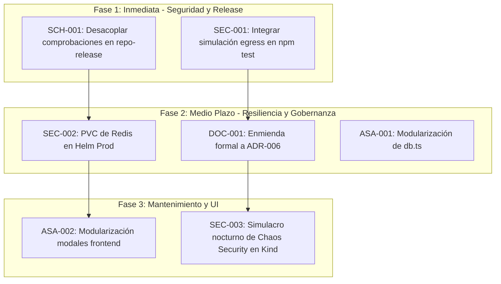

# Plan Integral de Mejoras Técnicas del Repositorio Pokédex

- **Fecha:** 2026-09-25
- **Estado Evaluado:** HEAD de `main` (Commit `e3b59fdb62e78ddfe0b883c216a33dfe30e3a412`)
- **Tipo de Documento:** Plan de Implementación Consolidado (*Improvement Plan*)
- **Quality Gate:** Markdown Quality Gate verificado (0 errores `MDxxx`)

---

## 1. Executive Summary

Este documento consolida el **Plan Integral de Mejoras Técnicas** derivado de las auditorías de consistencia, gobernanza de superficie operativa, modernización documental y evaluación de resiliencia ante fallas deliberadas (*Chaos Security Testing*) ejecutadas sobre el repositorio `rocapellino/pokedex`.

### Hitos Recientes Culminados

1. **Gobernanza de Taskfile y Reducción de Superficie:** Retiro exitoso de 18 aliases legados completando la Fase 4 de ADR-026 ([PR #272](https://github.com/rocapellino/pokedex/pull/272)).
2. **Modernización SSOT de Gestión de Secretos:** Renombrado y actualización canónica de [`docs/architecture/SECRETS_MANAGEMENT.md`](../../architecture/SECRETS_MANAGEMENT.md) formalizando HashiCorp Vault CE y External Secrets Operator como SSOT vigente, y declarando el retiro definitivo de Bitnami Sealed Secrets bajo `CLN-002` ([PR #274](https://github.com/rocapellino/pokedex/pull/274)).
3. **Paridad de Versión GitOps:** Sincronización de `targetRevision` en manifiestos ArgoCD a `v1.77.2` ([PR #275](https://github.com/rocapellino/pokedex/pull/275)).
4. **Hardening de Firma de Cadena de Suministro:** Corrección de identidades y emisores OIDC en `gitsign verify-tag` para CI/CD ([PR #270](https://github.com/rocapellino/pokedex/pull/270)).
5. **Auditoría de Efectividad de Controles de Seguridad:** Emisión formal del reporte de resiliencia y contención ante inyección deliberada de vulnerabilidades ([PR #276](https://github.com/rocapellino/pokedex/pull/276)).

---

## 2. Estado Técnico Actual del Repositorio

- **Rama Base:** `main` (limpia, sincronizada con `origin/main`).
- **Versión Actual:** `1.76.0` (definida en `package.json`).
- **Tag ArgoCD GitOps:** `v1.77.2` en aplicaciones de Proxmox y Cloud.
- **Salud del Composition Root:** `apps/backend/server.ts` se mantiene estable en **255 líneas** (límite contractual $\le 300$ LOC), sin dependencias circulares.
- **Suite de Pruebas Automatizadas:** 225/225 pruebas superadas exitosamente (`npm test`), incluyendo suites de paridad GitOps, auditoría de rotación de secretos, resiliencia de ciclo de vida y pentest de API.
- **Ecosistema de Skills:** 20 skills operativas en `.agents/skills/`, alineadas a la matriz de impacto transversal.

---

## 3. Matriz de Hallazgos Vigentes y Oportunidades de Mejora

| ID | Área | Descripción Sintética | Prioridad | Confianza | Esfuerzo | Impacto |
| :--- | :--- | :--- | :--- | :--- | :--- | :--- |
| **`[SCH-001]`** | Supply Chain / Release | Desacoplamiento granular en `repo-release`: verificar de forma independiente Git tag, OCI image, OCI digest, Cosign signature, SBOM y SLSA provenance (`PASS`/`FAIL`/`UNKNOWN`/`NOT_APPLICABLE`). | **P1** | `HIGH` | `S` | Previene asumir que la existencia de un tag implica automáticamente la integridad criptográfica de la cadena. |
| **`[SEC-001]`** | Seguridad / DevSecOps | Asimetría defensiva Local vs. Clúster: Cilium L7 eBPF y NetworkPolicies L4 operan exclusivamente en K8s; localmente el desarrollador no experimenta el bloqueo en red. | **P1** | `HIGH` | `S` | Fortalece la detección temprana en local mediante simulación determinista pre-commit. |
| **`[SEC-002]`** | Resiliencia / Redis | Riesgo residual de desincronización inter-pod en revocación de sesiones tras reinicio o pérdida de Redis (Pods sin JTI en caché local aceptan el token hasta su TTL). | **P2** | `HIGH` | `M` | Elimina la ventana de replay attack mediante almacenamiento persistente (PVC) en Redis de producción. |
| **`[DOC-001]`** | Documentación / ADR | Discrepancia entre `ADR-006` (estrategia off-site limitada a S3 y PBS inactivos) y la implementación K8s-native funcional de Google Drive con Rclone. | **P2** | `HIGH` | `S` | Sincroniza la arquitectura formal con el sistema de backup off-site activo. |
| **`[ASA-001]`** | Arquitectura / Backend | Concentración de responsabilidades en `apps/backend/src/services/db.ts` (531 LOC, acopla pool PG, Redis, fallback en memoria, migraciones Drizzle y repositorio). | **P2** | `HIGH` | `M` | Reduce acoplamiento y mejora la modularidad del backend sin cambiar contratos. |
| **`[ASA-002]`** | Arquitectura / Frontend | Concentración de lógica de renderizado y modales en `apps/frontend/src/pokedex.ts` (683 LOC) y `apps/frontend/src/backoffice.ts` (560 LOC). | **P3** | `MEDIUM` | `M` | Facilita el mantenimiento de componentes de interfaz y pruebas unitarias de UI. |

---

## 4. Detalle de Mejoras Prioritarias

### `[SCH-001]` Verificación Desacoplada de Artefactos de Release

- **Objetivo:** Garantizar que la skill `repo-release` y las herramientas de validación de entrega evalúen cada eslabón de la cadena de suministro por separado.
- **Modelo Contractual a Implementar:**

  ```text
  RELEASE (Evaluación Exhaustiva)
   ├── Git tag (Identidad de código y firma de commit Gitsign)
   ├── OCI image (Existencia en registro GHCR)
   ├── OCI digest (Pinning SHA-256 inmutable y paridad GitOps)
   ├── Cosign signature (Firma criptográfica con OIDC de GitHub Actions)
   ├── SBOM (Generación y atestación CycloneDX)
   └── SLSA provenance (Atestación de procedencia y trazabilidad de build)
  ```

- **Estados Canónicos por Eslabón:** `PASS`, `FAIL`, `UNKNOWN`, `NOT_APPLICABLE`.
- **Acción:** Actualizar la especificación y scripts de soporte en `.agents/skills/repo-release/`.

---

### `[SEC-001]` Blindaje de la Asimetría Local vs. Clúster

- **Objetivo:** Evitar que fallos en la capa de código pasen inadvertidos en la estación de trabajo local debido a la ausencia de Cilium L7 y NetworkPolicies.
- **Acción:**
  1. Integrar el comando `npm run probe:security:egress` (`scripts/probe-egress-security.ts --simulate`) como paso de validación en la suite de pruebas locales (`npm test`).
  2. Asegurar que cualquier intento de añadir dependencias externas de red o modificar `validateImageUrl()` falle en el runner local sin requerir un despliegue en Kubernetes.

---

### `[SEC-002]` Persistencia de Redis para Eliminación del Riesgo Residual en Sesiones

- **Objetivo:** Prevenir que un fallo catastrófico del pod de Redis deje desincronizada la lista negra de tokens revocados entre réplicas de la API.
- **Acción:**
  1. Incorporar en `infra/helm/pokedex/values.prod.yaml` la configuración de PersistentVolumeClaim para Redis.
  2. Ajustar `redis-deployment.yaml` para asegurar que el Append-Only File (AOF) se almacene en un volumen no efímero.

---

### `[DOC-001]` Actualización de ADR-006 (Google Drive Off-site K8s-Native)

- **Objetivo:** Resolver el *Documentation Drift* entre las decisiones formales y los componentes desplegados.
- **Acción:**
  1. Redactar una enmienda o actualización en `docs/decisions/` que formalice la adopción del CronJob `backup-gdrive-cronjob.yaml` con Rclone y token cifrado como alternativa off-site aprobada.
  2. Mantener la trazabilidad histórica de S3 y Proxmox Backup Server (PBS) como blueprints alternativos.

---

### `[ASA-001]` Modularización Gradual de `apps/backend/src/services/db.ts`

- **Objetivo:** Evitar que `db.ts` continúe creciendo y se transforme en un *God Module*.
- **Acción:**
  1. Extraer la capa de repositorio Pokémon (`PokemonRepository`) a un módulo dedicado `apps/backend/src/repositories/pokemon.ts`.
  2. Conservar en `db.ts` exclusivamente la gestión del pool de conexiones PostgreSQL, cliente Redis y fallback resiliente de almacenamiento.

---

## 5. Roadmap de Implementación por Fases



### Cronograma de Ejecución

1. **Fase 1 (Corto Plazo / Inmediato):**
   - Implementar el desglose de 6 estados independientes en `repo-release`.
   - Incorporar la verificación simulada de Cilium/Egress en el ciclo de pruebas local.
2. **Fase 2 (Medio Plazo):**
   - Evaluar y aplicar PVC en Redis de producción bajo `infra/helm/pokedex`.
   - Formalizar la actualización documental de `ADR-006`.
   - Extraer `PokemonRepository` de `db.ts` manteniendo 100% de compatibilidad con los tests existentes.
3. **Fase 3 (Largo Plazo / Mantenimiento Continuo):**
   - Desacoplar modales y vistas en `apps/frontend/`.
   - Institucionalizar simulacros automáticos de inyección deliberada de vulnerabilidades en CI efímero.

---

## 6. Criterios de Aceptación y Quality Gates

Para dar por concluida cada iniciativa del presente plan, se exigirá el cumplimiento estricto de:

- [ ] **Validación de Código:** `npm run lint` y `npm run build` sin advertencias ni errores.
- [ ] **Tests de Regresión:** 100% de tests passing en `npm test` y `npm run test:fuzz`.
- [ ] **Paridad GitOps:** `npm run gitops:verify-parity:strict` certificando coincidencia de digest SHA-256 entre entornos.
- [ ] **Markdown Quality Gate Obligatorio:** `npm run lint:md -- <archivos-modificados>` con 0 errores `MDxxx`.
- [ ] **Demarcación de Verdad:** Preservar la inmutabilidad histórica de `docs/audits/` sin alterar auditorías fechadas previas.
