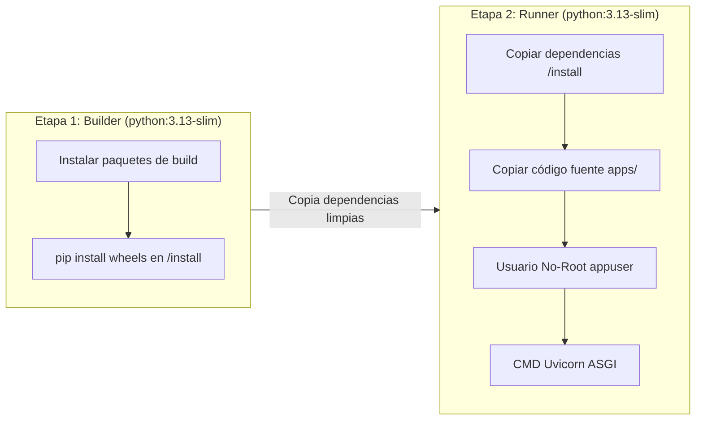

# 🐳 Guía de Mejores Prácticas para Dockerfile (Proyecto Python / FastAPI)

Este documento establece las mejores prácticas y estándares de la industria para la contenerización del proyecto **Pokémon API (FastAPI + Uvicorn)**, optimizando **seguridad**, **rendimiento**, **tamaño de imagen** y **mantenibilidad**.

---

## 📑 Tabla de Contenidos
1. [Principios Fundamentales](#1-principios-fundamentales)
2. [Estructura del `.dockerignore`](#2-estructura-del-dockerignore)
3. [Optimización de Capas y Caché](#3-optimización-de-capas-y-caché)
4. [Seguridad: Usuario No-Root y Escaneo](#4-seguridad-usuario-no-root-y-escaneo)
5. [Servidor de Producción (ASGI vs Development Server)](#5-servidor-de-producción-asgi-vs-development-server)
6. [Multi-Stage Builds (Construcción Multietapa)](#6-multi-stage-builds-construcción-multietapa)
7. [Manejo de Señales y Healthchecks](#7-manejo-de-señales-y-healthchecks)
8. [Dockerfile de Referencia para el Repositorio](#8-dockerfile-de-referencia-para-el-repositorio)
9. [Comandos Clave de Construcción y Ejecución](#9-comandos-clave-de-construcción-y-ejecución)

---

## 1. Principios Fundamentales

### 1.1. Seleccionar la Imagen Base Adecuada
- ❌ **Evitar:** `python:latest` o imágenes genéricas completas (`python:3.13` pesa ~1 GB).
- ❌ **Cuidado con Alpine:** Aunque `python:3.13-alpine` es pequeña, usa `musl libc` en vez de `glibc`, lo que puede requerir compilar dependencias C desde cero y hacer builds lentos.
- ✅ **Recomendado:** `python:3.13-slim` (~150 MB). Basada en Debian Slim, compatible con binarios precompilados (wheels) de Python y con un balance ideal entre ligereza y estabilidad.
- ✅ **Fijar versiones específicas:** Utilizar versiones semánticas fijas (ej. `python:3.13-slim`) para garantizar reproducibilidad en CI/CD y producción.

### 1.2. Variables de Entorno de Python
Configurar variables estándar para entornos contenerizados:
```dockerfile
ENV PYTHONDONTWRITEBYTECODE=1 \
    PYTHONUNBUFFERED=1 \
    PIP_NO_CACHE_DIR=1 \
    PIP_DISABLE_PIP_VERSION_CHECK=1
```
- `PYTHONDONTWRITEBYTECODE=1`: Evita que Python escriba archivos `.pyc` en disco innecesariamente dentro del contenedor.
- `PYTHONUNBUFFERED=1`: Asegura que los logs y la salida estándar (`stdout`/`stderr`) se envíen directamente a la terminal sin pasar por buffer (vital para Docker logs / Kubernetes).
- `PIP_NO_CACHE_DIR=1`: Evita almacenar la caché de descarga de `pip`, reduciendo el tamaño de la capa.

---

## 2. Estructura del `.dockerignore`

Antes de compilar, es obligatorio definir un archivo `.dockerignore` en la raíz. Esto evita enviar archivos innecesarios al contexto de compilación del Docker daemon (lo cual acelera el build y previene fugas de seguridad).

### Archivo `.dockerignore` recomendado para este proyecto:
```text
# Control de versiones
.git/
.gitignore

# Entornos virtuales locales
.venv/
venv/
env/

# Caché y artefactos de Python
__pycache__/
*.py[cod]
*$py.class
*.so
.pytest_cache/
.coverage
htmlcov/

# Archivos de entorno y secretos
.env
*.env.local
*.pem
*.key

# Archivos de desarrollo y testing no requeridos en runtime
tests/
scripts/
docs/
*.md
.vscode/
.idea/

# Logs del sistema y temporales
*.log
*.tmp
```

---

## 3. Optimización de Capas y Caché

Docker ejecuta el Dockerfile instrucción por instrucción, cacheando cada capa intermedia. Si una capa cambia, todas las capas posteriores se invalidan y deben reconstruirse.

### 3.1. Separar Dependencias del Código Fuente
El código fuente (`src/`, `templates/`, `static/`) cambia con mucha mayor frecuencia que las dependencias (`requirements.txt`).

```dockerfile
# 1. Establecer directorio de trabajo
WORKDIR /app

# 2. Copiar SOLO el manifiesto de dependencias primero
COPY requirements.txt .

# 3. Instalar dependencias (esta capa se mantiene en caché si requirements.txt no cambia)
RUN pip install --no-cache-dir -r requirements.txt

# 4. Copiar el resto del código fuente del proyecto
COPY app.py .
COPY src/ ./src/
```

> [!TIP]
> **Orden de instrucciones por frecuencia de cambio:**
> 1. Definición de variables de entorno y sistema base (cambian rara vez).
> 2. Instalación de paquetes de SO y dependencias Python (cambian ocasionalmente).
> 3. Copia de código fuente de la aplicación (cambia frecuentemente).

---

## 4. Seguridad: Usuario No-Root y Escaneo

Por defecto, los procesos dentro de un contenedor Docker se ejecutan como `root` (UID 0). Si un atacante compromete la aplicación, podría escalar privilegios hacia el host.

### 4.1. Crear y Utilizar un Usuario sin Privilegios
```dockerfile
# Crear un usuario y grupo dedicado sin privilegios de root
RUN addgroup --system --gid 1001 appgroup && \
    adduser --system --uid 1001 --ingroup appgroup --no-create-home appuser

# Asignar permisos del directorio de la app
RUN chown -R appuser:appgroup /app

# Cambiar al usuario no-root
USER appuser
```

### 4.2. Principio de Menor Privilegio
- No incluir compiladores (`gcc`, `g++`, `make`) en la imagen final si no son estrictamente necesarios en runtime.
- No guardar credenciales, tokens o contraseñas en el Dockerfile (`ARG` o `ENV`). Usar Docker Secrets o variables inyectadas en tiempo de ejecución.

---

## 5. Servidor de Producción (ASGI vs Development Server)

La API Pokémon utiliza **FastAPI**, un framework asíncrono basado en el estándar **ASGI** (*Asynchronous Server Gateway Interface*). En desarrollo local se puede utilizar recarga en vivo con `uvicorn --reload`, pero en contenedores de producción se debe ejecutar con configuración robusta de workers:

### 5.1. Implementación con Uvicorn (ASGI)
Las dependencias requeridas se definen en `requirements.txt`:
```text
fastapi>=0.115.0
uvicorn[standard]>=0.32.0
pydantic>=2.10.0
```

Y el contenedor ejecuta la aplicación mediante el servidor ASGI:
```dockerfile
CMD ["uvicorn", "apps.api.src.app:app", "--host", "0.0.0.0", "--port", "5000", "--workers", "4", "--access-log"]
```
* **`--workers 4`**: Ajustable según la fórmula recomendada `(2 x CPU_CORES) + 1` o fijado para balanceo dentro de pods de Kubernetes con límites de CPU asignados.
* **`--access-log`**: Garantiza que las solicitudes HTTP se registren en `stdout` para la recolección de logs por Fluentd, Loki o CloudWatch.

---

## 6. Multi-Stage Builds (Construcción Multietapa)

El patrón **Multi-Stage Build** permite separar el entorno de compilación/instalación de dependencias del entorno final de ejecución. Esto garantiza:
1. **Imágenes más ligeras:** La imagen final solo contiene lo mínimo indispensable para correr la app.
2. **Mayor seguridad:** Se eliminan herramientas de compilación, headers de C y paquetes residuales.



---

## 7. Manejo de Señales y Healthchecks

### 7.1. Sintaxis Exec vs Shell
Usar siempre la **forma Exec** (formato JSON array `["comando", "arg1"]`) para `ENTRYPOINT` y `CMD`. Esto permite que el proceso principal sea el **PID 1**, recibiendo correctamente las señales de apagado elegante (`SIGTERM`, `SIGINT`).

- ❌ **Shell form:** `CMD gunicorn src.app:app` (Ejecuta `/bin/sh -c`, impidiendo que Gunicorn reciba señales directamente).
- ✅ **Exec form:** `CMD ["gunicorn", "-b", "0.0.0.0:5000", "src.app:app"]`

### 7.2. Configuración de `HEALTHCHECK`
Permite a Docker y a orquestadores (Kubernetes, AWS ECS) verificar automáticamente el estado de salud del contenedor:

```dockerfile
HEALTHCHECK --interval=30s --timeout=5s --start-period=10s --retries=3 \
    CMD python -c "import urllib.request; urllib.request.urlopen('http://localhost:5000/')" || exit 1
```
*(Se usa `urllib.request` nativo de Python para no requerir instalar utilidades externas como `curl` o `wget`).*

---

## 8. Dockerfile de Referencia para el Repositorio

A continuación se presenta el `Dockerfile` completo optimizado con todas las buenas prácticas aplicadas a la API de Pokémon:

```dockerfile
# ==============================================================================
# ETAPA 1: Builder (Compilación e instalación de dependencias en prefijo aislado)
# ==============================================================================
FROM python:3.13-slim AS builder

# Configurar variables de entorno para pip y optimización de Python
ENV PYTHONDONTWRITEBYTECODE=1 \
    PYTHONUNBUFFERED=1 \
    PIP_NO_CACHE_DIR=1 \
    PIP_DISABLE_PIP_VERSION_CHECK=1

WORKDIR /build

# Copiar manifiesto de dependencias primero para aprovechar la caché de capas
COPY requirements.txt .

# Instalar dependencias en /install
RUN pip install --prefix=/install --no-warn-script-location -r requirements.txt

# ==============================================================================
# ETAPA 2: Runner (Imagen final ligera y segura para producción)
# ==============================================================================
FROM python:3.13-slim AS runner

# Metadatos del contenedor
LABEL maintainer="Grupo 3 - UTEC DevOps" \
      version="1.0.0" \
      description="API REST Pokémon FastAPI Containerizada con mejores prácticas"

# Variables de entorno de runtime
ENV PYTHONDONTWRITEBYTECODE=1 \
    PYTHONUNBUFFERED=1 \
    PORT=5000 \
    PYTHONPATH=/app \
    HOME=/home/appuser

WORKDIR /app

# Crear usuario y grupo sin privilegios con directorio home asignado (Seguridad)
RUN addgroup --system --gid 1001 appgroup && \
    adduser --system --uid 1001 --ingroup appgroup --home /home/appuser --shell /bin/false appuser

# Copiar dependencias instaladas desde la etapa builder
COPY --from=builder /install /usr/local

# Copiar el código de la aplicación
COPY --chown=appuser:appgroup app.py .
COPY --chown=appuser:appgroup apps/ ./apps/

# Monitoreo de salud del contenedor
HEALTHCHECK --interval=30s --timeout=5s --start-period=10s --retries=3 \
    CMD python -c "import urllib.request; urllib.request.urlopen('http://localhost:5000/healthz')" || exit 1

# Exponer el puerto de la aplicación
EXPOSE 5000

# Cambiar a usuario no-root
USER appuser

# Comando de inicio usando servidor ASGI de alto rendimiento Uvicorn
CMD ["uvicorn", "apps.api.src.app:app", "--host", "0.0.0.0", "--port", "5000", "--workers", "4", "--access-log"]
```

---

## 9. Comandos Clave de Construcción y Ejecución

### Compilar la imagen Docker:
```bash
docker build -t pokemon-api:1.0.0 -t pokemon-api:latest .
```

### Ejecutar el contenedor en modo detached con mapeo de puertos:
```bash
docker run -d \
  --name pokemon-app \
  -p 5000:5000 \
  --restart unless-stopped \
  pokemon-api:latest
```

### Inspeccionar la salud del contenedor:
```bash
docker inspect --format='{{json .State.Health}}' pokemon-app
```

### Ver logs en tiempo real:
```bash
docker logs -f pokemon-app
```

### Escaneo de vulnerabilidades con Docker Scout o Trivy:
```bash
docker scout cves pokemon-api:latest
# o con Trivy:
trivy image pokemon-api:latest
```

