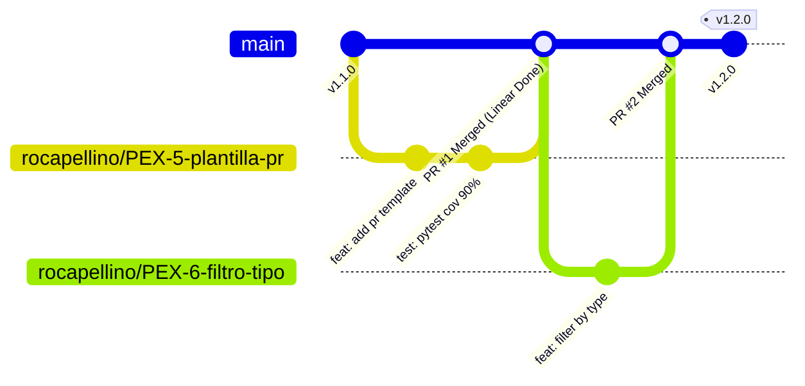
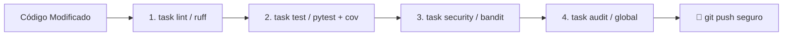
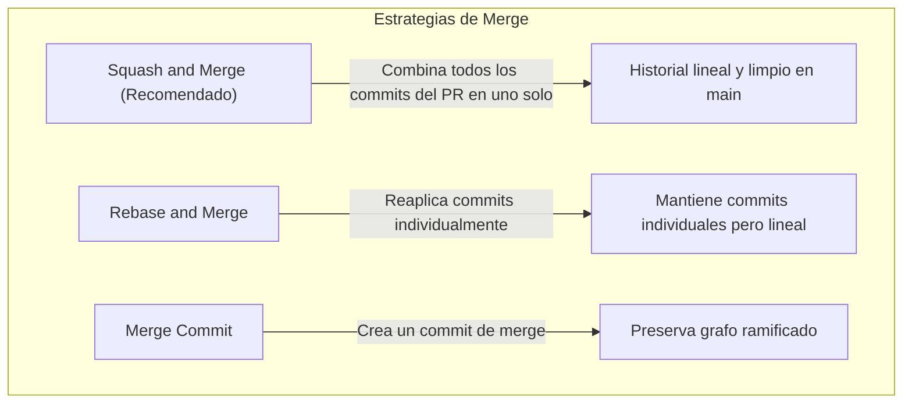

# 🌿 Guía de Mejores Prácticas para el Mantenimiento de Repositorios Git

Este documento define los lineamientos, flujos de trabajo y estándares de desarrollo para mantener un repositorio Git limpio, seguro, colaborativo y listo para integración continua (**CI/CD**), tomando como base el proyecto **Pokémon API**.

---

## 📑 Tabla de Contenidos
1. [Estrategia de Ramas & Integración con Linear](#1-estrategia-de-ramas--integración-con-linear)
2. [Estándar de Commits (Conventional Commits)](#2-estándar-de-commits-conventional-commits)
3. [Higiene del Repositorio y `.gitignore`](#3-higiene-del-repositorio-y-gitignore)
4. [Flujo de Pull Requests (PR) y Revisiones](#4-flujo-de-pull-requests-pr-y-revisiones)
5. [Proceso de Verificación y Validación Local (Shift-Left Testing)](#5-proceso-de-verificación-y-validación-local-shift-left-testing)
6. [Estrategias de Integración (Merge vs Squash vs Rebase)](#6-estrategias-de-integración-merge-vs-squash-vs-rebase)
7. [Versionado Semántico y Git Tags](#7-versionado-semántico-y-git-tags)
8. [Seguridad y Prevención de Fuga de Secretos](#8-seguridad-y-prevención-de-fuga-de-secretos)
9. [Guía Rápida de Comandos para el Equipo](#9-guía-rápida-de-comandos-para-el-equipo)

---

## 1. Estrategia de Ramas (Branching Strategy) & Integración con Linear

Para el proyecto utilizamos **GitHub Flow** combinado con la gestión ágil de tickets en **[Linear](https://linear.app)**, garantizando que la rama principal `main` siempre esté protegida y en estado desplegable.



### 1.1. Convención de Nomenclatura de Ramas
El formato de ramas está sincronizado con Linear bajo el patrón:
```text
<usuario>/<identificador-ticket>-<descripcion-corta>
```
* **Ejemplos:**
  - `rocapellino/PEX-5-configurar-plantilla-pr` (Feature asociada al ticket PEX-5 de Linear)
  - `rocapellino/PEX-12-fix-cache-ttl` (Bugfix asociado al ticket PEX-12)
  - `rocapellino/PEX-20-k6-stress-tests` (Pruebas de rendimiento)
* **Atajo en Linear:** Presiona `Ctrl + Shift + .` en cualquier ticket de Linear para copiar el nombre de rama automáticamente.

---

### 1.2. Protección de la Rama Principal (`main-protection` Ruleset)
La rama `main` cuenta con un **GitHub Ruleset Activo** ([`main-protection.json`](/.github/rulesets/main-protection.json)) que impone las siguientes políticas de seguridad:

1. 🚫 **Bloqueo de Deletions:** Imposible borrar la rama `main`.
2. 🚫 **Bloqueo de Force Pushes (`non_fast_forward`):** Prohibido `git push --force`.
3. 📋 **Pull Request Obligatorio:** Ningún cambio puede ser subido directamente a `main`.
4. 💬 **Resolución Obligatoria de Conversaciones:** Todos los comentarios de revisión (humanos o de IA Copilot) deben marcarse como resueltos.
5. 🛡️ **Quality Gates Obligatorios (Status Checks Estrictos):**
   * `🧪 Lint, Security & Unit Tests` (Pytest + Cobertura + Ruff + Bandit).
   * `🛡️ Gitleaks Secret Detection` (Detección de credenciales/secretos).
   * La rama debe estar sincronizada y actualizada con `main` antes de autorizar el merge.


---

## 2. Estándar de Commits (Conventional Commits)

Utilizar la especificación **Conventional Commits** para generar un historial legible, estructurado y que facilite la generación automática de CHANGELOGs.

### 2.1. Estructura del Mensaje
```text
<tipo>(<alcance opcional>): <descripción corta en imperativo>

[cuerpo opcional con detalles del cambio]

[pie opcional: referencias a issues, breaking changes]
```

### 2.2. Tipos de Commit Permitidos
| Tipo | Propósito | Ejemplo |
| :--- | :--- | :--- |
| `feat` | Nueva característica o endpoint | `feat(api): agregar endpoint GET /pokemons/habitat/<nombre>` |
| `fix` | Corrección de un bug | `fix(routes): corregir código de error 404 en DELETE` |
| `docs` | Cambios en documentación | `docs(readme): añadir instrucciones de ejecución con venv` |
| `test` | Añadir o modificar tests | `test(pytest): añadir pruebas unitarias para PUT /pokemons` |
| `refactor` | Refactorización de código sin cambiar comportamiento | `refactor(src): modularizar validación de esquema JSON` |
| `chore` | Tareas de mantenimiento, dependencias o config | `chore(deps): actualizar flask a version 3.0.3` |
| `ci` | Cambios en pipelines CI/CD o Docker | `ci(docker): agregar Dockerfile multi-stage y healthcheck` |
| `style` | Formato, espacios en blanco, comillas (sin cambio en lógica) | `style(app): formatear imports segun PEP 8` |

### 2.3. Principio del Commit Atómico
- ❌ **Evitar commits masivos:** "avances", "arreglos varios", "proyecto terminado".
- ✅ **Commits pequeños e independientes:** Cada commit debe resolver una sola unidad lógica. Si un commit rompe algo, debe ser fácil de revertir con `git revert` sin afectar otras funciones.

---

## 3. Higiene del Repositorio y `.gitignore`

El repositorio solo debe contener código fuente, configuración y documentación. Los binarios, artefactos generados y archivos del sistema deben ser ignorados.

### 3.1. Archivos que NUNCA deben commitearse
- Entornos virtuales: `.venv/`, `venv/`, `env/`
- Bytecode y caché de Python: `__pycache__/`, `*.pyc`, `.pytest_cache/`
- Archivos de configuración de IDE personal: `.vscode/`, `.idea/`
- Variables de entorno locales y secretos: `.env`, `.env.local`, llaves privadas `.pem`
- Reportes de cobertura y temporales: `htmlcov/`, `.coverage`, `*.log`

### 3.2. ¿Cómo limpiar archivos commiteados por error?
Si un archivo ignorado (ej. `.venv/` o `__pycache__/`) fue commiteado accidentalmente, se debe remover del seguimiento de Git sin borrar el archivo local:

```bash
# Remover del índice de git manteniendo el archivo en tu disco local
git rm -r --cached __pycache__/
git rm -r --cached .venv/

# Crear commit de limpieza
git commit -m "chore: eliminar archivos de cache y entorno virtual del seguimiento"
git push origin <rama>
```

---

## 4. Flujo de Pull Requests (PR) y Revisiones

Todo cambio debe integrarse mediante Pull Requests con una descripción clara y asociado a un ticket de Linear.

### 4.1. Plantilla de Pull Request ([`.github/pull_request_template.md`](/.github/pull_request_template.md))
Al abrir un PR en GitHub, la plantilla se carga automáticamente:

```markdown
## 📌 Issues Vinculados
- **Linear:** <!-- Ejemplo: PEX-5 / POK-12 -->
- **GitHub (opcional):** Closes #<!-- 123 -->

## 📝 Resumen de Cambios
<!-- Breve descripción de qué se implementó, refactorizó o corrigió -->

## 📦 Componentes Afectados
- [ ] `apps/api` (Backend FastAPI)
- [ ] `apps/web` (Frontend Web / Nginx)
- [ ] `infra` (Docker Compose / Monitorización)
- [ ] `docs` / Configuración CI/CD

## 🧪 Pruebas Realizadas
- [ ] Tests unitarios ejecutados (`pytest`)
- [ ] Linters y formato verificados (`ruff`)
- [ ] Verificado localmente en entorno Docker

---
> *Tip:* Si tienes habilitada la integración de Linear con GitHub, usar el formato de rama sugerido por Linear (`username/identifier-title`) vinculará automáticamente el PR al ticket.
```

---

## 5. Proceso de Verificación y Validación Local (*Shift-Left Testing*)

Antes de hacer `git push` y abrir el PR, el desarrollador debe ejecutar la batería de herramientas de validación local mediante el **Taskfile** (`task`):



### Comandos de Validación Local con Task:
| Validación | Comando con Task (`task`) | ¿Qué valida? |
|---|---|---|
| **Linter & Formato** | `task lint` / `task format` | Errores de sintaxis PEP8, imports y reglas de rendimiento con Ruff. |
| **Pruebas + Cobertura** | `task test` | Suite completa con Pytest y reporte de cobertura (`pytest-cov`). |
| **Seguridad SAST** | `task security` | Detección estática de vulnerabilidades e inyecciones con Bandit. |
| **Auditoría Global** | `task audit` | Ruff + Radon (Complejidad y Mantenibilidad) + Bandit + Duplicados. |
| **Pruebas de Estrés** | `task perf` | Benchmarking de endpoints y validación de SLAs con k6. |
| **Ecosistema TypeScript** | `task ts:lint` / `task ts:build` | Verificación de tipado y prototipos en experiments/ con esbuild. |

---

## 6. Estrategias de Integración (Merge vs Squash vs Rebase)

Al fusionar un Pull Request en `main`, existen tres opciones:



> [!TIP]
> **Recomendación para este proyecto:**
> - Usar **Squash and Merge** o **Merge Commit** según la magnitud de la feature.
> - Mantener la opción **Automatically delete head branches** activada en GitHub para eliminar ramas fusionadas y evitar ramas obsoletas (*stale branches*).

---

## 7. Versionado Semántico y Git Tags

Seguir la especificación [SemVer 2.0.0](https://semver.org/lang/es/): `vMAYOR.MENOR.PARCHE` (ej. `v1.1.0`).

- **MAYOR:** Cambios incompatibles con versiones anteriores (Breaking Changes en la API).
- **MENOR:** Nuevas funcionalidades retrocompatibles (herramientas de seguridad, testing, nuevos endpoints).
- **PARCHE:** Correcciones de errores retrocompatibles.

### 7.1. Creación de Tags Anotados
```bash
# Crear un tag anotado para una versión estable
git tag -a v1.1.0 -m "Release v1.1.0: Linear integration, DevOps pipelines, Security SCA/SAST, Pytest-Cov, k6 perf tests and DX tooling"

# Subir el tag al repositorio remoto
git push origin v1.1.0
```

---

## 8. Seguridad y Prevención de Fuga de Secretos

1. **Nunca commitear credenciales:** Tokens de GitHub, contraseñas de BD, claves JWT o API keys privadas jamás deben entrar al historial.
2. **Plantilla de variables (`.env.example`):** Proveer un archivo de ejemplo sin datos reales.
3. **Escaneo Automático:**
   - **Gitleaks:** Inspecciona commits en pre-commit y GitHub Actions.
   - **Bitnami Sealed Secrets (`kubeseal`):** Encripta credenciales antes de subirlas a Git.
   - **Trivy:** Escaneo de vulnerabilidades en imágenes Docker y librerías.

---

## 9. Guía Rápida de Comandos para el Equipo

### 1. Iniciar una nueva tarea desde Linear:
```bash
# 1. Asegurar tener la última versión de main
git checkout main
git pull origin main

# 2. Crear la rama copiando el formato de Linear (Ctrl + Shift + .)
git checkout -b rocapellino/PEX-10-nuevo-endpoint-berries
```

### 2. Trabajar y validar localmente antes de subir:
```bash
# Ejecutar validaciones locales
task lint
task test
task audit

# Si todo pasa en verde, añadir y commitear
git add .
git commit -m "feat(api): add berries endpoint and unit tests (PEX-10)"
```

### 3. Mantener tu rama al día con `main` antes del PR:
```bash
git fetch origin
git rebase origin/main
```

### 4. Publicar rama y abrir Pull Request:
```bash
git push -u origin rocapellino/PEX-10-nuevo-endpoint-berries
```
> Al abrir el PR en GitHub, se cargará la plantilla, el bot de Linear lo vinculará automáticamente y se dispararán los **Quality Gates** (`🧪 Lint, Security & Unit Tests` y `🛡️ Gitleaks`).


### Deshacer cambios locales de forma segura:
```bash
# Descartar cambios no guardados en un archivo específico
git restore src/app.py

# Deshacer el último commit local manteniendo los cambios en staging
git reset --soft HEAD~1
```

