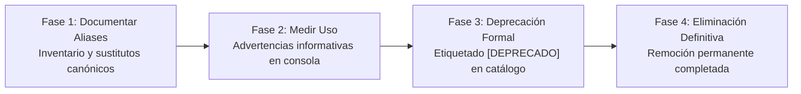

# ADR-020: Gobernanza Unificada de Despliegue, CLI Canónico con Taskfile y Retiro de Scripts Legados

## Estado

Aceptado (Activo — Consolida y absorbe ADR-026)

## Contexto

En fases tempranas de evolución del proyecto, la gestión del ciclo de vida de la aplicación y la infraestructura dependía de secuencias de comandos imperativas y dispersas: scripts bash (`scripts/proxmox_deploy.sh`, empaquetados ad-hoc de código fuente con `tar`/`rsync`) y playbooks de Docker Compose para entornos productivos.

Esta dispersión generaba tres problemas críticos de arquitectura y seguridad:

1. **Desvío de Configuración (*Configuration Drift*)**: La ejecución manual o semi-automatizada de scripts bash no garantizaba idempotencia ni control de versiones del estado real del clúster.
2. **Riesgo de Exfiltración de Secretos**: Los scripts de empaquetado o copia manual carecían de exclusiones forzadas de archivos `.env` y `.env.*`, abriendo vectores de fuga de credenciales.
3. **Fricción Cognitiva y Falta de Interfaz Canónica**: Los ingenieros debían memorizar comandos heterogéneos entre `npm`, `kubectl`, `helm`, `opentofu` y scripts locales. Asimismo, para compatibilidad histórica se habían introducido múltiples aliases de compatibilidad (`ts:*`, `tofu:*`, `docker:*`), fragmentando la documentación y la interfaz CLI.

Aunque los scripts legados de Compose y Proxmox fueron retirados en fases anteriores en favor de Kubernetes (ADR-001) y OpenTofu (ADR-004), la plataforma requería formalizar la gobernanza inmutable de herramientas, la interfaz canónica de CLI y la prohibición estricta de scripts de despliegue no versionados o imperativos.

## Decisión

Se adopta una **Gobernanza Unificada de Despliegue y Operaciones** sustentada en cuatro pilares arquitectónicos:

### 1. Interfaz Canónica de Operaciones (`Taskfile.yaml`) y `task --list` como Interfaz Oficial

`Taskfile.yaml` (y su arquitectura modular en `taskfiles/`) se consolida como la única interfaz de línea de comandos (CLI) oficial para desarrolladores y operadores:

- Tareas de ciclo de vida básico: `task install`, `task dev`, `task build`, `task start`, `task validate`.
- Tareas de ingeniería y calidad: `task test`, `task lint`, `task typecheck`, `task test:security`, `task perf`.
- Tareas de infraestructura y plataforma: `task k8s:status`, `task k8s:rollout-restart`, `task infra:validate`, `task infra:plan:proxmox`.
- Tareas de entrega continua GitOps: `task gitops:status`, `task gitops:sync:preprod`, `task gitops:pin`.
- Tareas de gobernanza: `task governance:audit-scripts`.

Se establece `task --list` (invocado también por defecto al ejecutar `task` sin argumentos) como la **única interfaz oficialmente soportada** para el descubrimiento, documentación e inspección de tareas operativas y de desarrollo en el repositorio.

### 2. Estrategia de Retiro de Aliases en Cuatro Fases (Completada)

Para evitar duplicidad y ambigüedad en los comandos de la CLI, se formalizó una estrategia en cuatro fases para extinguir los 18 aliases legados de compatibilidad (`ts:*`, `tofu:*`, `docker:*`, `deploy:proxmox`):

1. **Fase 1 (Documentación)**: Registro de equivalencias canónicas en [`docs/operations/TASKFILE_CLI_REFERENCE.md`](../operations/TASKFILE_CLI_REFERENCE.md).
2. **Fase 2 (Telemetría / Warnings)**: Inyección de avisos `⚠️  [DEPRECADO]` en terminal ante el uso de un alias.
3. **Fase 3 (Deprecación Formal)**: Marcado explícito de los comandos en el catálogo emitido por `task --list`.
4. **Fase 4 (Eliminación Definitiva - Ejecutada)**: Purga definitiva de los 18 aliases legados de `Taskfile.yaml`. La superficie del CLI queda exclusivamente restringida a los comandos canónicos oficiales.

### 3. Prohibición Terminante de Scripts Imperativos de Despliegue

- Queda estrictamente prohibido crear o incorporar scripts bash de despliegue imperativo (`deploy*.sh`, `*deploy.sh`, `deploy_aws.sh`, `deploy_proxmox.sh`, etc.) en la raíz o en cualquier subdirectorio.
- Todos los despliegues deben ser declarativos a través de Helm Charts parametrizados (`infra/helm/pokedex`) y aplicaciones de ArgoCD (`gitops/apps/`).
- La infraestructura base se gestiona exclusivamente como código (IaC) mediante OpenTofu (`infra/opentofu/`) y Ansible (`infra/ansible/`).

### 4. Delimitación Estricta del Directorio `scripts/` e Inventario en Lista Blanca

El directorio `scripts/` queda reservado exclusivamente para:

- Scripts auxiliares fuertemente tipados en TypeScript (ej. `scripts/k8s-rollout-restart.ts`, `scripts/dr-drill.ts`, `scripts/github-security-linear-sync.ts`, `scripts/sonar-linear-sync.ts`).
- La única secuencia shell autorizada en todo el repositorio: `scripts/dr_verify_restore.sh`, sujeta a validaciones estrictas de checksum SHA-256 y pruebas periódicas automatizadas (ADR-006).

Cualquier nuevo script `.sh` no contemplado en la lista blanca de gobernanza disparará un fallo *fail-closed* en los gates automatizados de CI (`tests/security/iac_baseline_security.test.ts`).

## Consecuencias

### Positivas

- **Operabilidad Homogénea**: Una única interfaz CLI canónica (`task <comando>`) y un catálogo limpio descubierto mediante `task --list`.
- **Cero Ambigüedad de Aliases**: Remoción total de deuda técnica al completar la Fase 4 de eliminación de aliases.
- **Prevención Activa de Deuda Técnica**: La lista blanca y el gate en CI impiden la proliferación de scripts efímeros o mal mantenidos.
- **Seguridad Garantizada**: Cero riesgo de despliegues imperativos que omitan escaneos SAST, firmas Cosign o verificaciones de admisión Kyverno.

### Compensaciones

- **Rigidez para Pruebas Rápidas**: Desarrolladores no pueden crear scripts `.sh` ad-hoc en el repo. *Mitigación*: Se incentiva el uso de tareas temporales en Taskfile o scripts TypeScript modulares.

---

## Trazabilidad y Decisiones Consolidadas

- **ADR-026 (Taskfile CLI Alias Deprecation and Lifecycle)**: Absorbido íntegramente en esta decisión. ADR-026 formalizó la estrategia de cuatro fases y el establecimiento de `task --list` como interfaz oficialmente soportada. Una vez completada la Fase 4 (eliminación definitiva de los 18 aliases legados), la decisión pasa a formar parte indivisible de la gobernanza unificada de operaciones.
