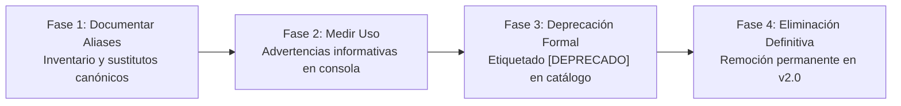

# ADR-026: Ciclo de Vida, Estrategia en Cuatro Fases y Deprecación de Aliases en Taskfile CLI

## Estado

Aceptado

## Contexto

Con la consolidación de `Taskfile.yml` como la interfaz unificada de línea de comandos (ADR-020), se incorporaron múltiples comandos canónicos para gobernar el ciclo de vida del monorepo, IaC con OpenTofu, automatización con Ansible, empaquetado Helm y GitOps con ArgoCD.

Para no romper los hábitos de desarrollo ni la compatibilidad con scripts históricos preexistentes, se introdujeron diversos aliases etiquetados como `[Alias compatibilidad]`, tales como:
- Comandos de infraestructura: `tofu:init:proxmox`, `tofu:plan:proxmox`, `tofu:apply:proxmox`, `tofu:init:aws`, `tofu:plan:aws`, `tofu:apply:aws`, `tofu:init:cloud`, `tofu:plan:cloud`, `tofu:apply:cloud`, `tofu:validate`.
- Comandos de aplicación TypeScript: `ts:install`, `ts:dev`, `ts:build`, `ts:start`, `ts:lint`.
- Comandos locales y de despliegue: `docker:up`, `docker:down`, `deploy:proxmox`.

Si bien estos aliases ofrecieron una rampa de adopción suave, mantener dos o más formas de ejecutar una misma operación genera fragmentación en la documentación, sobrecarga de mantenimiento cognitivo y ambigüedad sobre cuál es el contrato canónico.

No obstante, la eliminación inmediata de estos aliases rompería flujos en entornos de desarrolladores u operaciones que aún dependen de la nomenclatura anterior. Se requiere una estrategia evolutiva y controlada de retiro.

## Decisión

Se adopta una gobernanza de ciclo de vida para los comandos de la CLI estructurada en los siguientes pilares:

### 1. Interfaz Oficialmente Soportada: `task --list`

Se establece `task --list` (invocado también por defecto al ejecutar `task` sin argumentos) como la **única interfaz oficialmente soportada** para el descubrimiento, documentación e inspección de tareas operativas y de desarrollo en el repositorio.

Toda documentación del proyecto y guías operativas deben referenciar exclusivamente los comandos canónicos expuestos en el catálogo principal.

### 2. Estrategia de Deprecación y Retiro en Cuatro Fases

Se formaliza una estrategia en cuatro fases para gobernar el ciclo de vida de los aliases de compatibilidad:

1. **Fase 1 - Documentar Aliases**:
   - Inventariar exhaustivamente todos los aliases históricos y sus contrapartes canónicas en [`docs/operations/TASKFILE_CLI_REFERENCE.md`](../operations/TASKFILE_CLI_REFERENCE.md).
   - Estandarizar toda la documentación existente (`infra/README.md`, `PROXMOX_DEPLOYMENT_GUIDE.md`, plantillas de PR) para que utilice únicamente comandos canónicos.

2. **Fase 2 - Medir Uso y Telemetría Informativa**:
   - Instrumentar cada alias en `Taskfile.yml` con un aviso visible en consola (`⚠️  [DEPRECADO] 'task <alias>' es un alias legado. Use 'task <canónico>'.`).
   - Esto advierte inmediatamente al operador o script sobre la forma canónica sin interrumpir la ejecución ni alterar el código de retorno.

3. **Fase 3 - Deprecación Formal**:
   - Marcar explícitamente en el metadato `desc:` de cada alias la leyenda `[DEPRECADO]`, visible en el catálogo emitido por `task --list`.
   - Garantizar la compatibilidad hacia atrás durante todo el ciclo mayor `v1.x`.

4. **Fase 4 - Eliminación Definitiva (v2.0)**:
   - Programar la eliminación definitiva de las entradas de alias en el release mayor `v2.0` del proyecto, una vez que la telemetría y auditorías de CI confirmen uso nulo.

### 3. Matriz de Correspondencia Canónica

| Alias Histórico Deprecado | Comando Canónico Oficial | Rol Operativo |
| :--- | :--- | :--- |
| `tofu:init:proxmox` | `infra:validate` *(o tofu init)* | Inicialización de providers en Proxmox |
| `tofu:plan:proxmox` | `infra:plan:proxmox` | Generación de plan IaC en Proxmox VE |
| `tofu:apply:proxmox` | `infra:apply:proxmox` | Aplicación de cambios IaC en Proxmox VE |
| `tofu:init:aws` | `infra:validate` *(o tofu init)* | Inicialización de providers en AWS EKS |
| `tofu:plan:aws` | `infra:plan:aws` | Generación de plan IaC en AWS EKS |
| `tofu:apply:aws` | `infra:apply:aws` | Aplicación de cambios IaC en AWS EKS |
| `tofu:init:cloud` | `infra:validate` | Alias histórico de nube |
| `tofu:plan:cloud` | `infra:plan:aws` | Plan de nube (AWS EKS) |
| `tofu:apply:cloud` | `infra:apply:aws` | Aplicación de cambios en nube (AWS EKS) |
| `tofu:validate` | `infra:validate` | Validación sintáctica global de OpenTofu |
| `ts:install` | `install` | Instalación limpia con `npm ci` |
| `ts:dev` | `dev` | Servidor interactivo de desarrollo |
| `ts:build` | `build` | Compilación y bundling de producción |
| `ts:start` | `start` | Ejecución del bundle de producción |
| `ts:lint` | `lint` | Validación estricta de linter y tipos |
| `docker:up` | `dev:compose` | Entorno local interactivo con Docker Compose |
| `docker:down` | `dev:compose:down` | Detención de contenedores locales Docker |
| `deploy:proxmox` | `ansible:prepare` | Aprovisionamiento de baseline en nodo Proxmox |

## Consecuencias

### Positivas

- **Claridad Arquitectónica**: Existe una única interfaz canónica oficial para cada operación, reduciendo la fricción cognitiva y errores de operación.
- **Transición Transparente y sin Fricción**: Ningún comando preexistente deja de funcionar en `v1.x`, evitando romper pipelines o flujos locales de trabajo.
- **Concientización Activa**: Los desarrolladores y operadores son advertidos proactivamente en la terminal con la alternativa canónica en el momento exacto de ejecutar un alias.
- **Superficie de Mantenimiento Delimitada**: Se establece un hito claro (`v2.0`) para la remoción definitiva de deuda técnica.

### Negativas / Mitigaciones

- **Salida Adicional en Terminal**: Los comandos deprecados generan una línea adicional de advertencia en consola. *Mitigación*: La advertencia es concisa, utiliza un emoji visible (`⚠️`) y no interfiere con la captura de salidas estándar ni códigos de retorno.
