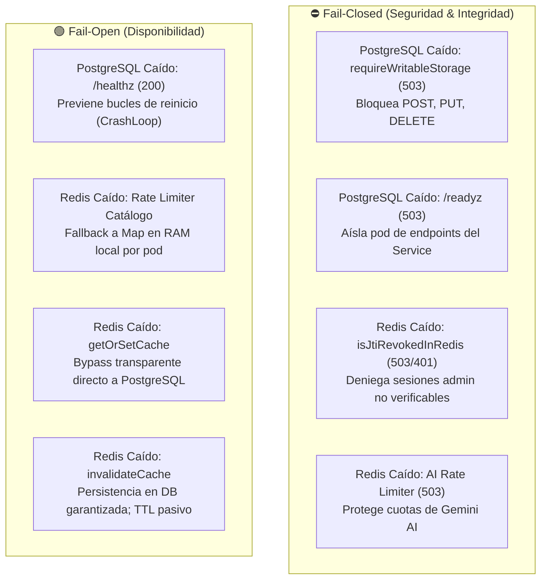

# ADR-027: Formalización de Contratos de Resiliencia: Fail-Open vs. Fail-Closed en Backend y Frontend

## Estado

Aceptado

## Contexto

A medida que la infraestructura de la Pokédex alcanzó madurez operativa (Kubernetes K3s bimodal, Vault, Cilium L7, ArgoCD, monitoreo Prometheus/Grafana), surgió la necesidad crítica de resolver la deuda técnica acumulada en la capa de aplicación:

1. **Frontend**: Existía duplicación de código entre la vista de usuario ([`apps/frontend/src/pokedex.ts`](../../apps/frontend/src/pokedex.ts)) y la interfaz de gestión administrativa ([`apps/frontend/src/backoffice.ts`](../../apps/frontend/src/backoffice.ts)), particularmente en normalización de strings, mapeo de colores de tipos elementales, renderizado de insignias (badges), formateo de IDs, invocaciones a la API REST, manejo unificado de errores y notificaciones toast.
2. **Backend**: Aunque el servidor implementaba protecciones avanzadas contra caídas de dependencias, no existía una especificación contractual formal sobre la postura del sistema ante la indisponibilidad de PostgreSQL o Redis. Esto generaba ambigüedad sobre cuándo el sistema debe operar en modo **Fail-Closed** (rechazando solicitudes para salvaguardar la seguridad o integridad) versus **Fail-Open** (degradando con gracia para preservar la disponibilidad del servicio).

## Decisión

Se adoptan formalmente las siguientes decisiones arquitectónicas para la aplicación:

### 1. Convergencia Modular en Frontend (`apps/frontend/src/shared/`)

Se refactoriza el código duplicado del frontend hacia una suite de módulos compartidos de alta cohesión y bajo acoplamiento:
* **`constants.ts`**: Paleta canónica de colores por tipo elemental (`TYPE_COLORS`), colores por defecto y límites de generaciones Pokémon.
* **`formatters.ts`**: Utilidades puras libres de efectos secundarios para normalización tipográfica (`normalizeStr`), resolución de color (`getTypeColor`), asignación de generación (`getGeneration`) y formateo consistente de identificadores numéricos (`formatPokemonId`).
* **`ui.ts`**: Funciones reutilizables de manipulación del DOM para toasts no intrusivos (`showToast`), insignias de tipos elementales (`renderTypeBadge`, `renderTypeBadges`) y estados vacíos estandarizados (`renderEmptyState`).
* **`api.ts`**: Cliente HTTP unificado y fuertemente tipado para operaciones de catálogo, autenticación administrativa sin exposición de tokens, y operaciones CRUD con manejo estructurado de errores (`ApiError`).
* **`index.ts`**: Barrel de exportación consumido directamente por `pokedex.ts` y `backoffice.ts`.

El bundler Vite genera automáticamente un chunk compartido (`shared-*.js`), optimizando el tiempo de carga y la memoria de ejecución en el navegador.

### 2. Contrato Formal de Resiliencia en Backend (Fail-Open vs. Fail-Closed)

Se ratifica la matriz de comportamiento del backend documentada exhaustivamente en [`docs/architecture/FAIL_OPEN_VS_FAIL_CLOSED_CONTRACTS.md`](../architecture/FAIL_OPEN_VS_FAIL_CLOSED_CONTRACTS.md):

1. **Almacenamiento Persistente (PostgreSQL)**:
   * **Fail-Closed en Escritura (`503 Service Unavailable`)**: `POST`, `PUT` y `DELETE` se rechazan inmediatamente mediante el middleware `requireWritableStorage`. Prohibido el almacenamiento en memoria volátil para prevenir split-brain o pérdida de datos ante reinicio de pods.
   * **Fail-Closed en Tráfico Ingress (`/readyz`)**: El pod reporta `503` y Kubernetes lo retira del balanceo de carga.
   * **Fail-Open en Ciclo de Vida (`/healthz`)**: Retorna `200 OK` para evitar que K8s mate y reinicie el contenedor en bucle mientras la base de datos se recupera.

2. **Caché y Coordinación Distribuida (Redis)**:
   * **Fail-Closed en Revocación de Sesión (`503 / 401`)**: Si Redis está configurado pero inaccesible, el backend no puede confirmar si un token JWT/jti fue invalidado. La solicitud se deniega preventivamente.
   * **Fail-Closed en Rate Limiting de IA (`503`)**: Protege las cuotas externas y costos de Google Gemini mediante `failClosedOnRedisOutage: true`.
   * **Fail-Open con Fallback Local en Catálogo Público**: El limitador de peticiones del catálogo conmuta de forma transparente al almacén en memoria local (`Map<string, RateLimitEntry>`), garantizando navegación fluida a los usuarios.
   * **Fail-Open en Caché e Invalidación**: Si Redis cae, las lecturas consultan directamente a PostgreSQL. Las mutaciones persisten en PostgreSQL y los errores de invalidación se absorben, garantizando consistencia eventual acotada por el TTL de las claves (máximo 60s).

## Consecuencias

### Positivas
* **Reducción Drástica de Deuda Técnica**: El código del frontend queda unificado, fácil de mantener y probar.
* **Predecibilidad Operativa Total**: Tanto los operadores SRE como los desarrolladores disponen de un contrato explícito que define cómo responde cada subsistema ante caídas de DB o Redis.
* **Seguridad Robusta Sin Sacrificar Disponibilidad**: Las operaciones que implican riesgos de seguridad o costos financieros fallan de forma cerrada, mientras que el catálogo público prioriza la alta disponibilidad mediante fallbacks locales.

### Negativas / Mitigaciones
* **Degradación Parcial Bajo Caída de Redis**: Si Redis se desconecta, las acciones de backoffice y consultas de IA no estarán disponibles temporalmente hasta restablecer la conectividad. Esto es deliberado y constituye la decisión de diseño correcta para salvaguardar la seguridad y el presupuesto.
