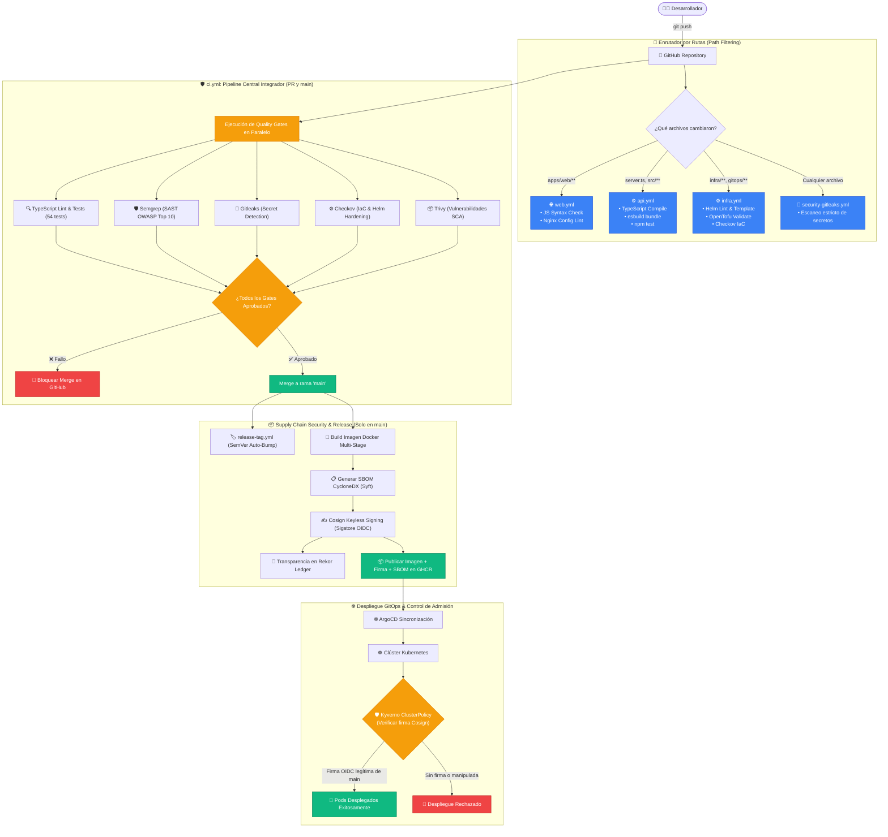

# 🤖 Guía Completa de Workflows de GitHub Actions y DevSecOps

Esta guía explica en detalle **qué son, para qué sirven y cómo funcionan** los pipelines de Integración Continua, Entrega Continua y Seguridad de la Cadena de Suministro (CI/CD/DevSecOps) configurados en [`.github/workflows/`](file:///.github/workflows/) de este repositorio.

---

## 📑 Tabla de Contenidos
1. [Estrategia de Monorepo y Filtrado por Rutas (`paths`)](#1-estrategia-de-monorepo-y-filtrado-por-rutas-paths)
2. [Diagrama de Ejecución y Flujo DevSecOps de Punta a Punta](#2-diagrama-de-ejecución-y-flujo-devsecops-de-punta-a-punta)
3. [Catálogo de Workflows del Proyecto](#3-catálogo-de-workflows-del-proyecto)
   * [3.1. ⚙️ `api.yml` (Backend API CI)](#31--apiyml-backend-api-ci)
   * [3.2. 🌐 `web.yml` (Frontend Web CI)](#32--webyml-frontend-web-ci)
   * [3.3. ⚙️ `infra.yml` (Infrastructure & IaC CI)](#33-️-infrayml-infrastructure--iac-ci)
   * [3.4. 🔐 `security-gitleaks.yml` (Secret Scanning)](#34--security-gitleaksyml-secret-scanning)
   * [3.5. 🚀 `ci.yml` (Monorepo CI, SBOM, Cosign & Supply Chain)](#35--ciyml-monorepo-ci-sbom-cosign--supply-chain)
   * [3.6. 🛡️ `security-trivy.yml` (Vulnerability Scan SCA & Container)](#36-️-security-trivyyml-vulnerability-scan-sca--container)
   * [3.7. 🏷️ `release-tag.yml` (Automated Semantic Release)](#37-️-release-tagyml-automated-semantic-release)
   * [3.8. 📌 `dependabot-linear-sync.yml` (Bot PRs to Linear Sync)](#38--dependabot-linear-syncyml-bot-prs-to-linear-sync)
4. [Integración con Linear (Issue Tracking)](#4-integración-con-linear-issue-tracking)
5. [Resolución de Errores y Diagnóstico en CI](#5-resolución-de-errores-y-diagnóstico-en-ci)

---

## 1. Estrategia de Monorepo y Filtrado por Rutas (`paths`)

Como este proyecto aloja backend (`server.ts`, `src/`), frontend (`apps/web/`), infraestructura (`infra/`, `gitops/`) y scripts en un solo monorepo, se implementa **Path Filtering** inteligente:
* **Cambios en Backend:** Activan exclusivamente [`api.yml`](file:///.github/workflows/api.yml).
* **Cambios en Frontend:** Activan exclusivamente [`web.yml`](file:///.github/workflows/web.yml).
* **Cambios en Infraestructura / Helm:** Activan exclusivamente [`infra.yml`](file:///.github/workflows/infra.yml).
* **Cambios transversales o Pull Requests a `main`:** Disparan [`ci.yml`](file:///.github/workflows/ci.yml) ejecutando la suite completa de calidad, seguridad y firmado.
* **Cualquier Commit:** Ejecuta [`security-gitleaks.yml`](file:///.github/workflows/security-gitleaks.yml).

---

## 2. Diagrama de Ejecución y Flujo DevSecOps de Punta a Punta

---

## 3. Catálogo de Workflows del Proyecto

### 3.1. ⚙️ [`api.yml`](file:///.github/workflows/api.yml) (Backend API CI)
* **Triggers:** Cambios en `server.ts`, `src/**`, `package.json`, `package-lock.json`, `tsconfig.json`.
* **Pasos:** Checkout, configuración de Node.js 22 LTS, `npm ci`, verificación de tipos (`tsc --noEmit`), compilación esbuild (`npm run build`), ejecución de tests (`npm test`) y auditoría de seguridad `npm audit --audit-level=high`.

### 3.2. 🌐 [`web.yml`](file:///.github/workflows/web.yml) (Frontend Web CI)
* **Triggers:** Cambios en `apps/web/**`.
* **Pasos:** Chequeo estricto de sintaxis de JavaScript (`node -c apps/web/public/js/*.js`), validación de configuración de Nginx (`nginx -t`).

### 3.3. ⚙️ [`infra.yml`](file:///.github/workflows/infra.yml) (Infrastructure & IaC CI)
* **Triggers:** Cambios en `infra/**`, `gitops/**`.
* **Pasos:** Helm CLI lint (`helm lint infra/helm/pokedex`), renderizado de templates con valores de desarrollo y producción (`helm template`), validación de sintaxis OpenTofu/Terraform y auditoría IaC con Checkov.

### 3.4. 🔐 [`security-gitleaks.yml`](file:///.github/workflows/security-gitleaks.yml) (Secret Scanning)
* **Triggers:** Todos los commits y PRs.
* **Pasos:** Ejecuta Gitleaks con reglas de [`.gitleaks.toml`](file:///.gitleaks.toml) para detectar claves privadas, tokens y credenciales expuestas en el historial.

### 3.5. 🚀 [`ci.yml`](file:///.github/workflows/ci.yml) (Monorepo CI, SBOM, Cosign & Supply Chain)
* **Triggers:** Pull Requests y pushes a `main`.
* **Etapas:**
  1. **Auditoría de Calidad y Complejidad:** Ejecuta `tsc`, compilación `esbuild` y `npm test`.
  2. **Análisis Estático SAST:** Ejecuta **Semgrep** para detectar fallas OWASP Top 10.
  3. **Seguridad IaC:** Ejecuta **Checkov** sobre manifiestos de Kubernetes y Helm.
  4. **Construcción y Escaneo de Contenedores:** Construye la imagen Docker y la escanea con **Trivy** (falla si hay vulnerabilidades CRITICAL/HIGH).
  5. **Firmado Criptográfico (Solo en `main`):**
     * Genera el **SBOM CycloneDX** con **Syft**.
     * Firma la imagen en modo Keyless con **Cosign** usando la identidad OIDC de GitHub Actions (`ci.yml@refs/heads/main`).
     * Registra la transparencia en el ledger público **Rekor** (`https://rekor.sigstore.dev`).
     * Publica imagen, firma y atestaciones en **GHCR**.

### 3.6. 🛡️ [`security-trivy.yml`](file:///.github/workflows/security-trivy.yml) (Escaneo Periódico de CVEs)
* **Triggers:** Cambios en dependencias o ejecución programada semanal.

### 3.7. 🏷️ [`release-tag.yml`](file:///.github/workflows/release-tag.yml) (Versionado Semántico Automático)
* **Triggers:** Push directo / merge a `main`.
* **Pasos:** Analiza commits convencionales (`feat:`, `fix:`, `perf:`), calcula el incremento SemVer y publica el **GitHub Release** con Git Tag asociado.

### 3.8. 📌 [`dependabot-linear-sync.yml`](file:///.github/workflows/dependabot-linear-sync.yml) (Sincronización con Linear)
* **Triggers:** Apertura de PR por bots de dependencias (Renovate / Dependabot).
* **Pasos:** Crea un ticket correlativo en Linear (`PER-X`) vinculado al PR para seguimiento centralizado.

---

## 4. Integración con Linear (Issue Tracking)

* **Convención de Ramas:** `<usuario>/<ticket-id>-<descripcion>` (ej: `rocapellino/PER-12-cosign-hardening`).
* **Vinculación Automática:** Al abrir el PR, el bot de Linear actualiza el estado a *In Review*. Al mergear a `main`, pasa a *Done*.

---

## 5. Resolución de Errores y Diagnóstico en CI

1. **Error en Quality Gate `Auditoría de Calidad`:**
   * Ejecutar localmente `npm run lint` y `npm test` para reproducir el fallo de tipado o prueba unitaria.
2. **Error en `Gitleaks`:**
   * Un archivo contiene un patrón similar a un secreto. Revisar el log para identificar el archivo y eliminar la credencial.
3. **Error en `Cosign / Kyverno`:**
   * Comprobar que el Pod en Kubernetes esté intentando descargar una imagen construida desde `main` con firma válida registrada en Rekor.
