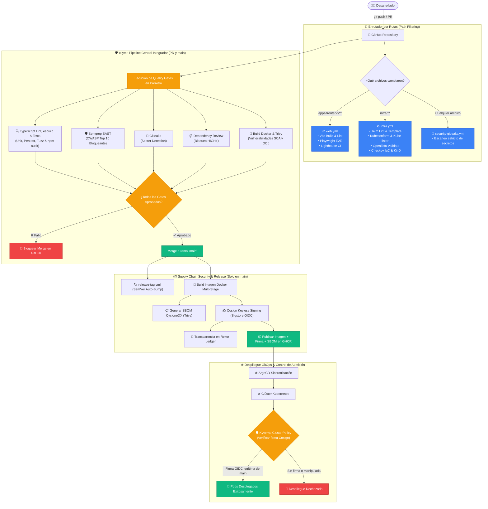

# 🤖 Guía Completa de Workflows de GitHub Actions y DevSecOps

Esta guía explica en detalle **qué son, para qué sirven y cómo funcionan** los pipelines de Integración Continua, Entrega Continua y Seguridad de la Cadena de Suministro (CI/CD/DevSecOps) configurados en [`.github/workflows/`](../../.github/workflows) de este repositorio.

---

## 📑 Tabla de Contenidos

1. [Estrategia de Monorepo y Filtrado por Rutas (`paths`)](#1-estrategia-de-monorepo-y-filtrado-por-rutas-paths)
2. [Diagrama de Ejecución y Flujo DevSecOps de Punta a Punta](#2-diagrama-de-ejecución-y-flujo-devsecops-de-punta-a-punta)
3. [Catálogo de Workflows del Proyecto](#3-catálogo-de-workflows-del-proyecto)
   * [3.1. 🌐 `web.yml` (Frontend Web CI)](#31--webyml-frontend-web-ci)
   * [3.2. ⚙️ `infra.yml` (Infrastructure & IaC CI)](#32-️-infrayml-infrastructure--iac-ci)
   * [3.3. 🔐 `security-gitleaks.yml` (Secret Scanning)](#33--security-gitleaksyml-secret-scanning)
   * [3.4. 🚀 `ci.yml` (Monorepo CI, Gates Bloqueantes, SBOM, Cosign & Supply Chain)](#34--ciyml-monorepo-ci-gates-bloqueantes-sbom-cosign--supply-chain)
   * [3.5. 🛡️ `security-trivy.yml` (Escaneo Programado de Vulnerabilidades)](#35-️-security-trivyyml-escaneo-programado-de-vulnerabilidades)
   * [3.6. 🏷️ `release-tag.yml` (Versionado Semántico Automático)](#36-️-release-tagyml-versionado-semántico-automático)
   * [3.7. ⚡ `performance-k6.yml` (Pruebas de Carga y Rendimiento)](#37--performance-k6yml-pruebas-de-carga-y-rendimiento)
4. [Hardening de la Cadena de Suministro (Supply Chain Hardening)](#4-hardening-de-la-cadena-de-suministro-supply-chain-hardening)
   * [4.1. SHA Pinning en GitHub Actions](#41-sha-pinning-en-github-actions)
   * [4.2. Dependency Review Gate](#42-dependency-review-gate)
   * [4.3. Renovate Bot con Cooldown y Gobernanza Automatizada](#43-renovate-bot-con-cooldown-y-gobernanza-automatizada)
5. [Integración con Linear & Slack (Issue Tracking & ChatOps)](#5-integración-con-linear--slack-issue-tracking--chatops)
6. [Resolución de Errores y Diagnóstico en CI](#6-resolución-de-errores-y-diagnóstico-en-ci)

---

## 1. Estrategia de Monorepo y Filtrado por Rutas (`paths`)

Como este proyecto aloja backend (`apps/backend/`), frontend (`apps/frontend/`), infraestructura (`infra/`, `gitops/`) y scripts en un solo monorepo estructurado con npm workspaces, se implementa una estrategia optimizada de pipelines sin ejecuciones redundantes (remediación `CI-001`):

* **Cambios en Frontend (`apps/frontend/**`):** Activan [`web.yml`](../../.github/workflows/web.yml) para linting, build Vite y pruebas E2E con Playwright y Lighthouse.
* **Cambios en Infraestructura (`infra/**`):** Activan [`infra.yml`](../../.github/workflows/infra.yml) para validación exhaustiva de Helm, OpenTofu, Ansible, esquemas Kubeconform, Kube-linter, Kyverno, escaneo CIS con Checkov e integración KinD.
* **Pull Requests y Pushes a `main`:** Disparan el pipeline central unificado [`ci.yml`](../../.github/workflows/ci.yml) ejecutando análisis estático, tipado, compilación esbuild, tests de unidad/seguridad/fuzzing, `npm audit`, Semgrep SAST, Dependency Review, empaquetado Docker y firma criptográfica Cosign.
* **Cualquier Commit:** Ejecuta [`security-gitleaks.yml`](../../.github/workflows/security-gitleaks.yml) para detección temprana de credenciales.

---

## 2. Diagrama de Ejecución y Flujo DevSecOps de Punta a Punta

---

## 3. Catálogo de Workflows del Proyecto

### 3.1. 🌐 `web.yml` (Frontend Web CI)

* **Archivo:** [`web.yml`](../../.github/workflows/web.yml)
* **Triggers:** Cambios en `apps/frontend/**`, `tests/e2e/**`, `playwright.config.ts`, `lighthouserc.json`.
* **Pasos:** Compilación de assets con Vite, linter de configuración Nginx y ejecución de tests E2E y auditoría de accesibilidad Axe-core con Playwright.

### 3.2. ⚙️ `infra.yml` (Infrastructure & IaC CI)

* **Archivo:** [`infra.yml`](../../.github/workflows/infra.yml)
* **Triggers:** Cambios en `infra/**`.
* **Pasos:** Helm CLI lint (`helm lint`), renderizado de plantillas Zero-Trust (`helm template`), validación estricta de esquemas OpenAPI con **Kubeconform**, auditoría de buenas prácticas con **Kube-Linter**, pruebas de admisión con **Kyverno CLI**, formateo y validación de **OpenTofu**, syntax-check de **Ansible**, auditoría de seguridad IaC con **Checkov** e integración end-to-end sobre clúster efímero **KinD**.

### 3.3. 🔐 `security-gitleaks.yml` (Secret Scanning)

* **Archivo:** [`security-gitleaks.yml`](../../.github/workflows/security-gitleaks.yml)
* **Triggers:** Todos los commits y PRs.
* **Pasos:** Gitleaks con reglas de [`.gitleaks.toml`](../../.gitleaks.toml) analizando el historial completo para evitar fuga de credenciales o API keys.

### 3.4. 🚀 `ci.yml` (Monorepo CI, Gates Bloqueantes, SBOM, Cosign & Supply Chain)

* **Archivo:** [`ci.yml`](../../.github/workflows/ci.yml)
* **Triggers:** Pull Requests y pushes a `main`.
* **Etapas:**
  1. **Auditoría de Calidad:** `tsc --noEmit`, compilación `esbuild`, `npm test` (unit, pentest, contratos), `npm run test:fuzz` (fuzzing DAST) y `npm audit --audit-level=high --omit=dev`.
  2. **Análisis Estático SAST (Bloqueante):** **Semgrep** analiza el código contra reglas de OWASP Top 10 y detiene el pipeline ante fallos de seguridad.
  3. **Dependency Review Gate (Bloqueante):** Bloquea automáticamente PRs que introduzcan vulnerabilidades `HIGH` o `CRITICAL` en dependencias nuevas o modificadas.
  4. **Construcción y Escaneo de Contenedores:** Construcción multi-stage de la imagen Docker y escaneo con **Trivy** (SCA y OS CVEs).
  5. **Firmado Criptográfico y Publicación OCI (Solo en `main`):**
     * Generación del **SBOM CycloneDX** con **Trivy**.
     * Firma Keyless de la imagen y del Helm Chart OCI con **Cosign** usando OIDC de GitHub Actions (`ci.yml@refs/heads/main`).
     * Atestación criptográfica de SBOM en el registro OCI.
     * Publicación en **GHCR** y registro de transparencia en **Rekor**.

### 3.5. 🛡️ `security-trivy.yml` (Escaneo Programado de Vulnerabilidades)

* **Archivo:** [`security-trivy.yml`](../../.github/workflows/security-trivy.yml)
* **Triggers:** Escaneo programado periódico de CVEs sobre filesystem y dependencias.

### 3.6. 🏷️ `release-tag.yml` (Versionado Semántico Automático)

* **Archivo:** [`release-tag.yml`](../../.github/workflows/release-tag.yml)
* **Triggers:** Push directo / merge a `main`.
* **Pasos:** Analiza commits convencionales (`feat:`, `fix:`, `perf:`), calcula el incremento SemVer y publica el **GitHub Release** con Git Tag asociado.

### 3.7. ⚡ `performance-k6.yml` (Pruebas de Carga y Rendimiento)

* **Archivo:** [`performance-k6.yml`](../../.github/workflows/performance-k6.yml)
* **Triggers:** Ejecución manual o programada para validar métricas de latencia p95 y resistencia bajo carga con scripts k6.

---

## 4. Hardening de la Cadena de Suministro (Supply Chain Hardening)

### 4.1. SHA Pinning en GitHub Actions

Todas las dependencias de GitHub Actions en los workflows están ancladas por su **hash SHA completo e inmutable** en lugar de tags mutables (ej: `actions/checkout@11bd71901bbe5b1630ceea73d27597364c9af683 # v4.2.2`), protegiendo el repositorio contra secuestro de tags en repositorios de terceros.

### 4.2. Dependency Review Gate

El workflow [`ci.yml`](../../.github/workflows/ci.yml) incorpora el gate de revisión de dependencias:

* Falla de forma bloqueante si un PR introduce paquetes con CVEs calificados como `moderate`, `high` o `critical`.
* Previene la introducción de paquetes comprometidos antes de que el código llegue a `main`.

### 4.3. Renovate Bot con Cooldown y Gobernanza Automatizada

* **Renovate Bot ([`renovate.json`](../../renovate.json)):** Centraliza la gestión unificada y programada de dependencias en todos los ecosistemas del proyecto (`npm`, `dockerfile`, `github-actions`, `helm` y `terraform/opentofu`).
* **Cooldown de 7 Días (`minimumReleaseAge: "7 days"`):** Garantiza que cualquier versión nueva permanezca en observación comunitaria durante 7 días antes de abrir un PR, mitigando riesgos de supply chain poisoning.
* **Ventana Programada:** Ejecución semanal los lunes antes de las 06:00 AM (ART).
* **Auto-Merge Controlado:** Restringido **exclusivamente a parches (`patch`) de dependencias npm**. Las actualizaciones menores, mayores, imágenes Docker, OpenTofu y GitHub Actions requieren aprobación humana explícita (`manual-review-required`, `infra-supply-chain-review`).

---

## 5. Integración con Linear & Slack (Issue Tracking & ChatOps)

* **Convención de Ramas:** `<usuario>/<ticket-id>-<descripcion>` (ej: `rocapellino/PEX-15-network-zero-trust`).
* **Vinculación Automática:** Al abrir el PR, el bot de Linear actualiza el estado a *In Review*. Al mergear a `main`, pasa a *Done*.
* **Notificaciones ChatOps en Slack:**
  * La aplicación de Linear para Slack retransmite eventos de los tickets (`PEX-X`) directamente al canal de ingeniería del equipo.
  * Los pipelines automatizados ([`renovate-linear-sync.yml`](../../.github/workflows/renovate-linear-sync.yml) y [`sonar-linear-sync.yml`](../../.github/workflows/sonar-linear-sync.yml)) reportan hallazgos creando tickets automáticos en Linear, que a su vez generan alertas inmediatas en Slack.
  * Cuando los PRs son mergeados o cerrados, la sincronización bidireccional actualiza el ticket a `Done` o `Canceled` y publica el resultado en Slack sin requerir gestión manual.

---

## 6. Resolución de Errores y Diagnóstico en CI

1. **Error en Quality Gate `Auditoría de Calidad`:**
   * Ejecutar localmente `npm run lint`, `npm test` y `npm run test:fuzz` para reproducir el fallo de tipado, prueba lógica o fuzzing.
2. **Error en `Gitleaks`:**
   * Un archivo contiene un patrón similar a un secreto. Revisar el log para identificar el archivo y eliminar la credencial.
3. **Error en `Cosign / Kyverno`:**
   * Comprobar que el Pod en Kubernetes esté intentando descargar una imagen construida desde `main` con firma válida registrada en Rekor.
