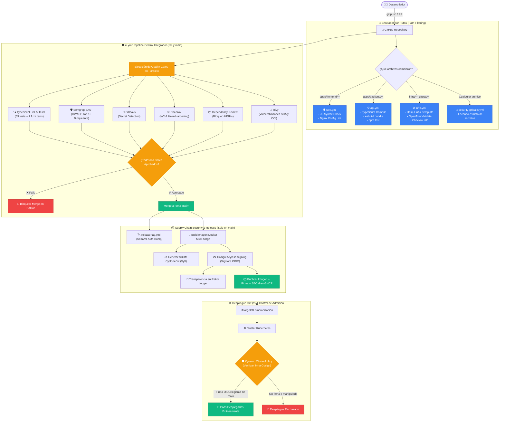

# 🤖 Guía Completa de Workflows de GitHub Actions y DevSecOps

Esta guía explica en detalle **qué son, para qué sirven y cómo funcionan** los pipelines de Integración Continua, Entrega Continua y Seguridad de la Cadena de Suministro (CI/CD/DevSecOps) configurados en [`.github/workflows/`](file:///.github/workflows/) de este repositorio.

---

## 📑 Tabla de Contenidos
1. [Estrategia de Monorepo y Filtrado por Rutas (`paths`)](#1-estrategia-de-monorepo-y-filtrado-por-rutas-paths)
2. [Diagrama de Ejecución y Flujo DevSecOps de Punta a Punta](#2-diagrama-de-ejecución-y-flujo-devsecops-de-punta-a-punta)
3. [Catálogo de Workflows del Proyecto](#3-catálogo-de-workflows-del-proyecto)
   * [3.1. ⚙️ `api.yml` (Backend API CI)](#31--apiyml-backend-api-ci)
   * [3.2. 🌐 `web.yml` (Frontend Web CI)](#32--webyml-frontend-web-ci)
   * [3.3. ⚙️ `infra.yml` (Infrastructure & IaC CI)](#33-️-infrayml-infrastructure--iac-ci)
   * [3.4. 🔐 `security-gitleaks.yml` (Secret Scanning)](#34--security-gitleaksyml-secret-scanning)
   * [3.5. 🚀 `ci.yml` (Monorepo CI, Gates Bloqueantes, SBOM, Cosign & Supply Chain)](#35--ciyml-monorepo-ci-gates-bloqueantes-sbom-cosign--supply-chain)
   * [3.6. 🛡️ `security-trivy.yml` (Vulnerability Scan SCA & Container)](#36-️-security-trivyyml-vulnerability-scan-sca--container)
   * [3.7. 🏷️ `release-tag.yml` (Automated Semantic Release)](#37-️-release-tagyml-automated-semantic-release)
   * [3.8. ⚡ `performance-k6.yml` (Pruebas de Rendimiento y Benchmarking)](#38--performance-k6yml-pruebas-de-rendimiento-y-benchmarking)
4. [Hardening de la Cadena de Suministro (Supply Chain Hardening)](#4-hardening-de-la-cadena-de-suministro-supply-chain-hardening)
   * [4.1. SHA Pinning en GitHub Actions](#41-sha-pinning-en-github-actions)
   * [4.2. Dependency Review Gate](#42-dependency-review-gate)
   * [4.3. Renovate Bot y Dependabot con Cooldown](#43-renovate-bot-y-dependabot-con-cooldown)
5. [Integración con Linear (Issue Tracking)](#5-integración-con-linear-issue-tracking)
6. [Resolución de Errores y Diagnóstico en CI](#6-resolución-de-errores-y-diagnóstico-en-ci)

---

## 1. Estrategia de Monorepo y Filtrado por Rutas (`paths`)

Como este proyecto aloja backend (`apps/backend/`), frontend (`apps/frontend/`), infraestructura (`infra/`, `gitops/`) y scripts en un solo monorepo estructurado con npm workspaces, se implementa **Path Filtering** inteligente:
* **Cambios en Backend:** Activan exclusivamente [`api.yml`](file:///.github/workflows/api.yml).
* **Cambios en Frontend:** Activan exclusivamente [`web.yml`](file:///.github/workflows/web.yml).
* **Cambios en Infraestructura / Helm:** Activan exclusivamente [`infra.yml`](file:///.github/workflows/infra.yml).
* **Pull Requests a `main` y Pushes a `main`:** Disparan [`ci.yml`](file:///.github/workflows/ci.yml) ejecutando la suite completa de calidad, security gates paralelos y firmado.
* **Cualquier Commit:** Ejecuta [`security-gitleaks.yml`](file:///.github/workflows/security-gitleaks.yml).

---

## 2. Diagrama de Ejecución y Flujo DevSecOps de Punta a Punta

---

## 3. Catálogo de Workflows del Proyecto

### 3.1. ⚙️ [`api.yml`](file:///.github/workflows/api.yml) (Backend API CI)
* **Triggers:** Cambios en `apps/backend/**`, `package.json`, `package-lock.json`, `tsconfig.json`.
* **Pasos:** Checkout con SHA pinned, Node.js 22 LTS, `npm ci`, verificación de tipos (`tsc --noEmit`), compilación esbuild (`npm run build`), ejecución de tests (`npm test`) y auditoría `npm audit --audit-level=high`.

### 3.2. 🌐 [`web.yml`](file:///.github/workflows/web.yml) (Frontend Web CI)
* **Triggers:** Cambios en `apps/frontend/**`.
* **Pasos:** Chequeo de sintaxis JavaScript en archivos estáticos (`node -c apps/frontend/public/js/*.js`) y validación de configuración de Nginx (`nginx -t`).

### 3.3. ⚙️ [`infra.yml`](file:///.github/workflows/infra.yml) (Infrastructure & IaC CI)
* **Triggers:** Cambios en `infra/**`, `gitops/**`.
* **Pasos:** Helm CLI lint (`helm lint infra/helm/pokedex`), renderizado de templates con valores de desarrollo y producción con validación Zero-Trust (`helm template`), validación de sintaxis OpenTofu/Terraform y auditoría IaC con Checkov.

### 3.4. 🔐 [`security-gitleaks.yml`](file:///.github/workflows/security-gitleaks.yml) (Secret Scanning)
* **Triggers:** Todos los commits y PRs.
* **Pasos:** Gitleaks con reglas de [`.gitleaks.toml`](file:///.gitleaks.toml) analizando el historial completo para evitar fuga de credenciales o API keys.

### 3.5. 🚀 [`ci.yml`](file:///.github/workflows/ci.yml) (Monorepo CI, Gates Bloqueantes, SBOM, Cosign & Supply Chain)
* **Triggers:** Pull Requests y pushes a `main`.
* **Etapas:**
  1. **Auditoría de Calidad:** `tsc --noEmit`, compilación `esbuild`, `npm test` (63 tests) y `npm run test:fuzz` (7 fuzz tests).
  2. **Análisis Estático SAST (Bloqueante):** **Semgrep** analiza el código contra reglas de OWASP Top 10 y detiene el pipeline ante fallos de seguridad.
  3. **Dependency Review Gate (Bloqueante):** Bloquea automáticamente PRs que introduzcan vulnerabilidades `HIGH` o `CRITICAL` en dependencias nuevas o modificadas.
  4. **Seguridad IaC:** **Checkov** valida manifiestos de Kubernetes y Helm contra estándares CIS.
  5. **Construcción y Escaneo de Contenedores:** Construcción multi-stage de la imagen y escaneo con **Trivy**.
  6. **Firmado Criptográfico (Solo en `main`):**
     * Generación del **SBOM CycloneDX** con **Syft**.
     * Firma Keyless con **Cosign** usando OIDC de GitHub Actions (`ci.yml@refs/heads/main`).
     * Publicación en **Rekor** (`https://rekor.sigstore.dev`) y publicación en **GHCR**.

### 3.6. 🛡️ [`security-trivy.yml`](file:///.github/workflows/security-trivy.yml) (Escaneo Programado de Vulnerabilidades)
* **Triggers:** Escaneo programado periódico de CVEs sobre filesystem y dependencias.

### 3.7. 🏷️ [`release-tag.yml`](file:///.github/workflows/release-tag.yml) (Versionado Semántico Automático)
* **Triggers:** Push directo / merge a `main`.
* **Pasos:** Analiza commits convencionales (`feat:`, `fix:`, `perf:`), calcula el incremento SemVer y publica el **GitHub Release** con Git Tag asociado.

### 3.8. ⚡ [`performance-k6.yml`](file:///.github/workflows/performance-k6.yml) (Pruebas de Carga y Rendimiento)
* **Triggers:** Ejecución manual o programada para validar métricas de latencia p95 y resistencia bajo carga con scripts k6.

---

## 4. Hardening de la Cadena de Suministro (Supply Chain Hardening)

### 4.1. SHA Pinning en GitHub Actions
Todas las dependencias de GitHub Actions en los workflows están ancladas por su **hash SHA completo e inmutable** en lugar de tags mutables (ej: `actions/checkout@11bd71901bbe5b1630ceea73d27597364c9af683 # v4.2.2`), protegiendo el repositorio contra secuestro de tags en repositorios de terceros.

### 4.2. Dependency Review Gate
El workflow [`ci.yml`](file:///.github/workflows/ci.yml) incorpora el gate de revisión de dependencias:
* Falla de forma bloqueante si un PR introduce paquetes con CVEs calificados como `moderate`, `high` o `critical`.
* Previene la introducción de paquetes comprometidos antes de que el código llegue a `main`.

### 4.3. Renovate Bot y Dependabot con Cooldown
* **Renovate Bot ([`renovate.json`](file:///renovate.json)):** Configurado con auto-merge restringido **exclusivamente a parches (`patch`) de dependencias npm**. Las actualizaciones menores, mayores, imágenes Docker y GitHub Actions requieren aprobación humana explícita y etiquetas `manual-review-required` e `infra-supply-chain-review`.
* **Dependabot ([`.github/dependabot.yml`](file:///.github/dependabot.yml)):** Configurado con un **cooldown obligatorio de 7 días** (`cooldown.default-days: 7`) para que cualquier nueva versión permanezca en observación comunitaria antes de proponerse en un PR.

---

## 5. Integración con Linear (Issue Tracking)

* **Convención de Ramas:** `<usuario>/<ticket-id>-<descripcion>` (ej: `rocapellino/PER-15-network-zero-trust`).
* **Vinculación Automática:** Al abrir el PR, el bot de Linear actualiza el estado a *In Review*. Al mergear a `main`, pasa a *Done*.

---

## 6. Resolución de Errores y Diagnóstico en CI

1. **Error en Quality Gate `Auditoría de Calidad`:**
   * Ejecutar localmente `npm run lint`, `npm test` y `npm run test:fuzz` para reproducir el fallo de tipado, prueba lógica o fuzzing.
2. **Error en `Gitleaks`:**
   * Un archivo contiene un patrón similar a un secreto. Revisar el log para identificar el archivo y eliminar la credencial.
3. **Error en `Cosign / Kyverno`:**
   * Comprobar que el Pod en Kubernetes esté intentando descargar una imagen construida desde `main` con firma válida registrada en Rekor.
