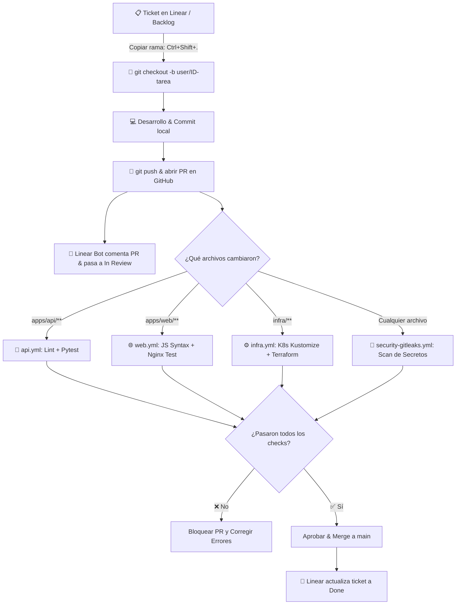

# 🤖 Guía Completa de Workflows de GitHub Actions

Esta guía explica en detalle **qué son, para qué sirven y cómo funcionan** los pipelines de Integración Continua (CI/CD) configurados en el directorio [`.github/workflows/`](file:///c:/Users/Rodrigo/Documents/Git/introducci%C3%B3n_devops/test_prueba/.github/workflows) de este repositorio.

---

## 📑 Tabla de Contenidos
1. [¿Qué es un Workflow de GitHub Actions?](#1-qué-es-un-workflow-de-github-actions)
2. [Estrategia de Monorepo y Filtrado por Rutas (`paths`)](#2-estrategia-de-monorepo-y-filtrado-por-rutas-paths)
3. [Catálogo de Workflows del Proyecto](#3-catálogo-de-workflows-del-proyecto)
   * [3.1. 🐍 `api.yml` (Backend API CI)](#31--apiyml-backend-api-ci)
   * [3.2. 🌐 `web.yml` (Frontend Web CI)](#32--webyml-frontend-web-ci)
   * [3.3. ⚙️ `infra.yml` (Infrastructure & IaC CI)](#33-️-infrayml-infrastructure--iac-ci)
   * [3.4. 🔐 `security-gitleaks.yml` (Secret Scanning)](#34--security-gitleaksyml-secret-scanning)
   * [3.5. 🚀 `ci.yml` (Monorepo CI Integrador)](#35--ciyml-monorepo-ci-integrador)
   * [3.6. 🛡️ `security-trivy.yml` (Vulnerability Scan SCA & Container)](#36-️-security-trivyyml-vulnerability-scan-sca--container)
   * [3.7. 🏷️ `release-tag.yml` (Automated Semantic Release)](#37-️-release-tagyml-automated-semantic-release)
   * [3.8. 📌 `dependabot-linear-sync.yml` (Dependabot to Linear Sync)](#38--dependabot-linear-syncyml-dependabot-to-linear-sync)
4. [Integración con Linear (Issue Tracking)](#4-integración-con-linear-issue-tracking)
5. [Diagrama de Ejecución y Flujo de Decisión](#5-diagrama-de-ejecución-y-flujo-de-decisión)
6. [Cómo Interpretar y Solucionar Errores en GitHub](#6-cómo-interpretar-y-solucionar-errores-en-github)

---

## 1. ¿Qué es un Workflow de GitHub Actions?

Un **Workflow** es un proceso automatizado compuesto por uno o más **Jobs** que se ejecutan automáticamente en servidores en la nube de GitHub (*Runners*) cuando ocurre un evento en el repositorio (por ejemplo, al hacer un `git push` o abrir un `Pull Request`).

### Conceptos Clave:
* **`on` (Eventos/Triggers):** Cuándo se ejecuta el pipeline (ej. al subir código a `main` o cambiar un archivo específico).
* **`jobs` (Trabajos):** Conjunto de pasos que se ejecutan en una máquina virtual limpia (ej. `ubuntu-latest`).
* **`steps` (Pasos):** Tareas individuales secuenciales, como descargar el código (`actions/checkout`), instalar dependencias o correr pruebas.

---

## 2. Estrategia de Monorepo y Filtrado por Rutas (`paths`)

Como este proyecto es un **Monorepo** (aloja frontend, backend, infraestructura y scripts en un solo repositorio), ejecutar todas las pruebas en cada commit desperdiciaría minutos de servidor y demoraría el trabajo.

Por eso utilizamos **Path Filtering**:
* Si modificas solo `apps/api/`, **únicamente se ejecuta `api.yml`**.
* Si modificas solo `apps/web/`, **únicamente se ejecuta `web.yml`**.
* Si modificas solo `infra/`, **únicamente se ejecuta `infra.yml`**.
* Si modificas la rama `main`, **se ejecuta `ci.yml` para validar todo el proyecto integrado**.

---

## 3. Catálogo de Workflows del Proyecto

### 3.1. 🐍 [`api.yml`](/.github/workflows/api.yml) (Backend API CI)
* **¿Cuándo se activa?** Cuando hay cambios en `apps/api/**`, `src/**` o `requirements.txt`.
* **¿Qué hace paso a paso?**
  1. Descarga el código en una máquina Ubuntu limpia.
  2. Instala Python 3.13 y las dependencias de `requirements.txt` y `requirements-dev.txt`.
  3. Ejecuta **Ruff** para verificar que no haya errores de sintaxis, variables sin usar o patrones lentos.
  4. Ejecuta análisis de seguridad SAST con **Bandit**.
  5. Ejecuta la suite de pruebas unitarias con reporte de cobertura (**Pytest-Cov**).
* **Objetivo:** Garantizar que los endpoints REST de FastAPI funcionen al 100% con alta cobertura y sin fallas de seguridad.

---

### 3.2. 🌐 [`web.yml`](/.github/workflows/web.yml) (Frontend Web CI)
* **¿Cuándo se activa?** Cuando hay cambios en `apps/web/**` (HTML, CSS, JS, Nginx).
* **¿Qué hace paso a paso?**
  1. Configura un entorno Node.js para validar sintaxis de JavaScript (`node -c apps/web/public/js/*.js`).
  2. Levanta un contenedor efímero de **Nginx** para validar que `nginx.conf` no tenga directivas inválidas (`nginx -t`).
* **Objetivo:** Evitar que un error tipográfico en JavaScript congele la Pokédex en el navegador o que Nginx falle al iniciar.

---

### 3.3. ⚙️ [`infra.yml`](/.github/workflows/infra.yml) (Infrastructure & IaC CI)
* **¿Cuándo se activa?** Cuando hay cambios en `infra/**` (Kubernetes, Terraform, Ansible).
* **¿Qué hace paso a paso?**
  1. Ejecuta `kubectl kustomize infra/k8s/` para comprobar que todos los manifiestos YAML de Kubernetes sean sintácticamente válidos.
  2. Ejecuta `terraform validate` sobre cada módulo en `infra/terraform/modules/` para validar la sintaxis HCL.
* **Objetivo:** Prevenir que un error en un archivo YAML o HCL rompa el clúster de Kubernetes o el aprovisionamiento en la nube.

---

### 3.4. 🔐 [`security-gitleaks.yml`](/.github/workflows/security-gitleaks.yml) (Secret Scanning)
* **¿Cuándo se activa?** En **todos** los commits y Pull Requests.
* **¿Qué hace paso a paso?**
  1. Inspecciona el historial de Git y los archivos modificados con **Gitleaks**.
  2. Busca patrones de claves privadas SSH, contraseñas hardcodeadas, tokens de AWS/GCP o API Keys.
* **Objetivo:** Bloquear inmediatamente el commit si algún desarrollador subió accidentalmente una contraseña o clave privada.

---

### 3.5. 🚀 [`ci.yml`](/.github/workflows/ci.yml) (Monorepo CI Integrador)
* **¿Cuándo se activa?** Al hacer `push` o `Pull Request` hacia la rama principal (`main` o `master`).
* **¿Qué hace paso a paso?**
  1. **Auditoría Global:** Ejecuta `scripts/audit_code_quality.py` (complejidad ciclomática, duplicación, seguridad SAST y linting).
  2. **Compilación Multi-Stage:** Compila las imágenes Docker de `apps/api/Dockerfile` y `apps/web/Dockerfile` con Buildx para verificar que el build de producción no falle.
* **Objetivo:** Puerta de calidad final (*Quality Gate*) antes de desplegar a producción.

---

### 3.6. 🛡️ [`security-trivy.yml`](/.github/workflows/security-trivy.yml) (Vulnerability Scan SCA & Container)
* **¿Cuándo se activa?** En cambios a `Dockerfile`, `requirements.txt` o cron semanal.
* **¿Qué hace paso a paso?**
  1. Escanea el código y dependencias con Trivy en busca de CVEs críticos.
  2. Construye la imagen Docker y escanea sus capas y paquetes del sistema operativo base.
* **Objetivo:** Prevenir que dependencias o imágenes base con vulnerabilidades conocidas lleguen a producción.

---

### 3.7. 🏷️ [`release-tag.yml`](/.github/workflows/release-tag.yml) (Automated Semantic Release)
* **¿Cuándo se activa?** Al hacer `merge` / `push` directo en la rama `main`.
* **¿Qué hace paso a paso?**
  1. Analiza los commits convencionales mergeados (`feat`, `fix`, `chore(deps)`).
  2. Calcula el siguiente incremento SemVer (`vMAJOR.MINOR.PATCH`).
  3. Crea el **Git Tag** y publica un **GitHub Release** con el changelog detallado.
* **Objetivo:** Automatizar el versionado continuo y trazabilidad sin intervención manual.

---

### 3.8. 📌 [`dependabot-linear-sync.yml`](/.github/workflows/dependabot-linear-sync.yml) (Dependabot to Linear Sync)
* **¿Cuándo se activa?** Cada vez que Dependabot abre un nuevo Pull Request de actualización.
* **¿Qué hace paso a paso?**
  1. Obtiene dinámicamente el equipo de Linear del usuario.
  2. Crea automáticamente un **ticket consecutivo/incremental** en Linear (ej. `PER-16`, `PER-17`) con el título y enlace directo al PR de GitHub.
* **Objetivo:** Centralizar la validación de dependencias y actualizaciones directamente en el tablero de Linear.

---

## 4. Integración con Linear (Issue Tracking)

El proyecto está conectado bidireccionalmente con **[Linear](https://linear.app)** para la gestión ágil de tareas, bugs y features.

### 4.1. Convención de Ramas
El formato configurado para las ramas sigue el estándar:
```bash
<username>/<identificador-issue>-<descripcion-corta>
```
* **Ejemplo:** `rocapellino/PER-5-configurar-plantilla-pr`
* **Acceso rápido:** En Linear, presiona `Ctrl + Shift + .` en cualquier ticket para copiar el nombre de rama automáticamente.

### 4.2. Plantilla de Pull Request (`.github/pull_request_template.md`)
Cada PR creado en GitHub se precarga con la sección para referenciar el ticket de Linear:
* **Vinculación:** Al abrir un PR con la rama del issue, el bot de Linear comenta el link al ticket y cambia su estado a **In Progress** / **In Review**.
* **Autocierre:** Al mergear el PR a `main`, Linear detecta la referencia y marca el ticket como **Done**.

---

## 5. Diagrama de Ejecución y Flujo de Decisión



---

## 6. Cómo Interpretar y Solucionar Errores en GitHub

1. En tu repositorio de GitHub, ve a la pestaña **Actions**.
2. Verás la lista de ejecuciones con un icono:
   * 🟢 **Verde (Check):** Todas las pruebas y validaciones pasaron con éxito.
   * 🔴 **Rojo (Cruz):** Algún paso falló (ej. un test fallido o un secreto detectado).
3. Haz clic en el workflow en rojo para ver el registro (*log*) exacto con el número de línea y mensaje de error.
