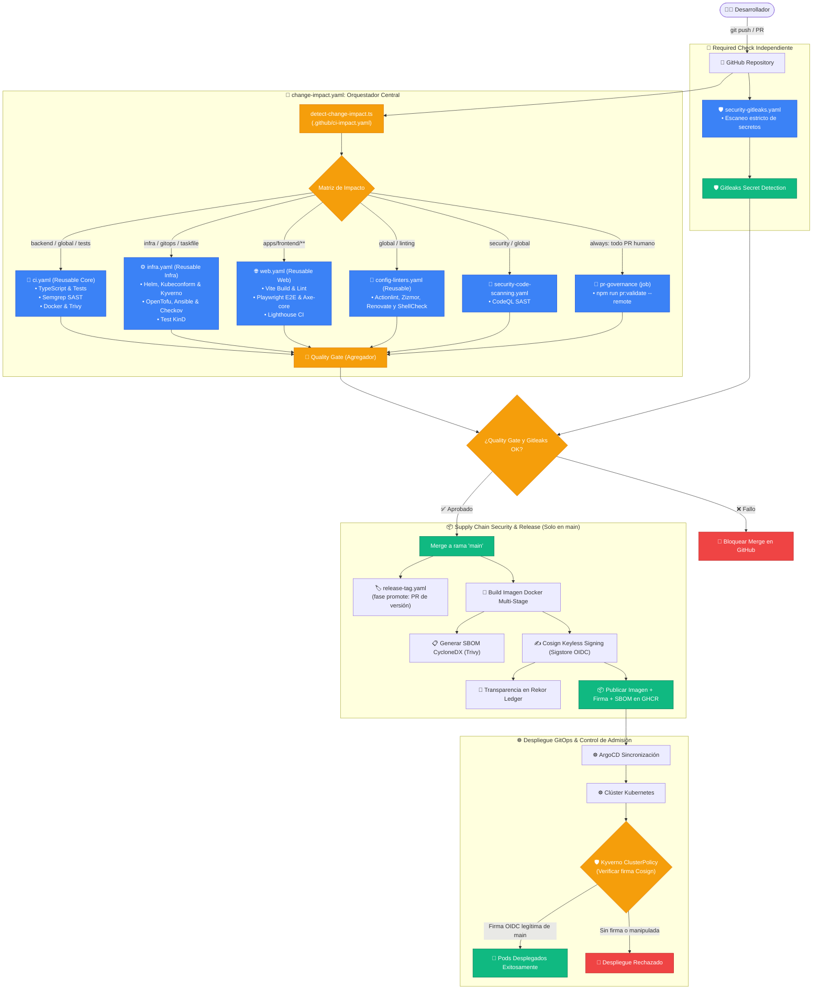

# 🤖 Guía Completa de Workflows de GitHub Actions y DevSecOps

Esta guía explica en detalle **qué son, para qué sirven y cómo funcionan** los pipelines de Integración Continua, Entrega Continua y Seguridad de la Cadena de Suministro (CI/CD/DevSecOps) configurados en [`.github/workflows/`](../../.github/workflows) de este repositorio.

---

## 📑 Tabla de Contenidos

1. [Estrategia de Monorepo y Orquestación por Impacto (`ci-impact`)](#1-estrategia-de-monorepo-y-orquestación-por-impacto-ci-impact)
2. [Diagrama de Ejecución y Flujo DevSecOps de Punta a Punta](#2-diagrama-de-ejecución-y-flujo-devsecops-de-punta-a-punta)
3. [Catálogo de Workflows del Proyecto](#3-catálogo-de-workflows-del-proyecto)
   - [3.1. 🎯 `change-impact.yaml` (Orquestador Central y Quality Gate Agregador)](#31--change-impactyaml-orquestador-central-y-quality-gate-agregador)
   - [3.2. 🚀 `ci.yaml` (Reusable Core CI: Calidad, SAST, Docker & Supply Chain)](#32--ciyaml-reusable-core-ci-calidad-sast-docker--supply-chain)
   - [3.3. 🌐 `web.yaml` (Reusable Frontend CI)](#33--webyaml-reusable-frontend-ci)
   - [3.4. ⚙️ `infra.yaml` (Reusable Infrastructure & IaC CI)](#34-️-infrayaml-reusable-infrastructure--iac-ci)
   - [3.5. 🧹 `config-linters.yaml` (Reusable Config Linters CI)](#35--config-lintersyaml-reusable-config-linters-ci)
   - [3.6. 🔬 `security-code-scanning.yaml` (Reusable SAST / CodeQL CI)](#36--security-code-scanningyaml-reusable-sast--codeql-ci)
   - [3.7. 🔐 `security-gitleaks.yaml` (Required Secret Scanning Independiente)](#37--security-gitleaksyaml-required-secret-scanning-independiente)
   - [3.8. 🛡️ `security-trivy.yaml` (Escaneo Programado de Vulnerabilidades)](#38-️-security-trivyyaml-escaneo-programado-de-vulnerabilidades)
   - [3.9. 🏷️ `release-tag.yaml` (Versionado Semántico Automático y Promoción GitOps)](#39-️-release-tagyaml-versionado-semántico-automático-y-promoción-gitops)
   - [3.10. ⚡ `performance-k6.yaml` (Pruebas de Carga y Rendimiento)](#310--performance-k6yaml-pruebas-de-carga-y-rendimiento)
   - [3.11. ⚡ `promote-auto-approve.yaml` (Auto-Aprobación Segura de Checks de Release)](#311--promote-auto-approveyaml-auto-aprobación-segura-de-checks-de-release)
4. [Hardening de la Cadena de Suministro (Supply Chain Hardening)](#4-hardening-de-la-cadena-de-suministro-supply-chain-hardening)
   - [4.1. SHA Pinning en GitHub Actions](#41-sha-pinning-en-github-actions)
   - [4.2. Dependency Review Gate](#42-dependency-review-gate)
   - [4.3. Renovate Bot con Cooldown y Gobernanza Automatizada](#43-renovate-bot-con-cooldown-y-gobernanza-automatizada)
5. [Integración con Linear & Slack (Issue Tracking & ChatOps)](#5-integración-con-linear--slack-issue-tracking--chatops)
6. [Resolución de Errores y Diagnóstico en CI](#6-resolución-de-errores-y-diagnóstico-en-ci)

---

## 1. Estrategia de Monorepo y Orquestación por Impacto (`ci-impact`)

Como este proyecto aloja backend (`apps/backend/`), frontend (`apps/frontend/`), infraestructura (`infra/`, `gitops/`) y scripts en un solo monorepo estructurado con npm workspaces, se implementa una arquitectura basada en **Orquestador Central + Reusable Workflows** gobernada por el contrato declarativo [`.github/ci-impact.yaml`](../../.github/ci-impact.yaml) y el CLI [`scripts/detect-change-impact.ts`](../../scripts/detect-change-impact.ts):

- **Orquestador Central ([`change-impact.yaml`](../../.github/workflows/change-impact.yaml)):** Es el punto de entrada unificado para todos los Pull Requests y pushes a `main`. Evalúa el diff del cambio contra las rutas del contrato y despacha dinámicamente solo los pipelines afectados.
- **Reusable Core CI ([`ci.yaml`](../../.github/workflows/ci.yaml)):** Invocado condicionalmente por el orquestador cuando se modifican backend, dependencias raíz, contratos de testing o rutas globales. Ejecuta tipado, tests, Semgrep SAST, escaneo Trivy y firmado Cosign en `main`.
- **Reusable Frontend CI ([`web.yaml`](../../.github/workflows/web.yaml)):** Invocado condicionalmente cuando cambian `apps/frontend/**` o pruebas E2E.
- **Reusable Infraestructura CI ([`infra.yaml`](../../.github/workflows/infra.yaml)):** Invocado condicionalmente cuando cambian `infra/**`, `gitops/**` o el `Taskfile.yaml`.
- **Reusable Config Linters ([`config-linters.yaml`](../../.github/workflows/config-linters.yaml)):** Ejecuta Actionlint, Zizmor, el validador de Renovate y ShellCheck sobre workflows, `renovate.json` y scripts en cambios globales o de linting.
- **Reusable Security Scanning ([`security-code-scanning.yaml`](../../.github/workflows/security-code-scanning.yaml)):** Ejecuta análisis avanzado CodeQL y Semgrep en cambios relevantes o programados.
- **Secret Scanning Incondicional ([`security-gitleaks.yaml`](../../.github/workflows/security-gitleaks.yaml)):** Se ejecuta de forma independiente y paralela en **cada commit y PR** como Required Check no negociable del ruleset de GitHub, sin depender de la clasificación de impacto.
- **Quality Gate Unificado:** El job final `quality-gate` en `change-impact.yaml` agrega el estado de todos los workflows invocados (`success` o `skipped` justificado), operando como único required status check orquestado y evitando bloqueos artificiales por jobs condicionales.

---

## 2. Diagrama de Ejecución y Flujo DevSecOps de Punta a Punta

```mermaid
flowchart TD
    DEV(["👨‍💻 Desarrollador"]) -->|git push / PR| GH["🚀 GitHub Repository"]

    subgraph SEC_INDEPENDENT ["🔐 Required Check Independiente"]
        GH --> WF_LEAKS["🛡️ security-gitleaks.yaml\n• Escaneo estricto de secretos"]
        WF_LEAKS --> CHK_LEAKS["🛡️ Gitleaks Secret Detection"]
    end

    subgraph ORCHESTRATOR ["🎯 change-impact.yaml: Orquestador Central"]
        GH --> DETECT["detect-change-impact.ts\n(.github/ci-impact.yaml)"]
        DETECT --> ROUTER{"Matriz de Impacto"}

        ROUTER -->|backend / global / tests| WF_CI["🚀 ci.yaml (Reusable Core)\n• TypeScript & Tests\n• Semgrep SAST\n• Docker & Trivy"]
        ROUTER -->|infra / gitops / taskfile| WF_INFRA["⚙️ infra.yaml (Reusable Infra)\n• Helm, Kubeconform & Kyverno\n• OpenTofu, Ansible & Checkov\n• Test KinD"]
        ROUTER -->|apps/frontend/**| WF_WEB["🌐 web.yaml (Reusable Web)\n• Vite Build & Lint\n• Playwright E2E & Axe-core\n• Lighthouse CI"]
        ROUTER -->|global / linting| WF_MEGA["🧹 config-linters.yaml (Reusable)\n• Actionlint, Zizmor, Renovate y ShellCheck"]
        ROUTER -->|security / global| WF_SCAN["🔬 security-code-scanning.yaml\n• CodeQL SAST"]
        ROUTER -->|always: todo PR humano| JOB_PRGOV["📝 pr-governance (job)\n• npm run pr:validate --remote"]

        WF_CI & WF_INFRA & WF_WEB & WF_MEGA & WF_SCAN & JOB_PRGOV --> QG["🚦 Quality Gate (Agregador)"]
    end

    QG --> QG_DECISION{"¿Quality Gate y Gitleaks OK?"}
    CHK_LEAKS --> QG_DECISION
    QG_DECISION -->|❌ Fallo| BLOCK_PR["🚫 Bloquear Merge en GitHub"]
    QG_DECISION -->|✅ Aprobado| MERGE_MAIN["Merge a rama 'main'"]

    subgraph SUPPLY_CHAIN ["📦 Supply Chain Security & Release (Solo en main)"]
        MERGE_MAIN --> BUMP["🏷️ release-tag.yaml\n(fase promote: PR de versión)"]
        MERGE_MAIN --> DOCKER_BUILD["🐳 Build Imagen Docker Multi-Stage"]
        DOCKER_BUILD --> SYFT_SBOM["📋 Generar SBOM CycloneDX (Trivy)"]
        DOCKER_BUILD --> COSIGN_SIGN["✍️ Cosign Keyless Signing (Sigstore OIDC)"]
        COSIGN_SIGN --> REKOR["📜 Transparencia en Rekor Ledger"]
        COSIGN_SIGN --> PUSH_GHCR["📦 Publicar Imagen + Firma + SBOM en GHCR"]
    end

    subgraph DEPLOYMENT ["☸️ Despliegue GitOps & Control de Admisión"]
        PUSH_GHCR --> ARGO["☸️ ArgoCD Sincronización"]
        ARGO --> K8S["☸️ Clúster Kubernetes"]
        K8S --> KYVERNO{"🛡️ Kyverno ClusterPolicy\n(Verificar firma Cosign)"}
        KYVERNO -->|Firma OIDC legítima de main| DEPLOY_OK["🚀 Pods Desplegados Exitosamente"]
        KYVERNO -->|Sin firma o manipulada| DEPLOY_FAIL["🚫 Despliegue Rechazado"]
    end

    classDef normal fill:#3b82f6,stroke:#1d4ed8,color:#fff;
    classDef gate fill:#f59e0b,stroke:#d97706,color:#fff;
    classDef success fill:#10b981,stroke:#047857,color:#fff;
    classDef error fill:#ef4444,stroke:#b91c1c,color:#fff;

    class WF_WEB,WF_INFRA,WF_LEAKS,WF_CI,WF_MEGA,WF_SCAN,JOB_PRGOV normal;
    class DETECT,ROUTER,QG,QG_DECISION,KYVERNO gate;
    class MERGE_MAIN,PUSH_GHCR,DEPLOY_OK,CHK_LEAKS success;
    class BLOCK_PR,DEPLOY_FAIL error;
```

---

## 3. Catálogo de Workflows del Proyecto

### 3.1. 🎯 `change-impact.yaml` (Orquestador Central y Quality Gate Agregador)

- **Archivo:** [`change-impact.yaml`](../../.github/workflows/change-impact.yaml)
- **Triggers:** Pull Requests y pushes a `main`.
- **Función:** Ejecuta `scripts/detect-change-impact.ts` con el contrato de `.github/ci-impact.yaml`. Con base en el análisis de diff, despacha los workflows reusables necesarios y expone el job agregador `quality-gate` que actúa como check requerido en el ruleset de protección de ramas.
- **Controles `always`:** el job `pr-governance` ejecuta `npm run pr:validate -- --remote <número>` en todo PR cuyo autor no sea un Bot (los PRs de promote y Renovate generan su propio cuerpo) y forma parte de `quality-gate`. El escaneo de secretos lo cubre `security-gitleaks.yaml` con su required check propio.

### 3.2. 🚀 `ci.yaml` (Reusable Core CI: Calidad, SAST, Docker & Supply Chain)

- **Archivo:** [`ci.yaml`](../../.github/workflows/ci.yaml)
- **Triggers:** Invocado por `change-impact.yaml` (`workflow_call`) y ejecutable manualmente (`workflow_dispatch`).
- **Etapas:**
  1. **Auditoría de Calidad:** `tsc --noEmit`, compilación `esbuild`, `npm test` (unit, pentest, contratos), `npm run test:fuzz` (fuzzing DAST) y `npm audit --audit-level=high --omit=dev`.
  2. **Análisis Estático SAST (Bloqueante):** **Semgrep** analiza el código contra reglas de OWASP Top 10 y detiene el pipeline ante fallos de seguridad.
  3. **Dependency Review Gate (Bloqueante, solo PR):** Bloquea automáticamente PRs que introduzcan vulnerabilidades `HIGH` o `CRITICAL` en dependencias nuevas o modificadas. La acción requiere contexto de Pull Request (`base_ref`/`head_ref`); en `push` y `workflow_dispatch` la cobertura SCA la aporta `npm audit`.
  4. **Construcción y Escaneo de Contenedores:** Construcción multi-stage de la imagen Docker y escaneo con **Trivy** (SCA y OS CVEs).
  5. **Firmado Criptográfico y Publicación OCI (Solo en `main`):**
     - Generación del **SBOM CycloneDX** con **Trivy**.
     - Firma Keyless de la imagen y del Helm Chart OCI con **Cosign** usando OIDC de GitHub Actions (`ci.yaml@refs/heads/main`).
     - Atestación criptográfica de SBOM en el registro OCI.
     - Publicación en **GHCR** y registro de transparencia en **Rekor**.

### 3.3. 🌐 `web.yaml` (Reusable Frontend CI)

- **Archivo:** [`web.yaml`](../../.github/workflows/web.yaml)
- **Triggers:** Invocado por `change-impact.yaml` (`workflow_call`) y `workflow_dispatch`.
- **Pasos:** Compilación de assets con Vite, linter de configuración Nginx y ejecución de tests E2E y auditoría de accesibilidad Axe-core con Playwright y Lighthouse CI.

### 3.4. ⚙️ `infra.yaml` (Reusable Infrastructure & IaC CI)

- **Archivo:** [`infra.yaml`](../../.github/workflows/infra.yaml)
- **Triggers:** Invocado por `change-impact.yaml` (`workflow_call`) y `workflow_dispatch`.
- **Pasos:** Helm CLI lint (`helm lint`), renderizado de plantillas Zero-Trust (`helm template`), validación estricta de esquemas OpenAPI con **Kubeconform**, auditoría de buenas prácticas con **Kube-Linter**, pruebas de admisión con **Kyverno CLI**, formateo y validación de **OpenTofu**, syntax-check de **Ansible**, auditoría de seguridad IaC con **Checkov** e integración end-to-end sobre clúster efímero **KinD**.

### 3.5. 🧹 `config-linters.yaml` (Reusable Config Linters CI)

- **Archivo:** [`config-linters.yaml`](../../.github/workflows/config-linters.yaml)
- **Triggers:** Invocado por `change-impact.yaml` (`workflow_call`) y `workflow_dispatch`.
- **Pasos:** Actionlint (imagen fijada por digest, con ShellCheck embebido sobre los bloques `run:`), Zizmor (imagen fijada por digest, modo `--offline`, severidad mínima `medium`; las excepciones justificadas viven en [`zizmor.yaml`](../../.github/zizmor.yaml)) `renovate-config-validator --strict` sobre [`renovate.json`](../../renovate.json) (imagen de Renovate fijada por digest; una opción inválida detiene a Renovate hospedado sin que ningún otro gate lo note) y ShellCheck sobre los `*.sh` versionados. Actionlint y ShellCheck usan severidad mínima `warning`. Sin `continue-on-error`: un fallo bloquea a través del Quality Gate.

### 3.6. 🔬 `security-code-scanning.yaml` (Reusable SAST / CodeQL CI)

- **Archivo:** [`security-code-scanning.yaml`](../../.github/workflows/security-code-scanning.yaml)
- **Triggers:** Invocado por `change-impact.yaml` (`workflow_call`), `schedule` semanal y `workflow_dispatch`.
- **Pasos:** Análisis estático con GitHub CodeQL y Semgrep para detección avanzada de fallas en código fuente e IaC.

### 3.7. 🔐 `security-gitleaks.yaml` (Required Secret Scanning Independiente)

- **Archivo:** [`security-gitleaks.yaml`](../../.github/workflows/security-gitleaks.yaml)
- **Triggers:** Todos los commits y PRs (incondicional).
- **Pasos:** Gitleaks con reglas de [`.gitleaks.toml`](../../.gitleaks.toml) analizando el commit range completo para evitar fuga de credenciales o API keys. Actúa como check directo requerido en el ruleset.

### 3.8. 🛡️ `security-trivy.yaml` (Escaneo Programado de Vulnerabilidades)

- **Archivo:** [`security-trivy.yaml`](../../.github/workflows/security-trivy.yaml)
- **Triggers:** Escaneo programado periódico de CVEs sobre filesystem y dependencias.

### 3.9. 🏷️ `release-tag.yaml` (Versionado Semántico Automático y Promoción GitOps)

- **Archivo:** [`release-tag.yaml`](../../.github/workflows/release-tag.yaml)
- **Triggers:** Push directo / merge a `main`.
- **Pasos (dos fases mutuamente excluyentes):**
  1. **Fase `promote`:** analiza los commits convencionales (`feat:`, `fix:`, `perf:`), calcula el incremento SemVer en `dry-run` y abre/actualiza el PR atómico `release/promote-<tag>` (sin crear tag).
  2. **Fase `tag`:** al mergear el PR de promoción, verifica la coherencia 1:1 de la metadata, firma y publica el **Git Tag** con Gitsign (Sigstore keyless) **sobre ese commit** y crea el **GitHub Release** con el changelog automático.
- **Sincronización de versión:** el bump de `package.json` y `package-lock.json` (vía `npm version --no-git-tag-version`, atómico) más `infra/helm/pokedex/Chart.yaml` se promueve mediante un **Pull Request** a `main` (`release/promote-<tag>`), porque `main` está protegida por el ruleset `main-protection` y el `GITHUB_TOKEN` no puede escribir directamente en ella.
- **Promoción GitOps:** el `targetRevision` de los manifiestos ArgoCD viaja en el **mismo PR atómico** `release/promote-<tag>` (no existe una rama separada `gitops/pin-<tag>`).

### 3.10. ⚡ `performance-k6.yaml` (Pruebas de Carga y Rendimiento)

- **Archivo:** [`performance-k6.yaml`](../../.github/workflows/performance-k6.yaml)
- **Triggers:** Ejecución manual o programada para validar métricas de latencia p95 y resistencia bajo carga con scripts k6.

### 3.11. ⚡ `promote-auto-approve.yaml` (Auto-Aprobación Segura de Checks de Release)

- **Archivo:** [`promote-auto-approve.yaml`](../../.github/workflows/promote-auto-approve.yaml)
- **Triggers:** `pull_request_target` en ramas `main` para PRs de promoción de release (`release/promote-*`).
- **Trust Boundary & Seguridad:** Ejecuta con validación estricta de no-fork (`head.repo.full_name == github.repository`), rama con prefijo legítimo, PR no en borrador (`!draft`) y emisor verificado (`rocapellino` o `github-actions[bot]`). Desbloquea las ejecuciones en `action_required` para permitir que los checks CI corran automáticamente antes del merge.

---

## 4. Hardening de la Cadena de Suministro (Supply Chain Hardening)

### 4.1. SHA Pinning en GitHub Actions

Todas las dependencias de GitHub Actions en los workflows están ancladas por su **hash SHA completo e inmutable** en lugar de tags mutables (ej: `actions/checkout@11bd71901bbe5b1630ceea73d27597364c9af683 # v4.2.2`), protegiendo el repositorio contra secuestro de tags en repositorios de terceros.

### 4.2. Dependency Review Gate

El workflow [`ci.yaml`](../../.github/workflows/ci.yaml) incorpora el gate de revisión de dependencias:

- Falla de forma bloqueante si un PR introduce paquetes con CVEs calificados como `moderate`, `high` o `critical`.
- Solo se ejecuta en eventos `pull_request`, `pull_request_target` y `merge_group` (es la única forma en que la acción obtiene `base_ref`/`head_ref`); en `push` a `main` el job se omite para evitar falsos negativos de configuración.
- Previene la introducción de paquetes comprometidos antes de que el código llegue a `main`.

### 4.3. Renovate Bot con Cooldown y Gobernanza Automatizada

- **Renovate Bot ([`renovate.json`](../../renovate.json)):** Centraliza la gestión unificada y programada de dependencias en todos los ecosistemas del proyecto (`npm`, `dockerfile`, `docker-compose`, `github-actions`, `helm` y `terraform/opentofu`).
- **Imágenes de `docker-compose`:** el gestor `docker-compose` mantiene los tags y digests de `docker-compose.yaml` y `docker-compose.dev.yaml`. Todas llevan tag y digest (incluida `rclone/rclone:1.68.2@sha256:…`), para que Renovate conozca la versión de la que parte; `rclone` también está en el chart de Helm (`backup.gdrive.image.tag` y `digest` en `infra/helm/pokedex/values.yaml`, campos separados por INFRA-005): Renovate agrupa ambos en un solo PR (`renovate/rclone`) pero solo cambia el `tag` del chart, así que el `digest` se copia del compose en ese mismo PR; `tests/security/dr_backup_security.test.ts` falla mientras no coincidan.
- **Gitsign sin gestión de Renovate:** Gitsign se actualiza de forma manual y deliberada. No existe datasource de Renovate para binarios de Sigstore y ningún regex manager puede calcular el SHA-256 de un release asset (vive en el campo `digest` de la API de GitHub y en `checksums.txt`); un bump automático dejaría los digests obsoletos y el release fallaría en modo fail-closed. Procedimiento en [`release-tag.yaml`](../../.github/workflows/release-tag.yaml): cambiar `GITSIGN_VERSION`, ejecutar el workflow con el input `gitsign_refresh` y pegar el bloque `env:` impreso; la coherencia versión-digests se valida en runtime (SEC-001). Esta explicación no puede vivir en `renovate.json` como clave `//gitsign`: es una opción inválida y detenía a Renovate hospedado.
- **Bloqueo de major de PostgreSQL y Redis:** `postgres` y `redis` se declaran en `docker-compose` y en el chart de Helm (`helm-values`, `infra/helm/pokedex/values.yaml`), y el bloqueo de sus major cubre ambos gestores: PostgreSQL 16 y Redis 7 son contrato documentado y un major de PostgreSQL exige migrar el volumen de datos. Siguen permitidos los digests, parches y minor. `tests/security/renovate_config_contract.test.ts` (RENOVATE-001) impide que la regla se estreche.
- **Cooldown de 7 Días (`minimumReleaseAge: "7 days"`):** Garantiza que cualquier versión nueva permanezca en observación comunitaria durante 7 días antes de abrir un PR, mitigando riesgos de supply chain poisoning.
- **Ventana Programada:** Ejecución semanal los lunes antes de las 06:00 AM (ART).
- **Auto-Merge Controlado:** Restringido **exclusivamente a parches (`patch`) de dependencias npm**. Las actualizaciones menores, mayores, imágenes Docker, OpenTofu y GitHub Actions requieren aprobación humana explícita (`manual-review-required`, `infra-supply-chain-review`).

### 4.4. Principio de Menor Privilegio (Least Privilege) y Permisos Zero-Trust por Job

Conforme a las recomendaciones de OpenSSF y CIS Benchmarks para GitHub Actions:

- **Top-Level Permissions:** Los 18 workflows declaran un bloque restrictivo inicial (`permissions: { contents: read }` o el mínimo estricto requerido).
- **Job-Level Permissions:** Cada job individual dentro de los 18 workflows declara explícitamente sus propios permisos granulares, evitando que jobs de ejecución o compilación hereden permisos de escritura innecesarios.
- **Auditoría de Sobre-Privilegios:** Se auditaron y eliminaron permisos no operativos (por ejemplo `issues: write` en escaneos DAST donde la emisión de issues está desactivada).
- **Guardrail Automatizado de CI:** La suite de pruebas de gobernanza [`tests/ci_impact.test.ts`](../../tests/ci_impact.test.ts) valida automáticamente en cada PR que ningún workflow use `write-all` y que el 100% de los jobs declare sus permisos de forma explícita.

---

## 5. Integración con Linear & Slack (Issue Tracking & ChatOps)

- **Convención de Ramas:** `<usuario>/<ticket-id>-<descripcion>` (ej: `rocapellino/PEX-15-network-zero-trust`).
- **Vinculación Automática:** Al abrir el PR, el bot de Linear actualiza el estado a *In Review*. Al mergear a `main`, pasa a *Done*.
- **Notificaciones ChatOps en Slack:**
  - La aplicación de Linear para Slack retransmite eventos de los tickets (`PEX-X`) directamente al canal de ingeniería del equipo.
  - Los pipelines automatizados ([`renovate-linear-sync.yaml`](../../.github/workflows/renovate-linear-sync.yaml) y [`sonar-linear-sync.yaml`](../../.github/workflows/sonar-linear-sync.yaml)) reportan hallazgos creando tickets automáticos en Linear, que a su vez generan alertas inmediatas en Slack.
  - Cuando los PRs son mergeados o cerrados, la sincronización bidireccional actualiza el ticket a `Done` o `Canceled` y publica el resultado en Slack sin requerir gestión manual.

---

## 6. Resolución de Errores y Diagnóstico en CI

1. **Error en Quality Gate `Auditoría de Calidad`:**
   - Ejecutar localmente `npm run lint`, `npm test` y `npm run test:fuzz` para reproducir el fallo de tipado, prueba lógica o fuzzing.
2. **Error en `Gitleaks`:**
   - Un archivo contiene un patrón similar a un secreto. Revisar el log para identificar el archivo y eliminar la credencial.
3. **Error en `Cosign / Kyverno`:**
   - Comprobar que el Pod en Kubernetes esté intentando descargar una imagen construida desde `main` con firma válida registrada en Rekor.
