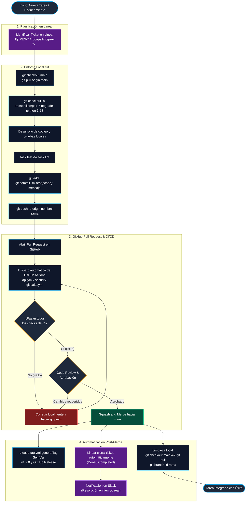
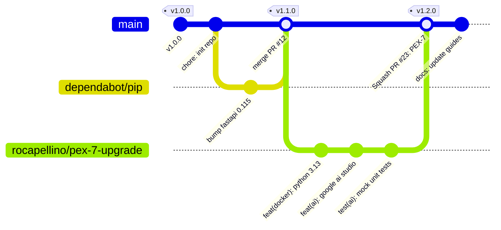

# 🌿 Guía de Flujo Git: Creación de Ramas, Conventional Commits y Merge a `main`

Esta guía describe el estándar oficial de trabajo con **Git, GitHub y Linear** en el repositorio Pokédex. Detalla el ciclo de vida completo de una rama de desarrollo desde su concepción hasta su integración (*Merge*) en `main`, automatización de releases y limpieza.

---

## 📑 Tabla de Contenidos

1. [Estrategia de Ramas (GitHub Flow Adaptado)](#1-estrategia-de-ramas-github-flow-adaptado)
2. [Diagrama de Flujo del Ciclo de Vida de una Rama](#2-diagrama-de-flujo-del-ciclo-de-vida-de-una-rama)
3. [Diagrama GitGraph (Historial y Merge)](#3-diagrama-gitgraph-historial-y-merge)
4. [Convención de Nombres de Ramas](#4-convención-de-nombres-de-ramas)
5. [Guía Paso a Paso con Comandos de Terminal](#5-guía-paso-a-paso-con-comandos-de-terminal)
   * [Paso 1: Sincronizar `main` local](#paso-1-sincronizar-main-local)
   * [Paso 2: Crear y cambiar a la nueva rama](#paso-2-crear-y-cambiar-a-la-nueva-rama)
   * [Paso 3: Desarrollo y validación local](#paso-3-desarrollo-y-validación-local)
   * [Paso 4: Commits semánticos (Conventional Commits)](#paso-4-commits-semánticos-conventional-commits)
   * [Paso 5: Publicar la rama en el repositorio remoto](#paso-5-publicar-la-rama-en-el-repositorio-remoto)
   * [Paso 6: Abrir y configurar el Pull Request](#paso-6-abrir-y-configurar-el-pull-request)
   * [Paso 7: Validación de CI y Code Review](#paso-7-validación-de-ci-y-code-review)
   * [Paso 8: Integración (Merge) a `main`](#paso-8-integración-merge-a-main)
   * [Paso 9: Limpieza y sincronización post-merge](#paso-9-limpieza-y-sincronización-post-merge)
6. [Manejo de Conflictos y Rebase](#6-manejo-de-conflictos-y-rebase)
7. [Buenas Prácticas y Reglas de Oro](#7-buenas-prácticas-y-reglas-de-oro)

---

## 1. Estrategia de Ramas (GitHub Flow Adaptado)

El proyecto utiliza un modelo ágil basado en **GitHub Flow**:

* **`main` es la rama protegida y estable:** Todo commit en `main` debe compilar, pasar pruebas y ser apto para producción inmediata.
* **Ramas de Feature/Fix efímeras:** Cada tarea, issue o ticket de Linear se desarrolla en una rama aislada que nace de `main` y muere al completarse el merge.
* **Integración Continua Obligatoria:** Ningún cambio entra a `main` sin pasar por un Pull Request con todos los checks de GitHub Actions en verde.

---

## 2. Diagrama de Flujo del Ciclo de Vida de una Rama



---

## 3. Diagrama GitGraph (Historial y Merge)

El siguiente gráfico ilustra cómo se ramifica el historial, se aplican los commits y se reincorpora a la rama principal mediante *Squash and Merge* con generación automática de etiquetas SemVer:



---

## 4. Convención de Nombres de Ramas

Para mantener consistencia con Linear y la trazabilidad del equipo, se utiliza la siguiente convención:

| Tipo | Formato de Rama | Ejemplo Real |
| :--- | :--- | :--- |
| **Linear Ticket (Recomendado)** | `<usuario>/<ticket-id>-<descripcion-kebab>` | `rocapellino/pex-7-upgrade-python-3-13-and-features` |
| **Nueva Característica** | `feat/<nombre-funcionalidad>` | `feat/google-ai-studio-endpoints` |
| **Corrección de Bug** | `fix/<nombre-del-error>` | `fix/postgres-docker-connection-refused` |
| **Mantenimiento / Deps** | `chore/<descripcion>` | `chore/update-ruff-config` |
| **Documentación** | `docs/<tema>` | `docs/git-branching-guide` |
| **Refactorización** | `refactor/<modulo>` | `refactor/evolution-tree-parser` |

---

## 5. Guía Paso a Paso con Comandos de Terminal

### Paso 1: Sincronizar `main` local

Antes de comenzar cualquier trabajo, asegúrate de tener la última versión de la rama principal:

```bash
# Cambiar a la rama main
git checkout main

# Descargar las últimas actualizaciones remotas
git pull origin main
```

---

### Paso 2: Crear y cambiar a la nueva rama

Crea una rama nueva a partir del estado limpio de `main`:

```bash
# Crear y cambiarse en un solo comando (-b)
git checkout -b rocapellino/pex-8-nueva-funcionalidad

# Verificar en qué rama te encuentras
git branch --show-current
```

---

### Paso 3: Desarrollo y validación local

Realiza los cambios necesarios en el código. Antes de commitear, ejecuta las pruebas y linters locales:

```bash
# Ver archivos modificados
git status

# Ejecutar verificación de tipos y compilación
task lint
# (o equivalente: npm run lint && npm run build)

# Ejecutar auditoría de archivos duplicados y seguridad
task audit
```

---

### Paso 4: Commits semánticos (Conventional Commits)

Organiza los cambios en commits claros siguiendo la especificación [Conventional Commits](https://www.conventionalcommits.org/):

```bash
# Agregar archivos específicos al área de preparación (staging)
git add server.ts src/services/ai.ts

# Crear el commit con mensaje semántico
git commit -m "feat(ai): add google ai studio flowchart generator"
```

#### 🏷️ Prefijos Estándar

* `feat:` Nueva funcionalidad para el usuario.
* `fix:` Corrección de un bug.
* `docs:` Cambios exclusivamente en la documentación.
* `style:` Formato, espacios, imports (sin cambio en lógica).
* `refactor:` Refactorización de código sin añadir features ni bugs.
* `test:` Añadir o modificar pruebas unitarias.
* `chore:` Tareas de mantenimiento, dependencias, configs de CI.

---

### Paso 5: Publicar la rama en el repositorio remoto

Envía la rama a GitHub configurando el seguimiento (*upstream*):

```bash
git push -u origin rocapellino/pex-8-nueva-funcionalidad
```

*(En los siguientes pushes dentro de la misma rama, solo necesitarás escribir `git push`).*

---

### Paso 6: Abrir y configurar el Pull Request

1. Ingresa a GitHub en el repositorio: `https://github.com/rocapellino/pokedex`.
2. Haz clic en el botón verde **`Compare & pull request`**.
3. Asegúrate de que la rama base sea `main` y la comparada sea tu rama.
4. **Vincular Linear:** Incluye el identificador del ticket en la descripción:

   ```markdown
   Relates to PEX-8
   Closes PEX-8
   ```

---

### Paso 7: Validación de CI y Code Review

* **GitHub Actions** ejecutará automáticamente los workflows relevantes:
  * `api.yml` (Pruebas unitarias, compilación TypeScript).
  * `security-gitleaks.yml` (Escaneo de secretos).
  * `security-trivy.yml` (Escaneo de vulnerabilidades).
* Si algún check falla:

  ```bash
  # 1. Haz la corrección localmente
  # 2. Guarda y commitea
  git add .
  git commit -m "fix(linter): sort import blocks"
  # 3. Empuja de nuevo
  git push origin rocapellino/pex-8-nueva-funcionalidad
  ```

---

### Paso 8: Integración (Merge) a `main`

Una vez que todos los checks estén en verde y el PR aprobado:

1. En GitHub, selecciona **`Squash and merge`** (o *Rebase and merge* según la política).
2. Confirma el mensaje final del commit.
3. Haz clic en **`Delete branch`** en la interfaz de GitHub para eliminar la rama remota.

---

### Paso 9: Limpieza y sincronización post-merge

Regresa a tu terminal local para mantener el repositorio limpio y sin ramas huérfanas:

```bash
# 1. Regresar a main
git checkout main

# 2. Descargar el nuevo commit del merge desde GitHub
git pull origin main

# 3. Eliminar la rama local ya integrada
git branch -d rocapellino/pex-8-nueva-funcionalidad

# 4. Purgar referencias a ramas remotas ya eliminadas
git fetch --prune
```

---

## 6. Manejo de Conflictos y Rebase

Si mientras trabajabas en tu rama otro desarrollador integró cambios a `main`, actualiza tu rama antes de mergear:

```bash
# 1. Actualizar tu main local
git checkout main
git pull origin main

# 2. Regresar a tu rama de trabajo
git checkout rocapellino/pex-8-nueva-funcionalidad

# 3. Rebasar tus commits encima del último main
git rebase main

# Si hay conflictos:
# - Edita los archivos en conflicto marcados por Git
# - Agrega los archivos resueltos:
git add <archivo-resuelto>
# - Continúa el rebase:
git rebase --continue

# 4. Actualizar la rama remota (requiere force push seguro con lease)
git push --force-with-lease
```

---

## 7. Buenas Prácticas y Reglas de Oro

1. 🚫 **Nunca hagas commits directos sobre `main`:** Trabaja siempre en ramas de feature.
2. 🔒 **Nunca commitees secretos ni `.env`:** Asegúrate de que las credenciales estén en `.env` (ignorado por `.gitignore`). Gitleaks bloqueará el PR si detecta tokens.
3. 📦 **Commits pequeños y atómicos:** Es preferible tener 3 commits claros (`feat`, `test`, `docs`) que un commit gigante con 50 archivos.
4. 🧹 **Mantén limpio tu entorno local:** Ejecuta periódicamente `git fetch --prune` y borra ramas locales que ya fueron mergeadas.
5. 🤖 **Aprovecha el Taskfile:** Usa `task dev`, `task test` y `task lint` para verificar la calidad antes de abrir tu PR.
