# 🛠️ Catálogo de Herramientas y Stack Tecnológico DevSecOps

Este documento describe formalmente todas las tecnologías, frameworks, utilidades y servicios integrados en el ciclo de vida del proyecto **Pokédex** (Desarrollo, CI/CD, Seguridad de la Cadena de Suministro, Infraestructura y Observabilidad).

---

## 📑 Índice

1. [Diagrama de Flujo del Ecosistema de Herramientas](#1-diagrama-de-flujo-del-ecosistema-de-herramientas)
2. [Matriz Exhaustiva de Herramientas del Proyecto](#2-matriz-exhaustiva-de-herramientas-del-proyecto)
   * [2.1. Core, Backend & Runtime](#21-core-backend--runtime)
   * [2.2. Frontend Web](#22-frontend-web)
   * [2.3. Persistencia, Caché & Connection Pooling](#23-persistencia-caché--connection-pooling)
   * [2.4. Inteligencia Artificial Generativa](#24-inteligencia-artificial-generativa)
   * [2.5. Calidad de Código, Testing & Fuzzing](#25-calidad-de-código-testing--fuzzing)
   * [2.6. Seguridad & Supply Chain](#26-seguridad--supply-chain)
   * [2.7. Contenedores, Orquestación & GitOps](#27-contenedores-orquestación--gitops)
   * [2.8. Infraestructura como Código (IaC) & Virtualización](#28-infraestructura-como-código-iac--virtualización)
   * [2.9. Observabilidad & Monitoreo](#29-observabilidad--monitoreo)
   * [2.10. Automatización & Experiencia de Desarrollo (DX)](#210-automatización--experiencia-de-desarrollo-dx)
3. [Hoja de Ruta Tecnológica y Evoluciones Recomendadas](#3-hoja-de-ruta-tecnológica-y-evoluciones-recomendadas)
   * [3.1. Nuevas Herramientas y Librerías](#31-nuevas-herramientas-y-librerías)
   * [3.2. Mejoras en el Lenguaje y Tipado (TypeScript & JavaScript)](#32-mejoras-en-el-lenguaje-y-tipado-typescript--javascript)
   * [3.3. Evoluciones en la Arquitectura del Sistema](#33-evoluciones-en-la-arquitectura-del-sistema)

---

## 1. Diagrama de Flujo del Ecosistema de Herramientas

```mermaid
flowchart LR
    subgraph PLAN["1. Plan & Track"]
        LINEAR["📋 Linear\n(Tickets PEX-X)"]
        SLACK["💬 Slack\n(ChatOps & Alertas)"]
        LINEAR -. "Alertas automáticas" .-> SLACK
    end

    subgraph CODE["2. Code & Test"]
        TS["🟦 TypeScript 5.7\nNode.js 22 LTS"]
        ESBUILD["⚡ esbuild"]
        TASK["⚙️ Taskfile\n(go-task)"]
        TESTS["🧪 Node Test Runner\n(63 Tests + 7 Fuzz Tests)"]
    end

    subgraph SECURE_BUILD["3. Build & Supply Chain"]
        DOCKER["🐳 Docker 27+"]
        GITLEAKS["🔐 Gitleaks"]
        SEMGREP["🔍 Semgrep SAST"]
        DEP_REV["📦 Dependency Review"]
        TRIVY["🛡️ Trivy SCA"]
        SYFT["📋 Syft (SBOM)"]
        COSIGN["✍️ Cosign Keyless\n(Sigstore OIDC)"]
    end

    subgraph DEPLOY["4. GitOps & Admission"]
        GHCR["📦 GitHub Packages\n(ghcr.io)"]
        ARGO["☸️ ArgoCD"]
        HELM["⎈ Helm 3.17"]
        KYVERNO["🛡️ Kyverno Enforcer"]
        ESO["🔐 External Secrets Operator\n& Sealed Secrets"]
    end

    subgraph RUNTIME["5. Runtime & Observe"]
        K8S["☸️ K8s 1.30+ / Proxmox"]
        PGB["🛡️ PgBouncer 1.22"]
        PG["🗄️ PostgreSQL 16"]
        REDIS["⚡ Redis 7"]
        PROM["📊 Prometheus"]
        GRAFANA["📉 Grafana"]
        LOKI["📋 Grafana Loki"]
    end

    PLAN --> CODE --> SECURE_BUILD --> DEPLOY --> RUNTIME

    classDef plan fill:#3b82f6,stroke:#1d4ed8,color:#fff;
    classDef code fill:#6366f1,stroke:#4338ca,color:#fff;
    classDef sec fill:#ea580c,stroke:#c2410c,color:#fff;
    classDef dep fill:#10b981,stroke:#047857,color:#fff;
    classDef run fill:#0891b2,stroke:#0e7490,color:#fff;

    class PLAN plan;
    class CODE code;
    class SECURE_BUILD sec;
    class DEPLOY dep;
    class RUNTIME run;
```

---

## 2. Matriz Exhaustiva de Herramientas del Proyecto

### 2.1. Core, Backend & Runtime
| Herramienta | Versión | Rol Arquitectónico | Archivo / Configuración |
| :--- | :--- | :--- | :--- |
| **Node.js** | `22 LTS` | Runtime del servidor de aplicaciones backend | [`Dockerfile`](file:///Dockerfile), [`package.json`](file:///package.json) |
| **Express** | `4.21+` | Framework HTTP para rutas REST, middlewares y validaciones | [`server.ts`](file:///server.ts) |
| **TypeScript** | `5.7+` | Lenguaje de tipado estático estricto y modelos de dominio | [`tsconfig.json`](file:///tsconfig.json), [`src/types.ts`](file:///src/types.ts) |
| **esbuild** | `0.24+` | Empaquetador ultrarrápido a formato CommonJS para producción | [`package.json`](file:///package.json) |

### 2.2. Frontend Web
| Herramienta | Versión | Rol Arquitectónico | Archivo / Configuración |
| :--- | :--- | :--- | :--- |
| **HTML5 / CSS3 / Vanilla JS** | Estándar W3C | Interfaz reactiva sin dependencias pesadas, modo oscuro/claro y filtros | [`apps/web/public/`](file:///apps/web/public/) |
| **Nginx** | `1.27 Alpine` | Servidor web proxy inverso con gzip, cabeceras CSP y digest pinned | [`apps/web/nginx.conf`](file:///apps/web/nginx.conf), [`apps/web/Dockerfile`](file:///apps/web/Dockerfile) |

### 2.3. Persistencia, Caché & Connection Pooling
| Herramienta | Versión | Rol Arquitectónico | Archivo / Configuración |
| :--- | :--- | :--- | :--- |
| **PostgreSQL** | `16` | Base de datos ACID relacional con almacenamiento JSONB indexado | [`src/services/db.ts`](file:///src/services/db.ts), [`docker-compose.yml`](file:///docker-compose.yml) |
| **PgBouncer** | `1.22.0` | Connection pooler transaccional mediador obligatorio en producción (digest pinned) | [`infra/helm/pokedex/templates/pgbouncer-deployment.yaml`](file:///infra/helm/pokedex/templates/pgbouncer-deployment.yaml) |
| **Redis** | `7` | Caché en memoria sub-3ms, revocación de sesiones y rate limit Lua | [`src/services/db.ts`](file:///src/services/db.ts), [`src/services/auth.ts`](file:///src/services/auth.ts) |

### 2.4. Inteligencia Artificial Generativa
| Herramienta | Versión | Rol Arquitectónico | Archivo / Configuración |
| :--- | :--- | :--- | :--- |
| **Google AI Studio (`@google/genai`)** | SDK oficial | Integración nativa con **Gemini 2.5 Flash** para diagramas y mockups | [`src/services/ai.ts`](file:///src/services/ai.ts) |

### 2.5. Calidad de Código, Testing & Fuzzing
| Herramienta | Versión | Rol Arquitectónico | Archivo / Configuración |
| :--- | :--- | :--- | :--- |
| **Node Test Runner (`node:test`)** | Nativo Node 22 | Suite de 63 pruebas unitarias, de integración, seguridad y pentesting | [`tests/`](file:///tests/) |
| **Fuzz Testing Suite** | Script custom | 7 pruebas dinámicas de resistencia con payloads malformados (`test:fuzz`) | [`tests/fuzz/`](file:///tests/fuzz/) |
| **k6 (Grafana k6)** | Latest | Pruebas de estrés y benchmarking declarativo de endpoints | [`tests/performance/k6_stress_test.js`](file:///tests/performance/k6_stress_test.js) |
| **TypeScript Compiler (`tsc`)** | `5.7+` | Quality gate de verificación estricta de tipos (`npm run lint`) | [`package.json`](file:///package.json) |

### 2.6. Seguridad & Supply Chain
| Herramienta | Versión | Rol Arquitectónico | Archivo / Configuración |
| :--- | :--- | :--- | :--- |
| **Cosign (Sigstore)** | `2.x+` | Firmado criptográfico Keyless de imágenes OCI mediante OIDC de GitHub Actions | [`.github/workflows/ci.yml`](file:///.github/workflows/ci.yml) |
| **Kyverno** | `1.12+` | Control de admisión en Kubernetes para exigir imágenes firmadas válidas | [`infra/k8s/kyverno-cosign-policy.yaml`](file:///infra/k8s/kyverno-cosign-policy.yaml) |
| **Syft (Anchore)** | Latest | Generación automatizada de SBOM en estándar CycloneDX | [`.github/workflows/ci.yml`](file:///.github/workflows/ci.yml) |
| **Gitleaks** | `8.x` | Detección preventiva de credenciales y tokens en commits y PRs | [`.gitleaks.toml`](file:///.gitleaks.toml), [`.github/workflows/security-gitleaks.yml`](file:///.github/workflows/security-gitleaks.yml) |
| **Semgrep** | Latest | Análisis estático SAST bloqueante para detección de OWASP Top 10 | [`.github/workflows/ci.yml`](file:///.github/workflows/ci.yml) |
| **Dependency Review** | GitHub Action | Gate bloqueante en PRs para vulnerabilidades de dependencias (HIGH+) | [`.github/workflows/ci.yml`](file:///.github/workflows/ci.yml) |
| **Trivy (Aqua Security)** | Latest | Escáner de vulnerabilidades (CVEs) en filesystem y capas de contenedores | [`.github/workflows/security-trivy.yml`](file:///.github/workflows/security-trivy.yml) |
| **External Secrets Operator** | `v1beta1` | Sincronización automática de secretos desde Vault / AWS / GCP Secrets | [`infra/helm/pokedex/templates/externalsecret.yaml`](file:///infra/helm/pokedex/templates/externalsecret.yaml) |
| **Bitnami Sealed Secrets** | Latest | Cifrado asimétrico de secretos en Git para clústeres on-premise | [`scripts/seal_secret.py`](file:///scripts/seal_secret.py), [`scripts/seal_secret.sh`](file:///scripts/seal_secret.sh) |

### 2.7. Contenedores, Orquestación & GitOps
| Herramienta | Versión | Rol Arquitectónico | Archivo / Configuración |
| :--- | :--- | :--- | :--- |
| **Docker & Buildx** | `27+` | Compilación multi-stage en Alpine con usuario no-root UID 1001 | [`Dockerfile`](file:///Dockerfile) |
| **Docker Compose** | `v2` | Orquestación local multicontenedor (Web, API, Postgres, Redis) | [`docker-compose.yml`](file:///docker-compose.yml) |
| **Helm** | `3.17` | Empaquetado y parametrización de despliegue en Kubernetes | [`infra/helm/pokedex/`](file:///infra/helm/pokedex/) |
| **Argo CD** | Latest | Motor GitOps para sincronización declarativa continua en clúster | [`gitops/apps/`](file:///gitops/apps/) |

### 2.8. Infraestructura como Código (IaC) & Virtualización
| Herramienta | Versión | Rol Arquitectónico | Archivo / Configuración |
| :--- | :--- | :--- | :--- |
| **OpenTofu** | `1.8+` | Aprovisionamiento declarativo de infraestructura híbrida (Proxmox + AWS) | [`infra/opentofu/`](file:///infra/opentofu/) |
| **Checkov** | Latest | Análisis estático de seguridad para IaC, Helm y OpenTofu | [`.github/workflows/infra.yml`](file:///.github/workflows/infra.yml), [`.github/workflows/ci.yml`](file:///.github/workflows/ci.yml) |
| **Proxmox VE** | `8.x` | Virtualización on-premise mediante contenedores LXC y Cloud-Init | [`infra/proxmox/`](file:///infra/proxmox/) |
| **Ansible** | `2.16+` | Automatización de configuración de OS/nodos, dependencias de runtime y hardening de firewall UFW | [`infra/ansible/`](file:///infra/ansible/) |

### 2.9. Observabilidad & Monitoreo
| Herramienta | Versión | Rol Arquitectónico | Archivo / Configuración |
| :--- | :--- | :--- | :--- |
| **Prometheus** | `2.x+` | Recolección de métricas de la API (`/metrics`), hosts y contenedores | Stack `docker_monitoreo` |
| **Grafana** | `11.x` | Visualización en tiempo real con tableros de latencia, RPS y recursos | Stack `docker_monitoreo` |
| **Grafana Loki** | `3.x` | Ingesta e indexación de logs de contenedores para consultas LogQL | Stack `docker_monitoreo` |
| **Alertmanager** | Latest | Notificación proactiva ante anomalías o caídas de servicios | Stack `docker_monitoreo` |

### 2.10. Automatización & Experiencia de Desarrollo (DX)
| Herramienta | Versión | Rol Arquitectónico | Archivo / Configuración |
| :--- | :--- | :--- | :--- |
| **Taskfile (go-task)** | `3.x` | Automatizador de comandos multiplataforma (`task dev`, `task audit`) | [`Taskfile.yml`](file:///Taskfile.yml) |
| **Linear** | — | Gestión ágil de proyectos con convención estricta de ramas y linkbacks | [`.github/pull_request_template.md`](file:///.github/pull_request_template.md) |
| **Slack** | SaaS | Canal ChatOps para recepción de alertas de Linear (creación, asignación, updates y cierre de PEX-X) | Integración Workspace Linear App para Slack |
| **Renovate Bot** | Latest | Dependencias automáticas con auto-merge restringido a npm patch | [`renovate.json`](file:///renovate.json) |
| **Dependabot** | Latest | Version updates semanales con cooldown de 7 días y etiquetas sincronizadas | [`.github/dependabot.yml`](file:///.github/dependabot.yml) |

---

## 3. Hoja de Ruta Tecnológica y Evoluciones Recomendadas

Tomando como base las características identificadas en el repositorio, se establecen las herramientas, mejoras a nivel de lenguaje y evoluciones de arquitectura recomendadas para subsanar riesgos remanentes y elevar la madurez operacional de la plataforma Pokédex:

### 3.1. Nuevas Herramientas y Librerías

#### Gestión de Base de Datos y Ciclo de Vida del Esquema
* **Drizzle ORM / Prisma**: La inicialización actual con `init.sql` y `seed.ts` carece de versionado atómico. La adopción de un ORM o Query Builder moderno provee tipado estricto extremo a extremo (`type-safe SQL`), parametrización garantizada contra SQLi y migraciones declarativas reproducibles ejecutables desde el `seed-job.yaml` de Kubernetes.
* **Atlas / Flyway**: Gestión declarativa del control de versiones del esquema relacional de PostgreSQL integrada directamente en la tubería de CI/CD previo al despliegue productivo.

#### Resiliencia y Manejo de Integraciones Externas
* **Cockatiel / Opossum**: Librerías especializadas para la gestión avanzada de políticas de reintento con backoff exponencial, fallbacks y Circuit Breaker en [`services/ai.ts`](file:///apps/backend/src/services/ai.ts), previniendo el agotamiento de sockets de Node.js ante degradaciones de red del proveedor de IA.
* **BullMQ**: Desacoplamiento de tareas asíncronas pesadas (inferencia multimodal, generación de mockups y reportes masivos) mediante colas de trabajo respaldadas por la instancia existente de Redis (`redis-deployment.yaml`).

#### Observabilidad y Telemetría
* **OpenTelemetry SDK para Node.js**: Complementa los scrapers de Prometheus (`infra/monitoring/alerts.yml`) inyectando instrumentación distribuida de traces con propagación de `traceId` desde el Ingress de Nginx hasta las consultas de PostgreSQL y Redis.
* **Pino**: Reemplazo de logs estándar de consola por registros JSON estructurados con niveles jerárquicos y correlación de contexto por petición HTTP.

#### Herramientas de Monorepo y Build
* **Turborepo / Nx**: Orquestación eficiente de los espacios de trabajo `apps/backend` y `apps/frontend`, habilitando compilación en paralelo, verificación de tipos y caché distribuida de tareas en CI.
* **Vite**: Empaquetador ultrarrápido para modernizar la capa de presentación web, habilitando minificación, módulos ES nativos, tree-shaking y sustitución de scripts directos en el DOM.

---

### 3.2. Mejoras en el Lenguaje y Tipado (TypeScript & JavaScript)

#### Frontend Type-Safe y Contratos Compartidos
* **Migración a TypeScript Estricto en Frontend**: Conversión de `pokedex.js`, `backoffice.js` y `theme.js` a TypeScript bajo `"strict": true`, eliminando errores de acceso a propiedades no definidas (`undefined` / `null`) en tiempo de ejecución.
* **Paquete Compartido de Contratos (`@pokedex/contracts`)**: Extracción de interfaces y tipos de datos desde [`apps/backend/src/types.ts`](file:///apps/backend/src/types.ts) hacia un módulo interno reutilizable por frontend y backend, garantizando sincronización exacta de modelos de datos.

#### Validación Universal de Esquemas en Runtime
* **Zod / Valibot**: Reemplazo de las validaciones ad-hoc en [`apps/backend/src/validation/pokemon.ts`](file:///apps/backend/src/validation/pokemon.ts) por esquemas Zod con inferencia automática (`type Pokemon = z.infer<typeof PokemonSchema>`), filtrado estricto de campos no declarados (*strip unknown*) y reutilización bidireccional en formularios web y API.

#### Manejo de Errores con Tipos Algebraicos
* **`neverthrow` (Patrón Result / Either)**: Sustitución de `try/catch` no estructurados en [`services/db.ts`](file:///apps/backend/src/services/db.ts) y [`services/auth.ts`](file:///apps/backend/src/services/auth.ts) por tipos `Result<T, AppError>`, forzando en tiempo de compilación el manejo exhaustivo de fallos (entidad no encontrada, credencial inválida, timeout).

---

### 3.3. Evoluciones en la Arquitectura del Sistema

#### Arquitectura Hexagonal / Clean Architecture en Backend
* **Desacoplamiento Estricto en Capas**:
  * **Capa de Infraestructura**: Adaptadores para PostgreSQL, Redis, HTTP Express y cliente Gemini AI.
  * **Capa de Dominio**: Entidades puras de negocio y reglas de validación de Pokémon, independientes de librerías externas.
  * **Capa de Aplicación / Casos de Uso**: Casos de uso atómicos (registro de criaturas, autenticación, cálculo de estadísticas y generación de arte).
* **Beneficio**: Testabilidad unitaria completa mediante mocks en memoria sin dependencia forzada de bases de datos en tests locales.

#### Modernización de la Capa Frontend (UI Reactiva y Componentizada)
* **Adopción de Componentes Reactivos (Lit / Preact / React)**: Sustitución de mutaciones imperativas del DOM (`innerHTML`) por un árbol declarativo de componentes. Erradica estructuralmente el riesgo de inyección XSS al delegar la sanitización y escape en el motor de renderizado.

#### Seguridad y Caché Semántica en la Capa de IA
* **Guardrails y Delimitación Estricta**: Aislamiento total del contexto del sistema frente a datos ingresados por usuarios en [`services/ai.ts`](file:///apps/backend/src/services/ai.ts) mediante delimitadores XML (`<user_prompt>`) y filtrado semántico previo.
* **Caché Semántica con Redis**: Almacenamiento con TTL de respuestas generativas recurrentes para reducir latencia a menos de 5 ms y abatir costos operativos de API.

#### Endurecimiento de la Gestión de Estado de Infraestructura (IaC)
* **Backend Remoto Cifrado para OpenTofu**: Configuración de backend centralizado (S3 / MinIO con cifrado en reposo SSE y bloqueo de concurrencia) en `infra/opentofu/environments/`, evitando la retención de secretos de infraestructura en archivos `.tfstate` locales.
* **Inyección Efímera de Secretos**: Refactorización de scripts operativos ([`scripts/proxmox_deploy.sh`](file:///scripts/proxmox_deploy.sh)) para prescindir de parámetros posicionales en CLI, consumiendo credenciales únicamente vía variables de entorno efímeras o Vault.

