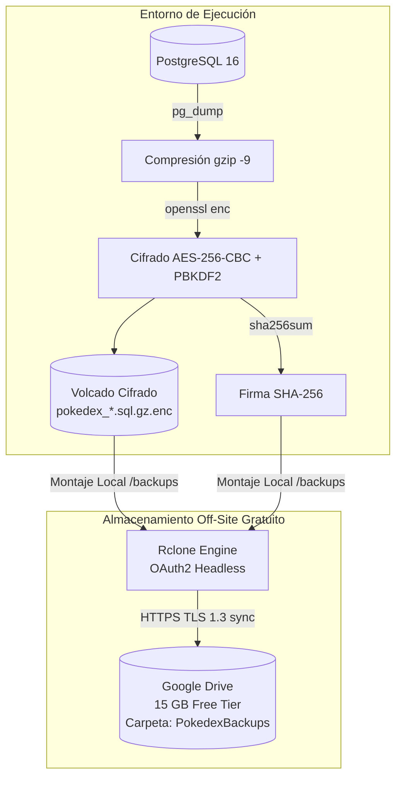

# Guía Operativa: Respaldo Off-Site en Google Drive con Rclone (Costo Cero $0)

Esta guía documenta la implementación de la **Fase 2 de Disaster Recovery** para el desacoplamiento total del dominio de falla (*Failure Domain*) del host local sin incurrir en costos de almacenamiento en la nube, aprovechando la cuota gratuita de **15 GB de Google Drive**.

---

## 1. Arquitectura y Modelo de Seguridad Zero-Trust



### Principios de Seguridad

1. **Zero-Knowledge Cloud Storage**: Google Drive solo recibe blobs binarios cifrados con **AES-256-CBC PBKDF2**. Sin la clave `BACKUP_ENCRYPTION_KEY`, los archivos son ilegibles para Google o cualquier actor externo.
2. **Firmas de Integridad**: Cada volcado viaja acompañado de su archivo `.sha256` para garantizar detección de corrupción o manipulación en tránsito.
3. **Costo Cero**: Un historial rotativo de 7 a 14 snapshots de Pokédex ocupa típicamente entre 50 MB y 300 MB, consumiendo menos del 2% del límite gratuito de 15 GB.

---

## 2. Paso Previo Común: Generación del Token OAuth2 de Google Drive

Dado que los servidores y contenedores operan en modo desatendido (*headless*), la autorización OAuth2 se genera una única vez desde una estación de trabajo con navegador web:

1. **Instalar Rclone localmente** (si no lo tienes instalado):
   - Linux/macOS: `curl https://rclone.org/install.sh | sudo bash`
   - Windows (PowerShell / Winget): `winget install Rclone.Rclone` o `choco install rclone`

2. **Obtener el token de autorización**:

   ```bash
   rclone authorize "drive"
   ```

   *Se abrirá una ventana en tu navegador web. Selecciona tu cuenta de Google y concede permisos de acceso a Google Drive.*

3. **Copiar el Token JSON resultante**:
   La terminal imprimirá un bloque JSON similar a este:

   ```json
   {"access_token":"<TU_ACCESS_TOKEN_OAUTH2>","token_type":"Bearer","refresh_token":"<TU_REFRESH_TOKEN_OAUTH2>","expiry":"2026-09-23T15:30:00Z"}
   ```

   > [!TIP]
   > Rclone renueva automáticamente el `access_token` cuando expira empleando el `refresh_token`, por lo que **no se requiere intervención humana recurrente**.

---

## 3. Alternativa A: Desarrollo Local con Docker Compose

Diseñado para desarrolladores que desean probar el ciclo de vida completo de DR localmente en Docker sin instalar herramientas adicionales en el sistema operativo anfitrión.

### Configuración en `.env`

Agrega en tu archivo `.env` local:

```env
# Clave AES-256 de cifrado (mínimo 32 caracteres)
BACKUP_ENCRYPTION_KEY=clave_super_secreta_para_cifrar_backups_2026

# Token JSON obtenido en el paso 2
GDRIVE_TOKEN='{"access_token":"<TU_ACCESS_TOKEN>","token_type":"Bearer","refresh_token":"<TU_REFRESH_TOKEN>","expiry":"..."}'
GDRIVE_FOLDER=PokedexBackups/dev
```

*(Opcionalmente, si ya tienes `~/.config/rclone/rclone.conf` en tu host, el contenedor lo montará automáticamente).*

### Ejecución con Script Automatizado

Genera el volcado desde el contenedor `pokemon-postgres`, cifra con AES-256, calcula el checksum y ejecuta el contenedor `rclone` para la subida:

```bash
npx tsx scripts/dev-backup-gdrive.ts
```

### Ejecución Directa con Docker Compose

Si ya cuentas con respaldos en el directorio `./backups/` y solo deseas sincronizarlos con Google Drive:

```bash
docker compose -f docker-compose.yml -f docker-compose.dev.yml --profile backup run --rm backup-gdrive
```

---

## 4. Alternativa B: Despliegue en el Host Proxmox VE (Nivel Hipervisor)

> [!WARNING]
> **Brecha Arquitectónica Factual: Desconexión entre PVC de K8s y Host Proxmox**
> Este playbook aprovisiona un **Mecanismo Preparado en Host** (Rclone + Systemd Timer en el hipervisor Proxmox VE), pero **no existe un puente implementado** que transfiera los respaldos generados por el CronJob de Kubernetes en el PVC `pokedex-backup-pvc` hacia el directorio local del host `/var/lib/pve/local-btrfs/pokedex-backups`.
>
> Por ende, **Google Drive NO debe considerarse todavía el backup off-site activo del Pokédex en Proxmox**, sino un mecanismo de sincronización preparado a nivel hipervisor que requiere la conexión de su origen de datos (vía bind-mount de K3s o migración a un CronJob nativo en Kubernetes con Rclone).

### Manifiesto de Automatización Ansible

El playbook [`infra/ansible/playbooks/setup_gdrive_backup.yml`](../../infra/ansible/playbooks/setup_gdrive_backup.yml) aprovisiona la configuración completa en el hipervisor:

1. **Editar los parámetros en el playbook o inventario**:

   ```yaml
   gdrive_backup_enabled: true
   gdrive_token_json: '{"access_token":"<TU_ACCESS_TOKEN>","token_type":"Bearer","refresh_token":"<TU_REFRESH_TOKEN>","expiry":"..."}'
   gdrive_folder: "PokedexBackups/proxmox"
   gdrive_local_backup_dir: "/var/lib/pve/local-btrfs/pokedex-backups" # o ruta del PVC local
   gdrive_sync_schedule: "03:00:00" # 03:00 UTC (1 hora tras el snapshot de K8s)
   gdrive_retention_days: 14
   ```

2. **Ejecutar el playbook**:

   ```bash
   ansible-playbook -i infra/ansible/inventory/hosts.ini infra/ansible/playbooks/setup_gdrive_backup.yml
   ```

3. **Componentes aprovisionados en Proxmox**:
   - `/etc/rclone/rclone.conf`: Configuración del remoto `[gdrive]` con permisos estrictos `0600`.
   - `/usr/local/bin/pokedex-gdrive-sync.sh`: Script idempotente con soporte de retención automática y logging.
   - `pokedex-gdrive-sync.service`: Unidad Systemd tipo *oneshot*.
   - `pokedex-gdrive-sync.timer`: Temporizador Systemd diario a las 03:00 UTC con *RandomizedDelaySec* para evitar picos de red.
   - `/etc/logrotate.d/pokedex-gdrive-sync`: Rotación periódica de logs.

### Verificación en Proxmox VE

```bash
# Comprobar estado del timer
systemctl status pokedex-gdrive-sync.timer

# Ejecutar sincronización manual inmediata
systemctl start pokedex-gdrive-sync.service

# Inspeccionar logs de auditoría
cat /var/log/pokedex-gdrive-sync.log
journalctl -u pokedex-gdrive-sync -f
```

---

## 5. Protocolo de Restauración ante Desastre (Disaster Recovery Drill)

Si el host físico Proxmox sufre una pérdida total:

1. **Descargar el último respaldo desde Google Drive**:

   ```bash
   # En cualquier máquina con Rclone
   rclone copy gdrive:PokedexBackups/proxmox/ ./restauracion/ --include "pokedex_*.sql.gz.enc*"
   ```

2. **Ejecutar certificación y restauración automatizada**:
   Utiliza el script oficial [`scripts/dr_verify_restore.sh`](../../scripts/dr_verify_restore.sh):

   ```bash
   export BACKUP_ENCRYPTION_KEY="tu_clave_secreta"
   bash scripts/dr_verify_restore.sh ./restauracion/pokedex_YYYYMMDD_HHMMSS.sql.gz.enc
   ```

   El script verificará el checksum SHA-256, probará el descifrado AES-256, descomprimirá y validará la estructura DDL/DML contra la base de datos de destino.
