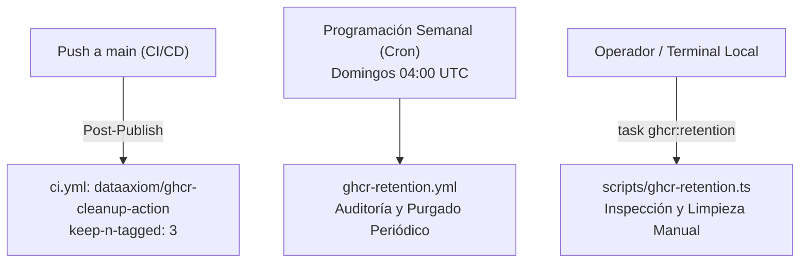

# Política de Retención y Purgado en GitHub Container Registry (GHCR)

## 1. Principio y Alcance

Conforme a los estándares de **Supply Chain Security** y optimización del almacenamiento en la nube, el proyecto adopta una política estricta de **retención máxima de 3 versiones activas** para todos los artefactos de contenedores y paquetes OCI publicados en **GitHub Container Registry (`ghcr.io`)**:

- **Imágenes de Contenedor:** `ghcr.io/rocapellino/pokedex` y `ghcr.io/rocapellino/pokedex-api`
- **Helm Charts OCI:** `oci://ghcr.io/rocapellino/charts/pokedex`

### Objetivos Arquitecturales

1. **Disponibilidad para Rollback Inmediato ($N, N-1, N-2$):** Se garantiza que la versión en producción actual ($N$), la versión previa inmediata ($N-1$) y la versión de resguardo ($N-2$) permanezcan disponibles y firmadas criptográficamente para recuperaciones inmediatas.
2. **Reducción de Superficie de Ataque:** Evita la permanencia indefinida de imágenes históricas que contengan dependencias con vulnerabilidades conocidas acumuladas (CVEs).
3. **Control de Cuotas y Almacenamiento:** Impide el crecimiento ilimitado del registro OCI en GitHub Packages.

---

## 2. Mecanismos de Ejecución y Automatización

La política se aplica de forma automatizada mediante tres niveles complementarios:



### Nivel 1: En Línea en el Pipeline de Publicación ([`.github/workflows/ci.yml`](../../.github/workflows/ci.yml))

En cada fusión a la rama `main`, tras la compilación, firma con Cosign, atestación de SBOM y publicación en GHCR, el job `publish` ejecuta automáticamente el paso:

```yaml
- name: 🧹 Aplicar política de retención en GHCR (Mantener últimos 3 activos)
  uses: dataaxiom/ghcr-cleanup-action@d52806a0dc70b430571a37da1fde39733ffd640f # v1
  with:
    keep-n-tagged: 3
    delete-untagged: true
    dry-run: false
    token: ${{ secrets.GITHUB_TOKEN }}
```

### Nivel 2: Workflow Autónomo y Programado ([`.github/workflows/ghcr-retention.yml`](../../.github/workflows/ghcr-retention.yml))

- **Frecuencia:** Semanal (domingos a las 04:00 UTC) y ante finalización exitosa de `CI/CD Pipeline`.
- **Ejecución Manual (`workflow_dispatch`):** Permite a los operadores ejecutar una auditoría en seco (`dry_run: true`) o purgar artefactos bajo demanda ajustando el número de versiones deseadas.

### Nivel 3: Herramienta CLI Local y Canónica ([`scripts/ghcr-retention.ts`](../../scripts/ghcr-retention.ts))

Los desarrolladores y administradores pueden inspeccionar el estado del registro y simular o forzar la retención mediante la interfaz oficial de `Taskfile`:

```bash
# Inspección en seco (Dry-Run) sin realizar mutaciones:
task ghcr:retention:dry-run

# Aplicación real de la política (requiere GITHUB_TOKEN con scopes de packages):
task ghcr:retention

# Ejecución en modo simulación para pruebas locales u offline:
node --experimental-strip-types scripts/ghcr-retention.ts --simulate --keep=3
```

---

## 3. Tratamiento de Firmas Criptográficas y Atestaciones OCI (Cosign)

La política de purgado está diseñada específicamente para registros OCI con firmas **Sigstore/Cosign** y atestaciones **in-toto/SLSA**:

- Al eliminar una versión obsoleta, las referencias asociadas (archivos `.sig`, `.att` y SBOMs adjuntos) son depurados de forma coordinada, evitando la existencia de capas y tags huérfanos (*dangling layers*).
- Las directivas `delete-untagged: true` y `keep-n-tagged: 3` aseguran que las 3 versiones activas preserven intacta su trazabilidad criptográfica y atestaciones SLSA.
