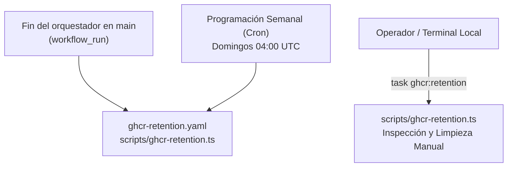

# Política de Retención y Purgado en GitHub Container Registry (GHCR)

## 1. Principio y Alcance

Conforme a los estándares de **Supply Chain Security** y optimización del almacenamiento en la nube, el proyecto adopta una política estricta de **retención máxima de 3 versiones activas** para todos los artefactos de contenedores y paquetes OCI publicados en **GitHub Container Registry (`ghcr.io`)**:

- **Imágenes de Contenedor:** `ghcr.io/rocapellino/pokedex-api`, `ghcr.io/rocapellino/pokedex-web` y el paquete heredado `ghcr.io/rocapellino/pokedex`
- **Helm Charts OCI:** `oci://ghcr.io/rocapellino/charts/pokedex`

### Objetivos Arquitecturales

1. **Disponibilidad para Rollback Inmediato ($N, N-1, N-2$):** Se garantiza que la versión en producción actual ($N$), la versión previa inmediata ($N-1$) y la versión de resguardo ($N-2$) permanezcan disponibles y firmadas criptográficamente para recuperaciones inmediatas.
2. **Reducción de Superficie de Ataque:** Evita la permanencia indefinida de imágenes históricas que contengan dependencias con vulnerabilidades conocidas acumuladas (CVEs).
3. **Control de Cuotas y Almacenamiento:** Impide el crecimiento ilimitado del registro OCI en GitHub Packages.

---

## 2. Mecanismos de Ejecución y Automatización

La política se aplica con un único mecanismo, el script canónico, invocado de dos formas:


```mermaid
flowchart TD
    A["Fin del orquestador en main<br/>(workflow_run)"] --> D["ghcr-retention.yaml<br/>scripts/ghcr-retention.ts"]
    C["Programación Semanal (Cron)<br/>Domingos 04:00 UTC"] --> D
    E["Operador / Terminal Local"] -->|task ghcr:retention| F["scripts/ghcr-retention.ts<br/>Inspección y Limpieza Manual"]
```

### Nivel 1 retirado: retención inline en `ci.yaml`

Hasta la corrección del pipeline de imágenes, el job `publish` de [`ci.yaml`](../../.github/workflows/ci.yaml) ejecutaba `dataaxiom/ghcr-cleanup-action` con `keep-n-tagged: 3` y `delete-untagged: true`. Se retiró por dos motivos: purgaba digests que GitOps seguía fijando en cuanto se publicaban tres imágenes más nuevas, y `delete-untagged` eliminaba los referrers sin tag de firmas y atestaciones SLSA. `tests/contracts/delivery/ghcr_retention.test.ts` impide reintroducirlo.

### Nivel 2: Workflow Autónomo y Programado ([`.github/workflows/ghcr-retention.yaml`](../../.github/workflows/ghcr-retention.yaml))

- **Frecuencia:** Semanal (domingos a las 04:00 UTC) y ante finalización exitosa del *Change Impact & Pipeline Orchestrator* (`change-impact.yaml`), que es el workflow de nivel superior real del pipeline. Antes de WF-004 este segundo trigger apuntaba a `ci.yaml` (`🚀 CI/CD Pipeline`), que es un *reusable workflow* y nunca genera una ejecución propia: el trigger no llegaba a dispararse.
- **Ejecución Manual (`workflow_dispatch`):** Permite a los operadores ejecutar una auditoría en seco (`dry_run: true`) o purgar artefactos bajo demanda ajustando el número de versiones deseadas.
- **Mecanismo de purgado:** Delega exclusivamente en el script canónico tipado [`scripts/ghcr-retention.ts`](../../scripts/ghcr-retention.ts) con `--keep=<N>`, que audita el registro, reporta el plan de purgado y elimina las versiones por encima del umbral.

> [!IMPORTANT]
> **Qué cuenta y qué nunca se purga.** `calculateVersionsToPrune` solo hace competir por el cupo `N` a las **imágenes de release**: versiones con al menos un tag que no sea un artefacto de Cosign (`sha256-<digest>.sig`, `.sbom`, `.att`). Además:
>
> - Los **digests fijados en GitOps** (`collectPinnedDigests`, sobre `gitops/environments/*/values.yaml` e `infra/helm/pokedex/values.prod.yaml`) se conservan siempre, aunque queden fuera del top `N`: son las imágenes que los clústeres descargan.
> - Los artefactos de Cosign y las versiones sin tag (referrers OCI de firmas y atestaciones SLSA) no se purgan.
>
> Antes de esta corrección el script ordenaba **todas** las versiones por fecha. Los artefactos de Cosign, publicados después de la imagen, la desplazaban del top 3, y la versión `main` recién publicada se purgaba minutos después del CI.

### Nivel 3: Herramienta CLI Local y Canónica ([`scripts/ghcr-retention.ts`](../../scripts/ghcr-retention.ts))

Los desarrolladores y administradores pueden inspeccionar el estado del registro y simular o forzar la retención mediante la interfaz oficial de `Taskfile`:

```bash
# Inspección en seco (Dry-Run) sin realizar mutaciones:
task ghcr:retention:dry-run

# Aplicación real de la política (requiere GITHUB_TOKEN con scopes de packages):
task ghcr:retention

# Ejecución en modo simulación para pruebas locales u offline:
node --experimental-strip-types scripts/ghcr-retention.ts --simulate --keep=3
```

---

## 3. Tratamiento de Firmas Criptográficas y Atestaciones OCI (Cosign)

La política de purgado está diseñada específicamente para registros OCI con firmas **Sigstore/Cosign** y atestaciones **in-toto/SLSA**:

- El script no purga artefactos de Cosign (`sha256-<digest>.sig`, `.sbom`, `.att`) ni versiones sin tag, de modo que las imágenes conservadas y las fijadas en GitOps preservan su firma, SBOM y atestación SLSA. Como contrapartida, los artefactos de imágenes ya purgadas quedan huérfanos en el registro hasta una limpieza dirigida.
