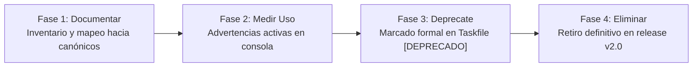

# Referencia Oficial del CLI Canónico con Taskfile (`Taskfile.yml`)

## 1. Principio Rector: `task --list` como Interfaz Oficialmente Soportada

Conforme a las decisiones arquitectónicas [ADR-020](../decisions/ADR-020-unified-deployment-governance-and-script-retirement.md) y [ADR-026](../decisions/ADR-026-taskfile-cli-alias-deprecation-and-lifecycle.md), el proyecto consolida **`Taskfile.yml`** como el único orquestador canónico de operaciones, compilación, pruebas, infraestructura y entrega continua.

La interfaz oficialmente soportada para el descubrimiento dinámico, documentación contextual e inspección de tareas disponibles es:

```bash
task --list
# o simplemente:
task
```

Al invocar `task` sin argumentos, se ejecuta de forma predeterminada `task --list`, presentando el catálogo estandarizado con la descripción funcional de cada comando disponible.

---

## 2. Catálogo de Comandos Canónicos Oficialmente Soportados

| Dominio | Tarea Canónica | Propósito / Acción |
| :--- | :--- | :--- |
| **Descubrimiento** | `task` o `task --list` | Muestra el catálogo de tareas disponibles y su descripción oficial. |
| **Gestión Monorepo** | `task install` | Instalación limpia y reproducible con `npm ci`. |
| **Desarrollo** | `task dev` | Servidor Pokédex en modo hot-reload interactivo. |
| **Compilación** | `task build` | Compila backend con esbuild y frontend con Vite. |
| **Producción** | `task start` | Ejecuta el bundle de producción compilado (`npm start`). |
| **Turborepo** | `task turbo:build` | Compilación optimizada con caché declarativa. |
| | `task turbo:lint` | Verificación de linter en todos los paquetes del monorepo. |
| | `task turbo:typecheck` | Verificación estricta de tipos de TypeScript (`tsc --noEmit`). |
| | `task turbo:clean` | Limpieza de caché `.turbo` y artefactos compilados en `dist/`. |
| **Validación y QA** | `task lint` | Ejecuta linting y análisis de tipos unificado. |
| | `task validate` | Suite obligatoria previa a commit (`lint`, `typecheck`, `build`, `test`). |
| | `task test` | Pruebas unitarias de seguridad y lógica de negocio. |
| | `task test:e2e` | Pruebas de integración E2E con Playwright. |
| | `task test:a11y` | Auditoría de accesibilidad WCAG 2.1 con Axe-core. |
| | `task test:coverage` | Generación de reporte de cobertura LCOV. |
| | `task perf:lighthouse` | Auditoría de Core Web Vitals y rendimiento con Lighthouse CI. |
| **Entorno Local** | `task dev:compose` | Levanta el stack interactivo con Docker Compose (Postgres, Redis, PgBouncer). |
| | `task dev:compose:down` | Detiene y desmantela los contenedores locales de Compose. |
| | `task dev:k8s:setup` | Despliega clúster Kind local con ingress y namespaces configurados. |
| | `task dev:k8s:status` | Consulta estado de pods, servicios e ingress en namespace `pokemon-app`. |
| **Infraestructura (OpenTofu)** | `task infra:fmt` | Verifica formato canónico en todos los entornos de OpenTofu (`tofu fmt -check`). |
| | `task infra:validate` | Valida sintaxis e inicializa backends (`Proxmox`, `AWS`, `Lab`). |
| | `task infra:plan:proxmox` | Genera plan de ejecución para entorno on-premise Proxmox VE. |
| | `task infra:apply:proxmox` | Aplica configuración IaC en Proxmox VE. |
| | `task infra:plan:aws` | Genera plan de ejecución para clúster AWS EKS en la nube. |
| | `task infra:apply:aws` | Aplica infraestructura AWS EKS con OpenTofu. |
| | `task infra:plan:lab` | Plan de ejecución para entorno de laboratorio de pruebas. |
| | `task infra:apply:lab` | Aplica infraestructura de laboratorio. |
| **Automatización (Ansible)** | `task ansible:prepare` | Aprovisiona baseline de sistema y configuración de nodo Proxmox. |
| | `task ansible:harden` | Aplica blindaje perimetral y reglas de firewall UFW en hosts. |
| | `task ansible:validate` | Auditoría y compliance de hosts sin alterar estado. |
| | `task k3s:setup:proxmox` | Aprovisiona K3s y Cilium CNI en Proxmox mediante Ansible (`setup_k3s.yml`). |
| | `task vault:setup:proxmox` | Aprovisiona e inicializa HashiCorp Vault CE en Proxmox (`setup_vault.yml`). |
| **Empaquetado (Helm)** | `task helm:lint` | Valida sintaxis y buenas prácticas del Chart de Helm. |
| | `task helm:template` | Renderiza manifiestos Kubernetes generados por el Chart. |
| **Kubernetes Runtime** | `task k8s:up` | Despliega o actualiza el release de Helm en el clúster activo. |
| | `task k8s:down` | Desinstala el release de Helm de forma controlada. |
| | `task k8s:status` | Diagnóstico de pods, réplicas, servicios e ingress. |
| **GitOps (ArgoCD)** | `task gitops:apps:root` | Sincroniza la aplicación App-of-Apps en el clúster. |
| | `task gitops:sync:proxmox` | Fuerza sincronización declarativa para Proxmox VE. |
| | `task gitops:sync:cloud` | Fuerza sincronización declarativa para AWS EKS. |
| | `task gitops:health-checks` | Aplica evaluadores de salud personalizados para CRDs. |
| **Seguridad & Egress L7** | `task security:egress` | Ejecuta pruebas automatizadas de política de egress L7 Anti-SSRF. |
| | `task security:egress:probe` | Ejecuta la sonda activa de seguridad y filtrado egress L7 en clúster. |
| **Supply Chain & Registro (GHCR)** | `task ghcr:retention` | Aplica política de retención en GHCR conservando estrictamente los últimos 3 releases. |
| | `task ghcr:retention:dry-run` | Inspecciona versiones en GHCR y simula la purga sin mutaciones (Dry-Run). |
| **Gobernanza & Auditoría** | `task governance:audit-scripts` | Valida lista blanca estricta de scripts y prohíbe scripts imperativos. |
| | `task security` | Escaneos SAST y auditoría de secretos (Semgrep, Gitleaks, Checkov). |

---

## 3. Estrategia de Deprecación de Aliases en 4 Fases

Para reducir la deuda técnica y eliminar la superficie de mantenimiento sin provocar disrupciones operativas ni romper flujos de trabajo preexistentes, se adopta la siguiente estrategia escalonada:



### Fase 1: Documentar Aliases (Inventario y Mapeo)

- Se registran de forma exhaustiva todos los aliases históricos en esta guía de referencia y en [ADR-026](../decisions/ADR-026-taskfile-cli-alias-deprecation-and-lifecycle.md).
- Toda la documentación oficial de despliegue, guías de Proxmox y READMEs se actualizan para emplear exclusivamente la sintaxis canónica (`task infra:plan:proxmox`, `task ansible:prepare`, `task lint`).

### Fase 2: Medir Uso y Telemetría Informativa

- Cada alias en `Taskfile.yml` incorpora una directiva informativa visible en consola:

  ```bash
  ⚠️  [DEPRECADO] 'task <alias>' es un alias de compatibilidad. Use 'task <canónico>'.
  ```

- Las ejecuciones en CI/CD y terminales locales muestran inmediatamente la advertencia, orientando a desarrolladores y operadores sobre la alternativa soportada.

### Fase 3: Deprecación Formal

- Las descripciones de las tareas en `Taskfile.yml` llevan el prefijo `[DEPRECADO]`, visible en la salida de `task --list`.
- Se mantiene 100% la funcionalidad subyacente para no bloquear pipelines existentes durante todo el ciclo de versiones `v1.x`.

### Fase 4: Eliminación Definitiva (v2.0)

- En el hito de lanzamiento mayor `v2.0`, tras verificar la ausencia de llamadas en pipelines de integración continua y scripts de automatización, los bloques de alias serán retirados permanentemente de `Taskfile.yml`.

---

## 4. Matriz de Aliases en Deprecación y Sustitutos Canónicos

| Alias Histórico Deprecado | Tarea Canónica Sustituta | Fase Actual | Fecha / Versión de Retiro |
| :--- | :--- | :---: | :---: |
| `task tofu:init:proxmox` | `task infra:validate` *(o tofu init en directorio)* | Fase 4 (Retirado) | Ejecutado (v1.76.0) |
| `task tofu:plan:proxmox` | `task infra:plan:proxmox` | Fase 4 (Retirado) | Ejecutado (v1.76.0) |
| `task tofu:apply:proxmox` | `task infra:apply:proxmox` | Fase 4 (Retirado) | Ejecutado (v1.76.0) |
| `task tofu:init:aws` | `task infra:validate` *(o tofu init en directorio)* | Fase 4 (Retirado) | Ejecutado (v1.76.0) |
| `task tofu:plan:aws` | `task infra:plan:aws` | Fase 4 (Retirado) | Ejecutado (v1.76.0) |
| `task tofu:apply:aws` | `task infra:apply:aws` | Fase 4 (Retirado) | Ejecutado (v1.76.0) |
| `task tofu:init:cloud` | `task infra:validate` | Fase 4 (Retirado) | Ejecutado (v1.76.0) |
| `task tofu:plan:cloud` | `task infra:plan:aws` | Fase 4 (Retirado) | Ejecutado (v1.76.0) |
| `task tofu:apply:cloud` | `task infra:apply:aws` | Fase 4 (Retirado) | Ejecutado (v1.76.0) |
| `task tofu:validate` | `task infra:validate` | Fase 4 (Retirado) | Ejecutado (v1.76.0) |
| `task ts:install` | `task install` | Fase 4 (Retirado) | Ejecutado (v1.76.0) |
| `task ts:dev` | `task dev` | Fase 4 (Retirado) | Ejecutado (v1.76.0) |
| `task ts:build` | `task build` | Fase 4 (Retirado) | Ejecutado (v1.76.0) |
| `task ts:start` | `task start` | Fase 4 (Retirado) | Ejecutado (v1.76.0) |
| `task ts:lint` | `task lint` | Fase 4 (Retirado) | Ejecutado (v1.76.0) |
| `task docker:up` | `task dev:compose` | Fase 4 (Retirado) | Ejecutado (v1.76.0) |
| `task docker:down` | `task dev:compose:down` | Fase 4 (Retirado) | Ejecutado (v1.76.0) |
| `task deploy:proxmox` | `task ansible:prepare` | Fase 4 (Retirado) | Ejecutado (v1.76.0) |
