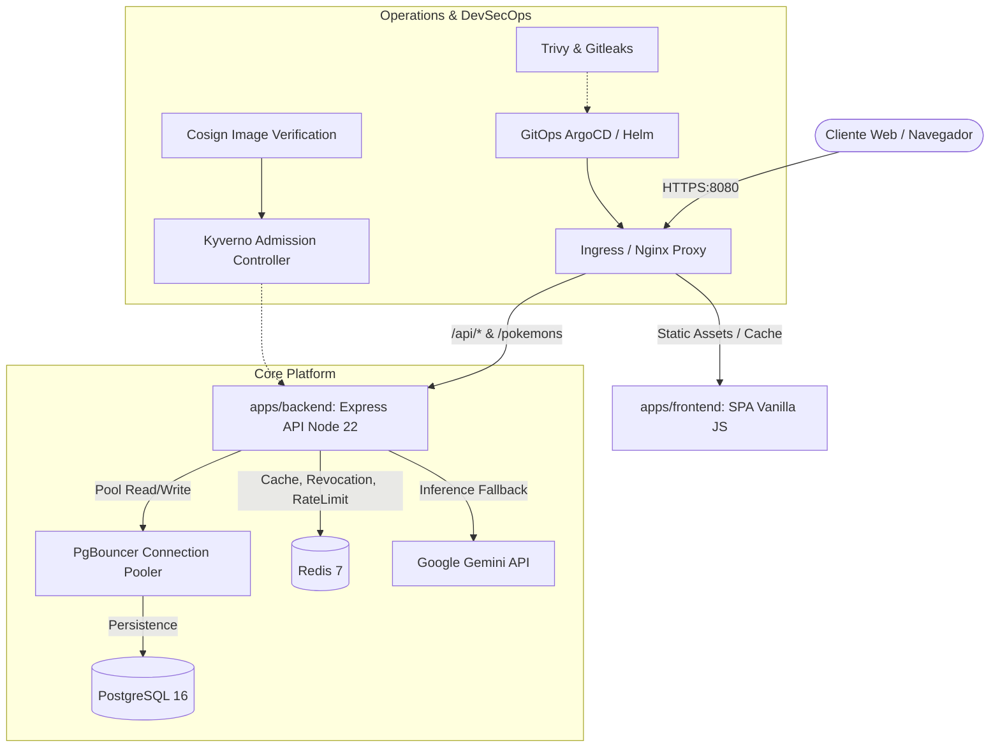

# 🛡️ Evaluación Técnica Integral y Auditoría DevSecOps — Pokédex

Este documento recoge la evaluación técnica de arquitectura, topología, análisis de vectores de vulnerabilidad, madurez operativa en DevSecOps y la hoja de ruta de modernización de la plataforma **Pokédex**.

---

## 1. Arquitectura de la Plataforma y Topología del Monorepo

La solución adopta un patrón de monorepo desacoplado enfocado en alta disponibilidad, resiliencia y portabilidad de cargas de trabajo híbridas (on-premise / Proxmox VE y Kubernetes de nube pública).

### Inventario de Módulos

| Módulo o Componente | Ruta en Repositorio | Pila Tecnológica | Propósito Operacional |
| :--- | :--- | :--- | :--- |
| **Núcleo de API REST** | [`apps/backend`](file:///c:/Users/Rodrigo/Documents/Git/pokedex/apps/backend) | Node.js 22 LTS, TypeScript, PostgreSQL, Redis | Ingesta, validación, lógica de negocio y persistencia relacional. |
| **Capa de Presentación** | [`apps/frontend`](file:///c:/Users/Rodrigo/Documents/Git/pokedex/apps/frontend) | Vanilla JS, HTML5/CSS3, Nginx Proxy | Interfaz gráfica pública y backoffice administrativo ligero. |
| **Automatización de Nodos** | [`infra/ansible`](file:///c:/Users/Rodrigo/Documents/Git/pokedex/infra/ansible) | Ansible Core, SSH, Cloud-Init | Hardening de SO, cortafuegos UFW y configuración base. |
| **Orquestación Kubernetes** | [`infra/helm/pokedex`](file:///c:/Users/Rodrigo/Documents/Git/pokedex/infra/helm/pokedex) | Helm Charts v3, K8s Manifests | Despliegue, HPA, PDB, Ingress y Network Policies Zero-Trust. |
| **Infraestructura Declarativa** | [`infra/opentofu`](file:///c:/Users/Rodrigo/Documents/Git/pokedex/infra/opentofu) | OpenTofu (Terraform DSL) | Aprovisionamiento declarativo de VMs/LXC en Proxmox y Cloud. |
| **Gobernanza y Admisión** | [`infra/k8s`](file:///c:/Users/Rodrigo/Documents/Git/pokedex/infra/k8s) | Kyverno, Cosign, Pod Security | Verificación criptográfica de firmas OCI y admisión. |

---

## 2. Análisis de Vulnerabilidades y Gestión del Riesgo

| Vector de Riesgo | Archivo Afectado | Severidad | Mecanismo del Fallo | Impacto Técnico & Mitigación |
| :--- | :--- | :---: | :--- | :--- |
| **Inyección de Código SQL** | [`apps/backend/src/services/db.ts`](file:///c:/Users/Rodrigo/Documents/Git/pokedex/apps/backend/src/services/db.ts) | **Crítica** | Interpolación no segura en consultas dinámicas. | **Mitigado:** Parámetros vinculados obligatorios (`$1`, `$2`) en todo el ciclo CRUD. |
| **Manipulación DOM (XSS)** | [`apps/frontend/public/js/*.js`](file:///c:/Users/Rodrigo/Documents/Git/pokedex/apps/frontend/public/js/pokedex.js) | **Alta** | Renderizado de respuestas de API en el DOM vía `innerHTML`. | **Mitigado:** Función `escapeHTML` estricta sanitizando `<`, `>`, `&`, `"`, `'` y backticks. |
| **Prompt Injection / DoS** | [`apps/backend/src/services/ai.ts`](file:///c:/Users/Rodrigo/Documents/Git/pokedex/apps/backend/src/services/ai.ts) | **Media** | Entrada no delimitada y carencia de disyuntor ante latencias. | **Mitigado:** Delimitadores semánticos XML `<user_prompt>`, sanitización y Circuit Breaker. |
| **Fuga de Secretos en Procesos** | [`scripts/proxmox_deploy.sh`](file:///c:/Users/Rodrigo/Documents/Git/pokedex/scripts/proxmox_deploy.sh) | **Alta** | Parámetros confidenciales por CLI visibles en `/proc` o `ps aux`. | **Mitigado:** Prioridad de variables de entorno, `umask 077` y exclusión estricta de `.env`. |
| **Omisión de Cabeceras HTTP** | [`apps/frontend/nginx.conf`](file:///c:/Users/Rodrigo/Documents/Git/pokedex/apps/frontend/nginx.conf) | **Media** | Pérdida de cabeceras en bloques `location` con `add_header` propio. | **Mitigado:** Inclusión sistemática de directivas de seguridad en bloques anidados. |
| **Exposición de Estado IaC** | [`infra/opentofu/environments/`](file:///c:/Users/Rodrigo/Documents/Git/pokedex/infra/opentofu/environments) | **Alta** | Riesgo de persistencia de `.tfstate` con valores en claro. | **Mitigado:** Recomendación de backend remoto S3/PostgreSQL con cifrado en reposo. |

---

## 3. Evaluación de Buenas Prácticas y Madurez DevSecOps

El repositorio supera los estándares habituales de la industria incorporando defensas en profundidad:

1. **Firmado Criptográfico:** `infra/k8s/kyverno-cosign-policy.yaml` verifica firmas Cosign antes de admitir cualquier contenedor.
2. **Segmentación de Red:** `infra/helm/pokedex/templates/network-policies.yaml` aplica Zero-Trust con default-deny en bases de datos.
3. **Multiplexación de Conexiones:** Despliegue de `pgbouncer-deployment.yaml` para mitigar la saturación de pools en PostgreSQL.
4. **Secretos Seguros:** External Secrets y Sealed Secrets para evitar credenciales en texto claro en Git.
5. **Suite de Pentest Automatizada:** Pruebas continuas de inyección, escalación de privilegios HMAC, prototype pollution, SSRF, DoS y fuzzing en `tests/`.

---

## 4. Hoja de Ruta de Modernización

| Ámbito de Mejora | Solución Propuesta | Horizonte Temporal | Impacto en la Plataforma |
| :--- | :--- | :---: | :--- |
| **Gestión de Estados IaC** | Backend remoto cifrado (S3 / OpenTofu HTTP / PG) | Inmediato | Protección absoluta de secretos y sincronización de infraestructura. |
| **Resiliencia en IA** | Circuit Breaker con degradación y delimitadores de prompt | Inmediato | Prevención de saturación de hilos y blindaje anti-inyecciones. |
| **Hardening de Cabeceras** | Cobertura total de CSP, HSTS y Permissions-Policy en Nginx | Inmediato | Protección contra Clickjacking, MIME sniffing y degradación SSL. |
| **Gestión de Datos** | Reemplazo de `init.sql` por migraciones declarativas (Drizzle / Flyway) | Corto Plazo | Despliegues continuos sin interrupción y reversibilidad de esquemas. |
| **Capa Frontend** | Migración a TypeScript estructurado con empaquetador Vite | Medio Plazo | Tipado unificado de modelos y eliminación estructural de XSS en DOM. |
| **Telemetría** | Instrumentación de OpenTelemetry y registros JSON correlacionados (Pino) | Medio Plazo | Diagnóstico distribuido y observabilidad extremo a extremo. |
