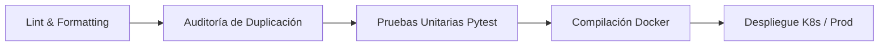

# 🧪 Guía Completa de Pruebas y Validación (Testing Guide)

Esta guía detalla la estrategia de aseguramiento de calidad (QA), las diferentes capas de pruebas implementadas en la plataforma Pokédex y las instrucciones paso a paso para su ejecución.

---

## 📑 Tabla de Contenidos
1. [Estrategia y Pirámide de Pruebas](#1-estrategia-y-pirámide-de-pruebas)
2. [Tipos de Pruebas Implementadas](#2-tipos-de-pruebas-implementadas)
   * [2.1. Pruebas Unitarias y de Integración REST (Pytest)](#21-pruebas-unitarias-y-de-integración-rest-pytest)
   * [2.2. Análisis Estático y Rendimiento de Código (Ruff)](#22-análisis-estático-y-rendimiento-de-código-ruff)
   * [2.3. Complejidad Ciclomática y Mantenibilidad (Radon & Xenon)](#23-complejidad-ciclomática-y-mantenibilidad-radon--xenon)
   * [2.4. Detección de Código Duplicado (JSCPD / AST)](#24-detección-de-código-duplicado-jscpd--ast)
   * [2.5. Pruebas de Carga y Autoescalado (K8s HPA)](#25-pruebas-de-carga-y-autoescalado-k8s-hpa)
   * [2.6. Pruebas de Seguridad y Detección de Secretos (Gitleaks)](#26-pruebas-de-seguridad-y-detección-de-secretos-gitleaks)
3. [Cómo Ejecutar las Pruebas](#3-cómo-ejecutar-las-pruebas)
   * [Opción A: Vía Tareas de VS Code (1 Solo Clic)](#opción-a-vía-tareas-de-vs-code-1-solo-clic)
   * [Opción B: Vía Consola Local (PowerShell / Bash)](#opción-b-vía-consola-local-powershell--bash)
   * [Opción C: En Contenedor Docker Aislado](#opción-c-en-contenedor-docker-aislado)
   * [Opción D: En Pipelines CI/CD (Jenkins / GitLab CI)](#opción-d-en-pipelines-cicd-jenkins--gitlab-ci)
4. [Quality Gates (Criterios de Aceptación)](#4-quality-gates-criterios-de-aceptación)

---

## 1. Estrategia y Pirámide de Pruebas

El proyecto implementa un enfoque de validación multicapa para garantizar alta disponibilidad, velocidad de respuesta y mantenibilidad:

```
                  ┌──────────────────────┐
                  │   Pruebas de Carga   │  (Locust / HPA Load Test)
                  │   y Resiliencia      │
                  ├──────────────────────┤
                  │ Pruebas Integración  │  (Endpoints REST / Swagger / BD)
                  ├──────────────────────┤
                  │  Pruebas Unitarias   │  (Pytest + FastAPI TestClient)
                  ├──────────────────────┤
                  │   Análisis Estático, │  (Ruff / Radon / JSCPD / Gitleaks)
                  │ Calidad y Complejidad│
                  └──────────────────────┘
```

---

## 2. Tipos de Pruebas Implementadas

### 2.1. Pruebas Unitarias y de Integración REST (`pytest`)
* **Ubicación:** [`apps/api/tests/test_app.py`](file:///c:/Users/Rodrigo/Documents/Git/introducci%C3%B3n_devops/test_prueba/apps/api/tests/test_app.py).
* **Motor:** `pytest` + `fastapi.testclient.TestClient` (basado en `httpx`).
* **Qué valida:**
  * `GET /`: Contrato de bienvenida, versión y rutas disponibles.
  * `GET /healthz`: Respuesta de comprobación de salud para balanceadores (HTTP 200).
  * `GET /docs`: Disponibilidad de la documentación interactiva Swagger UI.
  * `GET /pokemons`: Listado completo de Pokémon, estructura de tipos y presencia de árboles evolutivos.
  * `GET /pokemons/{id}`: Búsqueda exacta por ID y respuesta de error HTTP 404 para identificadores inexistentes.
  * `POST /pokemons`: Validación estricta de esquemas Pydantic (`PokemonCreateSchema`), cálculo de características y respuesta HTTP 201.
  * `POST /pokemons` (Campos inválidos): Rechazo automático con HTTP 422/400 ante payloads incompletos.
  * `PUT /pokemons/{id}`: Actualización parcial y total de atributos de combate y hábitat.
  * `DELETE /pokemons/{id}`: Eliminación física e invalidación de caché.
  * `GET /metrics`: Generación del formato de métricas estándar de Prometheus (`pokedex_http_requests_total`, `pokedex_uptime_seconds`).

### 2.2. Análisis Estático y Rendimiento de Código (`Ruff`)
* **Configuración:** [`ruff.toml`](file:///c:/Users/Rodrigo/Documents/Git/introducci%C3%B3n_devops/test_prueba/ruff.toml).
* **Reglas Activas:**
  * `PERF`: *Perflint* (detección de bucles lentos, optimización de comprensiones de listas).
  * `I`: *Isort* (ordenamiento alfabético y óptimo de módulos importados).
  * `B`: *Bugbear* (detección de patrones proclives a fallos en runtime).
  * `SIM`: Simplificación de expresiones lógicas redundantes.
  * `F` / `E`: Detección de variables no utilizadas, imports muertos y errores de sintaxis.

### 2.3. Complejidad Ciclomática y Mantenibilidad (`Radon` & `Xenon`)
* **Qué mide:**
  * **Complejidad Ciclomática (CC):** Cantidad de caminos de ejecución independientes por función. Calificación `A` (1-5 caminos, excelente), `B` (6-10), `C` (11-20).
  * **Índice de Mantenibilidad (MI):** Puntuación de 0 a 100 basada en líneas de código, volumen Halstead y complejidad ciclomática.
* **Umbral Aprobado:** Complejidad media del repositorio $\le 5$ (Grado A).

### 2.4. Detección de Código Duplicado (`JSCPD` / Scanner AST)
* **Configuración:** [`.jscpd.json`](file:///c:/Users/Rodrigo/Documents/Git/introducci%C3%B3n_devops/test_prueba/.jscpd.json).
* **Qué detecta:**
  * Bloques duplicados de código en Python, JavaScript, CSS y HTML con umbral de similitud.
  * Archivos idénticos o redundantes generados entre capas.

### 2.5. Pruebas de Carga y Autoescalado (`scripts/k8s_load_test.py`)
* **Ubicación:** [`scripts/k8s_load_test.py`](file:///c:/Users/Rodrigo/Documents/Git/introducci%C3%B3n_devops/test_prueba/scripts/k8s_load_test.py).
* **Qué valida:**
  * Inyección masiva de solicitudes concurrentes (50 hilos paralelos) sobre el endpoint `/pokemons`.
  * Verificación de aceleración por caché Redis (< 5ms de latencia).
  * Autoescalado elástico del **HPA** de Kubernetes pasando de 2 a 10 réplicas al superar el 70% de consumo de CPU.

### 2.6. Pruebas de Seguridad y Detección de Secretos (`Gitleaks`)
* **Configuración:** [`.gitleaks.toml`](file:///c:/Users/Rodrigo/Documents/Git/introducci%C3%B3n_devops/test_prueba/.gitleaks.toml).
* **Qué valida:**
  * Escaneo automático de tokens, contraseñas hardcodeadas o claves privadas antes de cada commit.

---

## 3. Cómo Ejecutar las Pruebas

### Opción A: Vía Tareas de VS Code (1 Solo Clic)
1. Presiona `Ctrl + Shift + P` (o `F1`) en VS Code.
2. Escribe `Tasks: Run Task`.
3. Selecciona la tarea deseada:
   * **`🧪 Tests: Ejecutar Pytest`** (Acceso rápido con `Ctrl + Shift + B` si está asignada como test).
   * **`🔍 Auditoría: Calidad, Duplicación y Rendimiento`**.

---

### Opción B: Vía Consola Local (PowerShell / Bash)

#### 1. Ejecutar la Suite de Pruebas Unitarias:
```powershell
.\.venv\Scripts\python -m pytest -v
```

#### 2. Ejecutar la Auditoría Completa en 1 Paso:
```powershell
.\.venv\Scripts\python scripts/audit_code_quality.py
```

#### 3. Ejecutar Linter y Correcciones Automáticas con Ruff:
```powershell
.\.venv\Scripts\ruff check apps/ src/ scripts/ --fix
```

#### 4. Medir Complejidad Ciclomática con Radon:
```powershell
.\.venv\Scripts\radon cc apps/api/src -s -a
```

#### 5. Ejecutar Prueba de Carga en Concurrencia:
```powershell
.\.venv\Scripts\python scripts/k8s_load_test.py
```

---

### Opción C: En Contenedor Docker Aislado
Para correr las pruebas dentro del contenedor de desarrollo sin necesidad de configurar Python localmente:

```powershell
# Iniciar el entorno de desarrollo
docker compose -f docker-compose.yml -f docker-compose.dev.yml up -d

# Ejecutar las pruebas unitarias dentro del contenedor
docker compose -f docker-compose.yml -f docker-compose.dev.yml exec api pytest

# Ejecutar la auditoría dentro del contenedor
docker compose -f docker-compose.yml -f docker-compose.dev.yml exec api python scripts/audit_code_quality.py
```

---

### Opción D: En Pipelines CI/CD (Jenkins / GitLab CI)

Los pipelines de integración continua ejecutan automáticamente estas etapas en cada push a la rama `main` o en Merge Requests:



* **Jenkins:** Declarado en [`Jenkinsfile`](file:///c:/Users/Rodrigo/Documents/Git/introducci%C3%B3n_devops/test_prueba/Jenkinsfile) (etapas: *Lint*, *Unit Tests*, *Docker Build*).
* **GitLab CI:** Declarado en [`.gitlab-ci.yml`](file:///c:/Users/Rodrigo/Documents/Git/introducci%C3%B3n_devops/test_prueba/.gitlab-ci.yml) (jobs: *lint*, *test*, *build*, *deploy*).

---

## 4. Quality Gates (Criterios de Aceptación)

Para que un cambio sea promovido a producción, debe cumplir con la siguiente matriz:

| Criterio | Métrica Requerida | Estado Actual |
| :--- | :--- | :--- |
| **Pruebas Unitarias** | 100% de pruebas aprobadas (14/14) | ✅ Aprobado |
| **Complejidad Ciclomática** | Promedio menor a 5.0 (Calificación A) | ✅ 3.36 (A) |
| **Errores de Linter** | 0 errores críticos (`ruff check`) | ✅ 0 errores |
| **Duplicación en Prod** | 0 duplicados en la imagen de producción | ✅ Aprobado |
| **Healthchecks** | HTTP 200 en `/healthz` en menos de 500ms | ✅ Aprobado (< 5ms) |
